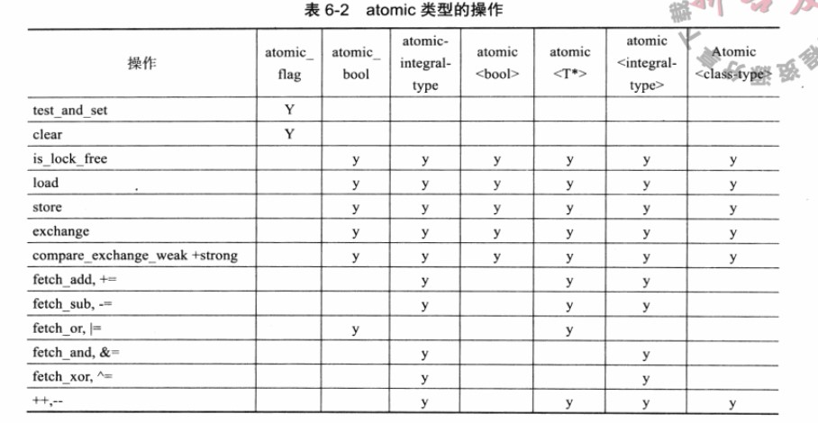
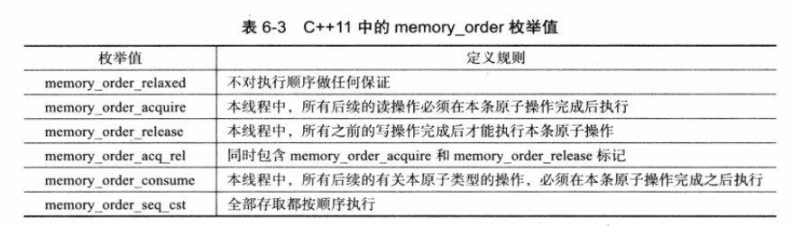

# C++11：原子类型和原子操作


### 6.3.1 并行编程，多线程和c++11

常见的并行编程有多种模型，比如共享内存，多线程，消息传递等。

多线程模型介绍：


c++11中一个相当大的变化在于引入了多线程，本文主要讲述原子操作中的原子类型。


### 6.3.2 原子操作与C++11原子类型

通常原子操作是通过“互斥”的访问保证的。

C++11之前，精细化实现需要嵌入内联汇编代码，粗粒度的互斥只需要借助POSIX标准的pthread库中的互斥锁即可。

比较C++11之前的代码和C++11之后：

```cpp
// C++11之前
static long long total = 0;
pthread_mutex_t m = PTHREAD_MUTEX_INITIALIZER;

void* func(void *) {
	long long i;
	for (i = 0; i < 100000000LL; i++) {
		pthread_mutex_lock(&m);
		total += i;
		pthread_mutex_lock(&m);
	}
}

int main() {
	pthread_t thread1, thread2;
	if (pthread_create(&thread1, NULL, &func, NULL)) {
		throw;
	}
	if (pthread_create(&thread2, NULL, &func, NULL)) {
		throw;
	}
	pthread_join(thread1, NULL);
	pthread_join(thread2, NULL);
	cout << total << endl;
	return 0;
}

//c++11之后
atomic_llong total{0};

void func(int) {
	long long i;
	for (i = 0; i < 100000000LL; ++i) {
		total += i;
	}
}

int main() {
	thread t1(func, 0);
	thread t2(func, 0);
	t1.join();
	t2.join();
	cout << total << endl;
	return 0;
}
```

明显c++11之后的代码步骤更加简单。


如果想用到原子类型，程序员可以使用atomic类模板。

```cpp
std::stomin<T> t;
// 如果想要定义原子的自定义类型，需要C++11中的新关键字_Atomic完成
```



当你对某个元素进行atomic的类模板时，看似正常的操作都是在执行原子操作，比如

```cpp
atomic<int> a;
int b = a; // 相当于b=a.load()
a = 1; // 相当于a.store()
```


在上表中，可以看到一个比较特殊的布尔型的atomic类型：`atomic_flag`。

atomic_flag是无锁的，即线程对它的访问不需要加锁，因此也不需要load，store等成员函数进行读写。

因此，通过atomic_flag的成员test_and_set以及clear，我们尝试实现一个自旋锁。

```cpp
#include<thread>
#include<atomic>
#include<iostream>
#include<unistd.h>
using namespace std;

std::atomic_flag lock = ATOMIC_FLAG_INIT;

void f(int n) {
    // test_and_set向内存空间原子的写入新值返回旧值
	while (lock.test_and_set(std::memory_order_acquire)) {
		cout << "Waiting from thread" << n << endl;
	}
	cout << "Thread " << n << "starts working" << endl;
}

void g(int n) {
	cout << "Thread " << n << " is going to start." << endl;
	lock.clear();
	cout << "Thread " << n << " starts working" << endl;
}

int main() {
	lock.test_and_set();
	thread t1(f, 1);
	thread t2(g, 2);
	t1.join(); // f中的函数一直返回true，不断打印信息，自选等待
	usleep(100);
	t2.join(); // clear将lock的值设置为false，自旋锁终止
	return 0;
}
```

以上代码可以达到自旋锁的作用，如果再将lock封装一下，可以实现无锁编程，这样可以最大限度的挖掘并行编程的性能。

```cpp
void Lock(atomic_flag *lock){while(lock.test_and_set());}
void UnLock(atomic_falg *lock){lock.clear();}
```


### 6.3.3 内存模型，顺序一致性和memory_order

对于线程间数据同步，原子类型提供了一定的保障。不过这样做的安全性建立在顺序一致性的内存模型之上。

对于编译器执行代码，这里我们需要理解一个概念，**重排reorder**。当编译器认定ab的赋值语句的执行先后顺序对输出结果有影响的话，会自动按情况重排以便提高性能，但如果ab赋值语句顺序不能改变，那么编译器就不会执行这样子的优化。

对于C++11的原子类型的变量，它在线程中总是保持着顺序执行的特性，我们称这样的特性为“**顺序一致**”，即代码在线程中运行的顺序和程序员看到的代码顺序一致。

但是顺序一致只是C++多种内存模型的一种，因为顺序一致往往意味着最抵消的同步方式。

通常情况下**内存模型**只是一个硬件上的概念，表示机器指令是以何种顺序被处理器执行。

在多线程情况下，多线程的程序总是共享代码的，**强顺序**意味着多线程之间的指令顺序一致；繁殖，如果线程间的内存数据被改变的数据和机器指令中声明的不一样说明是**弱顺序**。

现实中的x86以及SPARC都被看做强顺序内存模型的平台。而对于像Alpha,PowerPC等弱顺序内存模型的平台，要想保证指令执行顺序，往往需要加上一条所谓的**内存栅栏(memory barrier)**指令。比如PowerPC中的sync。


因此，对于C++11中的内存模型，要想保证顺序一致性，需要做到：

- 编译器保证原子操作的指令间顺序不变。
- 处理器对于原子操作的汇编指令的执行顺序不变。

atomic默认会阻止编译器优化，自动加上内存栅栏，保证了数据一致性，但是增加了并行开销。


C++11为此给出了一种可以指定内存顺序的松散的内存模型，**memory_order**



memory_order_seq_cst表示原子操作必须顺序一致，这也就是atomic的默认设置。

通常情况下，我们会使用memory_order_release和memory_order_acquire结合使用，这样可以维持顺序一致和松散两边的共同好处，我们也称这个为**release-acquire内存顺序**。

memory_order_consume只保证原子操作发生在有关ptr的原子操作之前，相比acquire的先于发生的关系更加弱化，**release-consume**会建立类似于生产者消费者的同步顺序模型。

**顺序一致，松散，release-acquire和release-consume通常是最为典型的四种内存顺序。**