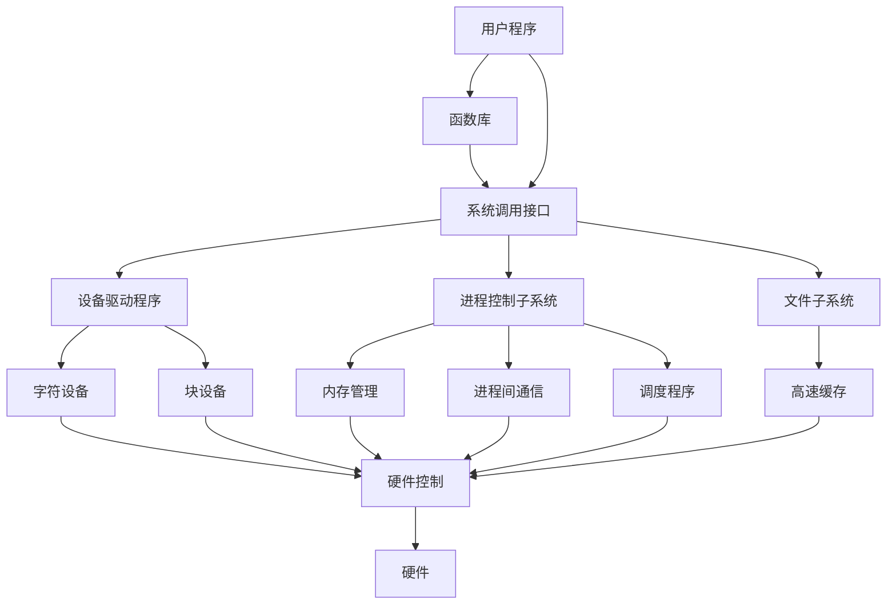

查找文件

```shell
find [搜索路径] [匹配条件] [操作]
```

查看系统CPU性能

```shell
top
```


###### 1.什么是IO多路复用。

select（位图），poll（动态数组），内核遍历的方式寻找可读可写的socket进行标记，之后再送回内存，内存再次遍历才能找到相应的socket

epoll（红黑树），内核中用红黑树跟踪进程所有待检测的文件描述字，当事件触发时通过回调函数内核将其加到就绪事件列表中，向内存返回事件发生的文件描述符的个数。

水平触发（LT)不断从epoll wait中苏醒，直到内核缓冲区数据被read函数读完才结束，边缘触发（ET）+非阻塞

###### 2.虚拟内存

两次映射：第一次映射到虚拟内存空间，第二次映射到物理内存空间

分段和分页


#### linux内核与体系结构

一个**完整的操作系统**主要由四部分组成：**硬件，操作系统内核，操作系统服务，用户应用程序**。

操作系统的内核结构模式主要分为**整体式的单内核模式**和**层次式的微内核模式**。linux 0.11内核采用单内核模式，单内核模式的内核也可以分为三个层次：调用服务的主程序层，执行系统调用的服务层和支持系统调用的底层函数。

##### linux内核

**linux内核**的主要用途在于与**计算机硬件进行交互**，实现对硬件部件的编程控制和接口操作，调度对硬件资源的访问，**为计算机上的用户提供高级的执行环境和硬件的虚拟接口**。

linux内核主要由五个模块构成：**进程调度模块，内存管理模块，文件系统模块，进程间通信模块，网络接口模块。**

- 进程调度：控制进程对cpu资源的使用，采用合适的调度策略
- 内存管理：确保进程能安全的共享机器主内存区，同时支持虚拟内存
- 文件系统：用于支持对外设的驱动和存储
- 进程通信：支持多种进程间的信息交换方式
- 网络接口：提供对多种网络通信标准的访问 

所有的模块都和进程调度模块存在依赖关系，它们都依靠进程调度程序来挂起或者重新运行它们的进程。



物理内存的分布情况：

```
| 内核模块 | 高速缓冲区 | 虚拟盘 | 主内存区 |
```


##### 参考书籍：

1.《linux内核完全剖析》


