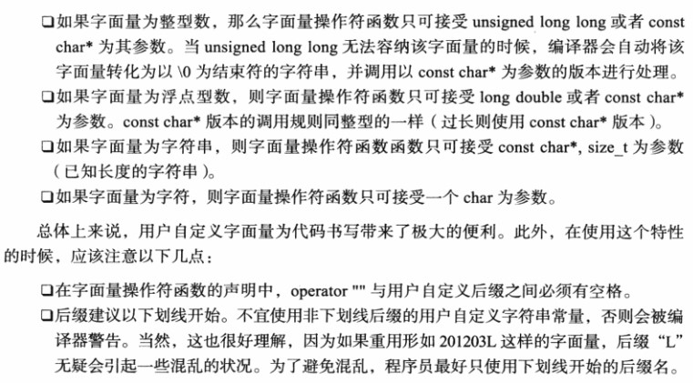
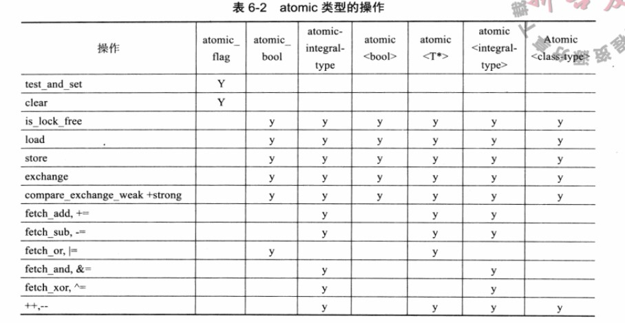
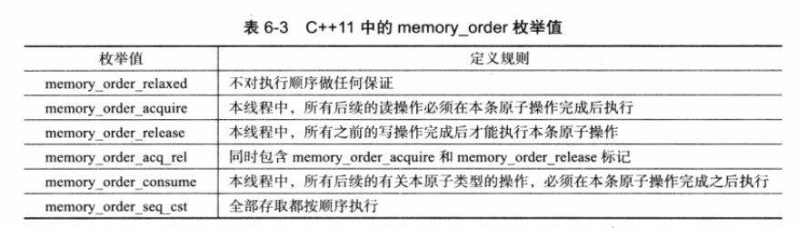
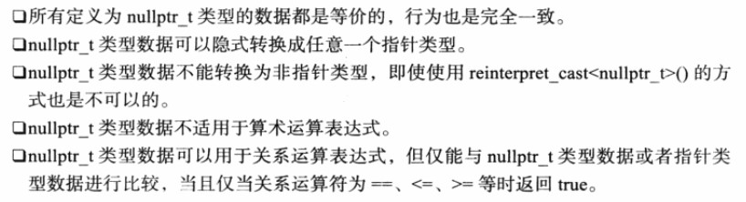

# C++演化(论文现代C++白皮书，书籍深入理解C++11特性)

> [TOC]
>

> 本文分为两部分：
>
> - 现代c++白皮书：在纷繁多变的世界里茁壮成长：C++ 2006–2020论文笔记
> - 书籍：深入理解c++11特性阅读笔记
>
> 找资料的过程中发现了现代c++白皮书，相见恨晚，github上还有各路大佬翻译的中文版，论文和《深入理解c++11》刚好可以同步学习，c++11应该属于现代版c++的开端，到了c++20，版本迭代属于更加完善了。
>
> 
>
> c++11那本书可以看，如果学习过一些c++项目的话，很多常用好用特性已经反复出现多次了，可能以前没觉察，通过这本书很能让你回忆起以前的诸多代码。
>
> 现代c++白皮书这个论文，它的重点不在于给你讲解知识点，而在于讲述它们出现的流程原因结果改善，以及各种特性的比较。想要完全看懂必然需要一定的水平，我也只是大概看了看，起码做个了解是没有坏处的。


## 论文：在纷繁多变的世界里茁壮成长：C++ 2006–2020(摘录+个人思考)

> 具体的语言技术话题包括**内存模型**、**并发并行**、**编译期计算**、**移动语义**、**异常**、**lambda 表达式**和**模块**。要设计一种机制来指定模板对其参数的要求，既足够灵活和精确，又不会增加运行期开销，实践证明这很困难。设计“概念”来做到这一点的反复尝试可以追溯到 1980 年代，并触及到 C++ 和泛型编程的许多关键设计问题。

### 1. 前言

c++发展的决定性性特征在于

- **语言构件到硬件功能的直接映射**（直接操作硬件）
- **零开销抽象**（不用的东西不付出代价）

#### c++年表

1. 1979年，工作从“C with class”变成C++
   - 语言：class，构造析构，public/private，简单继承，函数参数类型检查
   - 库：task（写出和仿真），vector
2. 1985年：c++首次商业发行
   - 语言：virtual函数，运算符重载，引用，常量
   - 库：输入输出流
3. 1989-91：ANSI和ISO标准化；
4. 1998：c++98，第一个ISO C++标准
5. **2011 年**：C++11 [Becker 2011]，TC++PL4 [Stroustrup 2013]
   - 语言：内存模型、`auto`、范围 `for`、`constexpr`、lambda 表达式、用户定义字面量……
   - 库：`thread` 和锁、`future`、`unique_ptr`、`shared_ptr`、`array`、时间和时钟、随机数、无序容器（哈希表）……
6. **2014 年**：C++14 [du Toit 2014]
   - 语言：泛型 lambda 表达式、`constexpr` 函数中的局部变量、数字分隔符……
   - 库：用户定义字面量……
7. **2017 年**：C++17 [Smith 2017]
   - 语言：结构化绑定、变量模板、模板参数的构造函数推导……
   - 库：文件系统、`scoped_lock`、`shared_mutex`（读写锁）、`any`、`variant`、`optional`、`string_view`、并行算法……
8. 2020 年：C++20 [Smith 2020]
   - 语言：`concept`、`module`、协程、三路比较、改进对编译期计算的支持……
   - 库：概念、范围、日期和时区、`span`、格式、改进的并发和并行支持……

从 2006 年到 2020 年，C++ 经历了两次主要修订：C++11 和 C++20；而论文的早期读者们也都要求获得更多的信息。结果就是论文的页数几乎翻倍。即使以目前的篇幅，读者也会发现某些重要的主题没有得到充分的展现，如并发和标准库。


### 2. 背景：C++的1979-2006

#### c++98语言特性：

- 模板，支持泛型编程
- 异常处理
- 运行期类型识别，danamic_cast, typeid
- namespace命名空间
- 条件语句内的声明
- 具名类型转换，（`static_cast`、`reinterpret_cast` 和 `const_cast`）
- bool

**C++98 中最重要的技术之一是 RAII**（Resource Acquisition Is Initialization, 资源获取即初始化）。想法就是每个资源都应该有一个所有者，它由作用域对象表示：构造函数获取资源、析构函数隐式地释放它。经常被用在标准文件流，file，智能指针中等

#### C++98 标准库

- STL——创造性的、通用的、优雅的、高效的容器、迭代器和算法框架，由 Alexander Stepanov 设计。
- 特征（trait）——对使用模板编程有用的编译期属性集（[§4.5.1](https://github.com/Cpp-Club/Cxx_HOPL4_zh/blob/main/04.md#451-实现技巧)）。
- `string`——一种用于保存和操作字符序列的类型。字符类型是一个模板参数，其默认值是 `char`。
- `iostream`——由 Jerry Schwartz 和标准委员会精心制作，基于我 1984 年的简单的数据流，处理各种各样的字符类型、区域设置和缓冲策略。
- `bitset`——一种用于保存和操作比特位集合的类型。
- `locale`——用来处理不同文化传统的精致框架，主要与输入输出有关。
- `valarray`——一个数值数组，带有可优化的向量运算，但遗憾的是，未见大量使用。
- `auto_ptr`——早期的代表独占所有权的指针；在 C++11 中，它被 `shared_ptr`（共享所有权）和 `unique_ptr`（独占所有权）（[§4.2.4](https://github.com/Cpp-Club/Cxx_HOPL4_zh/blob/main/04.md#424-资源管理指针)）替代。


### 3. C++标准委员会

讲述了一些关于c++制定标准时的矛盾冲突，或者c++需要更好的特性适应发展，参与c++修订人员变多的管理等等，和语法没什么很大关系，简单浏览下。


### 4. C++11感觉像是门新语言

#### [§4.1](https://github.com/Cpp-Club/Cxx_HOPL4_zh/blob/main/04.md#41-c11并发支持)：支持并发

##### 内存模型

内存屏障和原子操作

（无锁编程）


##### 线程和锁

- `thread`——系统的执行线程，支持 `join()` 和 `detach()`
- `mutex`——系统的互斥锁，支持 `lock()`、`unlock()` 和保证 `unlock()` 的 RAII 方式
- `condition_variable`——系统中线程间进行事件通信的条件变量
- `thread_local`——线程本地存储


##### 期值

- `future`——一个句柄，通过它你可以从一个共享的单对象缓冲区中 `get()` 一个值，可能需要等待某个 `promise` 将该值放入缓冲区。
- `promise`——一个句柄，通过它你可以将一个值 `put()` 到一个共享的单对象缓冲区，可能会唤醒某个等待 `future` 的 `thread`。
- `packaged_task`——一个类，它使得设置一个函数在线程上异步执行变得容易，由 `future` 来接受 `promise` 返回的结果。
- `async()`——一个函数，可以启动一个任务并在另一个 `thread` 上执行。


#### [§4.2](https://github.com/Cpp-Club/Cxx_HOPL4_zh/blob/main/04.md#42-c11简化使用)：简化使用

最常用的三种：

- [§4.2.1](https://github.com/Cpp-Club/Cxx_HOPL4_zh/blob/main/04.md#421-auto-和-decltype)：`auto`

  `auto` 是个纯粹的简化特性，而 `decltype` 的主要目的，则是让基础库可以使用复杂的元编程。然而，从语言使用的技术角度来看，它们是密切相关的。

- [§4.2.2](https://github.com/Cpp-Club/Cxx_HOPL4_zh/blob/main/04.md#422-范围-for)：范围 `for`

- [§4.3.1](https://github.com/Cpp-Club/Cxx_HOPL4_zh/blob/main/04.md#431-lambda-表达式)：lambda 表达式


**移动语义**：减少拷贝次数


**智能指针**

- `shared_ptr`——代表共享所有权
- `unique_ptr`——代表独占所有权（取代 C++98 中的 `auto_ptr`）


{} 使用初始化器列表

`nullptr`


`constexpr`

- 让编译期计算达到类型安全
- 一般来说，通过将计算移至编译期来提高效率
- 支持嵌入式系统编程（尤其是 ROM）
- 直接支持元编程（而非**模板**元编程（[§10.5.2](https://github.com/Cpp-Club/Cxx_HOPL4_zh/blob/main/10.md#1052-元编程)））
- 让编译期编程与“普通编程”非常相似


字符串字面量


属性（）暂时不清楚具体用法

- C++11 增加了标准属性 `[[noreturn]]` 和 `[[carries_dependency]]`。
- C++17 增加了 `[[fallthrough]]`、`[[nodiscard]]` 和 `[[maybe_unused]]`。
- C++20 增加了 `[[likely]]`、`[[unlikely]]`、`[[deprecated(message)]]`、`[[no_unique_address]]` 和 `[[using: …]]`。


垃圾收集

> 同时支持垃圾收集实现和基于可达性的泄漏检测器。这是通过把“隐藏指针”的程序定为未定义行为来实现的；举例来说，将指针与另一个值进行异或运算，然后将它转换回普通指针并对其进行解引用就是一种隐藏行为。


#### [§4.3](https://github.com/Cpp-Club/Cxx_HOPL4_zh/blob/main/04.md#43-c11改进对泛型编程的支持)：改进对泛型编程的支持

这些好处是

- 超越以 C 风格或面向对象风格所可能获得的灵活性
- 更清晰的代码
- 更细的静态类型检查粒度
- 效率（主要来自内联、让编译器同时查看多处的源代码，以及更好的类型检查）

C++11 中支持泛型编程的主要新特性有：

[§4.3.1](https://github.com/Cpp-Club/Cxx_HOPL4_zh/blob/main/04.md#431-lambda-表达式)：lambda 表达式

- 把代码写在需要它的那个准确位置上（通常作为函数参数）。
- 从代码内部访问代码的上下文。

引发的讨论

- 语法应该是富有表现力的还是简洁的？
- lambda 表达式可以从哪个作用域引用什么名字？[Crowl 2009]。
- 从 lambda 表达式生成的函数对象应该是可变的吗？默认情况下不是。
- lambda 表达式能是多态的吗？到 C++14 才可以（[§5.4](https://github.com/Cpp-Club/Cxx_HOPL4_zh/blob/main/05.md#54-泛型-lambda-表达式)）。
- lambda 表达式的类型是什么？独有的类型，除非它基本上是一个局部函数。
- lambda 表达式可以有名字吗？不可以。如果你需要一个名字，就把它赋给一个变量。
- 名称是由值绑定还是由引用绑定？你来选择。
- 变量可以移动到 lambda 表达式中（相对于复制）吗？到 C++14 才可以（[§5](https://github.com/Cpp-Club/Cxx_HOPL4_zh/blob/main/05.md#5-c14完成-c11)）。
- 语法是否会与各种非标准扩展发生冲突？（不严重）。


[§4.3.2](https://github.com/Cpp-Club/Cxx_HOPL4_zh/blob/main/04.md#432-变参模板)：变参模板

直接解决两个问题：

- 不能实例化包含任意长度参数列表的类模板和函数模板。
- 不能以类型安全的方式传递任意个参数给某个函数

变参模板的基本**思路**是，递归构造一个**参数包**，然后在另一个递归过程来使用它。递归技巧是必须的，因为参数包中的每个元素都有它自己的类型（和大小）。

**编译时间过长**的问题随模板元编程的大量使用（[§10.5.2](https://github.com/Cpp-Club/Cxx_HOPL4_zh/blob/main/10.md#1052-元编程)）变得越来越严重，对此变参模板是一项重大（有时是 20 倍）改进。可惜，变参模板越变越流行，也成了 C++ 标准库中必需的部分，以至编译时间的问题又出现了。

变参模板的**缺点**是容易导致代码膨胀，因为 N 个参数意味着模板的 N 次实例化。


[§4.3.3](https://github.com/Cpp-Club/Cxx_HOPL4_zh/blob/main/04.md#433-别名)：`template` 别名

```cpp
typedef double (*analysis_fp)(const vector<Student_info>&);

using analysis_fp = double (*)(const vector<Student_info>&);
```

C 定义类型别名的机制是靠 `typedef`

类型和模板别名是某些最有效的零开销抽象及模块化技巧的关键。别名让用户能够使用一套标准的名字而同时让各种实现使用各自（不同）的实现技巧和名字。这样就可以在拥有零开销抽象的同时保持方便的用户接口


[§4.3.4](https://github.com/Cpp-Club/Cxx_HOPL4_zh/blob/main/04.md#434-tuple)：`tuple`

> 元组是大小固定而成员类型可以不同的容器。作为一种通用的辅助工具，它们增加了语言的表现力。举几个元组类型一般用法的例子：
>
> - 作为返回类型，用于需要超过一个返回类型的函数
> - 编组相关的类型或对象（如参数列表中的各条目）成为单个条目
> - 同时赋多个值

```cpp
auto SVD(const Matrix& A) -> tuple<Matrix, Vector, Matrix>
{
    Matrix U, V;
    Vector S;
    // ...
    return {U,S,V};
};

void use()
{
    Matrix A;
    // ...
    auto [U,S,V] = SVD(A); // 使用元组形式和C++17结构化绑定，
    // 这写法怎么和matlab一样一样的
}
```


> 为什么 `tuple` 不是语言特性？我不记得当时有人这么问过，尽管一定有人想到过这一点。长期以来（自 1979 年），我们的策略就是，如果能合理地将新特性以库的形式加入 C++，就不要以语言特性加入；如果不能，就要改进抽象机制使其成为可能。这一策略有显而易见的优势：
>
> - 通常对一个库做试验比对一个语言特性做试验更容易，这样我们就更快地得到更好的反馈。
> - 库可以早在所有编译器升级到支持新特性之前就得到严肃使用。
> - 抽象机制（类，模板等）上的改进，能在眼前问题之外提供帮助。


[§4.2.5](https://github.com/Cpp-Club/Cxx_HOPL4_zh/blob/main/04.md#425-统一初始化)：统一初始化


#### [§4.4](https://github.com/Cpp-Club/Cxx_HOPL4_zh/blob/main/04.md#44-c11提高静态类型安全)：提高静态类型安全

依赖静态类型安全有两大好处：

- 明确意图
  - 帮助程序员直接表达想法
  - 帮助编译器捕获更多错误
- 帮助编译器生成更好的代码。

**C++11 中与类型安全直接相关的改进有**：

- 对于线程和锁的类型安全接口——避免 POSIX 和 Windows 在并发代码中对 `void**` 及宏的依赖（[§4.1.2](https://github.com/Cpp-Club/Cxx_HOPL4_zh/blob/main/04.md#412-线程和锁)）
- 范围 `for`——避免错误地指定范围（[§4.2.2](https://github.com/Cpp-Club/Cxx_HOPL4_zh/blob/main/04.md#422-范围-for)）
- 移动语义——解决指针的过度使用问题（[§4.2.3](https://github.com/Cpp-Club/Cxx_HOPL4_zh/blob/main/04.md#423-移动语义)）
- 资源管理指针（`unique_ptr` 和 `shared_ptr`（[§4.2.4](https://github.com/Cpp-Club/Cxx_HOPL4_zh/blob/main/04.md#424-资源管理指针)））
- 统一初始化——让初始化更通用，更一致，更安全（[§4.2.5](https://github.com/Cpp-Club/Cxx_HOPL4_zh/blob/main/04.md#425-统一初始化)）
- `constexpr`——消除多处（无类型和无作用域的）宏的使用（[§4.2.7](https://github.com/Cpp-Club/Cxx_HOPL4_zh/blob/main/04.md#427-constexpr-函数)）
- 用户定义的字面量——让用户定义类型更像内建类型（[§4.2.8](https://github.com/Cpp-Club/Cxx_HOPL4_zh/blob/main/04.md#428-用户定义字面量)）
- `enum class`——消除一些涉及整型常量的弱类型做法
- `std::array`——避免内建数组不安全地“退化”成指针


#### [§4.5](https://github.com/Cpp-Club/Cxx_HOPL4_zh/blob/main/04.md#45-c11支持对库的开发)：支持对库的开发

> 设计 C++ 基础库，往往要在性能和易用性方面同 C++ 及其他语言的内置功能进行竞争。这时，查找规则、重载决策、访问控制、模板实例化规则等特性之中的微妙之处会组合起来，产生强大的表达能力，但同时也暴露出可怕的复杂性。

- **SFINAE**（Substitution Failure Is Not An Error，替换失败不是错误）。

- 你如何表达一个当且仅当某个谓词为真时才有的操作？概念为 C++20 提供了这样的支持（GCC 自 2015 年开始支持），但在 21 世纪早期，人们不得不依赖于晦涩的语言规则。

  ```cpp
  template<typename T, typename U>
  struct pair {
      T first;
      U second;
      // ...
      /*当且仅当 pair 的两个成员都有拷贝赋值操作时 pair 才有拷贝赋值操作。这超乎寻常的丑陋，但它对于定义和实现基础库也超乎寻常的有用——在概念还没有出现时。*/
      /*如果成员都有拷贝赋值，enable_if<…,pair&>::type 会成为一个普通的 pair&，否则它的实例化就会失败（因为 enable_if 没有为赋值提供一个返回类型）。这里 SFINAE 就起作用了：替换失败不是错误；失败的结果就如同整条声明不曾出现一样。*/
      /*这里的 is_copy_assignable 是一个 type trait（类型特征），C++11 提供了数十个这样的特征以便程序员在编译期询问类型的属性。*/
      enable_if<is_copy_assignable<T>::value
                && is_copy_assignable<U>::value,pair&>::type
          operator=(const pair&);
      //...
  };
  ```

  `enable_if` 元函数由 Boost 开创并成为 C++11 的一部分。一个大致合理的实现：

  ```cpp
  template<bool B, typename T = void>
  struct enable_if {}; // false 的情况：里面没有 type
  
  template<typename T>
  struct enable_if<true, T> { typedef T type; }; // type 是 T
  ```

- 元编程支持

  为了改进编译器资源的利用，改进尝试采用了两条（至少理论上）互补的路径：

  - **语言**：概念（[§6](https://github.com/Cpp-Club/Cxx_HOPL4_zh/blob/main/06.md#6-概念)），编译期函数（[§4.2.7](https://github.com/Cpp-Club/Cxx_HOPL4_zh/blob/main/04.md#427-constexpr-函数)），lambda 表达式（[§4.3.1](https://github.com/Cpp-Club/Cxx_HOPL4_zh/blob/main/04.md#431-lambda-表达式)），模板别名（[§4.3.3](https://github.com/Cpp-Club/Cxx_HOPL4_zh/blob/main/04.md#433-别名)），以及更精确的模板实例化规范（[§4.5.1](https://github.com/Cpp-Club/Cxx_HOPL4_zh/blob/main/04.md#451-实现技巧)）。
  - **标准库**：`tuple`（[§4.3.4](https://github.com/Cpp-Club/Cxx_HOPL4_zh/blob/main/04.md#434-tuple)），类型特征（[§4.5.1](https://github.com/Cpp-Club/Cxx_HOPL4_zh/blob/main/04.md#451-实现技巧)），以及 `enable_if`（[§4.5.1](https://github.com/Cpp-Club/Cxx_HOPL4_zh/blob/main/04.md#451-实现技巧)）。

  遗憾的是，概念在 C++11（[§6.2](https://github.com/Cpp-Club/Cxx_HOPL4_zh/blob/main/06.md#62-c0x-概念)）中失败了，这给（通常复杂得可怕而且容易出错的）权宜之计留下了生存空间，典型情况会涉及类型特征和 `enable_if`（[§4.5.1](https://github.com/Cpp-Club/Cxx_HOPL4_zh/blob/main/04.md#451-实现技巧)）

- `noexcept`


#### [§4.6](https://github.com/Cpp-Club/Cxx_HOPL4_zh/blob/main/04.md#46-c11标准库组件)：标准库组件

C++11 增加了几个关键的库组件来支持特定任务：

- `thread`——基于线程和锁的并发

- `regex`——正则表达式

- `chrono`——时间

  `Howard Hinnant` 的 `chrono` 库 `[Hinnant et al. 2008] `处理时间点和时间间隔，在提供复杂功能的同时仍保持了易用性。

  到了 C++20，`chrono` 得到进一步增强，加入了处理日期和时区的功能

- `random`——随机数产生器和分布.

  `random` 库提供了分布函数和随机数产生器，其复杂性被誉为“每个随机数库都想长成的样子”。


### 5. C++14：完成 C++11

#### 二进制4字面量，例如 `0b1001000011110011`


#### [§5.1](https://github.com/Cpp-Club/Cxx_HOPL4_zh/blob/main/05.md#51-数字分隔符)：数字分隔符——为了可读性，例如 `0b1001'0000'1111'0011`

```cpp
auto a = 1'234'567;    // 1234567（整数）
auto b = 1'234'567s;   // 1234567 秒
```


#### [§5.2](https://github.com/Cpp-Club/Cxx_HOPL4_zh/blob/main/05.md#52-变量模板)：变量模板——参数化的常量和变量

```cpp
template<typename T>
constexpr T pi = T(3.1415926535897932385); // 模板常量

template<typename T>
T circular_area(T r)
{
    return pi<T> * r * r;
}
```

将来可以联系`concept`或者`constexpr`一起使用，可以达到不错的效果。

```cpp
template<typename T>
concept SignedIntegral = Signed<T> && Integral<T>; // concept起到的作用为类型约束，编译时检查

template<typename T> 
constexpr T pi_v = unspecified; // pi_v为模板变量
constexpr double pi = pi_v<double>; // b
```


#### [§5.3](https://github.com/Cpp-Club/Cxx_HOPL4_zh/blob/main/05.md#53-函数返回类型推导)：函数返回类型推导

C++11 引入了从 lambda 表达式的 return 语句来推导其返回类型的特性。C++14 将该特性扩展到了函数：

```cpp
template<typename T>
auto size(const T& a) { return a.size(); }
```


#### [§5.4](https://github.com/Cpp-Club/Cxx_HOPL4_zh/blob/main/05.md#54-泛型-lambda-表达式)：泛型 lambda 表达式

lambda 表达式是函数对象（[§4.3.1](https://github.com/Cpp-Club/Cxx_HOPL4_zh/blob/main/04.md#431-lambda-表达式)），因此它们显然可以是模板。在 C++14 中引入泛型 lambda 表达式，而没有引入概念，使得对受约束和不受约束的 lambda 表达式参数和函数参数的规则和写法就没有一起考虑.


#### [§5.5](https://github.com/Cpp-Club/Cxx_HOPL4_zh/blob/main/05.md#55-constexpr-函数中的局部变量)：`constexpr` 函数中的局部变量

该标准给了`constexpr`更宽松的限制，允许使用局部变量和for循环，比如：

```cpp
constexpr int min(std::initializer_list<int> xs)
{
  int low = std::numeric_limits<int>::max();
  for (int x : xs)
    if (x < low)
      low = x;
  return low;
}

constexpr int m = min({1,3,2,4});
```


- 移动捕获——例如 `[p = move(ptr)] {/* ... */};` 将值移入 lambda 表达式
- 按类型访问元组，例如 `x = get<int>(t);`
- 标准库中的用户定义字面量，例如：`10i`，`"Hello"s`，`10s`，`3ms`，`55us`，`17ns`


### 6. 概念

> 碎碎念：目前所见过的源码就没见过concept的一些使用，这篇好难，看的我头大，所以也看的好潦草，在网上搜索了一些相关文章的讲解，留些其它链接了。

[C++20新特性之concept -  uint128’s Blog](https://uint128.com/2020/11/20/C-20%E6%96%B0%E7%89%B9%E6%80%A7%E4%B9%8Bconcept/)

评价：一般般，不细致，讲的很简单，简单过过当作了解没问题。

[concept for C++20用法简介 - 南山烟雨珠江潮](https://zhuanlan.zhihu.com/p/107610017)

评价：很强的佬，还看到这个博主的c++2x特性专栏，很值得订阅。

这两文章都重在用法，基本就是依据`require`和SFINEA规则，可以实现约束和重载。concept可以理解为对SIFNAE机制的升级。

[C++20: Concept详解以及个人理解 - Lumi](https://zhuanlan.zhihu.com/p/266086040)

评价：最详细的一篇，作者网易游戏开发，图形学领域，好厉害。

最终评价，与其探究concept的演化过程不如直接看当前结论，毕竟从0几年提出到20年才正式宣布，过程太长了，研究这个对初学者比如我，不太友好。


> 由于模板极大的灵活性，编译器要做的时就是在函数体中使用模板参数。如果正确调用将生成出色的代码，不正确的调用会生成一塌糊涂的错误信息。因此衍生出来了`concept`。

```cpp
template<range R, typename Value>
    requires equality_comparable<Value, Range::value_type> // equity_comparable, 说明两个模板参数之间必须有关系，同时Ranges标准库组件规范了两者间的关系
forward_iterator find(R r, const Value& val)
{
    auto first = begin(r);
    auto last = end(r);
    while (first!=last && *first!=val)
        ++first;
    return first;
}
```


#### 6.1 概念的早期历史

早期认为C风格的宏能够有效支持泛型编程，但是宏只是预处理器定义的一种简单的文本替换机制，缺乏类型检查，调试困难。为了设计有合适接口的模板，我们的设计目标是

- **全面的通用性/表现力**——我明确不希望这些功能只能表达我想到的东西。
- **与手工编码相比，零额外开销**——例如，我想构建一个能够与 C 语言的数组在时间和空间性能方面相当的 vector。
- **规范化的接口**——我希望类型检查和重载的功能与已有的非泛型的代码相类似

`Bjarne Stroustrup` 和 `Gabriel Dos Reis` 在 2003 年发表的论文` [Stroustrup 2003; Stroustrup and Dos Reis 2003a,b]` 明确指出，**概念**是简化泛型编程的宏伟计划的一部分。例如，一个 `concept` 可以被定义为一组**使用模式**的约束。下面是为`concept`提出的建议

- 概念——用于指定对模板参数要求的编译期谓词。
- 根据使用模式来指定原始约束——以处理重载和隐式类型转换。
- 多参数概念——例如 `Mergeable<In1,In2,Out>`。
- 类型和值概念——也就是说，概念既可以将值也可以将类型当作参数，例如 `Buffer<unsigned char,128>`。
- 模板的“类型的类型”简略写法—例如 `template<Iterator Iter> …`。
- “模板定义的简化写法”——例如 `void f(Comparable&);` 使泛型编程更接近于“普通编程”。
- `auto` 作为函数参数和返回值中约束最少的类型。
- 统一函数调用（[§8.8.3](https://github.com/Cpp-Club/Cxx_HOPL4_zh/blob/main/08.md#883-统一调用语法)）——减少泛型编程与面向对象编程之间的风格差异问题（例如 `x.f(y)`、`f(x,y)` 和 `x+y`）。


#### 6.2 C++0x 概念

概念被定义为一组操作和相关类型

将概念定义为一组操作的方法中存在一个严重的问题，考虑在 C++ 中传递参数的方式。传递参数的不同方式的语义并不相同，因此我们自然而然地转向接受指定的参数类型，将匹配的负担推到了类型设计者和 `concept_maps` 的作者。

- 概念使用，require
- 概念映射，concept_map
- 定义检查

为了完成从无约束的模板到使用概念的模板的转换，我们需要语言支持。在 C++0x 的设计中，这两类模板非常不同：

- 受约束模板不能调用无约束模板，因为不知道无约束模板使用什么操作，因此无法对受约束模板进行定义检查。
- 无约束模板可以调用受约束模板，但是检查必须推迟到实例化的时候，因为在那之前我们不知道无约束模板在调用中使用什么类型。

概述了在我看来要让概念在 C++0x 中变得可接受所必须做的最小改进：

- 尽量少使用 `concept_map`。
- 使所有 `concept_map` 隐式/自动化。
- 概念如需要 `begin(x)`，那它也得接受 `x.begin()`，反之亦然（统一函数调用）；（[§6.1](https://github.com/Cpp-Club/Cxx_HOPL4_zh/blob/main/06.md#61-概念的早期历史)），（[§8.8.3](https://github.com/Cpp-Club/Cxx_HOPL4_zh/blob/main/08.md#883-统一调用语法)）
- 使所有标准库概念隐式/自动化。

对概念目标用户的分歧：

- **显式还是隐式**：为了安全和避免意外，程序员是否应该显式地说明如何从潜在可选方案中做决策？该讨论最终涉及有关重载决策、作用域决策、类型与概念的匹配、概念之间的关系，等等。
- **专家与普通人**：关键语言和标准库工具是否应该设计为供专家使用？如果是这样，是否应该鼓励“普通程序员”只使用有限的语言子集，是否应该为“普通程序员”设计单独的库？这个讨论出现在类、类层次结构、异常、模板等的设计和使用的场景中。


#### 6.3 Concepts TS

2009 年，几乎是在概念刚从 C++0x 移除之后，Gabriel Dos Reis、Andrew Sutton 和我开始重新设计概念。这次设计是根据我们最初的想法、从 C++0x 语言设计中得到的经验、使用 C++0x 概念的经验，以及标准委员会的反馈。我们的结论是

- 概念必须有语义上的意义
- 概念数量应该相对较少
- 概念应该基本，而非最小

在 Concepts TS 中 [Sutton 2017]

- 概念基于编译期谓词（包括多参数谓词和值参数）。
- 以使用模式来描述原始要求 [Dos Reis 和 Stroustrup 2006]（`requires` 表达式）。
- 概念可以用在一般的 `requires` 子句中，当作模板形参定义中 `typename` 的替代，也可以当作函数形参定义中类型名的替代。
- 从类型到概念的匹配是隐式的（没有 `concept_map`）。
- 重载中概念间是隐式的关系（通过计算得出，而不需要为概念进行显式细化）。
- 没有定义检查（至少目前还没有，所以也没有 `late_check`）。
- 没有 `axiom`，但这只是因为我们不想因为一个潜在有争议的特性而让设计更加复杂、产生拖延。C++0x 的 `axiom` 也可以是一个好起点。


### 7. 错误处理

[对使用 C++ 异常处理应具有怎样的态度？](https://www.zhihu.com/question/22889420/answer/22975569?utm_psn=1831491853448515585)

> 没理解，这篇是真的不太理解，平时写代码也很少处理异常）
>
> 仅仅知到只有noexcept可用，或者RALL管理内存之类的，待办，原文链接：[错误处理](https://github.com/Cpp-Club/Cxx_HOPL4_zh/blob/main/07.md).有兴趣的去看原文吧，看了几个回答貌似是说大部分代码也不太会进行异常处理。

C++ 从 C 语言中继承了各种基于错误返回码的机制，错误可以用**特殊值、全局状态、局部状态和回调**等多种方式表达。

**C++ 异常机制的主要目标是使不完整或复杂的错误处理中的错误最小化。**

C++ 异常是在 1988–89 年设计的，旨在解决当时普遍存在的复杂且容易出错的错误处理技术。当前控制异常的机制：

- RALL
- C++11 引入了 `noexcept` 作为一种更简单、更有效的控制异常的机制（[§4.5.3](https://github.com/Cpp-Club/Cxx_HOPL4_zh/blob/main/04.md#453-noexcept-规约)）。
- C++ 函数中的异常不会消失，因此我们将有四种选择：错误码、编译期检查的异常（例如 [Sutter 2018b]）、当前异常和 `noexcept`。只有当前的异常和非本地错误码不会影响类型系统或调用约定（ABI 接口）。

从根本上讲， C++ 需要两种错误处理机制：

- **异常**——罕见的错误或直接调用者无法处理的错误。
- **错误码**——错误码表示可以由直接调用者处理的错误（通常隐藏在易于使用的检测操作中或作为 (值,错误码) 对从函数返回）。


### 8. C++17：大海迷航

C++17提供的新特性也挺多，包括21个新的语言特性和13个标准库中增加的特性。令人困扰的是这些功能没有统一的主题，没有整体的规划，似乎只是由于可以达到投票多数而被扔进语言和标准库中的一组“聪明的想法”。这种状况可能给未来语言的发展带来更大的弊端，因此必须采取一些措施做出改变 。

#### 21 个新的语言特性

- 构造函数模板参数推导——简化对象定义（[§8.1](https://github.com/Cpp-Club/Cxx_HOPL4_zh/blob/main/08.md#81-构造函数模板参数推导)）
- 推导指引——解决构造函数模板参数推导歧义的明确写法（[§8.1](https://github.com/Cpp-Club/Cxx_HOPL4_zh/blob/main/08.md#81-构造函数模板参数推导)）
- 结构化绑定——简化写法并消除一种未初始化变量的来源（[§8.2](https://github.com/Cpp-Club/Cxx_HOPL4_zh/blob/main/08.md#82-结构化绑定)）
- `inline` 变量——简化了那些仅有头文件的库实现中的静态分配变量的使用 [Finkel and Smith 2016]
- 折叠表达式——简化变参模板的一些用法 [Sutton and Smith 2014]
- 条件中的显式测试——有点像 for 语句中的条件（[§8.7](https://github.com/Cpp-Club/Cxx_HOPL4_zh/blob/main/08.md#87-条件的显式测试)）
- 保证的复制消除——去除了很多不必要的拷贝操作 [Smith 2015]
- 更严格的表达式求值顺序——防止了一些细微的求值顺序错误 [Dos Reis et al. 2016b]
- `auto` 当作模板参数类型——值模板参数的类型推导 [Touton and Spertus 2016]
- 捕捉常见错误的标准属性——`[[maybe_unused]]`、`[[nodiscard]]` 和 `[[fallthrough]]` [Tomazos 2015]
- 十六进制浮点字面量 [Köppe 2016a]
- 常量表达式 `if`——简化编译期求值的代码


#### 标准库中增加大约 13 个新特性

- `optional`、`any` 和 `variant`——用于表达“可选”的标准库类型（[§8.3](https://github.com/Cpp-Club/Cxx_HOPL4_zh/blob/main/08.md#83-variantoptional-和-any)）

  替代`union`

- `shared_mutex` 和 `shared_lock`**（读写锁）**和 `scoped_lock`（[§8.4](https://github.com/Cpp-Club/Cxx_HOPL4_zh/blob/main/08.md#84-并发)）

- 并行 STL——标准库算法的多线程及矢量化版本（[§8.5](https://github.com/Cpp-Club/Cxx_HOPL4_zh/blob/main/08.md#85-并行-stl)）

  ```cpp
  sort(par_unseq, begin(v), end(v));  // 考虑并行和向量化
  ```

  当前并行版本并不完全，估计会在C++23中具体提出。

- 文件系统——可移植地操作文件系统路径和目录的能力（[§8.6](https://github.com/Cpp-Club/Cxx_HOPL4_zh/blob/main/08.md#86-文件系统)）

- `string_view`——对不可变字符序列的非所有权引用 [Yasskin 2014]

- 数学特殊函数——包括拉盖尔和勒让德多项式、贝塔函数、黎曼泽塔函数 [Reverdy 2012]


### 9. C++20：方向之争

#### 设计原则

- 在《C++ 语言的设计和演化》[Stroustrup 1994]（[§2.1](https://github.com/Cpp-Club/Cxx_HOPL4_zh/blob/main/02.md#21-第一个十年)）中提出的“经验法则”包括 RAII（[§2.2.1](https://github.com/Cpp-Club/Cxx_HOPL4_zh/blob/main/02.md#221-语言特性)）、面向对象编程、泛型编程和静态类型安全。
- “简单的事情简单做！”（[§4.2](https://github.com/Cpp-Club/Cxx_HOPL4_zh/blob/main/04.md#42-c11简化使用)）则引出洋葱原则（[§4.2](https://github.com/Cpp-Club/Cxx_HOPL4_zh/blob/main/04.md#42-c11简化使用)）。
- 从代码到硬件的直接映射和零开销抽象（[§1](https://github.com/Cpp-Club/Cxx_HOPL4_zh/blob/main/01.md#1-前言)）（[§11.2](https://github.com/Cpp-Club/Cxx_HOPL4_zh/blob/main/11.md#112-技术上的成功)）。
- 基于意见反馈来发展 C++，以解决现实世界的实际问题（[§11.2](https://github.com/Cpp-Club/Cxx_HOPL4_zh/blob/main/11.md#112-技术上的成功)）。
- 保持稳定性和兼容性 [Koenig and Stroustrup 1991b; Stroustrup 1994]。
- 直接和硬件打交道的能力，强有力的可组合的抽象机制，以及最小化的运行时系统


认为重要且适合引入 C++17 的内容及其理由：

- 概念——它让我们可以精确描述泛型程序，并解决对于错误信息质量的广泛抱怨。
- 模块——只要它可以显著地提高与宏的隔离并大大优化编译时间。
- 范围库和其他关键 STL 组件对概念的使用——为主流用户改进错误信息质量和提高库规范的精确性（“STL2”）。
- 统一调用语法——简化模板库的规范和使用。
- 协程——应该非常快速而简单。
- 网络库支持——基于 asio 库，如相应 TS 所描述。
- 契约——不一定需要在 C++17 的库规范中使用。
- SIMD 向量和并行算法。
- 标准库词汇类型，比如 `optional`、`variant`、`string_view` 和 `array_view`。
- 一种在栈上提供数组（`stack_array`）的“魔法类型”，合理支持安全、便捷的使用。


C++20 特性包括：

- [§6.4](https://github.com/Cpp-Club/Cxx_HOPL4_zh/blob/main/06.md#64-c20-概念)：**概念**——对泛型代码的要求进行明确规定

- [§9.3.1](https://github.com/Cpp-Club/Cxx_HOPL4_zh/blob/main/09.md#931-模块)：**模块**——支持代码的模块化，使代码更卫生并改善编译时间

  [C++20 新特性: modules 及实现现状](https://zhuanlan.zhihu.com/p/350136757)

  ```cpp
  export module map_printer;  // 定义一个模块
  
  import iostream;       // 使用 iostream
  import containers;     // 使用我自己的 containers
  using namespace std;
  
  export                 // 让 print_map() 对 map_printer 的用户可用
  template<Sequence S>
      requires Printable<Key_type<S>> && Printable<Value_type<S>>
  void print_map(const S& m) {
      for (const auto& [key,val] : m)  // 分离键和值
          cout << key << " -> " << val << '\n';
  }
  ```

  关键思想：

  - `export` 指令使实体可以被 `import` 到另一个模块中。
  - `import` 指令使从另一个模块 `export` 出来的实体能够被使用。
  - `import` 的实体不会被隐式地再 `export` 出去。
  - `import` 不会将实体添加到上下文中；它只会使实体能被使用（因此，未使用的 `import` 基本上是无开销的）。

- [§9.3.2](https://github.com/Cpp-Club/Cxx_HOPL4_zh/blob/main/09.md#932-协程)：**协程**——无栈协程

  [c++20协程入门](https://zhuanlan.zhihu.com/p/59178345)

- [§9.3.3](https://github.com/Cpp-Club/Cxx_HOPL4_zh/blob/main/09.md#933-编译期计算支持)：**编译期**计算支持

  C++20 增加了好几个相关的特性：

  - `consteval`——保证在编译期进行求值的 `constexpr` 函数 [Smith et al. 2018a]
  - `constinit`——保证在编译期初始化的声明修饰符 [Fiselier 2019]
  - 允许在 `constexpr` 函数中使用成对的 `new` 和 `delete` [Dimov et al. 2019]
  - `constexpr string` 和 `constexpr vector` [Dionne 2018]
  - 使用 `virtual` 函数 [Dimov and Vassilev 2018]
  - 使用 `unions`、异常、`dynamic_cast` 和 `typeid` [Dionne and Vandevoorde 2018]
  - 使用用户定义类型作为值模板参数——最终允许在任何可以用内置类型的地方使用用户定义类型 [Maurer 2012]
  - `is_constant_evaluated()` 谓词——使库实现者能够在优化代码时大大减少平台相关的内部函数的使用 [Smith et al. 2018b]

- [§9.3.4](https://github.com/Cpp-Club/Cxx_HOPL4_zh/blob/main/09.md#934-)：**<=>**——三路比较运算符

  **C++中的三向比较运算符**：

  - 在C++20及以后的版本中，"<=>" 是一个“ spaceship operator ”（太空船运算符），用于比较两个值并返回一个标准的比较结果。它能够实现全序比较，返回值为：
    - -1 如果左边的值小于右边的值，
    - 0 如果两边的值相等，
    - 1 如果左边的值大于右边的值。

- [§9.3.5](https://github.com/Cpp-Club/Cxx_HOPL4_zh/blob/main/09.md#935-范围)：**范围**——提供灵活的范围抽象的库

  比如

  ```cpp
  void test(vector<string>& vs)
  {
      sort(vs);   // 而不是 sort(vs.begin(),vs.end())
  }
  ```

  `range` 本身是一种 `concept`（[§6](https://github.com/Cpp-Club/Cxx_HOPL4_zh/blob/main/06.md#6-概念)）。所有 C++20 标准库算法现在都使用概念进行了精确规定。

- [§9.3.6](https://github.com/Cpp-Club/Cxx_HOPL4_zh/blob/main/09.md#936-日期和时区)：**日期**——提供日期类型、日历和时区的库

- [§9.3.8](https://github.com/Cpp-Club/Cxx_HOPL4_zh/blob/main/09.md#938-跨度)：**跨度**——提供对数组进行高效和安全访问的库

  ```cpp
  void f(span<int> a)  // span 包含一根指针和一条大小信息
  {
      for (int& x : a)
          x = 7;  // 可以
  }
  ```

  span的返回类型最终被定为无符号整数，认为与标准库容器保持一致性更重要，这点使得使用无符号整数是不是一个过去的失误变得无关紧要。

- [§9.3.7](https://github.com/Cpp-Club/Cxx_HOPL4_zh/blob/main/09.md#937-格式化)：**格式化**——提供类型安全的类似于 printf 的输出的库

  ```cpp
  string s = "foo";
  cout << format("The string '{}' has {} characters",s,s.size());
  ```

- [§9.4](https://github.com/Cpp-Club/Cxx_HOPL4_zh/blob/main/09.md#94-并发)：**并发改进**——例如作用域线程和停止令牌

  当前改进：

  - `jthread` 和停止令牌 [Josuttis et al. 2019a]
  - `atomic<shared_ptr<T>>` [Sutter 2017b]
  - 经典的信号量 [Lelbach et al. 2019]
  - 屏障和锁存器 [Lelbach et al. 2019]
  - 小的内存模型的修复和改进 [Meredith and Sutter 2017]

- [§9.5](https://github.com/Cpp-Club/Cxx_HOPL4_zh/blob/main/09.md#95-次要特性)：**很多次要特性**——例如 C99 风格的指派初始化器和使用字符串字面量作为模板参数

  - C99 风格的指派初始化器 [Shen et al. 2016]

  - 对 lambda 捕获的改进 [Köppe 2017b]

  - 泛型 lambda 表达式的模板参数列表 [Dionne 2017]

  - 范围 `for` 中初始化一个额外的变量（[§8.7](https://github.com/Cpp-Club/Cxx_HOPL4_zh/blob/main/08.md#87-条件的显式测试)）

  - 不求值语境中的 lambda 表达式 [Dionne 2016]

  - lambda 捕获中的包展开 [Revzin 2017]

  - 在一些情况下移除对 `typename` 的需要 [Vandevoorde 2017]

  - 更多属性：`[[likely]]` 和 `[[unlikely]]` [Trychta 2016]

  - 在不使用宏的情况下，`source_location` 给出一段代码中的源码位置 [Douglas and Jabot 2019]

  - 功能测试宏 [Voutilainen and Wakely 2018]

  - 条件 `explicit` [Revzin and Lavavej 2018]

  - 有符号整数保证是 2 的补码 [Bastien 2018]

  - 数学上的常数，比如 `pi` 和 `sqrt2` [Minkovsky and McFarlane 2019]

  - 位的操作，比如轮转和统计 1 的个数 [Maurer 2019]

    

 C++20 时尚未准备就绪，但可能会成为 C++23 的主要特性：

- [§8.8.1](https://github.com/Cpp-Club/Cxx_HOPL4_zh/blob/main/08.md#881-网络库)：**网络**——网络库（sockets 等）
- [§9.6.2](https://github.com/Cpp-Club/Cxx_HOPL4_zh/blob/main/09.md#962-静态反射)：**静态反射**——根据周围程序生成代码的功能
- **模式匹配**——根据类型和对象值选择要执行的代码 


### 10. 2020 年的 C++

#### c++应用领域：

- **工业界**：电信（例如 AT&T、爱立信、华为和西门子）、移动设备（基本上是所有，信号处理、屏幕渲染、对性能或可移植性有重大要求的应用）、微电子（例如 AMD、英特尔、Mentor Graphics 和英伟达）、金融（例如摩根士丹利和文艺复兴）、游戏（几乎所有）、图形和动画（例如 Maya、迪士尼和 SideFx）、区块链实现（例如 Ripple）、数据库（例如 SAP、Mongo、MySQL 和 Oracle）、云（例如谷歌、微软、IBM 和 Amazon）、人工智能和机器学习（例如 TensorFlow 库）、运营支持（例如 Maersk 和 AT&T）。
- **科学**：航空航天（例如 Space X、火星漫游者、猎户座载人飞行器、詹姆斯·韦伯太空望远镜）、高能物理（例如 CERN 欧洲核子研究中心、SLAC 国家加速器实验室、费米实验室）、生物学（遗传学、基因组测序）、超大规模计算。
- **教学**：全球大多数工程院校。
- **软件开发**：TensorFlow、工具、库、编译器、Emscripten（从 C++ 生成 asm.js 和 WebAssembly）、运行期代码生成、LLVM（许多新语言的后台支柱，也大量用于工具构建中）、XML 和 JSON 解析器、异构计算（例如 SYCL [Khronos Group 2014–2020] 和 HPX [Stellar Group 2014–2020]）。
- **Web 基础设施**：浏览器（Chrome、Edge、FireFox 和 Safari）、JavaScript 引擎（V8 和 SpiderMonkey）、Java 虚拟机（HotSpot 和 J9）、谷歌和类似组织（搜索、map-reduce 和文件系统）。
- **主要 Web 应用**：阿里巴巴、Amadeus（机票）、Amazon、苹果、Facebook、PayPal、腾讯（微信）、Yandex。
- **工程应用**：达索（CAD/CAM）、洛克希德·马丁（飞机）。
- **汽车**：辅助驾驶 [ADAS Wikipedia 2020; Mobileye 2020; NVIDIA 2020]、软件架构 [Autosar 2020; Autosar Wikipedia 2020]、机器视觉 [OpenCV 2020; OpenCV Wikipedia 2020]、宝马、通用、梅赛德斯、特斯拉、丰田、沃尔沃、大众、Waymo（谷歌自动驾驶汽车）。
- **嵌入式系统**：智能手表和健康监控器（例如佳明）、相机和视频设备（例如奥林巴斯和佳能）、导航辅助设备（例如 TomTom）、咖啡机（例如 Nespresso）、农场动物监控器（例如 Big Dutchman）、生产线温度控制（例如嘉士伯）。
- **安全**：卡巴斯基、美国国家安全局、赛门铁克。
- **医疗和生物学**：医学监测和成像（例如西门子、通用电气、东芝和飞利浦）、断层扫描（例如 CT）、基因组分析、生物信息学、放射肿瘤学（例如 Elekta 和 Varian）。


####  C++ 语言相关的学术研究成果：

- **概念**：泛型编程 [Dehnert and Stepanov 2000]、C++0x 概念 [Gregor et al. 2006]、使用模式 [Dos Reis and Stroustrup 2006]、库设计 [Sutton and Stroustrup 2011]。
- **理论与形式化体系**：继承模型 [Wasserrab et al. 2006]、模板和重载 [Dos Reis and Stroustrup 2005a]、模板语义 [Siek and Taha 2006]、对象布局 [Ramananandro et al. 2011]、构造和析构 [Ramananandro et al. 2012]、用于代码处理的表示形式 [Dos Reis and Stroustrup 2009，2011]、资源模型 [Stroustrup et al. 2015]。
- **动态查找**：快速动态类型转换 [Gibbs and Stroustrup 2006]、模式匹配 [Solodkyyet et al. 2012]、多重方法 [Pirkelbauer et al. 2010]。
- **静态分析**：可靠的表示法 [Yang et al. 2012]、实践经验 [Bessey 2010]。
- **性能**：代码膨胀 [Bourdev and Järvi 2006，2011]、异常实现 [Renwicket et al. 2019]。
- **语言比较**：泛型编程 [Garcia et al. 2007]。
- **并发和并行编程**：内存模型 [Batty et al. 2013，2012，2011]、HPX（一个适用于任何规模的并行和分布式应用程序的通用 C++ 运行时系统 [Kaiser et al. 2009Sept]）、STAPL（自适应泛型并行 C++ 库 [Zandifar et al. 2014]）、TBB（英特尔的任务并行库 [Reinders 2007]）。
- **协程**：数据库优化 [Jonathan et al. 2018; Psaropoulos et al. 2017]。
- **软件工程**：代码的组织和优化 [Garcia and Stroustrup 2015]、常量表达式求值 [Dos Reis and Stroustrup 2010]


#### c++支持的工具：

- 工业级的集成软件开发环境：例如微软的 Visual Studio [Microsoft 2020; VStudio Wikipedia 2020] 和 JetBrains 的 CLion [CLion Wikipedia 2020; JetBrains 2020]。这些环境不仅支持编辑和调试，还支持各种形式的分析和简单的代码转换。
- 在线编译器：例如 Compiler Explorer [Godbolt 2016] 和 Wandbox [Wandbox 2016–2020]。这些系统允许从任何浏览器中编译 C++ 程序，有时甚至可以执行。它们可用于实验，检查代码质量，还有比较不同的编译器及编译器和库的不同版本。
- GUI 库和工具：例如 Qt [Qt 1991–2020]、GTKmm [GTKmm 2005–2020] 和 wxWidgets [wxWidgets 1992–2020]。不幸的是，Qt 依赖于元对象协议（meta-object protocol，缩写为 MOP），因此 Qt 程序还不是标准的 ISO C++ 应用。静态反射（[§9.6.2](https://github.com/Cpp-Club/Cxx_HOPL4_zh/blob/main/09.md#962-静态反射)）使我们最终能够解决这个问题。C++ 社区的问题不是没有好的 GUI 库，而是太多了，因此会有选择困难。
- 分析器：例如 Coverity [Coverity 2002–2020]，Visual Studio 的 C++ Core Guidelines 分析器（[§10.6](https://github.com/Cpp-Club/Cxx_HOPL4_zh/blob/main/10.md#106-编码指南)）和 Clang Tidy [Clang Tidy 2007–2020]。
- 编译器工具支持：例如 LLVM 编译器后端基础设施，可简化代码生成和代码分析 [LLVM 2003–2020]。除了 C++ 本身，这为许多新语言提供了福利。
- 构建系统：例如 build2 [Build2 2014–2020] 和 CMake [CMake 2000–2020]，以及 GNUmake[GNUmake 2006–2020]。同样，在没有标准的情况下，选择会有困难。
- 包管理器：例如 Conan [Conan 2016–2020] 和 vcpkg [vcpkg 2016–2020]。
- 运行时环境：例如 WebAssembly：将 ISO C++ 编译为字节码以在浏览器中部署的系统 [WebAssembly 2017–2020]。
- 运行时编译、JIT 和链接：例如 Cling [Cling 2014–2020; Naumann 2012; Naumann et al. 2010] 和 RC++ [RC++ 2010–2020]。


编程范式

- 显然，它是面向对象编程：使用了虚函数和类层次结构。
- 显然是泛型编程：使用了模板（通过使用 `range` 概念进行参数化，我们得到一个模板）。
- 显然，这是普通的命令式编程：使用了 `for` 循环，并按照常规 `f(x)` 语法定义了一个将要被调用的函数。


模板的泛型编程是 C++ 标准库的支柱：容器、范围（[§9.3.5](https://github.com/Cpp-Club/Cxx_HOPL4_zh/blob/main/09.md#935-范围)）、算法、iostream、文件系统（[§8.6](https://github.com/Cpp-Club/Cxx_HOPL4_zh/blob/main/08.md#86-文件系统)）、随机数（[§4.6](https://github.com/Cpp-Club/Cxx_HOPL4_zh/blob/main/04.md#46-c11标准库组件)）、线程（[§4.1.2](https://github.com/Cpp-Club/Cxx_HOPL4_zh/blob/main/04.md#412-线程和锁)）（[§9.4](https://github.com/Cpp-Club/Cxx_HOPL4_zh/blob/main/09.md#94-并发)）、锁（[§4.1.2](https://github.com/Cpp-Club/Cxx_HOPL4_zh/blob/main/04.md#412-线程和锁)）（[§8.4](https://github.com/Cpp-Club/Cxx_HOPL4_zh/blob/main/08.md#84-并发)）、时间（[§4.6](https://github.com/Cpp-Club/Cxx_HOPL4_zh/blob/main/04.md#46-c11标准库组件)）（[§9.3.6](https://github.com/Cpp-Club/Cxx_HOPL4_zh/blob/main/09.md#936-日期和时区)）、字符串、正则表达式（[§4.6](https://github.com/Cpp-Club/Cxx_HOPL4_zh/blob/main/04.md#46-c11标准库组件)）和格式化（[§9.3.7](https://github.com/Cpp-Club/Cxx_HOPL4_zh/blob/main/09.md#937-格式化)）。


#### C++ 语言的最终目标是：

- 使用和学习上都要比 C 或当前的 C++ 容易得多
- 完全**类型**安全——没有隐式类型违规，没有悬空指针
- 完全**资源**安全——没有泄漏，不需要垃圾收集器
- 为其构建工具要相对简单——不要有宏
- 跟当前 C++ 一样快或更快——零开销原则
- 性能可预测——适用于嵌入式系统
- 表达力不亚于当前的 C++——很好地处理硬件


### 11. 回顾

关键的语言技术贡献有：

- 静态类型系统，对内置类型和用户定义类型具有同等支持（[§2.1](https://github.com/Cpp-Club/Cxx_HOPL4_zh/blob/main/02.md#21-第一个十年)）
- 既有值语义，又有引用语义（[§4.2.3](https://github.com/Cpp-Club/Cxx_HOPL4_zh/blob/main/04.md#423-移动语义)）
- 系统和通用资源管理（RAII）（[§2.2](https://github.com/Cpp-Club/Cxx_HOPL4_zh/blob/main/02.md#22-第二个十年)）
- 支持高效的面向对象编程（[§2.1](https://github.com/Cpp-Club/Cxx_HOPL4_zh/blob/main/02.md#21-第一个十年)）
- 支持灵活的和高效的泛型编程（[§10.5.1](https://github.com/Cpp-Club/Cxx_HOPL4_zh/blob/main/10.md#1051-泛型编程)）
- 支持编译期编程（[§4.2.7](https://github.com/Cpp-Club/Cxx_HOPL4_zh/blob/main/04.md#427-constexpr-函数)）
- 直接使用机器和操作系统资源（[§1](https://github.com/Cpp-Club/Cxx_HOPL4_zh/blob/main/01.md#1-前言)）
- 通过库提供并发支持（往往使用内建函数实现）（[§4.1](https://github.com/Cpp-Club/Cxx_HOPL4_zh/blob/main/04.md#41-c11并发支持)）（[§9.4](https://github.com/Cpp-Club/Cxx_HOPL4_zh/blob/main/09.md#94-并发)）


C++ 成功的根本原因很简单——它填补了编程领域的一个重要的“生态位”：

> 需要有效使用硬件和管理高复杂性的应用程序


这里有一个现代（2014 年）的 C++ 总结：

> - 直接映射到硬件
>   - 指令和基本数据类型
>   - 最初来自于 C 语言
> - 零开销抽象
>   - 带构造和析构函数的类、继承、泛型编程、函数对象
>   - 最初来自于 `Simula` 语言（当时还不是零开销的）


在过去几十年的基础上，21 世纪的关键技术进步包括：

- 内存模型（[§4.1.1](https://github.com/Cpp-Club/Cxx_HOPL4_zh/blob/main/04.md#411-内存模型)）
- 类型安全的并发支持：线程和锁（[§4.1.2](https://github.com/Cpp-Club/Cxx_HOPL4_zh/blob/main/04.md#412-线程和锁)）、并行算法（[§8.5](https://github.com/Cpp-Club/Cxx_HOPL4_zh/blob/main/08.md#85-并行-stl)）、汇合线程（[§9.4](https://github.com/Cpp-Club/Cxx_HOPL4_zh/blob/main/09.md#94-并发)）
- 类型推导：`auto`（[§4.2.1](https://github.com/Cpp-Club/Cxx_HOPL4_zh/blob/main/04.md#421-auto-和-decltype)）、概念（[§6](https://github.com/Cpp-Club/Cxx_HOPL4_zh/blob/main/06.md#6-概念)）、模板参数推导（[§8.1](https://github.com/Cpp-Club/Cxx_HOPL4_zh/blob/main/08.md#81-构造函数模板参数推导)）、变参模板（[§4.3.2](https://github.com/Cpp-Club/Cxx_HOPL4_zh/blob/main/04.md#432-变参模板)）
- 简化使用：`auto`（[§4.2.1](https://github.com/Cpp-Club/Cxx_HOPL4_zh/blob/main/04.md#421-auto-和-decltype)）、范围 `for`（[§4.2.2](https://github.com/Cpp-Club/Cxx_HOPL4_zh/blob/main/04.md#422-范围-for)）、并行算法（[§8.5](https://github.com/Cpp-Club/Cxx_HOPL4_zh/blob/main/08.md#85-并行-stl)）、范围（[§9.3.5](https://github.com/Cpp-Club/Cxx_HOPL4_zh/blob/main/09.md#935-范围)）、lambda 表达式（[§4.3.1](https://github.com/Cpp-Club/Cxx_HOPL4_zh/blob/main/04.md#431-lambda-表达式)）
- 移动语义（[§4.2.3](https://github.com/Cpp-Club/Cxx_HOPL4_zh/blob/main/04.md#423-移动语义)）
- 编译期编程：`constexpr`（[§4.2.7](https://github.com/Cpp-Club/Cxx_HOPL4_zh/blob/main/04.md#427-constexpr-函数)）、编译期循环（[§5.5](https://github.com/Cpp-Club/Cxx_HOPL4_zh/blob/main/05.md#55-constexpr-函数中的局部变量)）、可确保的编译期求值和容器（[§9.3.3](https://github.com/Cpp-Club/Cxx_HOPL4_zh/blob/main/09.md#933-编译期计算支持)）、元编程（[§10.5.2](https://github.com/Cpp-Club/Cxx_HOPL4_zh/blob/main/10.md#1052-元编程)）
- 泛型编程：STL（[§10.5.1](https://github.com/Cpp-Club/Cxx_HOPL4_zh/blob/main/10.md#1051-泛型编程)）、概念（[§6](https://github.com/Cpp-Club/Cxx_HOPL4_zh/blob/main/06.md#6-概念)）、用户定义类型作为模板参数（[§9.3.3](https://github.com/Cpp-Club/Cxx_HOPL4_zh/blob/main/09.md#933-编译期计算支持)）、lambda 表达式（[§4.3.1](https://github.com/Cpp-Club/Cxx_HOPL4_zh/blob/main/04.md#431-lambda-表达式)）
- 元编程（[§10.5.2](https://github.com/Cpp-Club/Cxx_HOPL4_zh/blob/main/10.md#1052-元编程)）

它们都与零开销原则相关，但最后两个有点令人惊讶，因为在 2006 至 2020 年期间内，C++ 对它们的支持并不完全。


为了对委员会的流程进行组织约束，方向组提出 C++ 程序员的“权利法案” [Dawes et al. 2018]：

1. **编译期稳定性**：新版本标准中的每一个重要行为变化都可以被支持以前版本的编译器检测到。
2. **链接期稳定性**：除极少数情况外，应避免 ABI 兼容性破坏，而且这些情况应被很好地记录下来并有书面理由支持。
3. **编译期性能稳定性**：更改不会导致现有代码的编译时间开销有明显增加。
4. **运行期性能稳定性**：更改不会导致现有代码的运行时间开销有明显增加。
5. **进步**：标准的每一次修订都会为某些重要的编程活动提供更好的支持，或为某些重要编程群体提供更好的支持。
6. **简单性**：每一次对标准的修订都会简化某些重要的编程活动。
7. **准时性**：每一次标准的修订都会按照公布的时间表按时交付


## 书籍：深入理解c++11note

> 大多就是些简单的笔记，更加具体的可以直接查阅书籍相关章节。

### chapter1 新标准的诞生

#### c++98/03和c++11

**c++98/03的设计目标：**

- 比c语言更适合系统编程
- 支持数据抽象
- 支持面向对象编程
- 支持泛型编程

**c++11的整体设计目标：**

- 成为更好的适用于系统开发以及库开发的语言
- 成为更易于教学的语言
- 保持语言的稳定性，兼容C++03和c语言

**C++11相对C++98/03的显著增强**

- 通过内存模型，线程，原子操作等支持本地并行编程(Native Concurrency)
- 通过统一初始化表达式，auto，declytype，移动语义等来统一对泛型编程的支持
- 通过constexpr，POD等更好的支持系统编程
- 通过内联命名空间，继承构造函数，右值引用等，更好的支持库的构建。

编程中，程序员往往需要把实物，流程，概念等进行抽象描述。但通常我们所指需要抽象出来的不仅仅对象，还有些其它概念，比如类型，类型的类型，算法，甚至资源的生命周期。c++11通常将这些抽象概念实现在库中，从这个角度上看，c++11则是一种所谓的”Lightweight Abstraction Programming Language“，程序员可以将程序设计的重点更多的放在设计，实现以及各种抽象概念的运用上。

因此，总的来说，**灵活的静态类型，小的抽象概念，绝佳的时间和空间运行性能以及和硬件紧密结合工作的能力**都是c++11突出的亮点。


#### c++11特性一览

##### 稳定性和兼容性之间的抉择

c++11引入的新关键字：

`alignas`, `alignof of decltype`, `auto`, `static_assert`, `using`, `noexcept`,` nullptr`, `constexpr`, `thread_local`

新标识符：

`override`, `final`

##### 更倾向于使用库而不是扩展语言实现特性

WG21会尽量将语言特性转为库特性实现，而不是优先编译器实现，比如c++11中的线程，正则表达式实现为regex库等。

库可能通过提供头文件实现，当然也可能实现在编译器内部，比如c++11中的原子操作，编译器在内部将原子操作实现为具体的机器指令，而不是链接库进行存档，因此原子操作并非纯粹的库。

##### 更倾向于通用的而不是特殊的手段实现特性

比如explicit，继承构造函数，移动语义等

##### 专家新手一概支持

比如c++98/03中的双右尖括号，由于最长匹配的解析规则，`vector<vector<int>>`经常会发生不应该存在的右移的报错；统一初始化语法的引入等

##### 增强类型的安全性

比如强类型枚举

##### 与硬件紧密合作

比如常量表达式，原子操作等，有助于提高性能，降低存储空间

const：只在初始化后才确立类型

constexpr：让函数和变量可以在编译时的常量取代

##### 开发能够改变人们思维方式的特性

- lambda函数，通常被处理为匿名的仿函数
- 如何让成员函数变得无效

##### 融入编程现实


### chapter2 保证稳定性和兼容性

#### 保持和c99兼容

`_func_`功能是返回所在函数的名字，编译器隐式的在函数定义之后定义这个标识符，c++11甚至可以将其用在类或者结构体中。·

`#pragma`预处理指令，向编译器传达语言标准以外的信息——C++11中，`_Pragma (字符串字面量)`操作符

`_VA_ARGS_`在宏定义实现部分替换省略号所代表的字符串。

`变长参数的宏定义`指宏定义中参数列表的最后一个参数为省略号


#### 静态断言

`assert`：将返回值总是需要为真的判别式放在语句中，用于排除设计的逻辑上不应该产生的情况。

- 运行时断言 assert
- 模板实例化也就是编译时期产生断言 static_assert


#### noexcept

`noexcept`表示其修饰的函数不会抛出异常，当然如果出现异常，编译器直接调用`std::terminate()`函数终止程序运行，比`throw()`在效率上会高一些，这是因为异常机制会带来额外开销，异常时函数栈会被依次展开，并依帧调用在本帧中以构造的自动变量的析构函数。 

[noexcept](https://www.cnblogs.com/ybqjymy/p/14972202.html)

- 有助于高效的性能优化。编译器可以进行优化，减少了需要为异常处理预留的额外代码。
- 提高代码的可预测性，确保不会发生未预期的异常。比如构造或者析构函数中有异常但是没有标记，很可能引发资源泄露或者对象不一致等


#### 快速初始化成员变量

c++11：可以就地初始化静态成员变量和非静态成员变量，一般使用{}或者=；但是（）一般指对自定义变量的表达式列表初始化，在strcut中如此写代码会导致编译出错。

初始化列表的效果总是优先于就地初始化的。


#### 非静态成员的sizeof

扩展了sizeof的定义


#### 扩展的friend语法

`friend`友元，技能可以无视类中成员的属性，但其实它的功能完全破坏了OOP中封装性的概念。其实也存在建议用Get/Set接口访问类的成员，但也会增加很多代码量。

因此在c++11中对friend关键字做了些改进，**声明一个类为另外一个类的友元时，不在需要使用class关键字**。这个带来的最大改动就是程序员可以为类模板声明友元了。

```cpp
using DefenderTest = DefenderT<Validator>;
using AttacterTest = AttacterT<Validator>;
// Validator时DefenderT和AttacterT的友元类
```


#### final/override控制

**重载**：类A中声明的虚函数在派生类B中再次被定义，并且B中的函数fun跟A中的fun的原型一样（函数名，参数列表一样），那么我们就称B重载了A的fun函数。

`final`：使派生类不可覆盖它修饰的虚函数。当然虚函数中也可也以使用final，但是这样子虚函数无法重载，就失去了虚函数的意义，若不想虚函数被重载，完全可以直接将该成员函数定义为非虚函数即可。

`override`：如果派生类在虚函数声明时使用了override描述符，那么该函数必须重载基类中的同名函数，否则代码无法通过编译。


#### 模板函数的默认模板参数

默认模板参数通常跟默认函数参数一起使用。


#### 外部模板

假设test.h中的模板在其它两个文件中需要用，那么它们会分别实例化模板，当然编译进行实例化后，链接器在链接时发现这个冗余会移除重复的实例化代码，会增加编译器的编译和链接时间。因此解决方法是外部模板。

**显式实例化和外部模板的声明**，例子：

```cpp
//test.h
template <typename T>
void fun(T){}
template void fun<int>(int); // 强制实例化

//test1.h
#include "test.h"
extern template void fun<int>(int);

void test1(){
    fun(3);
}
```

- 外部模板声明出现在某个编译单元中，阈值对应的显示实例化必须出现在另一个编译单元中
- 外部模板声明不能用于静态函数，但是可以用于类静态成员。（静态函数没有外部链接属性，不能出现在编译单元之外）
- 外部模板即使不使用，也不会出现报错。外部模板定义更应噶当作一种针对编译器的编译时间以及空间的优化手段。


#### 局部和匿名类型作模板实参

匿名类型：

- 临时使用，快速创建
- 只在当前作用域中有效


#### 总结

本章主要讲述了c++11在过往上做出了一些小改动，主要是为了保障语言的兼容性和稳定性。

比如为了和c99兼容，c99中的预定的宏，`_func_`预定义标识符，`_Pragma`操作符，变长参数定义等，这些是错过c++98但是进入了c++99的一些标准，为了最大程度兼容c，因此也将其加入了c++！1标准。

同时为了保障稳定性，在原有assert（运行时断言）加上了static_assert（编译断言），有助于对些模板中的断言进行编译时处理；将throw()的使用换成了判断是否抛出异常的描述符`noexcept`，避免了过多非必要开销；

为friend语法进行扩展，可以省略class，因此可以适用于模板；`sizeof`扩展定义能够对非静态成员进行计算；增加了`final/override`更好的控制不同类中的重载；给类增加了快速初始化的操作，函数模板添加了默认参数的机制，而且还增加了外部模板，优化了编译时间和内存消耗。

c++11通过这些小修小补，让已有的c++特性看上去更加成熟和完美。


### chapter3 通用为本，专用为末

#### 继承构造函数

增加`using-declaration`，可用于继承构造函数时。

注意当基类的构造函数为私有函数，或者是虚继承，那么就不能是在派生类中声明继承构造函数。同时，使用继承构造函数之后，编译器不会再为派生类使用默认构造函数了。


#### 委派构造函数

**定义**：它允许一个构造函数在同一个类中调用另一个构造函数，从而避免重复代码。

**注意**：不能形成委派环

**实际应用**：使用构造模板函数产生目标构造函数

```cpp
public:    
ComplexClass(T val) : value(val) {
        std::cout << "Called ComplexClass(T val): value = " << value << std::endl;
    }

    // 针对整型类型的构造函数，委托给通用的模板构造函数   
ComplexClass(int intValue) : ComplexClass(static_cast<T>(intValue)) {
        std::cout << "Called ComplexClass(int intValue)" << std::endl;
    }

    // 处理两个参数的构造函数，最终委托给单参数的模板构造函数   
ComplexClass(T val1, T val2) : ComplexClass(val1 + val2) {
        std::cout << "Called ComplexClass(T val1, T val2): value = " << value << std::endl;
    }
```


#### 右值引用：移动语义和完美转发

**移动构造函数：**接收一个所谓的“右值引用”的参数，使用参数的成员初始了本对象成员，将**参数成员的指针设置为空**，而后参数成员会被销毁。

**说明**：

- 右值引用指的是一个临时值，如果是拷贝构造就需要重新分配一个内存空间，移动构造只需要将现在的指针指向参数的值即可，不需要重新分配内存。**移动构造的触发点**也同样在于右值。

- 左值和右值都会进行内存分配，但是右值往往意味着一个很短的临时对象，在表达式结束后就会销毁，开发者使用右值引用为其保存了更长的生命周期，主要的服务点在于**移动语义**进行资源的转移。
- 移动构造主要进行资源的转移，而拷贝构造在于创建一个新的对象，它们的使用场景是不同的
- 一般为了避免悬空指针会使用`noexcept`，标准库中提供了`std::move_if_noexcept`可以在没有`noexcept`时返回左值从而使变量可以使用拷贝语义。

```cpp
template<class T>
void swap(T& a, T& b){
    T tmp(move(a));
    a = move(b);
    b = move(T);
}
```


#### 显示转换操作符

`explicit`显示转换操作符，防止不必要的隐式类型转换。


#### 列表初始化

- 增加了初始化方式；
- 增加了对vector，map等非内置的复杂数据类型的初始化

作用：

- 可以防止类型收窄


#### POD类型

`plain old data`：描述一个类型的属性。

`template<typename T> struct std::is_trivial`辅助的类模板可以进行属性判断。

`template<typename T> struct std::isstandard_layout`可以使用模板类来帮助判断类型是否是一个标准布局的类型。

- `trival`平凡：

  - 只有默认构造函数和默认析构函数
  - 有默认拷贝构造函数和默认移动构造函数
  - 有平凡的拷贝构造函数和移动构造函数
  - 不包含虚函数和虚基类

- `standard layout`标准布局：（标准布局的类或者结构体）

  **标准布局类的主要目的是为了确保跨平台的一致性和可移植性。标准布局类保证了其内存布局的可预测性，使得这些类的对象可以安全地在不同的编译器和平台间共享。**

  - **所有的非静态成员有相同的访问权限**

  - 在**类或者结构体继承**时，只存在两种情况

    - **派生类中有非静态成员，且只有一个仅包含静态成员的基类**
    - **基类中有非静态成员，派生类中没有非静态成员**

    （非静态成员同时出现在派生类和基类，或者非静态成员出现在多个基类，就不属于标准布局）

    （第一个明确派生类的内存布局，第二个派生类的内存布局完全依赖于基类）

  - 类中的第一个非静态成员的类型和基类不同。

    （如果相同的话，非静态成员的类型和基类类型相同，则派生类不会覆盖基类的空间，而是会强制分配1字节

    **c++标准中**，如果基类没有成员，派生类的第一个成员和基类共享地址）

  - 没有虚函数和虚基类。

  - 所有非静态数据成员均符合标准布局

在c++11中，`<type_traits>`头文件也为程序员提供了`template <typename T> struct std::is_pod`判断类型是否是POD。

**POD使用好处：**

1）字节赋值，代码中可以安全使用`memset`和`memcpy`对POD类型进行初始化和拷贝等操作。

2）提供对C内存布局兼容。C++程序可以和C函数相互操作，POD类型的数据在C和C++之间操作安全。

3）保证了静态初始化的安全有效


#### 非受限联合体

`union`是构造类型的数据结构，属于联合体，可以定义多种不同的数据类型，这些数据会共享相同的内存空间，复用内存达到节省空间的目的。

在**c++98标准**中，并不是所有的数据类型都能够成为联合体的数据成员，比如非POD类型，静态或者引用类型的成员。

在新的**c++11**标准中，

- 取消了联合体对于数据成员类型的限制，标准规定任何非引用类型都可以成为联合体的数据成员，当然仍然不允许静态成员变量的存在，这就是**非受限联合体**(`Unrestricted Union`)。
- 标准会默认删除一些非受限联合体的默认函数。因此也无法为其它变量声明，因此程序员自己为非受限联合体定义构造函数，利用`placement new`。
- 可以将匿名非受限联合体写成类的变长成员，灵活性更高。


#### 用户自定义字面量literal

将声明了后缀标识的字面量转化为需要的类型。

c++11**中的具体规则**：




#### 内联名字空间

**`namespace`命名空间**：分割全局共享的命名空间。

c++98规定不允许在不同的名字空间中对模板进行特化。（避免名字冲突，增加语言复杂性）因此**c++11**引入了一个新特性：

**`inline namespace`内联的名字空间**：内联的名字空间允许程序员在父名字空间定义或特化子名字空间的模板。它允许程序员在父命名空间定义或者特化子名字空间的模板。

- **名称查找**：在 `inline namespace` 中定义的模板和特化会在名称查找时自动被包含在外层命名空间中。这意味着，当你使用模板时，编译器会优先查找 `inline namespace` 中的定义，而不需要显式指定命名空间。
- **默认访问性**：`inline namespace` 中的成员可以被外部代码直接访问，无需额外的命名空间前缀。这与普通命名空间不同，后者需要通过明确指定命名空间来访问其内容。
- **版本控制**：`inline namespace` 允许你创建版本化的模板库。比如，可以在主命名空间中保留旧版本的实现，而在 `inline namespace` 中添加新的特化或版本，从而保证向后兼容性。


**其它特性**

`Argument-Dependent name Lookup`参数关联名称查找：

允许编译器在名字空间找不到函数名称时，在参数的名字空间内查找函数名字。


#### 模板别名

`typedef`和`using`

> 别名声明与模板兼容，而 C 风格的 typedef 则不兼容。

使用using定义的别名和使用typedef定以的类型别名都是一样的类型，两者效果相同。或者说在c++11中，using关键字的能力包含了typedef的部分。

使用模板编程时，using的语法甚至比typedef更加灵活。

```cpp
template<typename T> using MapString = std::map<T, char*>;
MapString<int> numberedString;
```


#### 一般化的SFINEA规则

`SFINEA - Substitution failure is not an error.`匹配失败不是错误

准确来说：针对重载的模板参数进行展开时，如果展开导致了类型不匹配，编译器不会报错。

**特点：**

灵活性，简化错误处理，提高可读性（可以明确表达对特定条件的依赖），增强类型安全，条件编译

**常见使用：**

1.STL中，检查布尔条件

```cpp
template<int I> void div(char(*)[I % 2 == 0] = 0) {
    /* this is taken when I is even */
}
template<int I> void div(char(*)[I % 2 == 1] = 0) {
    /* this is taken when I is odd */
}
```

2.

```cpp
#include <iostream>
void test(...)
{
    std::cout << "Catch-all overload called\n";
}
 
template <class C, class F>
auto test(C c, F f) -> decltype((void)(c.*f)(), void())
{
    std::cout << "Reference overload called\n";
}
 
template <class C, class F>
auto test(C c, F f) -> decltype((void)((c->*f)()), void())
{
    std::cout << "Pointer overload called\n";
}
 
struct X { void f() {} };
 
int main(){
  X x;
  test( x, &X::f);
  test(&x, &X::f);
  test(42, 1337);
}
```


#### 总结

右值引用，移动语义，完美抓发

POD

列表初始化

继承构造，委派构造

显式类型转换，非受限联合体，内联的名字空间

SFINAE规则


### chapter4 新手易学，老兵易用

#### 右尖括号>的改进

- c++98会将>>优先解析为右移。
- c++11则会要求编译器智能的判断哪些情况下>>不是右移符号


#### auto类型推导

> auto**声明变量的类型必须由编译器在编译时期推导而成**

直观来说，auto推导的最大优势是在**拥有初始化表达式的复杂类型变量声明时简化代码。**

```cpp
for(auto it=vs.begin(); it!=vs.end(); i++){}
```

第二个优势在于可以免除程序员在一些类型声明时的麻烦，或者避免一些在类型声明时的错误。

第三个有点在于“**自适应**”性能，能够在一定程度上支持泛型编程。

```cpp
template<typename T1, typename T2>
double Sun(T1 &t1, T2 &t2) {
    auto s = t1 + t2;
    return s;
}
```


#### `decltype`

c++中，类型推导是随着模板和泛型编程的广泛使用而引入的。

`decltype`的类型推导并不是像`auto`一样从变量声明的初始化表达式获得变量的类型，而是以一个普通的表达式为参数，返回该表达式的类型。

`decltype`可以将获得的类型定义另一个变量，也是在编译时进行的。

**应用场景：**

1. `decltype`和`typedef/using`的合用。

```cpp
using ptrdiff_t = decltype((int*)0 - (int*)0);
```

2. 增加代码的灵活性和可读性。
3. 重用匿名类型。比如匿名的结构体和联合体的重用
4. 扩大模板泛型

**`decltype(e)`获取类型时，编译器遵循的四个规则**：

1. 如果e是一个不带括号的标记符表达式或者类成员访问表达式，那么`decltype(e)`就是e所命名的实体的类型。此外，如果e是一个被重载的函数，则会导致编译时错误。
2. 否则，e的类型为T，如果e是一个将亡值，那么类型为T&&
3. 否则，e的类型为T，如果e是一个左值，那么类型为T&
4. 否则，e的类型为T，那么类型为T


`auto`类型推导时不能带走cv限制符(const/volatile)。

`decltype`能够带走表达式的cv限制符，但是如果对象的定义中有const或者volatile限制符，用它进行推导时，不会继承限制符。

二者在推导出类型之后，都会自动忽略一些冗余的符号。


#### 追踪返回类型

> 追踪返回类型配合`auto`和`decltype`会真正释放c++11中泛型编程的能力。

复合符号`->decltype`被称为追踪返回类型。

```cpp
auto Sum(T1 &t1, T2 &t2) -> decltype(t1 + t2) {
    return t1 + t2;
}
```


#### 基于范围的for循环

```cpp
for(迭代变量 : 迭代范围) {
   action; 
} // 迭代器有自增指针，迭代范围需要是一个固定值
```

能否使用基于范围的for循环，需要依赖一些条件：

- for循环迭代的范围是可确定的。

  比如类，需要有begin和end函数

  比如数组，就是数组的第一个元素和最后一个元素的范围

- 要求迭代对象实现++和==操作符，对于标准库中的容器不会有问题，但是用户自己写的类就需要自行提供相关操作。


#### 总结

双右尖括号>>

类型推导

基于范围的for循环


### chapter5 提高类型安全

#### 强类型枚举（mark）

为数值取名的方式有三种：

- `enum`
- `define`
- `const static`

`enum`的缺点在于，允许隐式转换为整型，占用存储空间及符号性不确定

因此c++11引进了一种新的枚举类型，`enum class`

- 强作用域，强类型枚举成员的名称不会输出到它的父作用域空间
- 转换限制，不能和整型隐式相互转换
- 可以指定底层类型，默认int


#### 堆内存管理

当写程序时，如果出现程序运行时突然退出，占用内存越来越多最后不得不重启的一些典型症状，有一定概率时C++中的**显式堆内存管理**并不完善，指针的自由度极高，对程序员的要求也更高。

从语言层面可以归结以下几个问题：

- **野指针**：内存单元已经释放但是指针还在使用，当该内存重新被分配时，容易出现不可预测的错误。
- **重复释放**：程序试图释放已经释放过的内存，或者释放已经被重新分配过的内存单元，就会出现重复释放错误。通常重复释放内存会导致C/C++运行时系统打印出大量错误和诊断信息。
- **内存泄露：**不需要使用的内存单元没有被释放同样会造成内存谢罗。


为了更好的进行内存管理，c++提出了**智能指针和垃圾回收**的概念，但是直到c++11都还存在着完善空间。

C++98中，采用模板类型`auto_ptr`实现。

C++11中，采用`unique_ptr`，`shared_ptr`，`weak_ptr`实现。weak_ptr的出现很大程度是对于shared_ptr的环形操作进行处理的。

- **`unique_ptr`**：与所指对象的内存紧密绑定，删除了拷贝构造函数，但是保留了移动构造函数。移动构造可以结合move转移对象内存的所有权，原对象会失效。
- **`shared_ptr`**：允许多个智能指针共享的拥有同一个堆分配对象的内存，实现上增加引用计数，只有当引用计数为0时才会释放内存。
- **`weak_ptr`**：它可以指向`Shared_ptr`指向的对象内存，但是并不拥有该内存，而使用`weak_ptr`的成员lock，就可以返回指向内存的一个`shared_ptr`对象，并且在所指对象内存无效时，会返回指针空值。


而对于不再使用或者没有任何指针指向的内存空间称为**垃圾**，对于这些垃圾收集起来再次利用的机制称为**垃圾回收**。

主要分为两大类：

1. **基于引用计数的垃圾回收器**

   **reference counting garbage collector**

   采用引用计数，当计数变为0时可以回收，不会堆系统缓存或者交换空间存在冲击，实现简单，但是额外开销不小，也很难处理**环形引用**问题。

2. **基于跟踪处理的垃圾回收器**

   **tracing garbage collector**

   - **标记-清除（Mark-Sweep）**：根据正在使用的对象进行查找，标记正在使用的内存，有标记的就是可达对象或者或对象，没有标记的就是垃圾，会被清扫掉。

     特点：活得对象不会移动，但是存在内存碎片。

   - **标记-整理（Mark-Compact）**

     和上一种基本相同，区别在于会将活对象向左靠齐，不再清扫垃圾，解决了内存碎片的问题

     特点：移动活的对象，但是程序中所有对堆内存的引用都需要更新。

   - **标记-拷贝（Mark-Copy）**

     From分配满的时候开始垃圾回收，从From堆空间找出所有活的对象，拷贝到To的堆空间里，交换form和to的角色，重新分配。

     堆的利用率只有一半，而且也需要移动活的对象。


因此，C++11中提出了**最小垃圾支持**的概念。只适用于new和delete。

首先指定了一个**安全派生(safely derived)的指针**的概念。安全派生的指针是指向由new分配的对象或者子对象的指针。安全派生指针的操作包括：

- 在解引用基础上的引用。比如&*p
- 定义明确的指针操作。比如p+1
- 定义明确的指针转换。比如static_cast<void*>(p)
- 指针和整型之间的reinterpret_case。比如reinterpret_cast<intptr_t>p

在c++11的规则中，最小垃圾回收是基于安全派生这个概念的。

程序员可以通过**get_pointer_safety()**函数查询确认编译器是否支持这个特性：

- pointer_safety::strict：表明编译器支持最小垃圾回收以及安全派生相关概念。
- pointer_safety::relax或者pointer_safety::preferred，则表明编译器不支持垃圾回收。


此外，C++11允许程序员通过一些API通知垃圾回收器不得回收该内存。

比如`declare_reachable(void *p)`函数和`undeclare_reachable<class T> T *undeclare_reachable(T *p) noexcept`；

`void declare_no_pointers(char* p, size_t n) noexcept;`和`void undeclare_no_pointers(char* p, size_t n) noexcept;`


#### 总结

c++是一种静态类型的语言，一系列的改进使得c++的类型机制几乎完善，最后的枚举也以强类型枚举的方式进行了规范。

c++11中仍然没有达成全面的垃圾回收，但是实现了最小化的垃圾回收支持，全面实现还需假以时日。


### chapter6 提高性能及操作硬件的能力

#### 常量表达式

`const`描述的是“**运行时常量**性”的概念，即具有运行时数据的不可更改性。

而对于**编译时期常量**的需求，曾经最为粗暴的方法是`define`，但是它只是简单的替换，安全性不强。因此c++11提出了新的关键字`constexpr`，即`constant expression`。当在函数表达式前加上这个声明时，编译器会在编译时期对函数进行值计算，从而将其视为编译时期常量。

但是并不是所有的函数都有资格成为常量表达式函数，有几点**要求：**

- 函数体只有单一的return语句
- 函数必须返回值
- 使用前必须已有定义
- return返回语句表达式中不能使用非常量表达式的函数，全局数据，且必须是一个常量表达式。

常量表达式的**构造函数**也有使用上的约束：

- 函数体必须为空
- 初始化列表只能由常量表达式赋值

```cpp
struct MyType {
    constexpr MyType(int x) : i(x){}
    int i;
};
constexpr MyType mt = {0};
```


常量表达式同样可以用于模板函数，但是模板函数中类型的不确定性太强，因此如果类型失败会忽略`constexpr`。


基于模板的编译时期运算的编程方式，成为**模板元编程**。

使用`constexpr`进行编译时期运算的方式称为**`constexpr`元编程**。

目前看来，使用了`consexpr`也不一定能做到编译时计算，也有可能被延迟推迟到运行时计算，此时会在性能上存在损耗。因此这个方式还是比不上模板元编程完善。


#### 变长模板hard

`variadic function`变长函数，`printf`能接收任何长度的参数列表，但是以下写法是错误的：(原文举了个这样子的反例，没看懂)

```cpp
const char *msg = "hello %s";
printf(msg, std::string("world"));
```

**变长模板类**

在一些情况下，类也需要不定长度的模板参数。最典型的就是c++11标准库中的`tuple`类模板，它可以接受任意多个不同类型元素的集合，也可以用`make_tuple`创建一个`tuple`模板类型。由于tuple包含的类型数量可以任意的多，客观上需要类模板接受变长参数。

> C++98中，由于没有变长模板，tuple能接受的参数数量是有限的，一般取决于标准库定义了多少个不同参数版本的tuple模板决定的。

```cpp
// Elements是模板参数包，tuple可以接受任意多个参数作为模板参数
template <typename... Elements> class tuple;
```

一个模板参数包在模板推导时会被认为是模板的单个参数。为了使用模板参数包，我们总是需要将其解包`unpack`。c++11中，通常通过一个名为包扩展`pack expansion`的表达式完成的。

```cpp
template<typename T1, typename T2> class B{};
template<typename... A> class Template: private B<A...>{};
template<X, Y> xy;
```

这个例子的实现只基于类模板B总是接受两个参数的前提下。

如果想实现多个参数，也有一种通过定义递归的模板偏特化定义，使得模板参数包在实例化时能够层层展开，直到参数包中的参数逐渐耗尽或者到达某个数量的边界为止。代码如下:

```cpp
template <typename... Elements> class tuple;

template<typename Head, typename... Tail>
class tuple<Head, Tail> : private tuple<Tail...> {
    Head head;
}

template<> class tuple<> {};
```

**变长模板函数**

```cpp
template<typename ... T> void f(T ... args);
```


#### 原子类型和原子操作

**6.3.1 并行编程，多线程和c++11**

常见的并行编程有多种模型，比如共享内存，多线程，消息传递等。

多线程模型介绍：


c++11中一个相当大的变化在于引入了多线程，本文主要讲述原子操作中的原子类型。

**6.3.2 原子操作与C++11原子类型**

通常原子操作是通过“互斥”的访问保证的。

C++11之前，精细化实现需要嵌入内联汇编代码，粗粒度的互斥只需要借助POSIX标准的pthread库中的互斥锁即可。

比较C++11之前的代码和C++11之后：

```cpp
// C++11之前
static long long total = 0;
pthread_mutex_t m = PTHREAD_MUTEX_INITIALIZER;

void* func(void *) {
	long long i;
	for (i = 0; i < 100000000LL; i++) {
		pthread_mutex_lock(&m);
		total += i;
		pthread_mutex_lock(&m);
	}
}

int main() {
	pthread_t thread1, thread2;
	if (pthread_create(&thread1, NULL, &func, NULL)) {
		throw;
	}
	if (pthread_create(&thread2, NULL, &func, NULL)) {
		throw;
	}
	pthread_join(thread1, NULL);
	pthread_join(thread2, NULL);
	cout << total << endl;
	return 0;
}

//c++11之后
atomic_llong total{0};

void func(int) {
	long long i;
	for (i = 0; i < 100000000LL; ++i) {
		total += i;
	}
}

int main() {
	thread t1(func, 0);
	thread t2(func, 0);
	t1.join();
	t2.join();
	cout << total << endl;
	return 0;
}
```

明显c++11之后的代码步骤更加简单。


如果想用到原子类型，程序员可以使用atomic类模板。

```cpp
std::stomin<T> t;
// 如果想要定义原子的自定义类型，需要C++11中的新关键字_Atomic完成
```



当你对某个元素进行atomic的类模板时，看似正常的操作都是在执行原子操作，比如

```cpp
atomic<int> a;
int b = a; // 相当于b=a.load()
a = 1; // 相当于a.store()
```


在上表中，可以看到一个比较特殊的布尔型的atomic类型：`atomic_flag`。

atomic_flag是无锁的，即线程对它的访问不需要加锁，因此也不需要load，store等成员函数进行读写。

因此，通过atomic_flag的成员test_and_set以及clear，我们尝试实现一个自旋锁。

```cpp
#include<thread>
#include<atomic>
#include<iostream>
#include<unistd.h>
using namespace std;

std::atomic_flag lock = ATOMIC_FLAG_INIT;

void f(int n) {
    // test_and_set向内存空间原子的写入新值返回旧值
	while (lock.test_and_set(std::memory_order_acquire)) {
		cout << "Waiting from thread" << n << endl;
	}
	cout << "Thread " << n << "starts working" << endl;
}

void g(int n) {
	cout << "Thread " << n << " is going to start." << endl;
	lock.clear();
	cout << "Thread " << n << " starts working" << endl;
}

int main() {
	lock.test_and_set();
	thread t1(f, 1);
	thread t2(g, 2);
	t1.join(); // f中的函数一直返回true，不断打印信息，自选等待
	usleep(100);
	t2.join(); // clear将lock的值设置为false，自旋锁终止
	return 0;
}
```

以上代码可以达到自旋锁的作用，如果再将lock封装一下，可以实现无锁编程，这样可以最大限度的挖掘并行编程的性能。

```cpp
void Lock(atomic_flag *lock){while(lock.test_and_set());}
void UnLock(atomic_falg *lock){lock.clear();}
```

**6.3.3 内存模型，顺序一致性和memory_order**

对于线程间数据同步，原子类型提供了一定的保障。不过这样做的安全性建立在顺序一致性的内存模型之上。

对于编译器执行代码，这里我们需要理解一个概念，**重排reorder**。当编译器认定ab的赋值语句的执行先后顺序对输出结果有影响的话，会自动按情况重排以便提高性能，但如果ab赋值语句顺序不能改变，那么编译器就不会执行这样子的优化。

对于C++11的原子类型的变量，它在线程中总是保持着顺序执行的特性，我们称这样的特性为“**顺序一致**”，即代码在线程中运行的顺序和程序员看到的代码顺序一致。

但是顺序一致只是C++多种内存模型的一种，因为顺序一致往往意味着最抵消的同步方式。

通常情况下**内存模型**只是一个硬件上的概念，表示机器指令是以何种顺序被处理器执行。

在多线程情况下，多线程的程序总是共享代码的，**强顺序**意味着多线程之间的指令顺序一致；繁殖，如果线程间的内存数据被改变的数据和机器指令中声明的不一样说明是**弱顺序**。

现实中的x86以及SPARC都被看做强顺序内存模型的平台。而对于像Alpha,PowerPC等弱顺序内存模型的平台，要想保证指令执行顺序，往往需要加上一条所谓的**内存栅栏(memory barrier)**指令。比如PowerPC中的sync。


因此，对于C++11中的内存模型，要想保证顺序一致性，需要做到：

- 编译器保证原子操作的指令间顺序不变。
- 处理器对于原子操作的汇编指令的执行顺序不变。

atomic默认会阻止编译器优化，自动加上内存栅栏，保证了数据一致性，但是增加了并行开销。


C++11为此给出了一种可以指定内存顺序的松散的内存模型，**memory_order**



memory_order_seq_cst表示原子操作必须顺序一致，这也就是atomic的默认设置。

通常情况下，我们会使用memory_order_release和memory_order_acquire结合使用，这样可以维持顺序一致和松散两边的共同好处，我们也称这个为**release-acquire内存顺序**。

memory_order_consume只保证原子操作发生在有关ptr的原子操作之前，相比acquire的先于发生的关系更加弱化，**release-consume**会建立类似于生产者消费者的同步顺序模型。

**顺序一致，松散，release-acquire和release-consume通常是最为典型的四种内存顺序。**


#### 线程局部存储

`Thread local storage`线程局部存储，就是拥有线程生命期及线程可见性的变量。

线程局部存储实际上是由单线程程序中的全局/静态变量被应用到多线程程序中被线程共享而来。

通常情况下，线程会拥有自己的栈空间，但是堆空间，静态数据区则是共享的，这样一来，全局，静态变量在这种多线程模型下就总是在线程间共享的。

当`errno`在多个线程中共享容易发生错误时，解决方案在于为每个线程指派一个TLS化的`errno`。

虽然TLS变量的声明很简单，使用也很直观，不过实际上TLS的实现需要涉及编译器，连接器，加载器，甚至操作系统的组合。TLS中常讨论的问题就是TLS变量的静态/动态分配问题，即TLS变量的内存究竟是在程序一开始就被分配还是在线程开始运行时被分配。通常来说前者更容易实现。C++11中允许平台/编译器自行选择分配方式。


#### 快速退出quick_exit和at_quick_exit

各种表示终止的函数：

**terminate：**

C++语言中异常处理的一部分。一般而言，没有被捕捉的异常会导致`terminate`的调用。此外比如`noexcept`关键字声明的函数抛出异常会调用该函数。`terminate`默认情况下会调用`abort`函数，不过用户可以通过`set_terminate`函数改变默认行为。

**abort：**

该函数不会调用任何析构函数，默认情况下，向合乎POSIX标准的系统抛出一个信号：`SIGABRT`。如果程序员为信号设定一个信号处理程序的话，操作系统会默认释放进程的所有资源，终止进程。如若终止的进程和其它软件层之间存在交互，那么进程的意外终止会导致一些问题。

**exit：**

`exit`属于”正常退出”范畴的程序终止，不太可能有以上的问题。

它会正确调用自动变量的析构函数，还会调用`atexit`注册的函数，这跟main函数结束时的清理工作相同。

但是它执行的析构函数会依次将零散的内存还给操作系统，这是一件费时的工作，实际上这些堆内存在进程结束时也会由操作系统统一回收，而且在此之前`exit`也需要向线程发送信号等待线程结束后再析构，这个过程也可能存在问题，比如线程在等待IO或者信号顺序导致的死锁等也很容易卡死。

因此

c++11引入了`quick_exit`函数。该函数不执行析构函数只是让线程终止。解除了因为退出造成的死锁等不良状态，但是也可以免除大量不必要的析构函数的调用。

- **快速性**：`quick_exit` 更加快速，因为它不会执行任何清理操作。
- **调试信息**：`abort` 更适合调试，因为它可以产生核心转储，有助于查找程序崩溃的原因。


- **`exit`**：适合需要优雅地清理资源和执行必要的终止操作的场景。

- **`quick_exit`**：适合在特定情况下快速终止程序而不关心资源清理的场合。


#### 总结

常量表达式`constexpr`

变长模板

原子操作

线程局部存储，`quick_exit`


### chapter7 为改变思考方式而改变

#### 指针空值-`nullptr`

为了保持良好的c++编程习惯，声明变量时需要记得将合适的代码位置进行初始化，防止出现**未初始化的悬挂指针。**

典型的初始化指针是将其指向一个NULL空的位置，比如0。由于大多数计算机系统不允许用户程序写地址为0的空间，如果程序无意对这个地址赋值会直接导致程序退出。在过去，字面常量0的类型既可以是整型，也可以是五类型指针，这种二义性会导致错误。

在c++新标准中，出于对兼容性的考量，字面常量0仍然存在二义性。但同时也给出了`nullptr`作为“指针空值类型”的常量。`nullptr_t`为指针空值类型。



- `nullptr`是编译时期的常量，它的名字是一个编译时期的关键字，能够为编译器所识别。
- `(void*)()`只是一个强制转换表达式，返回的也是一个void*指针类型。

不能直接对`nullptr`取地址，因为它是一个右值，但是如果去对它声明一个右值引用，还是可以取地址的。


#### 默认函数的控制

添加了关键字`default`和`delete`

C++引入显式缺省和显式是为了增强对类默认函数的控制，让程序员更加精细的控制默认版本的函数。

同时，显式缺省不仅可以在类的定义中修饰成员函数，也可以在类定义之外修饰成员函数。


`delete`显示删除时，应该避免`explicit`关键字修饰的函数，避免混乱


`placement new` 是 C++ 中的一种特殊的 `new` 操作符，允许你在指定的内存地址上构造对象，而不是在堆上分配内存。它主要用于在已分配的内存区域中创建对象，常见于性能优化和自定义内存管理。

- **自定义内存管理**：可以在预先分配的内存区域中构造对象，适用于内存池或其他自定义内存分配方案。
- **避免重复分配**：使用 `placement new` 可以避免频繁的内存分配和释放，提高性能。
- **调用构造函数**：在指定的内存位置上调用构造函数，可以进行对象的初始化。
- **需要手动析构**：使用 `placement new` 创建的对象不会在作用域结束时自动释放内存，需要手动调用析构函数来清理对象


同时，显式删除析构函数可用于构建单例模式。


#### lambda函数

> 以`lambda`概念为基础的**“函数式编程`function Programming`”**是与**命令式编程`Imperative Programing`**，**面向对象编程`Objective-oriented Programming`**等并列的一种**编程范型`Programming Paradigm`**。

通常情况的**lambda**函数语法定义：

[capture] (parameters) mutable -> return-type{statement}

- \[capture\]：它可以捕捉列表访问一些上下文中的数据，同时会描述上下文中的哪些数据可以被lambda使用，以及使用方式。
- 依照现行的c++标准，在块作用域以外的lambda函数捕捉列表必须为空，这样的话，跟普通函数的差别不大，而在块作用域中的lambda函数只能捕捉父作用域中的自动变量，捕捉任何非此作用域或者非自动变量（比如静态变量），都会导致编译器报错。


**`lambda`函数和仿函数**有相同的内涵，都可以捕捉一些变量作为初始状态，并接受参数进行运算。

lambda会捕捉作用域中的变量，仿函数会捕捉类中的私有函数，在参数传递上两者保持一致。

其实，仿函数是编译器实现`lambda`的一种方式，现阶段，编译器通常把lambda转化成一个仿函数对象，c++11中lambda可以视为仿函数的等价，或者称lambda是仿函数的“语法糖“。

- 仿函数的私有变量和构造函数等价于lambda函数的捕获参数，捕获一个外界参数通过构造函数变成自己的私有变量。
- 仿函数的operator()类似于lambda的函数体，都是传入一个参数，然后对这个传入参数和捕获参数进行处理返回。


当函数的重用性不高，但是又大量使用内部参数时，lambda函数能够很好的实现，并且在父函数接结束之后，所用空间会被自动释放。lambda本身就是匿名的函数。对性能没有很大的提升，但是具有很好的代码可读性。

另外，lambda可以实现，需要自己初始化状态的常量。

- 对于值传递的捕捉列表，传递的值在函数定义时已经决定了
- 对于引用传递的捕捉列表，传递的值等于lambda函数调用时的值。


c++11**的标准中**：lambda的类型被定义为闭包的类，每个lambda表达式则会产生一个闭包类型的临时对象（右值）。

**要点一：**lambda和仿函数之间的关系，但是lambda并不是仿函数的完全替代者。是由于lambda的捕捉列表仅能捕捉父作用域的自动变量。仿函数天生具有跨作用域共享的特征，可以定义以后在不同的作用域范围内取得初始值。

**要点二：**lambda函数倾向于就地书写，就地使用，局部封装，局部共享。

**要点三：**捕捉列表的值传递，通常容易造成过大开销。引用传递的话，函数和作用域对对象会相互影响，如果代码存在异步，也有可能产生问题。


#### 总结

`nullptr`指针初始化，排除字面常量0的二义性

`=default/=deleted`显式缺省，保证自定义类型符合POD的定义。

`lambda`函数 简化仿函数的使用；作为局部函数简化复杂代码，程序员可以轻松在函数内重用代码，无需分心涉及接口


### chapter8 融入实际应用

#### 对齐支持

一般情况下，由于对齐而造成的内存留空为**填充数据`padding data`**。

对齐数据在读写上会有性能的优势，比如频繁使用的数据和处理器的高速缓存器大小对齐，就有可能提高缓存性能。数据对齐对c++/c性能的提升有很大作用，但是语言一般会掩盖对齐的特性，只能通过大小`sizeof`和`offset`对对齐的方式进行判断。

C++11中为了支持对齐，引入了两个关键字`alignof`操作符，`alighment-specifier/alignas`对齐描述符。

- **`alignof`**：表示一个定义完整的自定义类型或者内置类型或者变量，返回值是一个`std::size_t`类型的整型常量。如同`sizeof`操作符一样，`alignof`获得的也是一个和平台相关的值
- **`alignas`**：对其描述符。它既可以接受常量表达式，也可以接受类型作为参数。

对齐值越大，对齐要求越高；对齐值越小，对齐要求越低。

**C++11标准建议：**用户在声明同一个变量是时使用同样的对齐方式以免发生意外。

另外

C++11在STL库中，内建了`std::align`函数，动态的根据指定的对齐方式调整数据块的位置。

```cpp
void* align(std::size_t alignment, std::size_t size, void*& ptr, std::size_t& space);
```

该函数对`ptr`指向大小为`space`的内存中进行对齐方式的调整，将`ptr`开始的`size`大小的数据调整为按`alignment`对齐。


#### 通用属性

使用方式为： `[[ attribute-list ]]`

好少见，感觉就没见过它的用法。。


#### Unicode支持

Unicode 是一个字符编码标准，用于为世界上几乎所有字符分配唯一编号。UTF-8、UTF-16 和 UTF-32 是 Unicode 的不同编码形式。

- **UTF-8**：变长编码，每个字符占用 1 到 4 个字节，向后兼容 ASCII，广泛用于网页和文件。
- **UTF-16**：通常使用 2 或 4 个字节表示字符，适合表示大部分常用字符，尤其是在东亚语言中。
- **UTF-32**：固定长度编码，每个字符占用 4 个字节，简单直接但内存开销大，主要用于需要直接处理字符的场景。


#### 原生字符串字面量

`raw string literal`

```cpp
regex pattern1 {"\\w{2}\\s*\\d{5}(-\\d{4})?"}; // 普通字符串字面量

regex pattern2 {R"(\w{2}\s*\d{5}(-\d{4})?)"};  // 原始字符串字面量
```


#### 总结

**对齐方式**：提供给用户更底层的手段

**通用属性**：关键字的包装器

增强了对`Unicode`的支持

支持了原生字符串字面量


## 附录：c++常见面试问题

> 1.静态变量和全局变量局部变量的区别，内存如何分布。
>
> 2.指针和引用
>
> 3.c++内存分区
>
> 4.static和const关键字作用
>
> 5.常量指针和指针常量
>
> 6.智能指针的实现原理
>
> 7.new和malloc的区别
>
> 8.delete和free
>
> 9.堆和栈
>
> 10.内存泄露是什么，如何检测和防止
>
> 11.野指针是什么，如何避免
>
> 12.c++面向对象三大特性
>
> 13.c++的重载和重写，区别和实现方式
>
> 14.c++多态的实现
>
> 15.虚函数和纯虚函数区别
>
> 16.虚函数如何实现
>
> 17.虚函数表是什么
>
> 18.构造函数和析构函数是什么，它们可以是虚函数吗
>
> 19.c++有几种构造函数，分别什么作用
>
> 20.深拷贝和浅拷贝
>
> 21.stl容器
>
> 22.vector和list区别
>
> 23.vector底层原理和扩容过程
>
> 24.push_back()和emplace_back()
>
> 25.map deque list实现原理
>
> 26.map unordered_map区别和实现机制
>
> 27.c++11新特性
>
> 28.移动语义的作用和原理
>
> 29.左值引用和右值引用区别
>
> 30.lambda函数
>
> 31.c++实现[单例模式](https://github.com/Sutdown/Note/blob/main/%E5%89%91%E6%8C%87offer/%E9%9D%A2%E8%AF%95%E9%A2%981-2.md)
>
> 32.菱形继承是什么
>
> 33.c++中的多线程同步机制
>
> 34.如何在c++中创建和管理线程
>


## 参考资料

1. [Thriving in a Crowded and Changing World: C++ 2006–2020](https://www.stroustrup.com/hopl20main-p5-p-bfc9cd4--final.pdf)
2. [在纷繁多变的世界里茁壮成长：C++ 2006–2020（中译版）](https://github.com/Cpp-Club/Cxx_HOPL4_zh)
3. 书籍：《深入理解C++11：C++11新特性解析与应用》
4. [腾讯技术工程对于c++17的看法 - 知乎](https://www.zhihu.com/question/56943731/answer/2498081091)