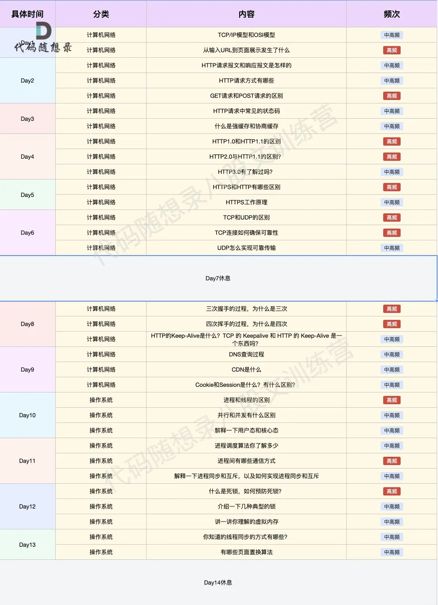
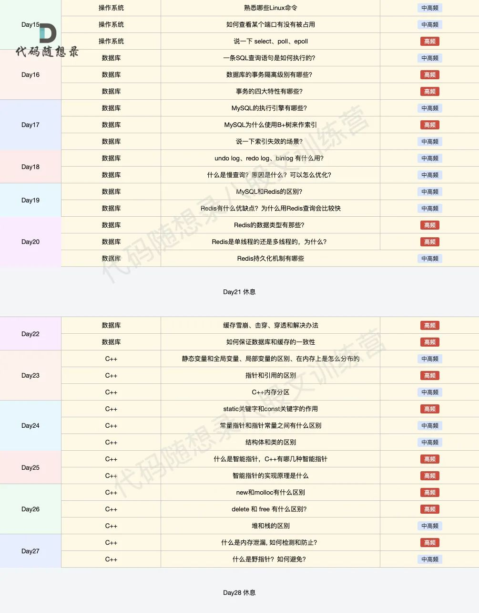
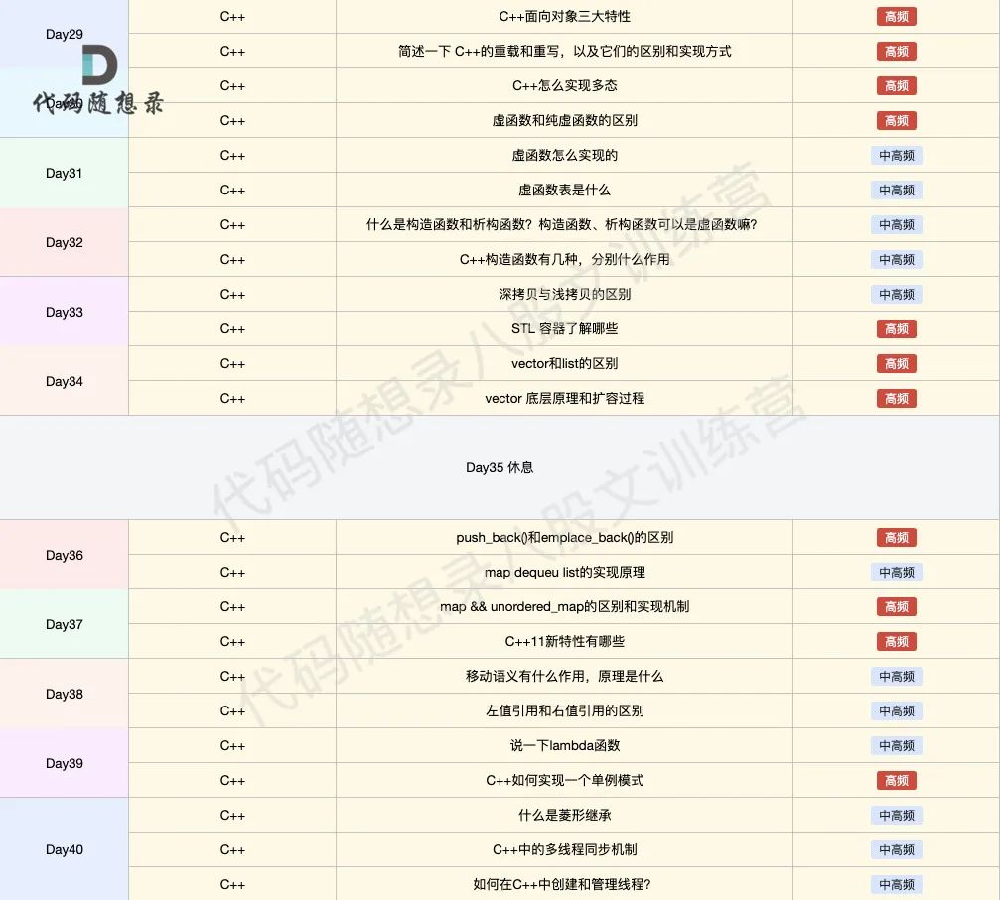

Day1

9.26

1.智能指针

unique_lock

shared_lock

2.RALL

3.介绍一下DNS

4.cpp内存泄露的工具如何实现

5.http传大型文件的工具如何实现

6.https是如何加密的

9.27

1.cpp虚函数，虚析构函数

2.进程和线程区别，进程和线程调度区别，上下文切换区别

3.b+树索引

4.tcp可靠连接，拥塞控制，流量窗口

5.手写生产者消费者模型

6.手撕线程池

7.c++11多线程标准库

9.29

1.static，inline，constexpr

2.c++11 5.2 堆内存管理

3.c++11 6.3原子类型和原子操作

10.2

1.讲讲虚函数

2.排序，常考快速排序

3.实现环形队列，LRUcache

从输入URL到显示网页期间发生了什么。

> 1、介绍一下其中一个go的项目的整体架构（存储相关）
> 2、解释一下LSM Tree的写放大问题
> 3 、布隆过滤器的实现以及如何判断一个布隆过滤器好坏的指标
> 4、问了一些leveldb相关的 // 项目
> 5、讲一下什么是进程，什么是线程，区别是什么
> 6、讲一下os的进程调度算法有哪些
> 7、进程间通信的方式有哪些 // os
> 8、从输入URL到显示网页期间发生了什么
> 9、get方法和post方法的区别
> 10、arp协议属于哪一层 // 计网
> 11、 linux的一些基本命令
> 12、ACID是什么，分别解释一下
> 13、什么是脏读，什么是幻读
> 14、事务的隔离级别有哪些，分别解释一下 // 数据库
>
> 作者：ryujin_nimi
> 链接：https://www.nowcoder.com/feed/main/detail/d964465eea9b4efaac3c54a980bcdc3e?sourceSSR=search
> 来源：牛客网
>
> 感觉好常见的问题，但是要我的话不一定都能回答
