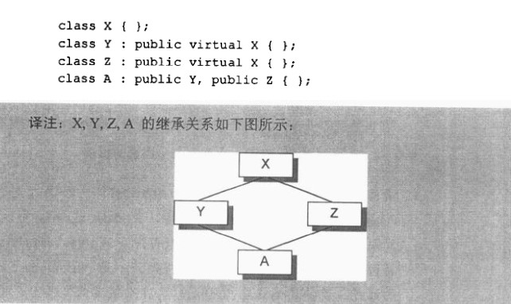

[TOC]

> 没看书，这两本书的优先级还没排到），所以目前就看两篇文章大致了解下重点，以后会看书的。

**参考资料**：

1. [《Effective Modern C++》笔记与实践 - 腾讯技术工程](https://zhuanlan.zhihu.com/p/592921281)

2.  [Effective C++ - 腾讯技术工程](https://www.zhihu.com/question/587851490/answer/2951706901?utm_psn=1832172405658898433)
3. 书籍：《Effective C++》和《Effective Modern C++》

先留参考链接），这就不是属于自己的笔记了，当然也不会复制粘贴。


### Effective Modern C++

#### 类型推导

###### 模板类型推导

```cpp
template<T>
void f(ParamType param); // ParamType为包含T的组合类型

f(expr)
```

也就是说，param的类型不一定是T，也可以是与T有关的组合类型的`ParamType`

- `ParamType`为引用或者指针时，`expr`的const保留，引用的引用忽略。
- `ParamType`为万能引用时，此时遵循引用折叠原则。基本就是左值仍然左值，右值也保持右值。
- `ParamType`非指针非引用，
  - `top-levelCV` 类型限定符会被忽略，但注意` low-level `的 `constness` 将被保留。
  - 数组和函数在 `ParamType` 为值类型时会分别退化成指针和函数指针

###### `auto`类型推导

1. 可以自动推导类型，比如变量，范型lambda中的函数返回值等
2. 可以配合`decltype`实现更好的泛型编程。

###### 右值引用，移动语义，完美转发

- 右值引用用于延长临时（将亡）变量的生命周期，常用于移动构造、移动赋值等场景，避免冗余复制操作带来的性能损耗
- `std::move` 不进行任何移动， `std::forward` 也不进行任何转发，两者在运行期都不发挥作用，只是进行[强制类型转换](https://zhida.zhihu.com/search?content_id=219893714&content_type=Article&match_order=1&q=强制类型转换&zhida_source=entity)，

###### 智能指针

C++11引入`shared_ptr`和`unique_ptr`

C++11引入`make_shared`,C++11引入`mutex`模块

C++17引入`shared_mutex`读写锁，`lock_guard`

###### lambda表达式

###### 变量捕获


### Effective C++


**参考资料**：

1. [《Effective Modern C++》笔记与实践 - 腾讯技术工程](https://zhuanlan.zhihu.com/p/592921281)

2.  [Effective C++ - 腾讯技术工程](https://www.zhihu.com/question/587851490/answer/2951706901?utm_psn=1832172405658898433)
3. 书籍：《Effective C++》和《Effective Modern C++》


### Data语义学



该图也就是所谓的“菱形继承”。如果没有虚函数的实现的话，Az在析构时由于继承了Y和Z，X会被析构两次，第二次会对悬空指针进行析构，造成不好的结果。这也就是`virtual`出现的原因之一。

**输出结果中：**

X大小为1，Y，X分别为8，A为16。

YZ由于指针的4字节，自身为空的1字节，对其限制因此为8。