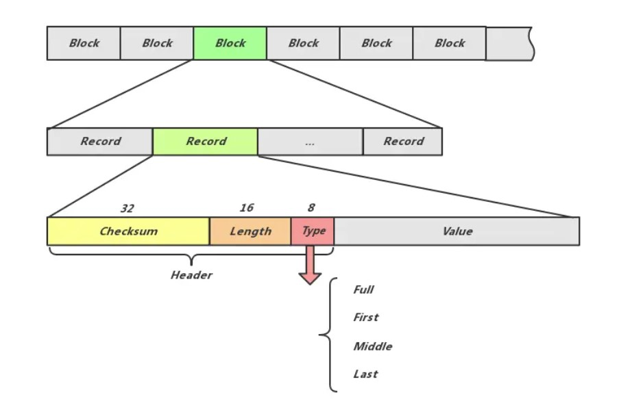

# leveldb面试题

https://segmentfault.com/a/1190000009707717#我喜欢这篇文章，写的很有意思。


### 1.讲讲leveldb是什么

LevelDB是Google开源的**持久化KV单机数据库**，特点在于使用键值对存储，支持快速随机读写，大容量存储操作。它使用**LSM树**结构，优化了写入性能，同时支持**compaction**以减少存储空间。但是LSM树的核心思想在于放弃部分读的性能换取最大写的能力。因此为了提升读取的能力，leveldb使用会**布隆过滤器**减少不必要的查找，同时提供了**snapshot**的机制用于在数据库读取时保持一致的视图，确保写入操作不影响读取。最后为了保持数据的一致性和可靠性，提供了**版本控制和日志**机制。


### 2.常问知识点

##### LSMtree，读写，如何写，如何读，如何解决读的速度慢，读放大，写放大

##### 引申：levelDB的存储结构

###### LSM

levelDB的存储包括内存数据库memtable和磁盘数据库SSTable两部分。

存储时会先将数据写到内存中的Memtable中，当Memtable满时会转变成Immutable Memtable，同时创建新的Memtable写入新的请求。而Immutable table会定期合并到磁盘的SSTable中，levelDB会合并和压缩SSTable，以减少磁盘的使用和提高读取性能。


###### 写放大

写放大指的是实际写入磁盘的数据量大于应用层请求写入的数据量。每写1byte数据带来n bytes的数据写盘，写放大为n。

本质需要和全局有序做权衡，对顺序要求越高的系统写放大越严重，比如B+树，但是LSM树把顺序延迟到后台compaction，减少了写放大。

- 分层存储。当一个层满了后，会将其数据合并并写入到下一个层，这个过程需要读取和写入大量的数据，导致写放大。
- 合并操作。每次合并会将多个 SSTable（Sorted String Table）文件合并成一个新文件，合并过程中需要读取多个文件并写入一个新的文件，这样增加了写入的数据量。
- 删除与更新。LevelDB 不会直接删除或更新数据，而是将其标记为删除（或过期），新数据会被写入到新的位置。这也导致了旧数据和新数据共存的情况，从而增加了写入次数。


###### 读放大

完成每次读请求所需要的额外读盘次数。


###### 读取

LevelDB的读取过程是：

1. 在memory db中查找指定的key；

2. 在冻结的memory db中查找指定的key；

3. 按低层至高层的顺序在level i层的sstable文件中查找指定的key；

但其实一般情况下在**一二步的cache**和第**三步Bloom Filter**的存在都能提高访问速度，减少不必要的磁盘访问。


##### skipList，与红黑树的区别，有没有更好的

> [红黑树](https://www.cnblogs.com/crazymakercircle/p/16320430.html#autoid-h3-5-0-0) 二叉查找树 —> AVL树/rb树
>
> 由于内存的存储结构中需要选择一个合适的数据结构，leveldb中我们需求的是`高效查找`，`高效插入`，`高效顺序遍历`。
>
> 数据结构首先考虑二叉树，但是普通二叉树在顺序遍历时会出现严重失衡，因此考虑更加平衡的比如AVL，二叉树等，都能够保证插入查找时间复杂度都是lg(n)，相比平衡树，跳表最大的优势在于，保证了读写性能的同时简化了实现。

###### 结构

跳表是一种可以取代平衡树的数据结构。跳表使用**概率均衡**而非严格均衡策略，从而**相对于平衡树，大大简化和加速了元素的插入和删除**。

跳表时一种带有额外指针的链表，思路为跳步采样，构建索引，逐层递减。

额外指针：指针数变为正常指针的两倍。

**插入**

1. 插入新节点的指针数通过独立的计算一个概率值决定，使全局节点的指针数满足几何分布即可。
2. 插入时不需要做额外的节点调整，只需要先找到其需要放的位置，然后修改他和前驱的指向即可。

###### 多线程并发访问

向外界提供保证：

1. Write：在修改跳表时，需要在用户代码侧加锁。
2. Read：在访问跳表（查找、遍历）时，只需保证跳表不被其他线程销毁即可，不必额外加锁。

自己内部代码实现：（还没看懂）

1. **非阻塞结构**：

- Skip list 采用了随机化算法，可以在多线程环境中支持并发读写，而不需要全局锁。这样可以减少线程间的竞争，提高并发性能。

2. **乐观并发控制**：

- 在进行插入和删除操作时，Skip list 使用乐观策略，假设冲突不频繁。当一个线程在更新时，它不会立即加锁，而是完成操作后检查是否存在冲突。如果存在，操作将被重试。

3. **局部锁定**：

- Skip list 的节点在更新时只锁定涉及的特定节点，而不是整个列表。这种局部锁定的方式减少了锁的持有时间，提高了并发性。

4. **指令重排**：

- 在一些情况下，Skip list 可以利用指令重排来优化性能。在执行某些操作时，可以重排指令顺序以提高执行效率，同时通过适当的内存屏障确保数据一致性。

5. **高效的搜索与插入**：

- Skip list 的层次结构使得搜索和插入操作的平均时间复杂度为 O(log n)，这对于并发访问非常有效，能够快速定位元素，减少操作时间。


##### log怎么设计的，如何保证数据丢失，双缓冲吗

一条日志记录的内容包含：Header和Data。

```markdown
header：
+-----------------+--------------+--------------+--------------+
|   CRC32（4字节） |  长度（2字节） |  类型（1字节） |  保留（1字节）  |
+-----------------+--------------+--------------+--------------+
buf 数组的设计确保了记录的结构在物理存储中是固定的，使得在读取记录时能够快速解析出每个字段的内容。这样做的好处是提高了数据的可解析性和读取效率，同时通过 CRC 校验增强了数据的可靠性。
```




##### 布隆过滤器的设计和应用，创建options对象时开启布隆过滤器，如何判断布隆过滤器的好坏

###### Bloom Filter使用场景

布隆过滤器需要在内存中维护一定的资源开销，因此默认是关闭的，需要用户手动开启。

- 适合用布隆过滤器的场景：高读取频率，大数据集并且键的分布相对均匀，写少读多
- 不需要使用bloom filter的场景：高写入频率，小数据集，访问模式简单

###### Bloom Filter原理

布隆过滤器的核心在于位数组和哈希。通过多个哈希函数将输入映射到位数组中的位置，将该位设置为1，查询时使用同样的哈希函数计算该位索引，如果所有位对应为1，那么可能存在；如果有位为0，那么一定不存在。涉及的参数有：

- 哈希函数个数k

- 位数组容量m

- 插入的数据数量n

  数学结论：k = ln2 * (m/n)时，布隆过滤器的准确率最高，m最少取到n的1.44倍时，错误率比较好。

###### Bloom Filter在levelDB中的应用

在每个sstable中都会有相应的布隆过滤器，布隆过滤器会保存其中所有的键。

统一的布隆过滤器会占用大量的内存，并且在是stable写入或者压缩时容易发生变化，独立的布隆过滤器在数据的插入删除更好处理。

###### Bloom Filter支持删除操作吗

不支持，但是[Counting Bloom Filter](https://cloud.tencent.com/developer/article/1136056)支持。为位数组中的每位增加了一个计时器。


##### version作用

> LevelDB的多版本存储设计可分为三个层次：
>
> - **从key/value的角度：** 每次变更操作的记录（Batch Writer可视为一次操作）都有不同且递增的SequenceNumber。对于一个UserKey，当存在SequenceNumber更高的的记录时，旧的记录不会被立即删除，至少要在该SequenceNumber之前的所有Snapshot都被释放后才能删除（具体删除时间与Compaction时间有关）。这是L**evelDB实现Snapshot Read的基础。**
> - **从MemTable的角度：** LevelDB中的MemTable通过**引用计数**来控制释放时间。在需要读取MemTable时（无论是Get操作还是Minor Compaction时），读取前会增大其引用计数，读取后减小引用计数。这样，即使MemTable已被通过Minor Compaction操作写入到Level-0文件，**MemTable在被读取，它就不会被释放**，保证能被多次读。
> - **从数据库文件的角度：** LevelDB的文件同样需要引用计数，当执行Major Compaction时，**LevelDB不会立即删除已被合并的数据库文件，因为此时可能还有未完成的读取该文件的操作。**
>
> `key/value`的版本实际上也是依赖于内存与稳定存储，其分别在Compaction与Put/Get操作中体现，因此这里我们主要关注后两者。
>
> `MemTable`的多版本与`Snapshot`信息是不需要直接持久化的，因为数据库关闭时无法进行Snapshot Read，也就没有了Snapshot的概念，而最新的MemTable会通过WAL重建，旧的MemTable也不再会被依赖。
>
> 数据库文件则不同，LevelDB必须记录数据库文件的版本信息，否则在数据库重启时无法快速确定哪些文件是有效的（LevelDB提供了文件版本信息损坏时的修复机制）。而**LevelDB中Version及相关概念就是为此设计的。**

`VersionSet`是一个管理和维护多个版本的集合，

- version文件主要用于**存储数据库的某个具体版本**，包括当前版本的所有文件，统计信息以及相关状态。其中维护了一个**文件列表记录每个层级的sst文件**，不同版本之间的连接方式为**双向链表**；通过引用**计数管理version对象的生命周期**等。

`VersionEdit`是对版本变化的具体描述和记录。通过这种结构，LevelDB能够有效地管理数据的版本控制和变化。

- 通过`LogAndApply()`方法应用`VersionEdit`对象，创建新的`Version`并将其添加到`VersionSet`中


##### levelDB如何compaction

[知乎 - compaction](https://www.zhihu.com/search?type=content&q=compactionleveldb)

> - 为什么需要compaction？
> - 何时需要做compaction
> - 具体怎么做compaction
> - 如何在compaction的同时保证服务可用
> - compaction对性能的影响
> - 如何在服务的延迟和单次compaction的收益做trade off

compaction分为两种，minor compaction和major compaction。compaction任务的运行期间会带来很大的资源开销，比如压缩，解压缩，数据拷贝，compare消耗大量cpu，读写数据引起diskIO，compaction策略约束了lsm-tree的形状，决定哪些文件需要合并、任务的大小和触发的条件，不同的策略对读写放大、空间放大和临时空间的大小有不同的影响。

`Minor Compaction > Manual Compaction > Size Compaction > Seek Compaction`


###### minor compaction

**主要发生在将Immutable memtable转变成sstable的过程中。**

leveldb对该步骤进行了优化，不仅会将其转储为sst存到leveldb0，还会将其推至更高的层级，最多推到第二层级。


###### major compaction

- **Size compaction**. level0层或者其它层超过预定上限时触发。主要在于均衡各个level的数据从而保证读写的性能均衡。

  起始层一般是score最高的一层（file size/level层的阈值）；确定起始层，然后向上查找，在没有合并的sstable中存在重叠文件，将起始层和该层合并然后放入起始层中。（第0层文件数过多，非0层总大小超过10^iMB)

- **Seek compaction**. 根据sstable的多次seek miss触发。

  allowed_seeks触发为0时，两层字段会合并。

- **Manual compaction**. LevelDB使用者通过接口`void CompactRange(const Slice* begin, const Slice* end)`手动触发。

  发生在level i中存在sst文件和参数的begin，end重合时，会compact掉整个level中所有存在重叠的sst文件。


##### levelDB的snapshot

snapshot是一种机制，用于在数据库**读取时保持一致**的视图，确保在读取数据时，写入操作不会影响读取结果，从而提供一种简单的**并发**控制方式。

SnapshotImpl表示一个具体的快照实例，包含一个序列号和指向前后快照的指针；序列号的主要作用是提供快照创建时数据库状态的唯一标识；双链表，便于快速插入和删除


### 3.levelDB缓存

LRU cache有优化吗

100w条数据存储大概需要的空间


### 4.levelDB重启过程

由于数据库启动前需要恢复数据，也就是利用Manifest信息重新构建一个最新的version。

1. 利用current文件读取最近使用的Manifest文件。

2. 创建一个空的version，利用manifest文件中的session record依次apply，还原出一个最新的version，注意manifest的第一条session record记录的是一个version的snapshot，后面记录的都是增量。

   （为了避免manifest过大，每次启动时重新创建的manifest的第一条都是当前版本的快照状态，其它过期的manifest文件会在下次启动的recover流程中自行删除）

3. 将非current文件指向的其它过期的manifest文件删除。

4. 将新建的version作为当前数据库的version。


### 5.levelDB分层，为什么从上往下读，层与层之间重复


### 6.levelDB和redis


### 7.levelDB的优化

- 写入磁盘时的延迟
- 并发写加锁造成的竞争
- 读操作时如何通过索引降低查找延迟
- 如何更好地利用cache优化查询效率，增加命中
- 快速地从快照或者日志中恢复
- 后台工作如何保持服务可用


### 8.memtable的实现


### 9.

> - Leveldb在用户视图中的基本单元是什么？
> - Leveldb一条记录在内存中的形式是什么，记录以怎样的方式被组织？
> - Leveldb的记录在文件中的存储格式是什么，多条记录在单文件中是如何被管理的，多文件又是如何被管理的？
> - Leveldb向用户做出了怎样的保证，在什么样的场景下提供了优化？

https://segmentfault.com/a/1190000009707717#