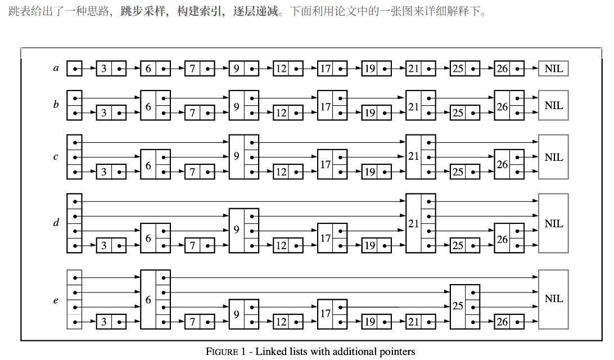
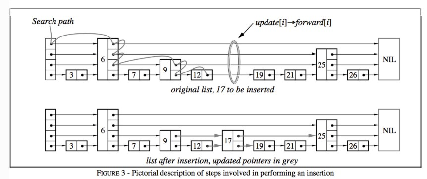
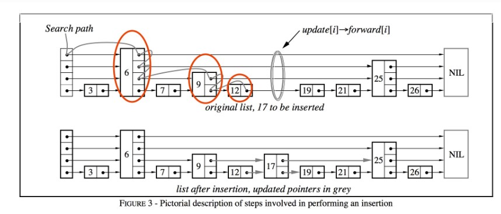
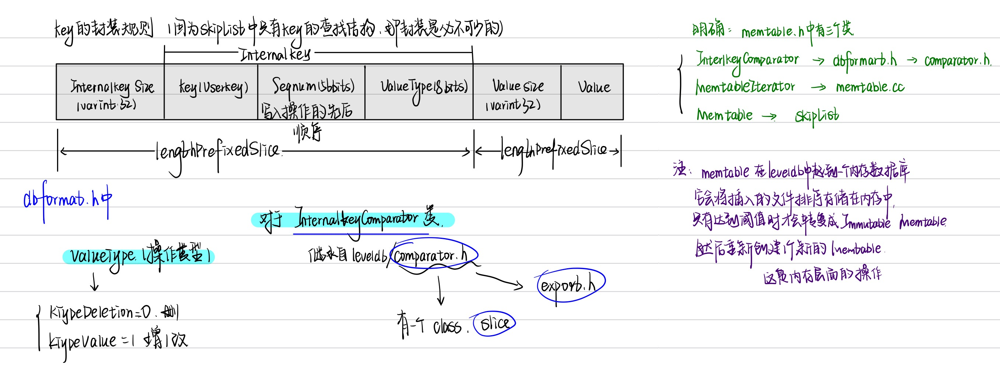
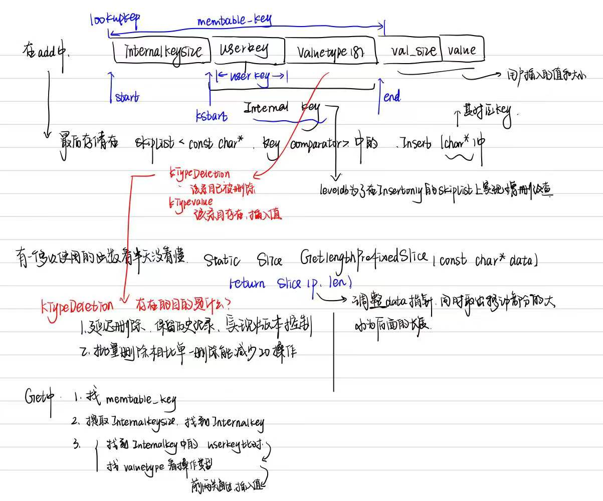

# Leveldb源码阅读2 - memtable(skiplist)

[TOC]


## 前言

leveldb是一个**写性能十分优秀**的存储引擎，是典型的LSM树(Log Structured-Merge Tree)实现。LSM树的核心思想就是**放弃部分读的性能，换取最大的写入能力**。

*leveldb如何读写的呢*

LSM树写性能极高的原理，简单地来说就是尽量减少随机写的次数。对于每次写入操作，并不是直接将最新的数据驻留在磁盘中，而是将其拆分成（1）一次日志文件的顺序写（2）一次内存中的数据插入。leveldb正是实践了这种思想，将数据首先更新在**内存**中，当内存中的数据**达到一定的阈值**，将这部分数据真正刷新到**磁盘**文件中，因而获得了极高的写性能（顺序写60MB/s, 随机写45MB/s）。

由于LSM树读性能并不好，尤其是高并发读，因此采用了**布隆过滤器**减少不必要的查找，布隆过滤器下一篇讲。

leveldb的内存结构用的是跳表，该文讲讲写入时涉及到的memtablde。


## 正文

#### memtable

leveldb的一次写入操作并不是直接将数据刷新到磁盘文件，而是首先写入到内存中作为代替，memtable就是一个在内存中进行数据组织与维护的结构。memtable中，所有的数据按**用户定义的排序方法**排序之后按序存储，等到其存储内容的容量达到阈值时（默认为4MB），便将其转换成一个**不可修改**的memtable，与此同时创建一个新的memtable，供用户继续进行读写操作。memtable底层使用了一种[跳表skiplist](https://zh.wikipedia.org/wiki/跳跃列表)数据结构，这种数据结构效率可以比拟二叉查找树，绝大多数操作的时间复杂度为O(log n)。


在memtable.h中

```cpp
/*这个头文件定义了LevelDB中的数据格式，包括键值对的编码方式、序列化和反序列化操作。它通常涉及到如何存储和检索数据的结构信息，比如内部的版本控制和时间戳等。*/
#include "db/dbformat.h"
/*skiplist.h 定义了跳表（Skip List）数据结构。LevelDB 使用跳表作为 MemTable 的实现，以提供快速的插入、查找和删除操作。*/
#include "db/skiplist.h"
/*这个头文件是 LevelDB 的主要接口定义，包括数据库的打开、关闭、读写等操作的函数原型。它提供了与用户交互的 API，用户通过这些接口来操作 LevelDB 数据库。*/
#include "leveldb/db.h" 
/*arena.h 提供了内存池（Memory Arena）管理的实现。它用于高效地管理内存分配和释放，减少内存碎片。LevelDB 中的 MemTable 和其他结构体会使用内存池来加速内存操作，尤其是在高频率的写入场景下。*/
#include "util/arena.h" 
```


由于skiplist中也会用到arena.h，因此先看看这个内存管理的文件。

#### arena.h

[arena和variant的讲解](https://www.myway5.com/index.php/2017/07/17/leveldb-varint-arena/)

> Arena是leveldb中管理内存分配的类。所有的内存分配都通过Arena申请，可以根据申请的内存大小使用不同的内存分配策略，也可以避免过多的内存碎片问题，并且在内存释放时统一使用Arena来释放，方便管理。

先看看arena的类。

##### 结构

```cpp
class Arena {
 public:
  Arena();

  Arena(const Arena&) = delete;
  Arena& operator=(const Arena&) = delete;

  ~Arena();

  // Return a pointer to a newly allocated memory block of "bytes" bytes.记得更新alloc_ptr的指针和alloc_bytes_remaining_的大小
  char* Allocate(size_t bytes);

  // Allocate memory with the normal alignment guarantees provided by malloc. 字节对齐
  char* AllocateAligned(size_t bytes);

  // Returns an estimate of the total memory usage of data allocated
  // by the arena. 剩余可用内存
  size_t MemoryUsage() const {
    return memory_usage_.load(std::memory_order_relaxed);
  }

 private:
  char* AllocateFallback(size_t bytes); // 处理无法在内存块中分配的情况，用于分配新内存块
  char* AllocateNewBlock(size_t block_bytes); // 分配新内存块

  // Allocation state
  char* alloc_ptr_; // 当前可分配指针
  size_t alloc_bytes_remaining_; // 当前分配块的剩余字节

  // Array of new[] allocated memory blocks 以及分配内存块的数组
  std::vector<char*> blocks_;

  // Total memory usage of the arena.
  // 利用原子存储可用内存，因为顺序不影响，因此使用的是松散模型
  // TODO(costan): This member is accessed via atomics, but the others are
  //               accessed without any locking. Is this OK?
  std::atomic<size_t> memory_usage_;
};
```

一般函数的核心是在private中，public中是对private中的包装然后向外提供接口。

**private**中包含两个处理分配内存的函数，一个内存指针，一份分配块可用内存书，一个已用内存，还有一个存储内存块的vector<char*>数组，这个数组也跟skiplist中每个结点的char\*指针是同源的。

需要**初始化**的肯定是内存指针alloc_ptr\_，alloc_bytes_remaining\_, memory_usage_这三部分，需要**析构**的也就是vector<char*>中的内存，这都是在堆中分配的。

然后便是**两个私有函数**的实现了。

```cpp
char* Arena::AllocateNewBlock(size_t block_bytes) {
  char* result = new char[block_bytes]; // 分配char*
  blocks_.push_back(result); // 传入数组
  memory_usage_.fetch_add(block_bytes + sizeof(char*),
                          std::memory_order_relaxed); // 调整大小
  return result;
}

char* Arena::AllocateFallback(size_t bytes) {
  if (bytes > kBlockSize / 4) {
    // Object is more than a quarter of our block size.  Allocate it separately
    // 内存比较大时，分配特定大小然后传入数组
    // to avoid wasting too much space in leftover bytes.
    char* result = AllocateNewBlock(bytes);
    return result;
  }

  // We waste the remaining space in the current block.
  // 内存比较小时，为了避免内存碎片，会直接分配一个新的块，然后更细剩余内存和指针位置
  alloc_ptr_ = AllocateNewBlock(kBlockSize);
  alloc_bytes_remaining_ = kBlockSize;

  char* result = alloc_ptr_;
  alloc_ptr_ += bytes;
  alloc_bytes_remaining_ -= bytes;
  return result;
}
```

> 有个问题，这个arena是为链表中每个结点的char*还是一个结点每层的char\*
>
> 破案，肯定不会是每个结点的char\*，这个在node中是自己存储了的，那肯定是后者，这个也能从skiplist的newNode()函数中看出来。
>
> ```cpp
> template <typename Key, class Comparator>
> typename SkipList<Key, Comparator>::Node* SkipList<Key, Comparator>::NewNode(
>     const Key& key, int height) {
>   char* const node_memory = arena_->AllocateAligned(
>       sizeof(Node) + sizeof(std::atomic<Node*>) * (height - 1));
>   return new (node_memory) Node(key);
> }
> ```

这个其实也就是leveldb的内存池。特点如下

##### 内存池特点

- 提供性能，可以批量分配内存，同时内存块连续分配，缓存利用率提高
- 降低内存碎片，内存大时直接分配，内存小时使用现有内存块
- 可以自动释放分配的内存块，实现RALL功能，便于实现内存管理中的构造和析构
- 原子操作可以保证线程安全。


#### random.h

```cpp
uint32_t seed_; // 存储种子的值
uint32_t Next(); // 生成并返回下一个随机数。使用线性同余法（LCG）算法更新种子值并计算随机数。
uint32_t Uniform(int n); //
bool OneIn(int n); // 以1/n的概率返回true，其余时间返回false
uint32_t Skewed(int max_log); // 返回一个带偏斜的随机数。首先从范围[0, max_log]中均匀选择一个基数，然后生成该基数位数的随机数，从而产生在[0, 2^max_log - 1]范围内的数字，具有对小数字的指数偏好。
```

```cpp
uint32_t Next() {
    static const uint32_t M = 2147483647L;  // 2^31-1
    static const uint64_t A = 16807;        // 乘数

    uint64_t product = seed_ * A; // 计算乘积

    // 计算新的种子值
    seed_ = static_cast<uint32_t>((product >> 31) + (product & M));
    
    // 确保新的种子在有效范围内
    if (seed_ > M) {
        seed_ -= M;
    }
    
    return seed_; // 返回生成的随机数
}
// 不直接调用系统函数的部分原因在于，性能优化，减少外部依赖

uint32_t Skewed(int max_log) {
    return Uniform(1 << Uniform(max_log + 1));
}
// 这个通过两次的uniform，达到了负载均衡中的偏斜的目的，生成的随机数更小。
```


#### skiplist.h

[skiplist](https://www.qtmuniao.com/2020/07/03/leveldb-data-structures-skip-list/)

> LevelDB 中对 SkipList 的实现增加了多线程并发访问方面的优化的代码，提供以下保证：
>
> 1. Write：在修改跳表时，需要在用户代码侧加锁。
> 2. Read：在访问跳表（查找、遍历）时，只需保证跳表不被其他线程销毁即可，不必额外加锁。

跳表的提出，为William Pugh在1990年提出，论文为[skiplist](https://15721.courses.cs.cmu.edu/spring2018/papers/08-oltpindexes1/pugh-skiplists-cacm1990.pdf).

> 文章中说到：
>
> 跳表是一种可以取代平衡树的数据结构。跳表使用**概率均衡**而非严格均衡策略，从而**相对于平衡树，大大简化和加速了元素的插入和删除**。

*概率均衡是什么？这个问题后面解决，我们先看看跳表是什么*

简单来说：**跳表就是带有额外指针的链表**。

##### skiplist的结构

```cpp
// (省略版)
class SkipList{
private:
    struct Node;
public:
  // 接收比较器和内存池
  explicit SkipList(Comparator cmp, Arena* arena);    
  // 禁止拷贝和构造
  SkipList(const SkipList&) = delete;
  SkipList& operator=(const SkipList&) = delete;
  
  void Insert(const Key& key);
  bool Contains(const Key& key) const;
  class Iterator{...};

private:
    // 有些函数
    Comparator const compare_;
    Arena* const arena_;  // Arena used for allocations of nodes
    Node* const head_; // 链表
    std::atomic<int> max_height_;
    Random rnd_; // Read/written only by Insert().
};

struct SkipList<Key, Comparator>::Node {
  explicit Node(const Key& k) : key(k) {}
  Key const key;
    
    // 适用于数据一致性
  Node* Next(int n) {
    assert(n >= 0);
    return next_[n].load(std::memory_order_acquire);
  }
  void SetNext(int n, Node* x) {
    assert(n >= 0); 
    next_[n].store(x, std::memory_order_release);
  }
  // 不保证其它操作顺序，保护共享资源，适用于性能优先
  Node* NoBarrier_Next(int n) {
    assert(n >= 0);
    return next_[n].load(std::memory_order_relaxed);
  }
  void NoBarrier_SetNext(int n, Node* x) {
    assert(n >= 0);
    next_[n].store(x, std::memory_order_relaxed);
  }
    
private:
     // 原子存储下一个结点的指针
  std::atomic<Node*> next_[1]; 
};
```



初始结点数目为n，加入的额外指针数也大致为n


感觉看了结构还是不太明了，再看看构造：

```cpp
template <typename Key, class Comparator>
typename SkipList<Key, Comparator>::Node* SkipList<Key, Comparator>::NewNode(const Key& key, int height) {
  char* const node_memory = arena_->AllocateAligned(sizeof(Node) + sizeof(std::atomic<Node*>) * (height - 1));
  return new (node_memory) Node(key);
}
```

**对比平衡树：**跳表在保证同样查询效率的情况下，使用了一种很巧妙的转化，大大简化了插入的实现。我们不能保证所有的插入请求在 key 空间具有很好地随机性，或者说均衡性；但我们可以控制每个节点其他维度的均衡性。比如，跳表中每个节点的指针数分布的概率均衡。

**插入节点**的时间复杂度为查找的时间复杂度 `O(log2n)`，与修改指针的复杂度 `O(1)` 之和，即也为 `O(log2n)`，**删除过程和插入类似**，也可以转化为查找和修改指针值，因此复杂度也为 `O(log2n)`。


跳表对外提供的接口

```cpp
// 插入 key 到跳表中.
// 要求: 不能够插入和跳表中的节点判等的 key.
template <typename Key, class Comparator>
void SkipList<Key, Comparator>::Insert(const Key& key)

// 当且仅当跳表中有和给定 key 判等的节点才返回真.
template <typename Key, class Comparator>
bool SkipList<Key, Comparator>::Contains(const Key& key) const

// 返回给定跳表的迭代器
template <typename Key, class Comparator>
inline SkipList<Key, Comparator>::Iterator::Iterator(const SkipList* list)
```

> inline函数的作用
>
> 内部链接：所有匿名命名空间里的东西（哪怕声明成extern） + 标记成static的变量、变量模板、函数、函数模板 + 不是模板不是inline没有volatile或extern修饰的常量（const和constexpr）。（符号不能被编译单元看见，所以可能出现多个不同的实体）
>
> 外部链接：非static函数、枚举和类天生有外部链接，除非在匿名命名空间里 + 排除内部链接规定的之后剩下的所有模板
>
> 1. 省去参数传递，和函数调用，直接内联到原位置。
> 2. c++17新加了通常情况下模板变量和inline变量是外部链接的规定，因此加上inline解决了模板变量常量链接性上的问题


##### 指令重排

详细可见这篇文章[深入理解C++11：原子类型和原子操作](https://github.com/Sutdown/Note/blob/main/cpp_knowledge/%E6%B7%B1%E5%85%A5%E7%90%86%E8%A7%A3c%2B%2B11---6.3%E5%8E%9F%E5%AD%90%E7%B1%BB%E5%9E%8B%E5%92%8C%E5%8E%9F%E5%AD%90%E6%93%8D%E4%BD%9C.md)

1. `std::memory_order_relaxed`：不对重排做限制，只保证相关共享内存访问的原子性。（只关心操作的原子性不关心操作顺序）
2. `std::memory_order_acquire`: 用在 load 时，保证同线程中该 load 之后的对相关内存读写语句不会被重排到 load 之前，并且其他线程中对同样内存用了 store release 都对其可见。（适用于加载，读取资源能看到之前的写入）
3. `std::memory_order_release`：用在 store 时，保证同线程中该 store 之后的对相关内存的读写语句不会被重排到 store 之前，并且该线程的所有修改对用了 load acquire 的其他线程都可见。（适用于确保写入之后，对共享数据的修改能够被其它线程看到）


##### skiplist的查找



见该图，有几个关键函数：代码还挺容易看懂的，这里直接给出来就不解释了。

```cpp
template <typename Key, class Comparator>
typename SkipList<Key, Comparator>::Node*SkipList<Key, 
COmparator>::FindGreaterOrEqual(const Key& key, Node** prev) const{
    Node* x = head_;
    int level = GetMaxHeight() - 1;
    while(true){
        Node* next = x->Next(level);
        if(KeyIsafterNode(key,next)){
            x = next;
        }else{
            // 存储了每一行中在key前面的那个那个函数
            if(prev != nullptr)prev[level] = x;
            if(level == 0){
                return next;
            }else{
                level--;
            }
        }
    }
}

template <typename Key, class Comparator>
bool SkipList<Key, Comparator>::KeyIsAfterNode(const Key& key, Node* n) const {
  // null n is considered infinite
  return (n != nullptr) && (compare_(n->key, key) < 0);
}

// 后面还有个SkipList<Key, Comparator>::FindLessThan(const Key& key) const，感觉和上面那个思路差不多，都是遍历。
// findlast同理，找x->Next为空的即可
```


都写到这了，感觉iterator还是可以拿出来说说，虽然代码不难，不过贵在为skiplist量身定制。

哦不对，还是没必要，它里面就是一些Next(), Prev()之类的函数，然后封装一下链表的指针和一些其它函数找到的值，都不怎么长，没什么说的必要。

在SkipList类里面设置一个iterator真妙啊，这样无论是找前面结点后面结点，开头结点街尾节点等都可以直接调用到函数，结构清晰，思路满分。


> 作者唠嗑：
>
> 有种好奇妙的感觉，差不多一个月前还对很多东西一无所知，当时随便写了些跳表，json之类的小项目，不过那会都是第一次接触，看的我可迷茫，今天在leveldb里面又看到跳表了，两次的实现方式不怎么一样。我记得之前的优点在于使用了c++17之类的新特性，leveldb好像是14年开源的，所以当时写的时候就还没怎么用上。这个skiplist的优点在于自己定制了iterator和arena内存管理，一个月前看的那个都还是现成的。
>
> 而且iterator和arena这两个和当初学mytinystl源码里的iterator和allocator有点点相似，不过明显这个简单多了，stl里面都有了一千行左右貌似，这才一两百行）。
>
> 知识之间产生联系的感觉实在是太好了。


##### 接口：Insert，Contains

铺垫完了，最后两个接口实现这个skiplist就结束了。

```cpp
template<typename Key, class Comparator>
void SkipList<Key, Comparator>::Insert(const Key& key) {
	Node* prev[KMaxHeight];
	//找大于或等于 key 的第一个节点，
	//并将每行的前一个节点存储在 prev 数组中。
	Node* x = FindGreaterOrEqual(key, prev);
	assert(x == nullptr || !Equal(key, x->key));
    
    // 随机化高度，使结点在不同层中的
	int height = RandomHeight();
	if (height > GetMaxHeight()) {
		for (int i = GetMaxHeight(); i < height; i++) {
			prev[i] = head;
		}
		max_height_.store(height, std::memory_order_relaxed);
	}

	x = NewNode(key, height);
	for (int i = 0; i < height; i++) {
        // 优先性能，更新了指针
        // 优先性能
		x->NoBarrier_SetNext(i, prev[i]->NoBarrier_Next(i));
        // 优先数据一致性
		prev[i]->SetNext(i, x); 
	}
}
```

似懂非懂，再看看图。



contain简单。

```cpp
template <typename Key, class Comparator>
bool SkipList<Key, Comparator>::Contains(const Key& key) const {
  Node* x = FindGreaterOrEqual(key, nullptr);
  if (x != nullptr && Equal(key, x->key)) {
    return true;
  } else {
    return false;
  }
}
```

> cy，可以再了解一下它的定制random随机机制，放前面和arena一块吧。


核心数据结构了解清楚了，那就直接上memtable了

#### memtable.h

看着两百多行还挺少的，结果看懵了，画张图我再理解一下：

```cpp
class InternalKeyComparator;
class MemTableIterator;
```

先看到两个没定义的类，然后找了一下，在**dbformat.h**文件中。

> dbformat.h：主要用于定义和管理数据在存储中的组织方式。其中包含：
>
> 1. 键值对格式，key，value
> 2. 内部表示，LevelDB使用一种特殊的内部格式来管理和存储数据，例如，如何将键值对组织在 SSTable 文件中，以便于高效查找和迭代。
> 3. `dbformat`可能涉及到版本信息，确保不同版本的LevelDB能够正确处理和解释数据。这对于数据迁移和升级是至关重要的。
> 4. 在写入和读取过程中，`dbformat`也帮助管理数据的切分和合并，确保性能和存储效率。
>
> `dbformat`在LevelDB中扮演着核心角色，它确保数据在存储和检索过程中的一致性和高效性，支持数据库的基本功能与性能优化。涉及的函数层面较多，因此仅在其它函数提到时去看，不单独讲解。



##### mentable class

看上图，大概知道memtable中有三个类，从mentable class讲起。

同样，我们先看这个类的private part:

```cpp
private:
 friend class MemTableIterator; 
 friend class MemTableBackwardIterator;  // 迭代器可以直接访问
/*
这里可以想到一个问题，在skiplist中，是将迭代器作为skiplist内嵌的一个类，但是这里是采用友元的方式，那么如何评价这两种方式？
1.友元可以保持清晰的接口，将迭代器和mentable的实现分配，是代码易于维护，同时如果其它类的迭代器也可以用这个，那么可以直接被复用。但是友元会增加类之间的依赖性，设计更加复杂。
2.内嵌迭代器比较适用于迭代器和类的关系极其紧密，并且迭代器功能简单的时候。
所以整体来说，迭代器逻辑复杂并且和类相对独立，建议友元；迭代器逻辑简单并且和类紧密相关，建议内嵌。
*/

 struct KeyComparator {
   const InternalKeyComparator comparator; // 定义键的比较规则
   explicit KeyComparator(const InternalKeyComparator& c) : comparator(c) {}
   int operator()(const char* a, const char* b) const; // 重载实现具体逻辑
 };

 typedef SkipList<const char*, KeyComparator> Table; // 存储类型，比较类型

 ~MemTable();  // 设计的目的是为了确保 MemTable 的对象只能通过调用 Unref() 方法来删除，防止外部代码直接删除对象，确保内存管理的安全性。

 KeyComparator comparator_;
 int refs_; // 引用计数，管理memtable的生命周期
/*
类似于shared_ptr，当有多个组件需要同时访问memtable实例时
使用引用计数可以安全的共享memtable，同时也避免了重复删除，实现了可靠的内存管理
*/
 Arena arena_; // 内存池
 Table table_; // 键值对
```

public的接口暂时放放，然后回去看看两个友元的类的实现。

##### MemTableIterator class

这个迭代器类大多数是对SkipList中的Iterator进行重写override，实际上变化不大，这个类的主要作用是修改构造函数中的数据，以更好的适配memtable。

它的私有成员包括一个实际的迭代器和一个临时存储编码后的键。

```cpp
private:
 MemTable::Table::Iterator iter_;
 std::string tmp_;  // For passing to EncodeKey
```

```cpp
 public:
  explicit MemTableIterator(MemTable::Table* table) : iter_(table) {}

  MemTableIterator(const MemTableIterator&) = delete;
  MemTableIterator& operator=(const MemTableIterator&) = delete;

  ~MemTableIterator() override = default;

  bool Valid() const override { return iter_.Valid(); }
/*这里，为什么传入Slice的类型，然后需要对K进行编码*/
// 将Seek方法的输入键K进行编码，然后用编码后的键更新迭代器位置
// 传入切片的原因应该是本身我们封装的key的值太多，避免不必要的拷贝，提供需要的值，
// 后面的encode就是调整为合适的格式
// 不过具体还是要看看代码
  void Seek(const Slice& k) override { iter_.Seek(EncodeKey(&tmp_, k)); }
  void SeekToFirst() override { iter_.SeekToFirst(); }
  void SeekToLast() override { iter_.SeekToLast(); }
  void Next() override { iter_.Next(); }
  void Prev() override { iter_.Prev(); }
  Slice key() const override { return GetLengthPrefixedSlice(iter_.key()); }
  Slice value() const override {
    Slice key_slice = GetLengthPrefixedSlice(iter_.key());
    return GetLengthPrefixedSlice(key_slice.data() + key_slice.size());
  }

  Status status() const override { return Status::OK(); }
```

首先如果想要明白slice，先要搞清楚slice的对象，

```cpp
 typedef SkipList<const char*, KeyComparator> Table;  // 存储类型，比较类型
 Table table_;  // 键值对
```

然后[slice介绍](https://blog.mrcroxx.com/posts/code-reading/leveldb-made-simple/2-slice/)

slice其实就是对整体的一个切片，memtable的逻辑如下：

其中包含对add和get函数的解释。



```cpp
static Slice GetLengthPrefixedSlice(const char* data) {
    // 取出前缀中的长度，然后移动指针
  uint32_t len;
  const char* p = data;
  p = GetVarint32Ptr(p, p + 5, &len);  // +5: we assume "p" is not corrupted
  return Slice(p, len);
}
```

切片的存在能够更好的对memtable结构中的某个部分进行处理。


> InternalKey是SkipList中Node的默认排序依据。LevelDB中SkipList的默认排序是通过`leveldb::InternalKeyComparator`实现的，其声明与实现在`db/dbformat.h`与`db/dbformat.cc`中。
>
> `InternalKeyComparator`的`Compare`方法按照如下优先级，依次对`InternalKey`进行排序：
>
> 1. 按照UserKey**升序**排序；
> 2. 按照SequenceNumber**降序**排序；
> 3. 按照ValueType**降序**排序（由于SequenceNumber已经足以对Key排序，因此这条规则永远不会用到）。
>
> 通过`InternalKeyComparator`，SkipList可以保证对于同一key（UserKey），新的操作永远在旧的操作的前面。因此，只要找到key（UserKey）在SkipList中第一次出现的位置，即可保证得到的是该key最新的版本。

这段是在另外一个地方看到的，不过在memtable.cc和memtable.h的两个代码中，唯一对comparator的使用就是判断两个切片相等），至于sequenceNumber更是从没出现过，cy，看看后面会不会解决这个问题。


这篇到这就结束了，本来还看的云里雾里，最后从add函数和构造函数彻底理清了memtable的结构，然后看其他的就得心应手了。

其中涉及的知识点有，切片slice，跳表skiplist，内存池，随机数，迭代器等，还有一些细节，比如删除时并不是直接删除而是改变标记一段时间后删除（这个操作不是在本文提到的代码中实现），为什么需要引入slice，迭代器和类之间的关系，随机数的倾斜的实现和意义等等等等。

其实就，重在见识了一下优美的代码。一个复杂的类由各个不同的部分组成，结合一些适当的语法，逻辑清晰，结构严密，多学习，希望我以后也能写的出来）。
