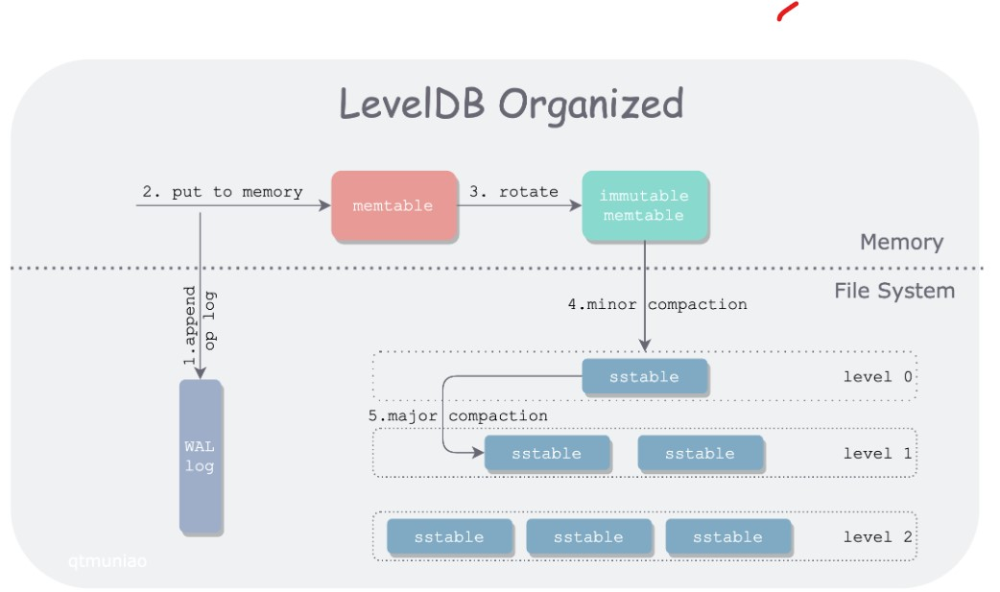
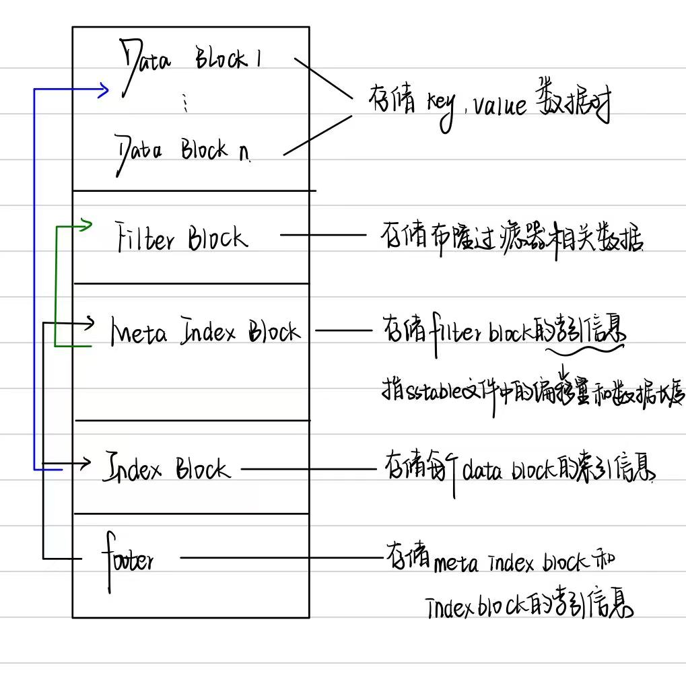
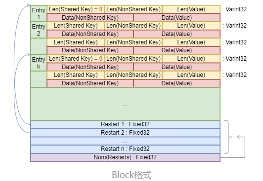
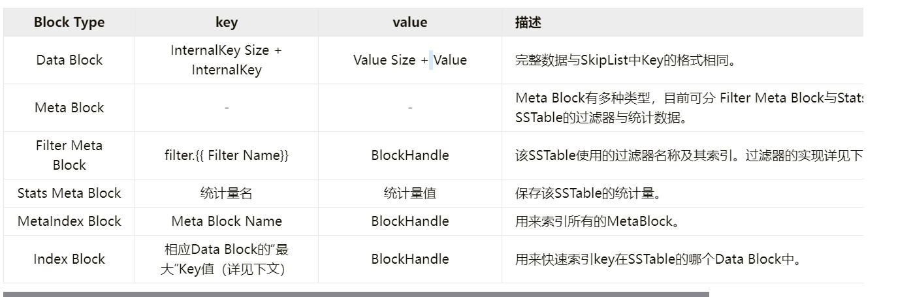
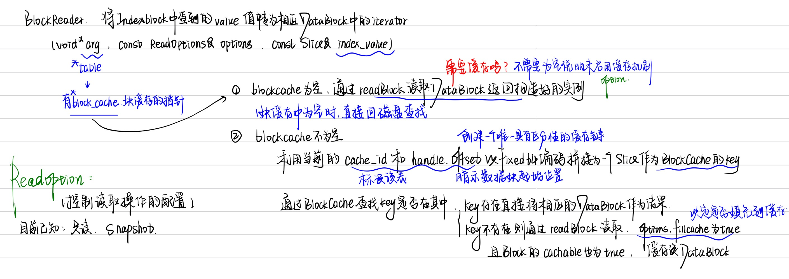

# leveldb源码阅读3 - filesysytem


[TOC]


# sstable

感谢这个[博主MrCroxx](https://blog.mrcroxx.com/)，看了这么多对leveldb的讲解，他的文章是最为明了的！本文中由部分引用他的原文，在此先声明。


插入，对于以下部分内容的概览，有利于理解cache的实现。

来源：[一只安静的猫](https://www.myway5.com/)

> ###### 2.1 hash table数据结构
>
> 哈希表是一个很常见的结构了，存储的是key-value结构，一个key-value对常被称作entry，它最大的特点是查找快。在网上找了一张hash table的图
> 
>
> 首先它是一个长为len的数组，每个数组中的元素都是一个链表。如图所示，john Smith和Sandra Dee都被hash到152这个地方，所以在152这个地方使用链表来存储这两个entry.查找的时候Sandra Dee的时候，先找到152这个地方，在遍历链表，直到找到key是Sandra的entry。
>
> ###### 2.2 LRU算法
>
> 在leveldb中,LRU算法的实现是使用两个双向环形链表，一个链表(in-use)存储当前正在使用的数据，另一个链表(lru)按照访问时间先后顺序存储缓存数据，每个数据都可以在in-use和lru之间切换。当我们需要使用LRU算法来淘汰数据时，只需要在lru上淘汰排序靠后的数据即可。
>
> ###### 2.3 分片LRU缓存
>
> 分片LRU缓存很简单，其实就是同时创建多个LRU缓存对象，然后使用hash将特定的缓存数据放置到相应的LRU缓存对象中。这个方式可以避免一个LRU缓存中存储过多的数据。


## 前言

### sstable的作用

对于redis，

- **内存存储**：数据主要存储在内存中，确保快速的读写性能。

- **持久化机制**：可选择性地将数据写入磁盘，以防数据丢失。

- **快速响应**：由于使用内存和高效的数据结构，Redis 能够快速响应读写请求。

但是对于`leveldb`，会先将写操作写入日志文件，其次将写操作应用在`memtablde`上，当`leveldb`到达checkpoint点时，`memtable`会被冻结成一个不可更改的内存数据库`immutable memory db`，同时创建一个新的`memtable`供系统继续使用。

`immutable memory db`会在后台进行一次`minor compaction`，将内存数据库中的数据持久化到磁盘文件中。

对于`minor compaction`，会在后文具体讲解，这里简单阐述一下它的目的：

1. 有效降低内存的使用率
2. 避免日志文件过大，系统回复时间过长

当`memory db`的数据持久化到文件中时，`leveldb`会以一定的规则进行文件组织，文件格式变为`sstable`，本文详细介绍`sstable`的文件格式以及相关读写。


### level的层次结构

这个在布隆过滤器中会详述，为了快速读取数据，采取了读放大的用法。




## 正文

> 好多文章都说`sstable`是很重要的一个模块，但是代码中也没有`sstable.h`这个文件。不过这个和`file system`是属于同一类，因此把它们放在一起，先理清知识结构，再结合代码看细节。

这个看的逻辑不可尽信，因为leveldb的版本会进行更新，memtable中的结构和代码结构就略有不同。

### sstable

#### sstable格式

##### 物理结构

每个sstable文件按照固定大小进行块划分，默认每个block大小4KiB，在每个块中，存储三个部分：

data，压缩类型（说明block中存储的数据是否进行数据压缩，如果压缩，默认未snappy算法），CRC校验码（循环冗余校验的校验码，校验范围包括数据以及压缩类型）。

##### 逻辑结构




#### block格式

block格式中的`restart`可以对频繁出现的公共前缀进行压缩。Restart Entry的间隔`leveldb::Options.block_restart_interval`默认为16，以平衡缓存局部性。



sstable中各类block的保存数据，仅关注key/value.




### cache

无论是BlockCache还是TableCache，核心都是实现分片的LRU缓存，这个LRU缓存实现了`include/leveldb/cache.h`定义的缓存接口。

- **`include/leveldb/cache.h`**：了解缓存接口和设计理念。

  这是缓存的抽象层，提供了一个通用的接口，以便在不同实现之间进行替换或扩展。

- **`util/cache.cc`**：深入实现细节和逻辑。

  这是实际的缓存实现，负责在内存中管理缓存对象并优化访问速度。

- **`db/table_cache.h`**：了解针对 SSTable 的具体缓存实现。

  这是一个更高层次的缓存，专门用于缓存 SSTable 文件的内容，定义了用于缓存 SSTable 数据块的类和方法，提供了与 SSTable 相关的缓存操作，包括从缓存中读取数据块，以提高读取性能。


#### include/leveldb/cache.h

定义 LevelDB 的缓存接口。

```cpp
/*同步，回调函数，引用计数，深拷贝*/
#ifndef STORAGE_LEVELDB_INCLUDE_CACHE_H_
#define STORAGE_LEVELDB_INCLUDE_CACHE_H_

#include <cstdint>

#include "leveldb/export.h"
#include "leveldb/slice.h"

namespace leveldb {

  // cache的缓存接口
class LEVELDB_EXPORT Cache;

LEVELDB_EXPORT Cache* NewLRUCache(size_t capacity);

class LEVELDB_EXPORT Cache {
 public:
  Cache() = default;

  Cache(const Cache&) = delete;
  Cache& operator=(const Cache&) = delete;

  // 回调函数销毁缓存的内容
  virtual ~Cache();

  // 指向cache中的一个缓存项
  struct Handle {};

  virtual Handle* Insert(const Slice& key, void* value, size_t charge, void (*deleter)(const Slice& key, void* value)) = 0;

  virtual Handle* Lookup(const Slice& key) = 0;
    
  virtual void Release(Handle* handle) = 0;
  virtual void* Value(Handle* handle) = 0;.
      
  virtual void Erase(const Slice& key) = 0
      
  virtual uint64_t NewId() = 0;
  virtual void Prune() {}

  virtual size_t TotalCharge() const = 0;
};

}  // namespace leveldb

#endif  // STORAGE_LEVELDB_INCLUDE_CACHE_H_
```


#### util/cache.cc

leveldb中有一个内建的Cache接口。其中有两个保存缓存项LRUHandle的链表：

- **in-use链表**：无序保存着在LRUCache中且正在被client使用的LRUHandle，链表配合引用计数确保了缓存项的有效管理，避免了因多个引用导致的内存泄漏或访问无效内存。
- **LRU链表**：按照最近使用的顺序保存当前在LRUCache中但是目前没有被用户使用的LRUHandle。LRU 链表允许快速定位需要被淘汰的项。

LRUHandle在两个链表中的切换由Ref和UnRef实现。

###### LRUHandle

```cpp
// 缓存项的结构体
struct LRUHandle {
  void* value;
  void (*deleter)(const Slice&, void* value);
  LRUHandle* next_hash; // 哈希表handleTable为了解决哈希冲突采用拉链法的链指针
  LRUHandle* next; // 双向链表
  LRUHandle* prev;
  size_t charge;  // TODO(opt): Only allow uint32_t?
  size_t key_length;
  bool in_cache;     // Whether entry is in the cache. 
  uint32_t refs;     // References, including cache reference, if present.引用计数
  uint32_t hash;     // Hash of key(); used for fast sharding and comparisons
  char key_data[1];  // Beginning of key

  Slice key() const {
    // next is only equal to this if the LRU handle is the list head of an
    // empty list. List heads never have meaningful keys.
    assert(next != this);

    return Slice(key_data, key_length);
  }
};
```


LRUCache为了能够快速根据key来找到相应的LRUHandle，而不需要遍历链表，其还组装了一个**哈希表`HandleTable`**。LevelDB的哈希表与哈希函数都使用了自己的实现。

###### HandleTable

```cpp
// 可扩展哈希表
class HandleTable {
 public:
  HandleTable() : length_(0), elems_(0), list_(nullptr) { Resize(); }
  ~HandleTable() { delete[] list_; }

  LRUHandle* Lookup(const Slice& key, uint32_t hash) {
    return *FindPointer(key, hash);
  }

  // ptr为空时，新缓存项作为头部，同时elem++检查是否需要扩充空间
  // ptr不为空时，采用头插法
  LRUHandle* Insert(LRUHandle* h) {
    LRUHandle** ptr = FindPointer(h->key(), h->hash);
    LRUHandle* old = *ptr;
    h->next_hash = (old == nullptr ? nullptr : old->next_hash);
    *ptr = h;
    if (old == nullptr) {
      ++elems_;
      if (elems_ > length_) {
        // Since each cache entry is fairly large, we aim for a small
        // average linked list length (<= 1).
        Resize();
      }
    }
    return old;
  }

  LRUHandle* Remove(const Slice& key, uint32_t hash) {
      // 理解二重*的链表
    LRUHandle** ptr = FindPointer(key, hash); // ptr为当前结点地址
    LRUHandle* result = *ptr;
    if (result != nullptr) {
      // *ptr就是当前结点的前一个结点，ptr为当前结点地址
      // 将当前节点的前一个节点的 next_hash 更新为要删除节点的下一个节点。
      *ptr = result->next_hash; 
      --elems_;
    }
    return result;
  }

 private:
  // The table consists of an array of buckets where each bucket is
  // a linked list of cache entries that hash into the bucket.
  uint32_t length_; // slot的数量
  uint32_t elems_; // 已经使用的slot数量
  LRUHandle** list_; // handleTable的bucket数组

  // Return a pointer to slot that points to a cache entry that
  // matches key/hash.  If there is no such cache entry, return a
  // pointer to the trailing slot in the corresponding linked list. 正常的查找操作
  LRUHandle** FindPointer(const Slice& key, uint32_t hash) {
    LRUHandle** ptr = &list_[hash & (length_ - 1)];
    // 这里要求找到hash和key都相同的位置，然后建立链表
    // hash是因为哈希冲突，jey则可能因为版本不同的缓存或者缓存项被频繁更新
    while (*ptr != nullptr && ((*ptr)->hash != hash || key != (*ptr)->key())) {
      ptr = &(*ptr)->next_hash;
    }
    return ptr;
  }

  // 确立新空间
  // 将旧的哈希表数据重新计算复制到新的哈希表中
  void Resize() {
    uint32_t new_length = 4;
    while (new_length < elems_) {
      new_length *= 2;
    }
    LRUHandle** new_list = new LRUHandle*[new_length];
    memset(new_list, 0, sizeof(new_list[0]) * new_length);
    uint32_t count = 0;
    // 这里使用头插法时，二重链表中的数据反了，但是并不影响LRU的使用，因为有另外的链表实现LRU机制
    for (uint32_t i = 0; i < length_; i++) {
      LRUHandle* h = list_[i];
      while (h != nullptr) {
        // 保存下一个元素地址
        LRUHandle* next = h->next_hash;
        uint32_t hash = h->hash;
        // 取模，找一个位置
        LRUHandle** ptr = &new_list[hash & (new_length - 1)];
        h->next_hash = *ptr;
        *ptr = h;
        h = next;
        count++;
      }
    }
    assert(elems_ == count);
    delete[] list_;
    list_ = new_list;
    length_ = new_length;
  }
};
```

**list硬控我一个小时）。。基础不行应该是。


###### LRUCache

在**LRUCache**的实现中，

在Inset方法插入**LRUHandle**时，只会从LRU链表中逐出LRUHandle。也就是说，对于LRUCache中的每个LRUHandle，其只有如下几种状态：

- 对于还没存入LRUCache的LRUHandle，不在任一链表上（显然）。
- 当前在LRUCache中，且正在被client使用的LRUHandle，在*in-use*链表上无序保存。
- 当前在LRUCache中，当前未被client使用的LRUHandle，在*LRU*链表上按LRU顺序保存。
- 之前在LRUCache中，但①被用户通过`Erase`方法从LRUCache中删除，或②用户通过`Insert`方法更新了该key的LRUHandle，或③LRUCache被销毁时，LRUHandle既不在*in-use*链表上也不在*LRU*链表上。此时，该LRUHandle在等待client通过`Release`方法释放引用计数以销毁。

```cpp
class LRUCache {
 private:
  // 删除结点，添加结点
  void LRU_Remove(LRUHandle* e); 
  void LRU_Append(LRUHandle* list, LRUHandle* e);
  void Ref(LRUHandle* e); // 引用结点，从lru list转移到in use list
  void Unref(LRUHandle* e); // 解引用，变为0时删掉，变为1则放进lru中便于以后变成0删掉
  bool FinishErase(LRUHandle* e) EXCLUSIVE_LOCKS_REQUIRED(mutex_); // 完全移除e，在此之前已经从哈希表中移除

  // Initialized before use. 容量
  size_t capacity_; 

  // mutex_ protects the following state.
  mutable port::Mutex mutex_;
  size_t usage_ GUARDED_BY(mutex_); // 当前用量

  // Dummy head of LRU list.
  // lru.prev is newest entry, lru.next is oldest entry.
  // Entries have refs==1 and in_cache==true.
  LRUHandle lru_ GUARDED_BY(mutex_); // lru链表 ，缓存项

  // Dummy head of in-use list.
  // Entries are in use by clients, and have refs >= 2 and in_cache==true.
  LRUHandle in_use_ GUARDED_BY(mutex_); // in-use链表，无序保存着在LRUCache中且正在被client使用的LRUHandle

  HandleTable table_ GUARDED_BY(mutex_); // 哈希表，按照最近使用的顺序保存当前在LRUCache中但是目前没有被用户使用的LRUHandl
};
```


###### ShardedLRUCache

最终实现cache的接口。SharedLRUCache中保存了若干个LRUCache，根据插入的key的哈希分配到相应的LRUCache中，每个LRUCache都有独立的锁，因此可以减少锁的争用，优化程序性能。

`ShardedLRUCache`通过`HashSlice`方法对key进行一次哈希，并通过`Shard`方法为其分配shard。

```cpp
 private:
  // 实现分片的LRU缓存
  LRUCache shard_[kNumShards];
  port::Mutex id_mutex_; // 保护对共享资源的访问，确保线程安全
  uint64_t last_id_;     // 管理缓存项的唯一标识

  static inline uint32_t HashSlice(const Slice& s) {
    // 计算给定对象的哈希值
    return Hash(s.data(), s.size(), 0);
  }

  // 分片，位数为KNumShardBits时，hash二进制右移32-kNumShardBits能得到0---2^kNumShardBits-1的值，类似于提取前kNumShardBits位数。
  // 分片能让多线程访问不同分片，减少竞争；
  // 同时每个分片的数据减少，减少锁的竞争；数据分布均匀，也可以避免某个分片过于繁忙，实现负载均衡
  static uint32_t Shard(uint32_t hash) { return hash >> (32 - kNumShardBits); }
```

> `override` 是 C++11 引入的一个关键字，用于在派生类中显式地标记一个虚拟函数，表示它重写了基类中的虚拟函数。使用 `override` 可以提高代码的可读性，并在编译时提供更强的类型检查。

public就是对之前class LRUCache和自己的私有函数的简单封装。


#### db/table_cache.h

为了减少热点数据访问磁盘IO频繁导致的效率问题。leveldb在访问sstable时加上了缓存。leveldb中的缓存功能上分为两种：

- `BlockCache`：缓存最近使用的**SSTable中的DataBlock**数据
- `TableCache`：**TableCache可以认为是一个双层cache**。
  - 第一层缓存最近打开的sstable中的部分元数据，减少频繁的磁盘访问
  - 第二层即是BlockCache，缓存了当前SSTable中的DataBlock数据。TableCache提供的Get接口能够同时查询两层缓存。


tableCache对sharedLRUCache又进行了一次封装，二者的区别主要在于key/value的类型以及cache的大小

- **BlockCache**：用户通过Options.block_cache配置自定义BlockCache的实现，其默认实现为8MB的SharedLRUCache。其中key/value为(table.cache_id,block.offset)->(Block*)。

- **TableCache**：用户可通过OptionTable.max_open_file配置来自定义TableCache的大小，其默认可以保存1000个Table的信息。其key/value为(SSTable.file_number)->(TableAndFile*)。


> 云里雾里，在此提出问题，blockcache和tablecache在整个leveldb中起到什么样子的作用，和我们最刚开始画出的磁盘和内存交换时，磁盘中的level1level2level0有关吗。

`Answer：`

**SStable**中使用LSM树存储sstable文件，位于**写入过程**。

**Level 0**：

- 通常用于存储新写入的 SSTable 文件。
- Level 0 中的文件不一定是有序的，可能存在重叠，需要在合并时进行整理（即“压缩”）。

**Level 1 及以上**：

- 每个更高的层级（Level 1、Level 2 等）通常包含经过合并和排序的 SSTable 文件。
- 在这些层级中，文件通常是非重叠的，每个层级的大小和数量都有一定的限制。


同时，**内存中的 `BlockCache` 和 `TableCache`** 提供快速的数据访问和元数据管理，旨在提高**读取过程**性能，加速读取操作，减少对磁盘的访问。

当然leveldb中不止blockcache和tablecache这两种缓存系统，还有writer buffer，布隆过滤器，快照等都属于缓存系统。


最终整体过程是：

- 写入：将Immutable Memtable从内存中写入磁盘，形成sstable，然后访问level0，此后也会通过compaction到level1和level2中。

- 读取：
  - 接收读取请求，查询Memtable和Immutable Memtable
  - 查询blockcache（blockcache中存储了从sstable中读取的data数据块）
  - 如果此时还没找到，就会进入磁盘中，通过布隆过滤器定位sstable文件
  - 如果找到，读取sstable中的datablock，否则返回没有找到。


在`tablecache`中

###### tablecache.h

```cpp
 private:
  // 通过filename找到sstable文件，filesize可以用于验证或者缓存的查找，handle**用于返回找到的缓存项
  Status FindTable(uint64_t file_number, uint64_t file_size, Cache::Handle**);

  Env* const env_; // 指向环境对象的指针
  const std::string dbname_; // 存储数据库的名称或路径
  const Options& options_; // 对于leveldb的配置选项的引用
  Cache* cache_; // 指向缓存对象的指针
```

在它的创建迭代器中，涉及阅读模式的选择，leveldb提供snapshot和read-only两种模式。快照的代码等这部分看完再去看。


###### tablecache.cc

```cpp
struct TableAndFile {
  RandomAccessFile* file; // 将数据以sstable的格式持久化存储到磁盘上。
  Table* table; // 作为一个数据结构，封装了与sstable相关的逻辑，比如读取，查找，迭代等
};
```

另外主要关注两个函数，findtable和get

> findtable会先构造key在tablecache中查找是否已经缓存了该sstable，
>
> - 如果有，直接返回缓存结构；
> - 否则根据传入的filename和filesize通过Table::open在磁盘中找到相应大sstable，将file和table写入tableandfile结构体，放入自己的sharedLRUCache缓存中。

```cpp
/*
* 实现了查找sstable的功能
* 缓存中查找如果失败，
* 会动态打开文件创建表对象，同时插入缓存
* 最终返回状态
*/
Status TableCache::FindTable(uint64_t file_number, uint64_t file_size,
                             Cache::Handle** handle) {
  // 初始化
  Status s;
  char buf[sizeof(file_number)];
  EncodeFixed64(buf, file_number);
  Slice key(buf, sizeof(buf));

  // 查找
  *handle = cache_->Lookup(key);
  if (*handle == nullptr) { // 检查缓存结果，从文件中查找
    std::string fname = TableFileName(dbname_, file_number); // 构造文件名
    RandomAccessFile* file = nullptr; // 初始化指针
    Table* table = nullptr;

    s = env_->NewRandomAccessFile(fname, &file);
    if (!s.ok()) { // 打开文件失败的错误处理
      std::string old_fname = SSTTableFileName(dbname_, file_number);
      if (env_->NewRandomAccessFile(old_fname, &file).ok()) {
        s = Status::OK();
      }
    }
    if (s.ok()) {
      s = Table::Open(options_, file, file_size, &table);
    }

    if (!s.ok()) { // 错误处理
      assert(table == nullptr);
      delete file;
      // We do not cache error results so that if the error is transient,
      // or somebody repairs the file, we recover automatically.
    } else { // 创建新对象插入缓存
      TableAndFile* tf = new TableAndFile;
      tf->file = file;
      tf->table = table;
      *handle = cache_->Insert(key, tf, 1, &DeleteEntry);
    }
  }
  return s;
}
```


get中则是Tablecache暴露给caller的外部方法，

首先通过findtable打开需要的sstable，然后通过table结构体的InternalGet结构获取给定key的value。**table.h**是实现tablecache的关键，因此接下来会介绍**table.h**.

```cpp
/*从缓存中获取指定键的值*/
Status TableCache::Get(const ReadOptions& options, uint64_t file_number,
                       uint64_t file_size, const Slice& k, void* arg,
                       void (*handle_result)(void*, const Slice&,
                                             const Slice&)) {
  Cache::Handle* handle = nullptr;
  Status s = FindTable(file_number, file_size, &handle);
    /*TableCache 的 Get 方法能够同时查询这两层缓存。
    首先，它会查找第一层缓存（元数据），获取所需的 SSTable 信息。
    如果该信息存在，接着会使用这些信息查询第二层缓存（BlockCache），获取实际的数据块。
    */
  if (s.ok()) {
    // 查找成功时，从缓存句柄中获取TableAndFile对象，通过类型转换获取内部的table指针
    Table* t = reinterpret_cast<TableAndFile*>(cache_->Value(handle))->table;
      // 切片，参数，回调函数
    s = t->InternalGet(options, k, arg, handle_result); // 获取键值对，同时调用回调函数
    cache_->Release(handle); // 释放缓存句柄，减少引用计数
  }
  return s;
}

/*驱逐指定的sstable*/
void TableCache::Evict(uint64_t file_number) {
  // 创建字符数组，为文件编号编码
  char buf[sizeof(file_number)];
  EncodeFixed64(buf, file_number);
  // 从缓存中删除
  cache_->Erase(Slice(buf, sizeof(buf)));
}
```


#### include/leveldb/table.h

###### table.h

leveldb的用户可以通过这个接口中的open方法打开sstable并且通过迭代器访问其中的数据，或者估算key在sstable中的位置等。

```cpp
 private:
  friend class TableCache;
  struct Rep; // 内部实现结构体，封装table的具体实现细节

  static Iterator* BlockReader(void*, const ReadOptions&, const Slice&);

  /*私有构造函数，接收一个指向 Rep 结构体的指针，初始化 rep_ 成员*/
  explicit Table(Rep* rep) : rep_(rep) {}

  // Calls (*handle_result)(arg, ...) with the entry found after a call
  // to Seek(key).  May not make such a call if filter policy says
  // that key is not present.
  // 在表中查找给定键的条目。如果找到了，将调用 handle_result 函数处理结果
  Status InternalGet(const ReadOptions&, const Slice& key, void* arg,
                     void (*handle_result)(void* arg, const Slice& k,
                                           const Slice& v));

  // 读取元数据和过滤器的相关函数
  void ReadMeta(const Footer& footer);
  void ReadFilter(const Slice& filter_handle_value);

  Rep* const rep_;
```


###### table.cc

在`InternalGet`函数中，大致过程如下：

```cpp
Status Table::InternalGet(const ReadOptions& options, const Slice& k, void* arg, oid (*handle_result)(void*, const Slice&, const Slice&)) {
    // 获取indexblock的iterator
    Iterator* iiter = rep_->index_block->NewIterator(rep_->options.comparator);
    iiter->Seek(k); /*1.键的查找*/
if (iiter->Valid()) {
    Slice handle_value = iiter->value(); /*2.获取与键关联的值，这个值中存储了datablock的位置，datablock存在磁盘中，减少io次数*/
    FilterBlockReader* filter = rep_->filter; /*3.获取过滤器，过滤器中可以查看数据是否存在*/
        BlockHandle handle;
    if (filter != nullptr && handle.DecodeFrom(&handle_value).ok() &&
        !filter->KeyMayMatch(handle.offset(), k)) {
      // 过滤器为空且键可能不匹配
        // not found
    } else {
      /*4.过滤器顺利找到，根据value查找相应的数据块中的迭代器*/
      Iterator* block_iter = BlockReader(this, options, iiter->value());
      block_iter->Seek(k); /* 5.在数据块中查找key*/
      if (block_iter->Valid()) {
          // 找到时采用handle_result 处理结果
        (*handle_result)(arg, block_iter->key(), block_iter->value());
      }
      // 更新状态
      s = block_iter->status();
      delete block_iter;
    }
  }
  if (s.ok()) {
    s = iiter->status();
  }
  delete iiter;
  return s;
}
}
```


在上面的第4步中，我们看看`BlockReader`的具体过程




在`open`方法中,

```cpp
/*
* 读取sstable中的footer，加载其filter block和index block的数据到内存
* 为table分配一个cache_id
* 在通过Table读取其中DataBlock的数据时，
* 会拼接cache_id与Block的offset拼接作为BlockCache的key。
*/
Status Table::Open(const Options& options, RandomAccessFile* file,  uint64_t size, Table** table) {...}
```


###### option.h

```apl
在你提供的代码中，LevelDB 定义了几个关键的结构体，主要包括 `Options`、`ReadOptions` 和 `WriteOptions`。以下是对这些结构体的详细介绍：

### 1. `Options`

`Options` 结构体用于控制数据库的行为，包含多个参数，影响数据库的打开、性能和数据存储等。主要字段包括：

- **`comparator`**：用于定义键的顺序的比较器。
- **`create_if_missing`**：如果数据库不存在，是否创建新的数据库。
- **`error_if_exists`**：如果数据库已经存在，是否报错。
- **`paranoid_checks`**：是否进行严格的数据完整性检查。
- **`env`**：与环境交互的对象（如读写文件等）。
- **`info_log`**：用于记录信息和错误的日志记录器。
- **`write_buffer_size`**：内存中写缓冲区的大小。
- **`max_open_files`**：数据库可以打开的最大文件数量。
- **`block_cache`**：用于缓存块的对象。
- **`block_size`**：每个块的近似大小。
- **`block_restart_interval`**：用于键的增量编码的重启点之间的键数量。
- **`max_file_size`**：写入文件的最大字节数。
- **`compression`**：用于块的压缩算法。
- **`zstd_compression_level`**：zstd 压缩的压缩级别。
- **`reuse_logs`**：是否在打开数据库时追加到现有的 MANIFEST 和日志文件。
- **`filter_policy`**：用于减少磁盘读取的过滤策略。

### 2. `ReadOptions`

`ReadOptions` 结构体控制读取操作的行为，包含以下字段：

- **`verify_checksums`**：是否在读取时验证校验和。
- **`fill_cache`**：读取的数据是否应被缓存。
- **`snapshot`**：用于读取的快照对象。

### 3. `WriteOptions`

`WriteOptions` 结构体控制写入操作的行为，包含以下字段：

- **`sync`**：是否在写入完成前将数据刷新到操作系统的缓冲区。设置为 `true` 会使写入变慢，但可以确保写入数据的持久性。

这些结构体的设计使得 LevelDB 能够灵活配置数据库的行为，以适应不同的使用场景和性能需求。
```


snapshot下一节再讲。

该文先暂时这样子。
