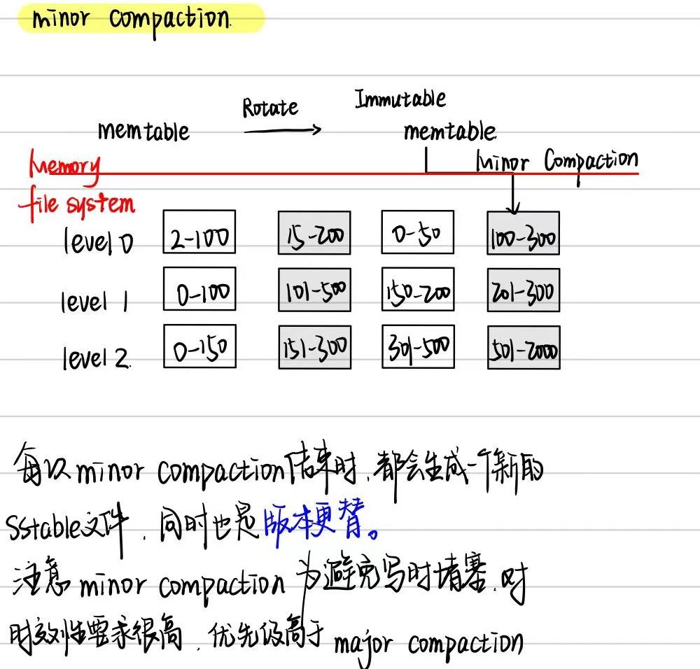
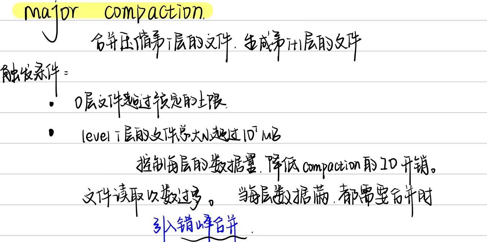
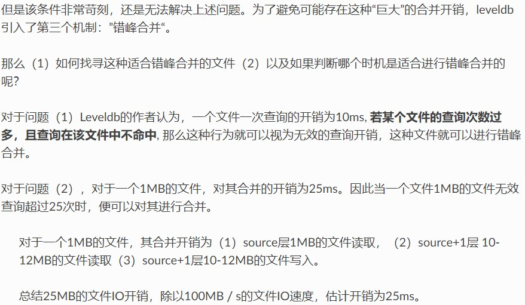
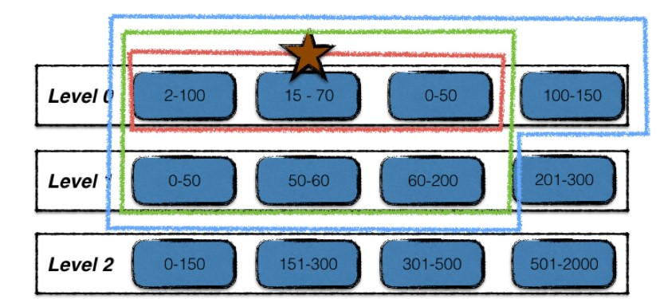
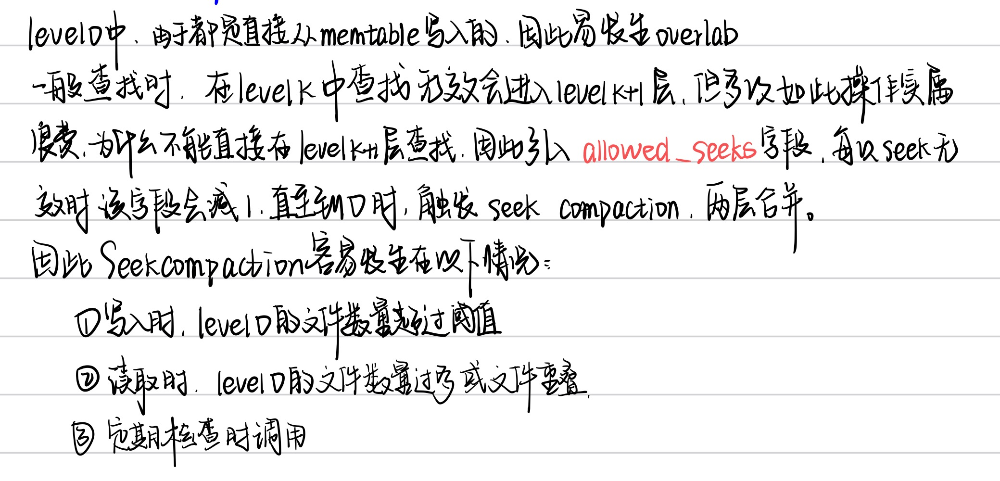
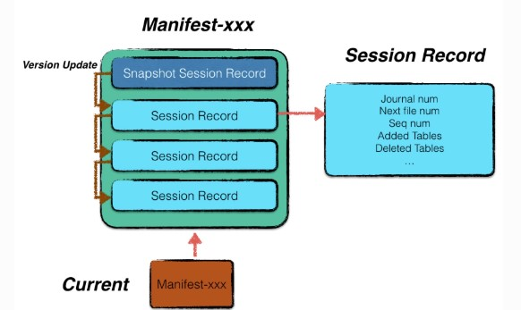
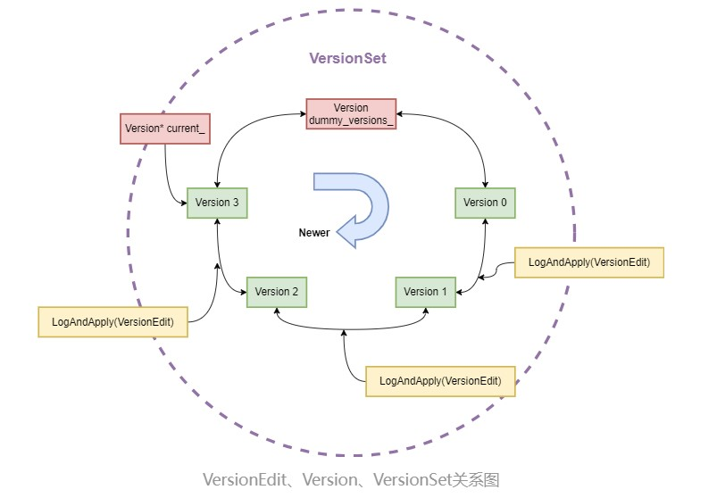
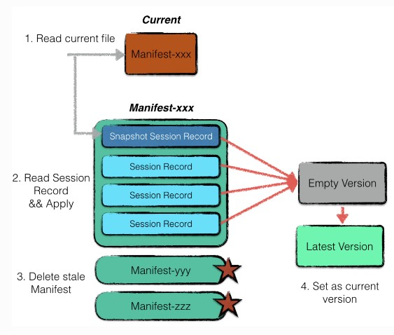

# leveldb源码阅读5 - Compaction And Version

[TOC]


## compaction

### 作用：[leveldb - handbook](https://leveldb-handbook.readthedocs.io/zh/latest/compaction.html)

1. **数据持久化。**一次**minor compaction**的产出是一个0层的sstable文件，其中包含了所有的内存数据。但是若干个0层文件中是可能存在数据overlap的。

2. **提高读写效率**。**Major Compaction**的过程，将0层中的文件合并为若干个没有数据重叠的1层文件。对于没有数据重叠的文件，一次查找过程就可以进行优化，最多只需要一个文件的遍历即可完成。因此，leveldb设计compaction的目的之一就是为了**提高读取的效率**。

3. **平衡读写差异。**有了minor compaction和major compaction，所有的数据在后台都会被规定的次序进行整合。但是一次major compaction的过程其本质是一个**多路归并**的过程，既有大量的磁盘读开销，也有大量的磁盘写开销，显然这是一个严重的性能瓶颈。

   但是当用户写入的速度始终大于major compaction的速度时，就会导致0层的文件数量还是不断上升，用户的读取效率持续下降。所以leveldb中规定：

   - 当0层文件数量超过`SlowdownTrigger`时，写入的速度主要减慢；
   - 当0层文件数量超过`PauseTrigger`时，写入暂停，直至Major Compaction完成；

4. **整理数据。**leveldb的每一条数据项都有一个版本信息，标识着这条数据的新旧程度。这也就意味着同样一个key，在leveldb中可能存在着多条数据项，且每个数据项包含了不同版本的内容。为了尽量减少数据集所占用的磁盘空间大小，leveldb在major compaction的过程中，对不同版本的数据项进行合并。


### Compaction过程

#### minor compaction介绍




#### major compaction介绍

- Size Compaction：根据每层总SSTable大小触发（level-0根据SSTable数）的Major Compaction。
- Seek Compaction：根据SSTable的seek miss触发的Major Compaction。
- Manual Compaction：LevelDB使用者通过接口`void CompactRange(const Slice* begin, const Slice* end)`手动触发。




##### 错峰合并

对于**错峰合并**网上是这么讲解的，我暂时还没看懂：




##### 采样检测

每个sstable文件的元数据中，还有一个额外的字段`seekLeft`，默认为文件的大小除以16KB。leveldb**在正常的数据访问时，会顺带进行采样探测**。正常的数据访问包括（1）用户直接调用Get接口（2）用户使用迭代器进行访问。

**采样的规则：**

- 记录本次访问的第一个sstable文件。
- 若在该文件中访问命中，则不做任何处理；若在该文件中访问不命中，则对 该文件的`seekLeft`标志做减一操作。
- 某一个文件的`seekLeft`标志减少到0时，触发错峰合并。

故以上三种机制可以保障每次进行compaction的时候，总体开销不会呈现上升趋势。


##### 过程

1. 寻找合适的输入文件；

   > 对于*level 0层文件数过多引发的合并场景或由于level i层文件总量过大的合并场景*，采用轮转的方法选择起始输入文件，记录了上一次该层合并的文件的最大key，下一次则选择在此key之后的首个文件。
   >
   > 对于*错峰合并*，起始输入文件则为该查询次数过多的文件。

2. 根据key重叠情况扩大输入文件集合；

   

3. 多路合并；

   多路合并的过程比较简单，即将level i层的文件，与level i+1层的文件中的数据项，按序整理之后，输出到level i+1层的若干个新文件中，即合并完成。

   注意在整理的过程中，需要将冗余的数据进行清理，即同一条数据的多个版本信息，只保留最新的那一份。但是要注意，某些仍然在使用的旧版本的数据，在此时不能立刻删除，而得等到用户使用结束，释放句柄后，根据引用计数来进行清除。

   

   

4. 积分计算；

   每一次compaction都会消除若干source层的旧文件，新增source+1层的新文件，因此触发进行合并的条件状态可能也发生了变化。故在leveldb中，使用了计分牌来维护每一层文件的文件个数及数据总量信息，来**挑选出下一个需要进行合并的层数**。

   计分的规则很简单：

   - 对于0层文件，该层的分数为文件总数／4；
   - 对于非0层文件，该层的分数为文件数据总量／数据总量上限；

   将得分最高的层数记录，若该得分超过1，则为下一次进行合并的层数；


> 由于leveldb内部进行compaction时有trivial move优化，且根据内部的文件格式组织，用户在使用leveldb时，可以尽量将大批量需要写入的数据进行预排序，利用**空间局部性**，尽量减少多路合并的IO开销。


### Compact源码分析

#### 后台线程

为了防止Compaction执行时阻塞LevelDB的正常读写，LevelDB的所有Compaction都通过一个后台线程执行。接口定义在了`include/leveldb/env.h`中，在不同环境中的实现分别位于`util/env_windows.cc`与`env_posix.cc`中。

在env.h的schedule接口中，首先检测后台线程是否创建，如果没有创建创建后台线程。接下来会将任务放入后台线程的任务队列中，并通过信号量唤醒后台线程执行。创建后台线程与操作任务队列都需要通过锁来保护，因此该方法全程加锁。

后台线程会循环获取任务丢列中的任务，为了避免线程空转，在队列为空时通过信号量等待唤醒。如果队列中有任务，则获取该任务并将任务出队，然后执行任务。后台线程中操作队列的部分需要通过锁来保护，而执行任务时没有上锁，可以并行执行（但是LevelDB只使用了1个后台线程，因此Compaction仍是串行而不是并行的）。


#### 优先级

> Minor Compaction > Manual Compaction > Size Compaction > Seek Compaction

> 这里应当涉及几个问题：
>
> 1.compaction什么时候会被触发，对应代码是什么。2.触发时的先后顺序什么样子，对应什么代码。

###### db_impl.cc

在 LevelDB 的 `db_impl.cc` 文件中，主要负责处理对数据库的主要操作.

1. **打开和关闭数据库**：管理数据库的生命周期。
2. **读写操作**：提供对键值对的插入、查找和删除功能。
3. **压缩和合并**：实现后台压缩和合并的逻辑，优化存储。
4. **状态管理**：维护数据库的状态，包括错误状态和后台任务的调度。
5. **事务处理**：支持事务相关的操作。

`db_impl.cc`中的`void MaybeScheduleCompaction() EXCLUSIVE_LOCKS_REQUIRED(mutex_);`会判断是否执行Compaction：

```cpp
void DBImpl::MaybeScheduleCompaction() {
  mutex_.AssertHeld();
  // 检查是否有后台压缩任务被调度，如果有就不做操作
  if (background_compaction_scheduled_) {
    // Already scheduled 
  } else if (shutting_down_.load(std::memory_order_acquire)) {
    // DB is being deleted; no more background compactions
    // DB正在关闭时，不能调度任何压缩任务
  } else if (!bg_error_.ok()) {
    // Already got an error; no more changes
    // 有错误时，不能进行任何压缩任务
  } else if (imm_ == nullptr && manual_compaction_ == nullptr &&
             !versions_->NeedsCompaction()) {
    // No work to be done
    // 没有任何待处理的压缩，则不调度压缩
  } else {
    // 当避免了各种不必要的操作和潜在问题时，可以调度压缩任务
    background_compaction_scheduled_ = true;
    env_->Schedule(&DBImpl::BGWork, this);
  }
}
```

上面的最后一个if判断待处理的压缩时，`imm_==nullptr`对应的是`Minor Compaction`；然后就是`munual compaction`（手动触发），以及最后的version所需要的`Size Compaction`（某层的大小超过限制）或者`Seek Compaction`（多次寻找miss）

在versions中的对于后面两种情况的触发为：

```cpp
// Returns true iff some level needs a compaction.
  bool NeedsCompaction() const {
    Version* v = current_;
     // compaction_score_字段用来计算是否需要触发Size Compaction，
     // file_to_compact_用来计算是否需要触发Seek Compaction
    return (v->compaction_score_ >= 1) || (v->file_to_compact_ != nullptr);
}
```


##### Minor Compaction范围

在[LSTtree](https://www.siyuanblog.cn/archives/lsm-tree)的基本概念中，Minor Compaction只需要将Immutable转储为SSTable并将其推送到level0即可。

而LevelDB对这一步骤进行优化，其会将MinorCompaction生成的SSTable推至更高的层级。

1. 为什么要推到更高的层级，这个步骤不是major compaction要做的吗

   `major compaction`需要对level中的多个文件进行复杂的合并和去重，涉及复杂的键比较和重复数据的处理，同时需要对Manifest进行频繁的更新去记录新的文件和合并后的状态，也有复杂的IO操作，开销较大。

   `minor compaction`只需要将memtable的数据进行写入即可，memtable也通常较小，不涉及复杂的操作，有利于提升性能。

2. 关于推到更高的层级最多也只能是两层的解释。

   level0层的文件通常是无序的，往上的更高层级则要求文件按照键进行排序。

   通常是对于数据进行读取和去重然后推送到更高的层级。随着层级的提高，文件数量越来越少，但是文件的数据量更多，访问的数据块也越多，这会增加IO开销。

   进行minor compaction时，本身文件量并不高，推导更高的层级反而导致了更大的开销，得不偿失。

那如何确定讲memtable中的数据存放在哪个层级，看下面的代码：

```cpp
/*确立memtable输出的数据应该存放哪个层级*/
int Version::PickLevelForMemTableOutput(const Slice& smallest_user_key,
                                        const Slice& largest_user_key) {
  int level = 0;
  // 看level0是否与memtable输出的键有重叠，如果没有，继续向下查找
  // 没有重叠向下查找是为了确保多个层级之间都没有重叠，减少对于major的调用，提升性能
  // 存在重叠的愿意按：多版本的不同数据，同一个文件的多个用户间，文件分布不均等
  // major就是拿来处理层与层之间的重叠，进而定期优化清理层级结构。
  if (!OverlapInLevel(0, &smallest_user_key, &largest_user_key)) {
    // Push to next level if there is no overlap in next level,
    // and the #bytes overlapping in the level after that are limited.
    InternalKey start(smallest_user_key, kMaxSequenceNumber, kValueTypeForSeek);
    InternalKey limit(largest_user_key, 0, static_cast<ValueType>(0));
    std::vector<FileMetaData*> overlaps;
    // 循环遍历，直到达到最大内存压缩层级
    while (level < config::kMaxMemCompactLevel) {
      if (OverlapInLevel(level + 1, &smallest_user_key, &largest_user_key)) {
        break; // 有重叠时保持当层级退出
      }
      // 如下面两层的重叠字数超过最大值时，容易导致性能问题，层级不能上升
      if (level + 2 < config::kNumLevels) {
        // Check that file does not overlap too many grandparent bytes.
        GetOverlappingInputs(level + 2, &start, &limit, &overlaps);
        const int64_t sum = TotalFileSize(overlaps);
        if (sum > MaxGrandParentOverlapBytes(vset_->options_)) {
          break;
        }
      }
      level++;
    }
  }
  return level;
}
```


> 紧接着就又存在了一个问题，minor compaction和major compaction的执行过程究竟哪里不同，才会导致它们在不同的情况下使用。这个后面会结合代码解释，先大致说说。

**Major Compaction**

- **目的**: Major Compaction 主要是将 Level 0 中的所有文件合并到 Level 1，并将 Level 1 中的文件合并到 Level 2，以减少文件数量和重叠，提高查找效率。
- 执行过程
  1. **选择文件**: 选择需要合并的文件，通常是 Level 0 中的所有文件。
  2. **读取数据**: 读取所有选择的文件的数据，可能涉及多个文件的内容。
  3. **去重和排序**: 对读取到的所有键值对进行去重和排序，以确保合并后的文件是有序的。
  4. **写入新文件**: 将合并后的数据写入新文件，并将其放入更高层级（如 Level 1）。
  5. **更新状态**: 更新 Manifest 文件，记录新文件的位置和状态。
  6. **删除旧文件**: 旧的合并文件会被删除，释放存储空间。

**Minor Compaction**

- **目的**: Minor Compaction 主要是将 MemTable 中的数据写入 Level 0，并将 Level 0 中的一些文件推送到更高层级（如 Level 1），通常处理较小的数据量。
- 执行过程
  1. **选择 MemTable**: 从 MemTable 中选择数据进行写入。
  2. **写入 Level 0**: 将 MemTable 中的数据直接写入 Level 0 的新文件。
  3. **合并操作**: 在 Level 0 中，可能会选择一些文件进行简单的合并（如果有）。
  4. **更新状态**: 更新 Manifest 文件，记录新文件的位置。
  5. **释放空间**: 旧的 MemTable 数据被替换或清理。


##### Major Compaction范围

LevelDB在进行Major Compaction时，至少需要确定以下参数：

1. 确定Compaction起始层级i，通常为level0，因为该层数量最多最容易重叠。
2. 确定level_i层SSTable input，识别需要合并的sstable文件。
3. 找到i+1层中与当前层级中，没有合并的sstable存在重叠的文件，讲这些重叠文件和当前文件一起处理生成新的文件放在i+1层文件中。

由于三种Major Compaction的起始条件与目标都不同，其确定这三个参数的方式稍有不同。


#### 后台线程中的compaction

`DBImpl::BGWork`是后台线程的执行入口。具体情况从代码中分析：

```cpp
/*将db通过类型转换程DBImpl，然后调用BackGroundCall接口，启动和调度后台处理任务。*/
void DBImpl::BGWork(void* db) {
  reinterpret_cast<DBImpl*>(db)->BackgroundCall();
}

/*处理levelDB的后台任务*/
void DBImpl::BackgroundCall() {
  MutexLock l(&mutex_); // 创建互斥锁，保证线程安全。
  assert(background_compaction_scheduled_); // 确保后台有任务被调度
  if (shutting_down_.load(std::memory_order_acquire)) {
    // No more background work when shutting down.
    // 数据库正在关闭时不执行任何后台工作，避免关闭过程中继续处理数据导致数据损坏
  } else if (!bg_error_.ok()) {
    // No more background work after a background error.
    // 排除后台错误
  } else {
    // 执行合并操作，将levelDB中的数据整理并优化到适当的层级
    // 只要满足条件触发合并，这个过程就会不断被调用
    // 首次遍历，优化存储，减少重叠文件和荣誉数据
    BackgroundCompaction();
  }

  // 重置调度装置，表示任务完成，避免重复执行同一个合并任务
  background_compaction_scheduled_ = false;

  // Previous compaction may have produced too many files in a level,
  // so reschedule another compaction if needed.
  MaybeScheduleCompaction(); // 检查是否需要重新调度合并，对sstable文件数量进行评估
  background_work_finished_signal_.SignalAll(); // 唤醒等待线程，可以促进触发新的合并
}
```

我还挺好奇，`BackgroundCompaction`和`MaybeScheduleCompaction`的具体差异，后者前面分析过了，有待处理的压缩比如minor compaction或者major compaction时会调用。

看看BackgroundCompaction()这个函数：代码比较长，这里就叙述一下大致逻辑：

```cpp
/*leveldb的核心部分，涵盖了合并的选择，执行和状态管理*/
void DBImpl::BackgroundCompaction() {
    // 上锁保障线程安全
    mutex_.AssertHeld();  
    // 处理尚未合并的immutable memetable
    if (imm_ != nullptr) { 
        CompactMemTable();
        return;
}
    
    // 处理尚未合并的 munual compaction
    // 根据is_munual选择对c进行手动合并还是自动合并
    Compaction* c;
    bool is_manual = (manual_compaction_ != nullptr); 
    
    // 对c进行再次检查的主要原因是为了确保合并操作的完整性和正确性。
    // 第一次合并主要是处理选择出来的SSTable文件，执行合并操作。
    // 第二次目的是确认合并结果
    Status status;
    /*c为空时，跳过；
      当前任务不是mutual compaction，则判断是不是is_trivial move(只需要从一层移动到下一层)，既不需要合并也不需要拆分SSTable，只通过Versionset修改一下level的文件编号即可。
      否则，执行compaction的操作，依次执行DoCompactionWork、CleanupCompaction、RemoveObsoleteFiles。*/
    if (c == nullptr) {
    // Nothing to do 没有合并文件
    } else if (!is_manual && c->IsTrivialMove()) {...}
   
    // 错误处理，状态更新
}     
// is_manual为1则是手动合并，为0则是自动合并。
```

至于`Compaction::IsTrivialMove`的实现:

```cpp
/*判断当前的操作是否可以简单移动*/
bool Compaction::IsTrivialMove() const {
  const VersionSet* vset = input_version_->vset_;
  // Avoid a move if there is lots of overlapping grandparent data.
  // Otherwise, the move could create a parent file that will require
  // a very expensive merge later on.
  // 当前层有文件而下一层没有文件，因为这确保了移动不会引入重叠，并简化了未来的合并流程
  // 如果在进行简单移动时，当前层的文件与祖父层的文件重叠过多，这可能导致在未来需要进行昂贵的合并操作
  // 如果当前层与下一层之间的重叠较少，则在合并时主要关注当前层和下一层之间的关系，而与祖父层的关系相对较小。也就是让祖父层和下一层重叠多是一个很糟的决定
  return (num_input_files(0) == 1 && num_input_files(1) == 0 &&
          TotalFileSize(grandparents_) <=
              MaxGrandParentOverlapBytes(vset->options_));
}
```


#### Minor Compaction

对于该步的直接理解在于，从immutable memtable转换成磁盘中的sstable文件，接下来看看具体过程。

##### 触发

首先我们了解一下Memtable转换成Immutable Memtable的过程，这个是在`DBImpl::MakeRoomForWrite`中。

```cpp
/*
leveldb是流控和等待的方式。
在这个函数中，通过综合内存管理和文件状态，确保leveldb在写入时的高效性。
在循环写入的过程中，会对不同的情况进行判断，比如
1.level0文件数量接近上限(默认为8，超过4时会触发minor compaction），开始对写入操作施加延迟，减少坚持波动给压缩线程留出时间
2.内存表有足够空间时，继续写入，memtable有空间
3.内存表已满，并且之前的内存表正在压缩（memtable已满，immutable memtable没有完成minor compaction），等待
4.磁盘中level0文件太多，超过8时，等待
5.切换到新的内存表，压缩之前的内存表，更新状态
*/
```

在触发Minor Compaction前，就切断到新的WAL写入，如果Minor Compaction失败，就需要从这之前的WAL中恢复；如果Minor Compacton没有完成，leveldb不会删除旧的WAL，因此不会出现数据丢失问题，LevelDB这样做是为了在保证安全地情况下，避免Minor Compaction操作阻塞对LevelDB的正常读写。


#### Size Compaction

##### 触发

在非level0层根据总的sstable大小触发，在level0层根据该层的sstable数触发。也就是说只有发生了`Compaction`，才有可能触发`Size Compaction`.

`Compaction`的执行会导致Version的更新，因此LevelDB在`VersionSet::LogAndApply`方法更新`Version`之后，让其调用VersionSet::Finalize计算每层SSTable看是否需要SIze，然后选出最需要size compaction的层作为下次目标。

(这个应该就是根据每层的sstable的数量进行触发，当到达边缘时，会重排进行一些整体，具体操作后面讲，先看看触发条件)

在后台线程的`DBImpl::BackgroundCall`方法中，该方法在完成Compaction操作后，会再次调用`MaybeScheduleComapction`方法，触发上次因Compaction而需要的Size Compaction操作。

```cpp
void DBImpl::BackgroundCall() {  
  // ... ...
  // Previous compaction may have produced too many files in a level,
  // so reschedule another compaction if needed.
  MaybeScheduleCompaction();
  background_work_finished_signal_.SignalAll();
}
```


#### Seek Compaction

##### 触发



当leveldb查找key时，会记录一些统计信息。当在SSTable上查找时，会记录发生`seekmiss`的SSTable，这样更新`version`中相应的`FileMetaData`中的`allowed_seeks`字段，并且通过`MaybeScheduleCompaction`检查是否需要触发`Seek Compaction`。

在`DBImpl::Get`函数(读取）中，每次读取会对更新的信息进行统计，然后再判断是否需要进行seek compaction，以下为代码：

```cpp
Status DBImpl::Get(const ReadOptions& options, const Slice& key, std::string* value) {
  Status s;
  MutexLock l(&mutex_); // 加锁保护
  SequenceNumber snapshot;
  if (options.snapshot != nullptr) {
    snapshot = // 确认快照
        static_cast<const SnapshotImpl*>(options.snapshot)->sequence_number();
  } else {
    snapshot = versions_->LastSequence();
  }

  MemTable* mem = mem_; // 获取当前的内存表和不可变内存表
  MemTable* imm = imm_;
  Version* current = versions_->current(); // 当前版本的引用
  mem->Ref();
  if (imm != nullptr) imm->Ref();
  current->Ref();

  bool have_stat_update = false;
  Version::GetStats stats;

  // Unlock while reading from files and memtables
  {
    mutex_.Unlock();
    // First look in the memtable, then in the immutable memtable (if any).
    LookupKey lkey(key, snapshot);
    if (mem->Get(lkey, value, &s)) {
      // Done 先在当前内存表找
    } else if (imm != nullptr && imm->Get(lkey, value, &s)) {
      // Done 再在不可变内存表中找
    } else {
      // 最后在当前版本的SSTable文件中查找
      s = current->Get(options, lkey, value, &stats);
      have_stat_update = true;
    }
    mutex_.Lock();
  }

  // 如果查找时更新了统计信息，调用MaybeScheduleCompaction决定是否需要进行压缩
  if (have_stat_update && current->UpdateStats(stats)) {
    MaybeScheduleCompaction(); // 这个会对各种压缩是否需要进行检查
  }
  // 解除引用计数
  mem->Unref();
  if (imm != nullptr) imm->Unref();
  current->Unref();
  return s;
}
```

在`Version::Get`中，逐层遍历覆盖了给定的`lookupkey`的sstable，同时调用match判断是否有我们想要查找的`internalkey`，即如果发生了seek就会调用`match`。

如果`sstable`中没有该key，则会继续查找，当找到了key时返回false。`Match`还会记录第一次`seek miss`的SSTable。`DBImpl::Get`会将SSTable的`allowed_seeks`减1，`MaybeScheduleCompaction`检查是否需要触发`Seek Compaction`。

```cpp
Status Version::Get(const ReadOptions& options, const LookupKey& k,
                    std::string* value, GetStats* stats) {
  stats->seek_file = nullptr;
  stats->seek_file_level = -1;

  struct State {
    Saver saver;
    GetStats* stats;
    const ReadOptions* options;
    Slice ikey;
    FileMetaData* last_file_read;
    int last_file_read_level;

    VersionSet* vset;
    Status s;
    bool found;

    static bool Match(void* arg, int level, FileMetaData* f) {
      State* state = reinterpret_cast<State*>(arg);
      // 没有找到文件时，记录当前文件和层级
      if (state->stats->seek_file == nullptr &&
          state->last_file_read != nullptr) {
        // 检查是否有文件已经被访问过
        // We have had more than one seek for this read.  Charge the 1st file.
        state->stats->seek_file = state->last_file_read;
        state->stats->seek_file_level = state->last_file_read_level;
      }

      state->last_file_read = f;
      state->last_file_read_level = level;

      // 使用tablecache从缓存中获取数据
      state->s = state->vset->table_cache_->Get(*state->options, f->number,
                                                f->file_size, state->ikey,
                                                &state->saver, SaveValue);
      if (!state->s.ok()) {
        state->found = true;
        return false;
      }
      switch (state->saver.state) {
        case kNotFound: // 继续找其它文件
          return true;  // Keep searching in other files
        case kFound: // 找到键更新状态返回
          state->found = true;
          return false;
        case kDeleted: // 返回，键已删除
          return false;
        case kCorrupt: // 记录错误状态返回
          state->s =
              Status::Corruption("corrupted key for ", state->saver.user_key);
          state->found = true;
          return false;
      }

      // Not reached. Added to avoid false compilation warnings of
      // "control reaches end of non-void function".
      return false;
    }
  };

  State state;
  state.found = false;
  state.stats = stats;
  state.last_file_read = nullptr;
  state.last_file_read_level = -1;

  state.options = &options;
  state.ikey = k.internal_key();
  state.vset = vset_;

  state.saver.state = kNotFound;
  state.saver.ucmp = vset_->icmp_.user_comparator();
  state.saver.user_key = k.user_key();
  state.saver.value = value;
    
  /*遍历版本中的文件，查找与给定的用户键和内部键重叠的文件，并通过回调函数处理这些文件。通过分层的方式，确保在最新文件优先的同时，也不遗漏其他层中的重叠文件。*/
  ForEachOverlapping(state.saver.user_key, state.ikey, &state, &State::Match);

  return state.found ? state.s : Status::NotFound(Slice());
}
```

get函数中，文件的访问和查找会统计访问过的文件。虽然不是直接的seek compaction，但是为后续的compaction提高了信息，判断哪些文件需要被合并以减少查找时的IO。

ForEachOverlapping函数中，查找过程会遍历多个层次的文件，通过重叠查找相关文件，这有助于进行seekcomapction时，确定哪些文件时重叠的进而决定compaction。


#### Manual Compaction

##### 触发

Manual Comapction的触发时机比较简单。

当LevelDB的用户调用`DB::CompactRange`接口时，LevelDB会检查用户给定的Compact范围与当前状态，判断是否需要执行Manual Compaction。

如果确定执行Manual Compaction，则设置`manual_compaction_`，再调用`MaybeScheduleCompaction`方法以尝试触发Manual Compaction。


#### Minor Compaction执行

以下两个函数是imm转变为sst的过程，

1. **文件添加**：`DBImpl::WriteLevel0Table` 创建新的 SST 文件并将其添加到 Level 0或者其它层级。
2. **触发条件**：一旦 Level 0 中的文件数量达到预设阈值，系统会自动触发 minor compaction。
3. **合并操作**：在 minor compaction 过程中，Level 0 的 SST 文件会被合并并输出到 Level 1，减少 Level 0 的文件数量，提高性能。

```cpp
/*将imm变为SSTable，同时添加到leveldb的版本控制和文件管理。*/
void DBImpl::CompactMemTable() {
  mutex_.AssertHeld(); // 操作期间有锁，避免并发问题（并发控制）
  assert(imm_ != nullptr);

  // Save the contents of the memtable as a new Table
  VersionEdit edit; // 版本编辑（内存管理）
  Version* base = versions_->current(); 
  base->Ref(); // 引用版本
  Status s = WriteLevel0Table(imm_, &edit, base); // 将imm写入level0，更新版本信息
  base->Unref();
  // 如果写入成功并且正在关闭数据库，记录错误返回
  if (s.ok() && shutting_down_.load(std::memory_order_acquire)) {
    s = Status::IOError("Deleting DB during memtable compaction");
  }
  // 如果没有错误，更新版本信息（错误管理）
  // Replace immutable memtable with the generated Table
  if (s.ok()) {
    edit.SetPrevLogNumber(0);
    edit.SetLogNumber(logfile_number_);  // Earlier logs no longer needed
    s = versions_->LogAndApply(&edit, &mutex_);
  }
  // 清理空间，清理错误文件（性能优化）
  if (s.ok()) {
    // Commit to the new state
    imm_->Unref();
    imm_ = nullptr;
    has_imm_.store(false, std::memory_order_release);
    RemoveObsoleteFiles();
  } else {
    RecordBackgroundError(s);
  }
}
```

重点在WriteLevel0Table这个函数：

```cpp
/*要用于将内存表（MemTable）的数据写入到 Level0的SST文件中*/
/*
* meta文件元数据，通过mem的迭代器保存到sst文件中
* edit描述数据库版本的更改，记录新文件的添加和删除等信息
* base当前数据库版本，参考已经存在的数据和文件信息
*/
Status DBImpl::WriteLevel0Table(MemTable* mem, VersionEdit* edit,
                                Version* base) {
  mutex_.AssertHeld(); // 确保有锁
  const uint64_t start_micros = env_->NowMicros(); // 记录开始时间
  FileMetaData meta; // 创建文件元数据
  meta.number = versions_->NewFileNumber();
  pending_outputs_.insert(meta.number);
  Iterator* iter = mem->NewIterator(); // 创建迭代器遍历内存表
  Log(options_.info_log, "Level-0 table #%llu: started",
      (unsigned long long)meta.number); // 记录日志

  Status s;
  { // 加锁建构表
    mutex_.Unlock();  // （理清表中有什么，meta中有什么）
    /*
    BuildTable 函数负责实际的写入过程。
    它将遍历迭代器中的数据，并写入到新SST文件中。
    会在指定数据库目录中创建新文件，文件名基于meta.number生成。
    */
    s = BuildTable(dbname_, env_, options_, table_cache_, iter, &meta);
    mutex_.Lock();
  }
  // 日志记录和删除迭代器 
  Log(options_.info_log, "Level-0 table #%llu: %lld bytes %s",
      (unsigned long long)meta.number, (unsigned long long)meta.file_size,
      s.ToString().c_str());
  delete iter;
  pending_outputs_.erase(meta.number); // 这个pending_outputs什么作用？
  // 主要用于跟踪正在进行的写入操作，避免同一时刻对同一个文件进行多次写入
  // 防止并发造成的数据破坏

  // Note that if file_size is zero, the file has been deleted and
  // should not be added to the manifest.
  int level = 0; // 表格构建成功，文件大小大于0
  if (s.ok() && meta.file_size > 0) {
    const Slice min_user_key = meta.smallest.user_key();
    const Slice max_user_key = meta.largest.user_key();
    if (base != nullptr) {
      // 根据用户键选择写入层级
      level = base->PickLevelForMemTableOutput(min_user_key, max_user_key);
    }
    // 将文件信息添加到版本编辑中
    edit->AddFile(level, meta.number, meta.file_size, meta.smallest,
                  meta.largest);
  }

  CompactionStats stats;
  stats.micros = env_->NowMicros() - start_micros;
  stats.bytes_written = meta.file_size;
  stats_[level].Add(stats);
  return s;
}
```

`CompactRange` 函数主要用于执行 **minor compaction**，它将 Level 0 中的 SST 文件合并到 Level 1 或更高层级。其主要作用是优化存储结构，减少 Level 0 的文件数量，提升查询和写入性能。

```cpp
/*处理leveldb中的范围压缩*/
void DBImpl::CompactRange(const Slice* begin, const Slice* end) {
  int max_level_with_files = 1;
  {
    MutexLock l(&mutex_);
    Version* base = versions_->current(); // 获取当前版本
    for (int level = 1; level < config::kNumLevels; level++) {
      if (base->OverlapInLevel(level, begin, end)) {
        max_level_with_files = level; // 查找有重叠的最高层级
      }
    }
  }
  TEST_CompactMemTable();  // TODO(sanjay): Skip if memtable does not overlap
  for (int level = 0; level < max_level_with_files; level++) {
    TEST_CompactRange(level, begin, end); // 对每个层级进行范围压缩
    // 将指定范围的sst文件合并，更新数据库存储结构
  }
}
```

于从 Level 0 到找到的最高层级，`CompactRange` 会调用 `TEST_CompactRange` 函数，依次压缩每个层级。

- 压缩过程：
  - **读取文件**：选择与指定范围重叠的 SST 文件。
  - **合并数据**：将这些文件中的数据合并，进行排序和去重。
  - **写入新文件**：将合并后的结果写入新的 SST 文件，存储在目标层级。
  - **更新版本信息**：压缩完成后，更新数据库的版本信息，移除已合并的旧文件。


#### Major Compaction执行

关于major，我们来分析一个比较长的函数`DBImpl::DoCompactionWork`:

```cpp
/*执行具体的压缩工作，从输入迭代器中读取键值对，合并数据，写入输出文件，更新版本信息*/
Status DBImpl::DoCompactionWork(CompactionState* compact) {
  const uint64_t start_micros = env_->NowMicros();// 初始化开始时间
  int64_t imm_micros = 0;  // Micros spent doing imm_ compactions
  // 记录日志
  Log(options_.info_log, "Compacting %d@%d + %d@%d files",
      compact->compaction->num_input_files(0), compact->compaction->level(),
      compact->compaction->num_input_files(1),
      compact->compaction->level() + 1);

  assert(versions_->NumLevelFiles(compact->compaction->level()) > 0);
  assert(compact->builder == nullptr);
  assert(compact->outfile == nullptr);
  if (snapshots_.empty()) {// 设置快照
    compact->smallest_snapshot = versions_->LastSequence();
  } else {
    compact->smallest_snapshot = snapshots_.oldest()->sequence_number();
  }
  // 为当前版本创建一个迭代器，用于遍历待压缩的键值对
  Iterator* input = versions_->MakeInputIterator(compact->compaction);

  // Release mutex while we're actually doing the compaction work
  mutex_.Unlock();

  input->SeekToFirst(); // 检查迭代器是否有效
  Status status;
  ParsedInternalKey ikey;
  std::string current_user_key;
  bool has_current_user_key = false;
  SequenceNumber last_sequence_for_key = kMaxSequenceNumber;
```

这部分就是，断言避免编码，做好日志，初始化时间等，准备数据，设置快照…然后前面是需要加锁的，然后开始解锁，设置迭代器，seq。

```cpp
  /*遍历处理键值对，根据压缩的需求决定哪些键值对保留，哪些需要抛弃*/
  while (input->Valid() && !shutting_down_.load(std::memory_order_acquire)) {
    // Prioritize immutable compaction work优先处理imm
    if (has_imm_.load(std::memory_order_relaxed)) {
      const uint64_t imm_start = env_->NowMicros();
      mutex_.Lock();
      if (imm_ != nullptr) {
        CompactMemTable(); // 这个函数可以压缩不可变内存表
        // Wake up MakeRoomForWrite() if necessary.若imm为空格，唤醒相关函数
        background_work_finished_signal_.SignalAll();
      }
      mutex_.Unlock();
      imm_micros += (env_->NowMicros() - imm_start); // 记录处理不可变内存表所花费的时间
    }

    Slice key = input->key();// 通过迭代器获取当前键
    if (compact->compaction->ShouldStopBefore(key) &&
        compact->builder != nullptr) { // 到达停止条件时完成写入
      status = FinishCompactionOutputFile(compact, input);
      if (!status.ok()) {
        break;
      }
    }

    // Handle key/value, add to state, etc.
    bool drop = false; // 解析当前键，获取用户键和序列号
    if (!ParseInternalKey(key, &ikey)) {
      // Do not hide error keys 解析失败，重置相关变量
      current_user_key.clear();
      has_current_user_key = false;
      last_sequence_for_key = kMaxSequenceNumber;
    } else { // 处理解析成功的键
      if (!has_current_user_key ||
          user_comparator()->Compare(ikey.user_key, Slice(current_user_key)) !=
              0) {
        // First occurrence of this user key
        current_user_key.assign(ikey.user_key.data(), ikey.user_key.size());
        has_current_user_key = true;
        last_sequence_for_key = kMaxSequenceNumber;
      }

      if (last_sequence_for_key <= compact->smallest_snapshot) {
        // Hidden by an newer entry for same user key
        drop = true;  // (A)
      } else if (ikey.type == kTypeDeletion &&
                 ikey.sequence <= compact->smallest_snapshot &&
                 compact->compaction->IsBaseLevelForKey(ikey.user_key)) {
        // For this user key:
        // (1) there is no data in higher levels
        // (2) data in lower levels will have larger sequence numbers
        // (3) data in layers that are being compacted here and have
        //     smaller sequence numbers will be dropped in the next
        //     few iterations of this loop (by rule (A) above).
        // Therefore this deletion marker is obsolete and can be dropped.
        drop = true;
      }

      last_sequence_for_key = ikey.sequence;
    }

    if (!drop) { // 继续处理
      /*打开输出文件，更新输出文件最小最大键，将键值对添加到当前输出文件*/
      // Open output file if necessary
      if (compact->builder == nullptr) {
        status = OpenCompactionOutputFile(compact);
        if (!status.ok()) {
          break;
        }
      }
      // 如果为第一个条目，设置最小值
      if (compact->builder->NumEntries() == 0) {
        compact->current_output()->smallest.DecodeFrom(key);
      } // 更新当前条目的最大键
      compact->current_output()->largest.DecodeFrom(key);
      compact->builder->Add(key, input->value()); // 添加键值对

      // Close output file if it is big enough 关闭输出文件
      if (compact->builder->FileSize() >=
          compact->compaction->MaxOutputFileSize()) {
        status = FinishCompactionOutputFile(compact, input);
        if (!status.ok()) {
          break;
        }
      }
    }

    input->Next();
  }
```

在处理过程中，函数会优先处理不可变内存表，确保在压缩过程中不会丢失重要数据。对于每个输入键，函数会解析其内部格式并判断是否需要丢弃，基于其序列号和类型。如果键有效，就将其添加到当前的输出文件中，必要时会打开新文件并检查文件大小以决定是否完成写入。整个过程中，函数还会处理各种状态检查，并在最后记录压缩的统计信息，以便分析性能和效果。

```cpp
  /*处理完成情况*/
  if (status.ok() && shutting_down_.load(std::memory_order_acquire)) {
    status = Status::IOError("Deleting DB during compaction");
  }
  if (status.ok() && compact->builder != nullptr) {
    status = FinishCompactionOutputFile(compact, input);
  }
  if (status.ok()) {
    status = input->status();
  }
  delete input;
  input = nullptr;
  /*统计信息：包括压缩时间，字节读取，写入统计*/
  CompactionStats stats;
  stats.micros = env_->NowMicros() - start_micros - imm_micros;
  for (int which = 0; which < 2; which++) {
    for (int i = 0; i < compact->compaction->num_input_files(which); i++) {
      stats.bytes_read += compact->compaction->input(which, i)->file_size;
    }
  }
  for (size_t i = 0; i < compact->outputs.size(); i++) {
    stats.bytes_written += compact->outputs[i].file_size;
  }

  mutex_.Lock();
  stats_[compact->compaction->level() + 1].Add(stats);
  /*安装压缩结果：更新版本控制，记录错误*/
  if (status.ok()) {
    status = InstallCompactionResults(compact);
  }
  if (!status.ok()) {
    RecordBackgroundError(status);
  }
  /*记录日志*/
  VersionSet::LevelSummaryStorage tmp;
  Log(options_.info_log, "compacted to: %s", versions_->LevelSummary(&tmp));
  return status;
}
```


注：

要注意一个误区是major compaction和minor compaction不是两个具体的过程。它们都是读取文件，合并数据，写入新文件，更新版本信息这几个过程。minor和major我刚开始以为是底层和高层的不同压缩，这样理解不准确，应该是微型和大型压缩更为合适。

minor相对简单，主要涉及少量文件的合并。major会涉及更多，层之内，层与层之间的文件的合并等。


## version

### 前言

leveldb每次生成或者删除sstable，都会从一个版本升级成另外一个版本。换句话说，每次都会从一个版本升级成另外一个版本。sstable的更替对于leveldb来说是一个最小的操作单元，具有原子性。。

从leveldb的角度来看，MVCC机制不仅能够并行化实现读读和读写操作，还使其能够实现快照读。用户可以通过提供的接口保留一定时间的快照，在用户释放快照前，该快照创建时leveldb中存在的数据就不会被释放。

LevelDB的多版本存储设计可分为三个层次：

- **从key/value的角度：** 每次变更操作的记录（Batch Writer可视为一次操作）都有不同且递增的SequenceNumber。对于一个UserKey，当存在SequenceNumber更高的的记录时，旧的记录不会被立即删除，至少要在该SequenceNumber之前的所有Snapshot都被释放后才能删除（具体删除时间与Compaction时间有关）。这是L**evelDB实现Snapshot Read的基础。**
- **从MemTable的角度：** LevelDB中的MemTable通过**引用计数**来控制释放时间。在需要读取MemTable时（无论是Get操作还是Minor Compaction时），读取前会增大其引用计数，读取后减小引用计数。这样，即使MemTable已被通过Minor Compaction操作写入到Level-0文件，**MemTable在被读取，它就不会被释放**，保证能被多次读。
- **从数据库文件的角度：** LevelDB的文件同样需要引用计数，当执行Major Compaction时，**LevelDB不会立即删除已被合并的数据库文件，因为此时可能还有未完成的读取该文件的操作。**

`key/value`的版本实际上也是依赖于内存与稳定存储，其分别在Compaction与Put/Get操作中体现，因此这里我们主要关注后两者。

`MemTable`的多版本与`Snapshot`信息是不需要直接持久化的，因为数据库关闭时无法进行Snapshot Read，也就没有了Snapshot的概念，而最新的MemTable会通过WAL重建，旧的MemTable也不再会被依赖。

数据库文件则不同，LevelDB必须记录数据库文件的版本信息，否则在数据库重启时无法快速确定哪些文件是有效的（LevelDB提供了文件版本信息损坏时的修复机制）。而**LevelDB中Version及相关概念就是为此设计的。**

> `VersionSet`是一个管理和维护多个版本的集合，
>
> 而`VersionEdit`是对版本变化的具体描述和记录。通过这种结构，LevelDB能够有效地管理数据的版本控制和变化。


### 源码分析

`version_set.h` 文件定义了 LevelDB 中版本管理和压缩的核心数据结构。`Version` 和 `VersionSet` 类负责维护数据库的版本及其文件信息，而 `Compaction` 类则处理压缩操作。这个结构确保了 LevelDB 能高效地管理数据的版本和执行压缩策略，从而优化性能。同时相关文件有Manifest和Current。

#### class compaction

```cpp
class Compaction {
 public:
  ...
 private:
  friend class Version;
  friend class VersionSet;

  Compaction(const Options* options, int level);

  int level_; //正在进行压缩的级别
  uint64_t max_output_file_size_; // 最大输出文件大小限制
  Version* input_version_; // 指向当前压缩的输入版本
  VersionEdit edit_; // 保存压缩操作所作的编辑内容，包含需要添加和删除的文件

  // Each compaction reads inputs from "level_" and "level_+1"
  // 一个存储当前级别，一个存储下一个几倍
  std::vector<FileMetaData*> inputs_[2];  // The two sets of inputs

  // State used to check for number of overlapping grandparent files
  // (parent == level_ + 1, grandparent == level_ + 2)
  std::vector<FileMetaData*> grandparents_;
  size_t grandparent_index_;  // Index in grandparent_starts_
  bool seen_key_;             // Some output key has been seen
  int64_t overlapped_bytes_;  // Bytes of overlap between current output
                              // and grandparent files

  // State for implementing IsBaseLevelForKey

  // level_ptrs_ holds indices into input_version_->levels_: our state
  // is that we are positioned at one of the file ranges for each
  // higher level than the ones involved in this compaction (i.e. for
  // all L >= level_ + 2).
  // 输入版本的文件列表中为每个级别保存指向当前状态的索引
  size_t level_ptrs_[config::kNumLevels];
};
```


#### Manifest

manifest文件专用于记录版本信息。leveldb采用了增量式的存储方式，记录每一个版本相较于上一个版本的变化情况。展开来说，一个Manifest文件中，包含了多条Session Record，**其中第一条Session Record**记载了当时leveldb的*全量版本信息*，其余若干条Session Record仅记录每次更迭的变化情况。




#### version_edit

VersionEdit类在levelDB中与上面manifest文件管理密切相关。 manifest文件用于记录数据库的元数据和版本信息。每当数据库状态发生变化时，都会生成一个新的manifest文件，具体表现在versionset中有体现。

```cpp
enum Tag {
  kComparator = 1, // 比较器的名称字符串
  kLogNumber = 2, // 文件编号
  kNextFileNumber = 3, // 下一个文件分配的编号
  kLastSequence = 4, // 当前版本的最后一个序列号
  kCompactPointer = 5, // 压缩指针
  kDeletedFile = 6, // 删除的元数据
  kNewFile = 7, // 新文件
  // 8 was used for large value refs
  kPrevLogNumber = 9 // 文件编号
};
```

version_edit文件

```cpp
/*文件元数据，存储每个sst文件的元数据*/
struct FileMetaData {
  FileMetaData() : refs(0), allowed_seeks(1 << 30), file_size(0) {}

  int refs; // 引用计数
  int allowed_seeks;  // Seeks allowed until compaction 容易触发seek compaction
  uint64_t number; // 文件的唯一编号
  uint64_t file_size;    // File size in bytes
  InternalKey smallest;  // Smallest internal key served by table 
  InternalKey largest;   // Largest internal key served by table
};

/*记录版本的变化信息*/
class VersionEdit {
 public:
  VersionEdit() { Clear(); }
  ~VersionEdit() = default;
  void Clear();
  // 设置信息
  void SetComparatorName(const Slice& name) {
    has_comparator_ = true;
    comparator_ = name.ToString();
  }
  void SetLogNumber(uint64_t num) {
    has_log_number_ = true;
    log_number_ = num;
  }
  void SetPrevLogNumber(uint64_t num) {
    has_prev_log_number_ = true;
    prev_log_number_ = num;
  }
  void SetNextFile(uint64_t num) {
    has_next_file_number_ = true;
    next_file_number_ = num;
  }
  void SetLastSequence(SequenceNumber seq) {
    has_last_sequence_ = true;
    last_sequence_ = seq;
  }
  void SetCompactPointer(int level, const InternalKey& key) {
    compact_pointers_.push_back(std::make_pair(level, key));
  }
  // 添加删除文件
  // Add the specified file at the specified number.
  // REQUIRES: This version has not been saved (see VersionSet::SaveTo)
  // REQUIRES: "smallest" and "largest" are smallest and largest keys in file
  void AddFile(int level, uint64_t file, uint64_t file_size,
               const InternalKey& smallest, const InternalKey& largest) {
    FileMetaData f;
    f.number = file;
    f.file_size = file_size;
    f.smallest = smallest;
    f.largest = largest;
    new_files_.push_back(std::make_pair(level, f));
  }
  // Delete the specified "file" from the specified "level".
  void RemoveFile(int level, uint64_t file) {
    deleted_files_.insert(std::make_pair(level, file));
  }
  // 编码解码
  void EncodeTo(std::string* dst) const;
  Status DecodeFrom(const Slice& src);

  std::string DebugString() const;

 private:
  friend class VersionSet;

  typedef std::set<std::pair<int, uint64_t>> DeletedFileSet;

  std::string comparator_; //比较器名称
  uint64_t log_number_; // 日志编号
  uint64_t prev_log_number_;
  uint64_t next_file_number_;
  SequenceNumber last_sequence_; // 最后一个序列号
  bool has_comparator_;
  bool has_log_number_;
  bool has_prev_log_number_;
  bool has_next_file_number_;
  bool has_last_sequence_;

  std::vector<std::pair<int, InternalKey>> compact_pointers_; // 存储压缩指针
  DeletedFileSet deleted_files_; // 跟踪已删除的文件，便于版本更新时管理
  std::vector<std::pair<int, FileMetaData>> new_files_; // 存储新添加的文件信息
};
```

在创建新版本时，LevelDB首先构造VersionEdit，然后通过`VersionSet::LogAndApply`方法，先将VersionEdit应用到Current Version，然后将增量的VersionEdit写入Manifest文件中。


#### version_set



##### class version

version文件主要用于存储数据库的某个具体版本，包括当前版本的所有文件，统计信息以及相关状态。其中维护了一个文件列表记录每个层级的sst文件，不同版本之间的连接方式为双向链表；通过引用计数管理version对象的生命周期等。

同时还有和compaction相关的成员变量，

比如当前需要进行压缩的元数据以及所在层级（确定待压缩候选者）

比如当前版本的压缩评分和下一个需要压缩的层级（管理压缩的紧迫性和优先级）

```cpp
class Version{
public:
    ...
 private:
  friend class Compaction;
  friend class VersionSet;

  class LevelFileNumIterator;

  explicit Version(VersionSet* vset)
      : vset_(vset),
        next_(this),
        prev_(this),
        refs_(0),
        file_to_compact_(nullptr),
        file_to_compact_level_(-1),
        compaction_score_(-1),
        compaction_level_(-1) {}

  Version(const Version&) = delete;
  Version& operator=(const Version&) = delete;

  ~Version();

  Iterator* NewConcatenatingIterator(const ReadOptions&, int level) const;

  // Call func(arg, level, f) for every file that overlaps user_key in
  // order from newest to oldest.  If an invocation of func returns
  // false, makes no more calls.
  //
  // REQUIRES: user portion of internal_key == user_key.
  void ForEachOverlapping(Slice user_key, Slice internal_key, void* arg, bool (*func)(void*, int, FileMetaData*));

  VersionSet* vset_;  // VersionSet to which this Version belongs
  Version* next_;     // Next version in linked list
  Version* prev_;     // Previous version in linked list
  int refs_;          // Number of live refs to this version

  // List of files per level
  std::vector<FileMetaData*> files_[config::kNumLevels];

  // Next file to compact based on seek stats.
  FileMetaData* file_to_compact_;
  int file_to_compact_level_;

  // Level that should be compacted next and its compaction score.
  // Score < 1 means compaction is not strictly needed.  These fields
  // are initialized by Finalize().
  double compaction_score_;
  int compaction_level_;
};
```


##### class versionset

versionset主要用于管理多个version对象，负责维护数据库的版本历史和状态。

```cpp
class VersionSet {
public:
    ...
 private:
  class Builder;

  friend class Compaction;
  friend class Version;

  bool ReuseManifest(const std::string& dscname, const std::string& dscbase);

  void Finalize(Version* v);
    // 进行压缩或者查询时，了解数据范围有助于优化性能
  void GetRange(const std::vector<FileMetaData*>& inputs, InternalKey* smallest, InternalKey* largest);
    // 合并文件时考虑文件范围
  void GetRange2(const std::vector<FileMetaData*>& inputs1, const std::vector<FileMetaData*>& inputs2, InternalKey* smallest, InternalKey* largest);
    // 为压缩操作设置其它输入文件
  void SetupOtherInputs(Compaction* c);

  // Save current contents to *log
  Status WriteSnapshot(log::Writer* log);

  void AppendVersion(Version* v);

  Env* const env_; 
  const std::string dbname_; // 数据库名称
  const Options* const options_; // 数据库选项
  TableCache* const table_cache_; // 表缓存
  const InternalKeyComparator icmp_; // 内部键比较器
  uint64_t next_file_number_;
  uint64_t manifest_file_number_;
  uint64_t last_sequence_; // 所有写操作中最后使用的序列号
  uint64_t log_number_;
  uint64_t prev_log_number_;  // 0 or backing store for memtable being compacted

  // Opened lazily
  WritableFile* descriptor_file_;  // 数据库描述符文件
  log::Writer* descriptor_log_; // 写入日志
  Version dummy_versions_;  // Head of circular doubly-linked list of versions.循环双链表的虚拟头
  Version* current_;        // == dummy_versions_.prev_指向当前版本

  // Per-level key at which the next compaction at that level should start.压缩指针
  // Either an empty string, or a valid InternalKey.
  std::string compact_pointer_[config::kNumLevels];
};
```

通过`LogAndApply()`方法应用`VersionEdit`对象，创建新的`Version`并将其添加到`VersionSet`中。下面来看看LogAndApply函数的过程：

1. **保存状态**：首先，它会保存当前的锁状态，以确保在写入文件时不会有其他线程干扰。

2. **更新版本**：接着，通过传入的`VersionEdit`对象，更新当前的版本信息。这可能包括创建新版本，保存新版本到builder类中，删除旧文件、更新日志编号等。

3. **写入日志**：在更新版本的同时，`LogAndApply`会将这些变更记录到持久化日志中，以便后续的恢复操作。

   ```cpp
     Status s;
     if (descriptor_log_ == nullptr) {
       // No reason to unlock *mu here since we only hit this path in the
       // first call to LogAndApply (when opening the database).
       assert(descriptor_file_ == nullptr);
       // 日志为空时，生成新的描述符文件名，创建可写文件
       new_manifest_file = DescriptorFileName(dbname_, manifest_file_number_);
       s = env_->NewWritableFile(new_manifest_file, &descriptor_file_);
       if (s.ok()) {
       // 将其作为新的日志写入其，同时将当前版本快照写入日志
         descriptor_log_ = new log::Writer(descriptor_file_);
         s = WriteSnapshot(descriptor_log_);
       }
   ```

4. **应用更改**：更新完成后，函数会应用这些更改到当前版本，确保数据库状态与日志一致。

   ```cpp
     {
       mu->Unlock();
   
       // Write new record to MANIFEST log
       if (s.ok()) {
         std::string record;
         edit->EncodeTo(&record);
         s = descriptor_log_->AddRecord(record); //使用 descriptor_log_ 将该记录添加到MANIFEST日志中。
         if (s.ok()) { // 同步到磁盘，确保写入持久化
           s = descriptor_file_->Sync();
         }
         if (!s.ok()) {
           Log(options_->info_log, "MANIFEST write: %s\n", s.ToString().c_str());
         }
       }
   
       // If we just created a new descriptor file, install it by writing a
       // new CURRENT file that points to it.
       if (s.ok() && !new_manifest_file.empty()) {
       // 更新current文件，指向新创建的描述符文件
         s = SetCurrentFile(env_, dbname_, manifest_file_number_);
       }
   
       mu->Lock();
     }
   ```

   

5. **释放锁**：最后，释放锁并返回结果，完成整个过程。


#### Recover

由于数据库启动前需要恢复数据，也就是利用Manifest信息重新构建一个最新的version。

1. 利用current文件读取最近使用的Manifest文件。

2. 创建一个空的version，利用manifest文件中的session record依次apply，还原出一个最新的version，注意manifest的第一条session record记录的是一个version的snapshot，后面记录的都是增量。

   （为了避免manifest过大，每次启动时重新创建的manifest的第一条都是当前版本的快照状态，其它过期的manifest文件会在下次启动的recover流程中自行删除）

3. 将非current文件指向的其它过期的manifest文件删除。

4. 将新建的version作为当前数据库的version。



#### Repair

repair.cc中只有一个公共接口，Run()

```cpp
  Status Run() {
    /*查找数据库目录中的文件
    * 解析文件名，提取文件编号和类型
    * 对于描述符文件，文件名存入manifest
    * 对于日志和表文件，存储在logs和table_number中
    */
    Status status = FindFiles(); 
    if (status.ok()) {
      ConvertLogFilesToTables(); // 将日志文件转换成表文件
      ExtractMetaData(); // 获取每个文件的元数据(key)以及最终数据库的元数据(seq)
      status = WriteDescriptor(); // 创建一个新的manifest文件，将扫描的数据库元数据进行记录
    }
    if (status.ok()) {
      unsigned long long bytes = 0;
      for (size_t i = 0; i < tables_.size(); i++) {
        bytes += tables_[i].meta.file_size;
      }
      Log(options_.info_log,
          "**** Repaired leveldb %s; "
          "recovered %d files; %llu bytes. "
          "Some data may have been lost. "
          "****",
          dbname_.c_str(), static_cast<int>(tables_.size()), bytes);
    }
    return status;
  }
```

但是该方法的效率十分低下，首先需要对整个数据库的文件进行扫描，其次0层的文件必然将远远大于4个，这将导致极多的compaction发生。


有关这部分的大致内容就是这样子了，关于version的内容其实可以再次精细化，留个点位，leveldb整体一遍学完后也还会留时间再回头看看的。
