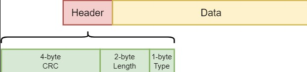
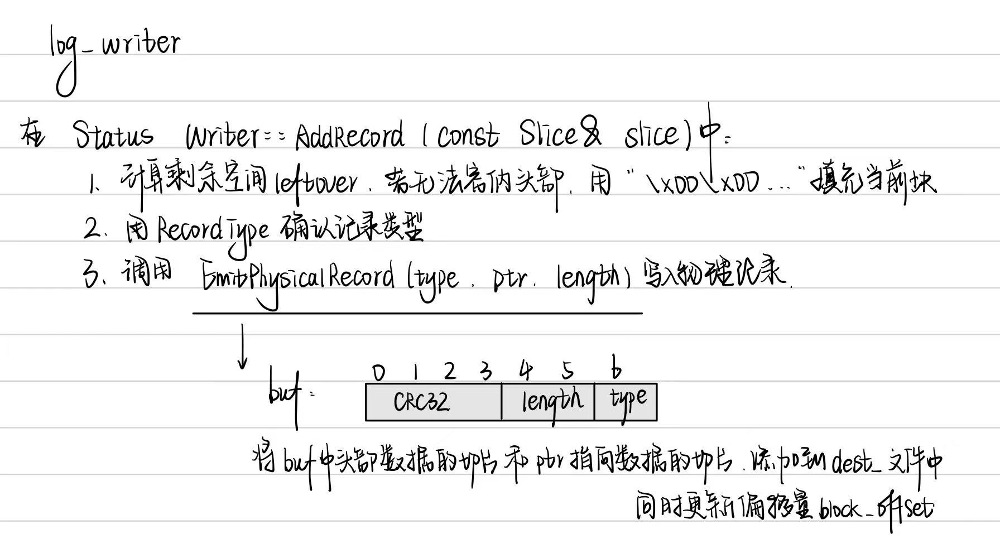
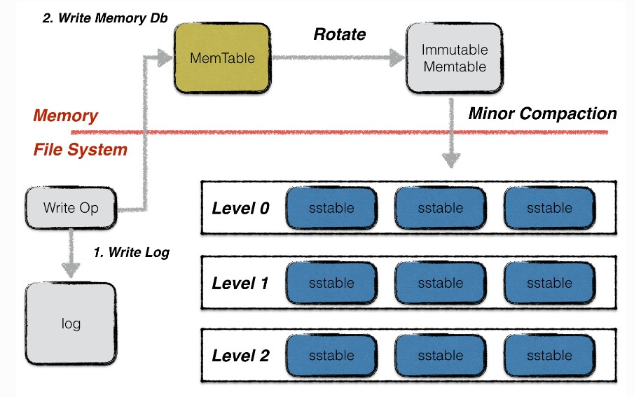
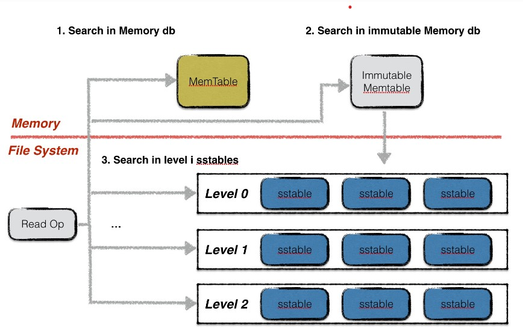

# leveldb源码阅读6 - wirte&read and log

[TOC]


## LOG

### log结构和设计

Log有Record和一些为了对其而填充的gap组成的文件。levelDB在读取Log文件时，为了减少IO次数，每次读取都会读入一个32KB大小的块。因此在写入log文件时，leveldb也将数据按照32KB对齐。

每个块中会很有多段，段的记录形式有三种：`FirstType` `Middle Fragment` `Last Fragment`。

而对于段结构：



当写入时，和32KB对其的剩余空间不足以放入7字节的header，会将剩余空间填入0X00，要继续写入。

一条日志记录的内容包含：Header和Data。其中header中有（1）当前db的sequence number（2）本次日志记录中所包含的put/del操作的个数。


### 源代码分析

#### log_writer

日志写入流程。leveldb内部实现了一个journal的writer。首先调用Next函数获取一个singlewriter，这个SingleWriter的作用就是写入一条journal记录。

**class logwriter**

```cpp
	/*提供高效的记录写入机制*/
class Writer {
 public:
  explicit Writer(WritableFile* dest);
  Writer(WritableFile* dest, uint64_t dest_length);
  Writer(const Writer&) = delete;
  Writer& operator=(const Writer&) = delete;

  ~Writer();
  Status AddRecord(const Slice& slice);
 private:
	 // 进行执行数据的物理写入，包括计算和处理记录类型。
  Status EmitPhysicalRecord(RecordType type, const char* ptr, size_t length);

  WritableFile* dest_; // 目标文件的指针，数据写入这个文件
  int block_offset_;  // Current offset in block块中的偏移量

  // crc32c values for all supported record types.  These are
  // pre-computed to reduce the overhead of computing the crc of the
  // record type stored in the header.预计算的CRC32值
  uint32_t type_crc_[kMaxRecordType + 1];
};
```

对于其中的函数：可以得出头部信息buf的格式：

```markdown
+-------------+-------------+-----------+-----------+
|CRC32（4字节）|  长度（2字节）|类型（1字节）|保留（1字节）|
+-------------+-------------+-----------+-----------+
> buf 数组的设计确保了记录的结构在物理存储中是固定的，使得在读取记录时能够快速解析出每个字段的内容。
> 这样做的好处是提高了数据的可解析性和读取效率，同时通过 CRC 校验增强了数据的可靠性。
```

对于logwrite.cc里面的文件逻辑：



#### log_reader

日志的读取也较为简单，为了避免频繁的IO读取，每次从文件中读取数据时，按block（32KiB）进行块读取。每次读取一条日志记录，reader调用Next函数返回一个singleReader。singleReader每次调用Read函数就返回一个chunk的数据。每次读取一个chunk，都会检查这批数据的校验码、数据类型、数据长度等信息是否正确，若不正确，且用户要求严格的正确性，则返回错误，否则丢弃整个chunk的数据。循环调用singleReader的read函数，直至读取到一个类型为Last的chunk，表示整条日志记录都读取完毕，返回。

**class log_reader**

```cpp
class Reader {
 public:
    ...
  
 /* 类功能
  * 读取日志记录
  * 支持检查和校验
  * 处理数据损坏
  */
 private:
  enum {
    kEof = kMaxRecordType + 1,
    kBadRecord = kMaxRecordType + 2
  };

  bool SkipToInitialBlock(); // 跳过所有initial_offset之前的块
  unsigned int ReadPhysicalRecord(Slice* result); // 读取物理记录

  // Reports dropped bytes to the reporter.报告数据损坏和丢失字节数量
  // buffer_ must be updated to remove the dropped bytes prior to invocation.
  void ReportCorruption(uint64_t bytes, const char* reason); 
  void ReportDrop(uint64_t bytes, const Status& reason);

  SequentialFile* const file_; // 指向要读取的文件指针
  Reporter* const reporter_; // 报告错误和数据损坏的接口
  bool const checksum_; // 指示是否读取时验证校验和
  char* const backing_store_; // 存储读取记录的临时缓冲区
  Slice buffer_; // 当前读取记录的切片
  bool eof_;  // 上一次读取是否到达文件末尾

  // Offset of the last record returned by ReadRecord.
  uint64_t last_record_offset_; // 保存上一次返回记录的物理偏移量
  // Offset of the first location past the end of buffer_.
  uint64_t end_of_buffer_offset_; // 缓冲区结尾的偏移量

  // Offset at which to start looking for the first record to return
  uint64_t const initial_offset_; // 指定开始查找记录的初始偏移量

  bool resyncing_; // 当前是否正在重新同步，处理随机读取
};
```

在log_writer.cc文件中

- **ReadRecord**:
  - 读取下一个记录到 `record` 中，返回 `true` 表示成功，`false` 表示到达文件末尾。
  - 处理记录类型，如完整记录、首部记录、中间记录和尾部记录，并相应地合并数据或报告损坏。
- **ReadPhysicalRecord**:
  - 从缓冲区读取物理记录，解析头部，验证长度和校验和。
  - 如果记录有效，返回其类型；如果无效，则返回 `kBadRecord`。
- **ReportCorruption 和 ReportDrop**:
  - 报告数据损坏或丢失的字节数，通过 `reporter_` 接口进行通知。

在 `ReadRecord` 方法中，通过 `ReadPhysicalRecord` 读取记录后，根据不同类型进行处理：

1. **kFullType**：表示完整记录，直接返回。
2. **kFirstType**：表示开始的部分，存储到 `scratch` 中。
3. **kMiddleType**：表示中间部分，追加到 `scratch`。
4. **kLastType**：表示记录的最后部分，合并并返回。
5. **kEof** 和 **kBadRecord**：处理文件末尾和错误记录。


## Read&Write

参考：[levelDB - handbook](https://leveldb-handbook.readthedocs.io/zh/latest/rwopt.html#section-3)

### 读写操作过程

#### 写操作

leveldb的一次写入分为两部分：

1. 将写操作写入日志；
2. 将写操作应用到内存数据库中；




##### PutAndDelete

leveldb对外提供的写入接口有：（1）Put（2）Delete两种。这两种本质对应同一种操作，Delete操作同样会被转换成一个value为空的Put操作。

除此以外，leveldb还提供了一个批量处理的工具Batch，用户可以依据Batch来完成批量的数据库更新操作，且这些操作是原子性的。

```cpp
  // Set the database entry for "key" to "value".  Returns OK on success,
  // and a non-OK status on error.
  // Note: consider setting options.sync = true.
  virtual Status Put(const WriteOptions& options, const Slice& key,
                     const Slice& value) = 0;

  // Remove the database entry (if any) for "key".  Returns OK on
  // success, and a non-OK status on error.  It is not an error if "key"
  // did not exist in the database.
  // Note: consider setting options.sync = true.
  virtual Status Delete(const WriteOptions& options, const Slice& key) = 0;

  // Apply the specified updates to the database.
  // Returns OK on success, non-OK on failure.
  // Note: consider setting options.sync = true. 执行批量操作
  virtual Status Write(const WriteOptions& options, WriteBatch* updates) = 0;

// Convenience methods
Status DBImpl::Put(const WriteOptions& o, const Slice& key, const Slice& val) {
  return DB::Put(o, key, val);
}

Status DBImpl::Delete(const WriteOptions& options, const Slice& key) {
  return DB::Delete(options, key);
}
```


##### batch结构

无论是Put/Del操作，还是批量操作，底层都会为这些操作创建一个batch实例作为一个数据库操作的最小执行单元。因此首先介绍一下batch的组织结构。


在batch中，每一条数据项都按照上图格式进行编码。每条数据项编码后的第一位是这条数据项的类型（更新还是删除），之后是数据项key的长度，数据项key的内容；若该数据项不是删除操作，则再加上value的长度，value的内容。

batch中会维护一个size值，用于表示其中包含的数据量的大小。该size值为所有数据项key与value长度的累加，以及每条数据项额外的8个字节。这8个字节用于存储一条数据项额外的一些信息。

```cpp
/*批量写入操作*/
class LEVELDB_EXPORT WriteBatch {
 public:
  ...

 private:
  /*如果将所有逻辑放在一个类中，
    任何内部修改都有可能影响公共接口。
    将内部逻辑分离，可以减少对外部接口的影响。*/
    
  friend class WriteBatchInternal;
    
  /*存储了该批次操作的具体格式和内容*/
  std::string rep_;  // See comment in write_batch.cc for the format of rep_
};

class WriteBatchInternal {
 public:
  static int Count(const WriteBatch* batch); // 计数
  static void SetCount(WriteBatch* batch, int n);

  static SequenceNumber Sequence(const WriteBatch* batch); // 序列号
  static void SetSequence(WriteBatch* batch, SequenceNumber seq);
  
  static Slice Contents(const WriteBatch* batch) {  // 内容
	  return Slice(batch->rep_); 
  }
  static size_t ByteSize(const WriteBatch* batch) {  // 字节大小
	  return batch->rep_.size(); 
  }
  static void SetContents(WriteBatch* batch, const Slice& contents);

  static Status InsertInto(const WriteBatch* batch, MemTable* memtable); // 插入

  static void Append(WriteBatch* dst, const WriteBatch* src); 
};
```

writeBatch是用户直接使用的接口，而writeBatchInternal是支撑其实现的工具类，提供底层的操作方法。

WriteBatch中有比如put，delete，clear，ApproximateSize等类似的公共接口，用户可以用其进行执行批量操作。WriteBatchInternal中存在一些关于writeBatch相关的条目数量，内部内容，将其插入内存表，实现计数和内存管理等功能的类。


##### key值编码

当数据项从batch中写入到内存数据库中时，需要将一个key值的转换，即在leveldb内部，所有数据项的key是经过特殊编码的，这种格式称为internalKey。


internalkey在用户key的基础上，尾部追加了8个字节，用于存储（1）该操作对应的sequence number（2）该操作的类型。

其中，每一个操作都会被赋予一个sequence number。该计时器是在leveldb内部维护，每进行一次操作就做一个累加。由于在leveldb中，一次更新或者一次删除，采用的是append的方式，并非直接更新原数据。因此对应同样一个key，会有多个版本的数据记录，而最大的sequence number对应的数据记录就是最新的。此外，leveldb的快照（snapshot）也是基于这个sequence number实现的，即每一个sequence number代表着数据库的一个版本。


##### 合并写

leveldb中，在面对并发写入时，做了一个处理的优化。在同一个时刻，只允许一个写入操作将内容写入到日志文件以及内存数据库中。为了在写入进程较多的情况下，减少日志文件的小写入，增加整体的写入性能，leveldb将一些“小写入”合并成一个“大写入”。

```cpp
/*批量写*/
Status DBImpl::Write(const WriteOptions& options, WriteBatch* updates) {
  Writer w(&mutex_);
  w.batch = updates;  // 写入批次
  w.sync = options.sync; // 同步标志
  w.done = false; // 完成状态

  MutexLock l(&mutex_);
  writers_.push_back(&w);
  /* 当前请求未完成并且不是队列的第一个时只能淘汰  */
  while (!w.done && &w != writers_.front()) {
    w.cv.Wait(); // 等待信号量解锁
  }
  if (w.done) {
    return w.status;
  }

  // May temporarily unlock and wait.、
  /*MakeRoomForWrite方法会根据当前MemTable的使用率来选择是否触发Minor Compaction
  （如果当前updates为空，则为Manual Compaction用来强制触发Minor Compaction的操作）。*/
  Status status = MakeRoomForWrite(updates == nullptr); // 获取空间
  uint64_t last_sequence = versions_->LastSequence(); // 获取当前序列号
  Writer* last_writer = &w; 
  if (status.ok() && updates != nullptr) {  // nullptr batch is for compactions
    WriteBatch* write_batch = BuildBatchGroup(&last_writer);
    WriteBatchInternal::SetSequence(write_batch, last_sequence + 1);
    last_sequence += WriteBatchInternal::Count(write_batch);

    // Add to log and apply to memtable.  We can release the lock
    // during this phase since &w is currently responsible for logging
    // and protects against concurrent loggers and concurrent writes
    // into mem_.
    {
        // 处理队列
      mutex_.Unlock();
      /*释放锁，write线程根据传入的writeoptions中的sync判断是否需要等待WAL同步道稳定存储*/
      status = log_->AddRecord(WriteBatchInternal::Contents(write_batch));
      bool sync_error = false;
      if (status.ok() && options.sync) {
        status = logfile_->Sync(); // 保持同步
        if (!status.ok()) {
          sync_error = true;
        }
      }
      if (status.ok()) {
          // 将其插入到mem中
        status = WriteBatchInternal::InsertInto(write_batch, mem_);
      }
      mutex_.Lock();
      if (sync_error) {
        // The state of the log file is indeterminate: the log record we
        // just added may or may not show up when the DB is re-opened.
        // So we force the DB into a mode where all future writes fail.
        RecordBackgroundError(status);
      }
    }
    if (write_batch == tmp_batch_) tmp_batch_->Clear();

    versions_->SetLastSequence(last_sequence);
  }

  // 完成后置done字段为true
  while (true) {
    Writer* ready = writers_.front();
    writers_.pop_front();
    if (ready != &w) {
      ready->status = status;
      ready->done = true;
      ready->cv.Signal();
    }
    if (ready == last_writer) break;
  }
```


##### 原子性

leveldb的任意一个写操作（无论包含了多少次写），其原子性都是由日志文件实现的。一个写操作中所有的内容会以一个日志中的一条记录，作为最小单位写入。

考虑以下两种异常情况：

1. 写日志未开始，或写日志完成一半，进程异常退出；
2. 写日志完成，进程异常退出；


#### 读操作

leveldb提供给用户两种进行读取数据的接口：

1. 直接通过`Get`接口读取数据；
2. 首先创建一个snapshot，基于该snapshot调用Get接口读取数据；

由于两种方式本质都是基于快照进行读取的，因此在介绍读操作之前，首先介绍快照。


##### 快照

快照代表着数据库某一个时刻的状态，在leveldb中，作者巧妙地用一个整型数来代表一个数据库状态。

在leveldb中，用户对同一个key的若干次修改（包括删除）是以维护多条数据项的方式进行存储的（直至进行compaction时才会合并成同一条记录），每条数据项都会被赋予一个序列号，代表这条数据项的新旧状态。一条数据项的序列号越大，表示其中代表的内容为最新值。

```cpp

const Snapshot* DBImpl::GetSnapshot() {
  MutexLock l(&mutex_);
  return snapshots_.New(versions_->LastSequence());
}

void DBImpl::ReleaseSnapshot(const Snapshot* snapshot) {
  MutexLock l(&mutex_);
  snapshots_.Delete(static_cast<const SnapshotImpl*>(snapshot));
}

```


##### 读取

leveldb读取分为三步：

1. 在memory db中查找指定的key，若搜索到符合条件的数据项，结束查找；

2. 在冻结的memory db中查找指定的key，若搜索到符合条件的数据项，结束查找；

   在memory和Immutable MemTable上的查找都是在`SkipList`上的查找，这里不再赘述。

3. 按低层至高层的顺序在level i层的sstable文件中查找指定的key，若搜索到符合条件的数据项，结束查找，否则返回Not Found错误，表示数据库中不存在指定的数据；

   在sst中的查找是在current version的`Version::Get`上实现的。



`DBImpl::Get`这个函数主要用于从数据库中获得指定键的值。

在它的函数中，首先会寻找快照或者versions_的序列号，这是为了实现MVCC中的一致性存储。

然后先后在mem当前内存表，imm不可变内存表，current的sstable文件中查找。

> 这里面会用到cache。
>
> 1. **查找数据块**：当 `Get` 操作试图从 SSTable 中读取数据时，如果目标数据块已经被缓存，LevelDB 会直接从缓存中读取，而不是访问磁盘。这可以显著提高读取性能。
> 2. **序列号查找**：在使用快照（snapshot）或版本号时，LevelDB 会使用缓存来加速对特定版本数据的查找，避免多次读取相同数据块。
> 3. **合并读取**：在合并操作（如从多个 SSTable 读取）时，LevelDB 也会优先检查缓存，以减少磁盘 I/O。

当进行多次数据读取时，读取操作会影响一些统计信息的更新，比如数据的访问频率，那么LRU cache中的数据块的位置会发生改变，也会影响到层级中的数据分布；还有删除操作显示减少数据块；频繁插入也会导致memtable增多，因此会调用`MaybeScheduleCompaction();`决定是否压缩。
