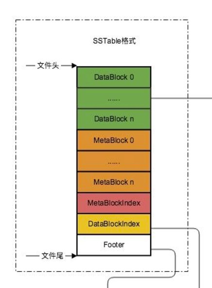
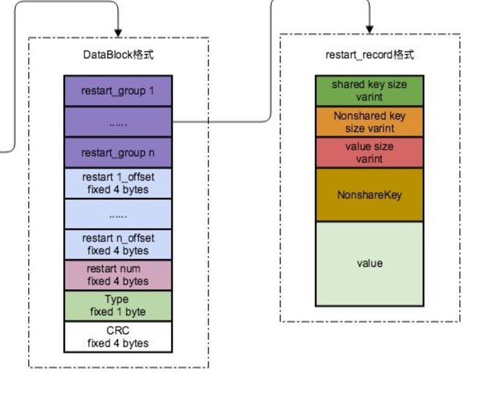
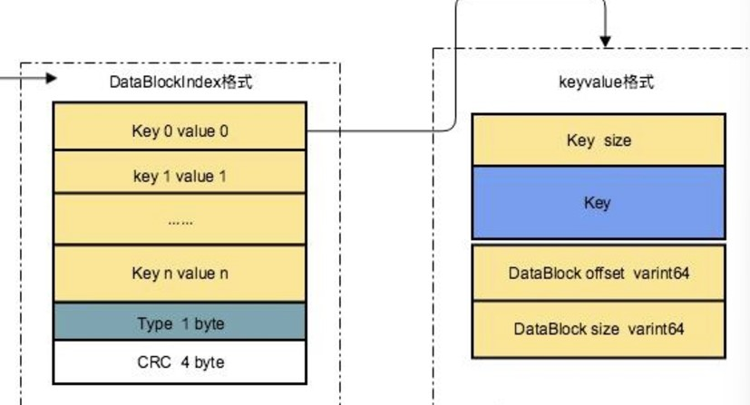
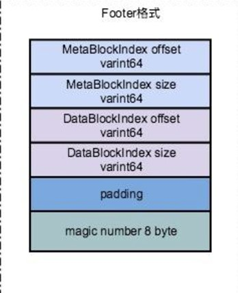

# 详谈`leveldb`中的`sstable`

惊讶的发现我之前看`leveldb`的时候没怎么仔细看这一部分），估计是看到后面懒了，现在补补。


**先讲讲`sstable`在`·leveldb·`中的位置**

(`sstable`全名`Sorted String Table`)

在`leveldb`中，当将`memory db`的数据持久化文件中时，`leveldb`会以一定的规则进行文件组织，文件格式变为`sstable`。

查询时，一般会通过`footer`先在`meta block`中利用`bloom filter`查询，如果不存在则直接返回，减少了磁盘IO。

正式读取数据块中的数据时，通过``footer`加载相应的过滤快和数据块的数据到达内存，为内存分配一个`cache_id`，读取数据的同时会拼接`cache_id`和`block`的偏移量作为`blockcache`的`key`。


##### **正文开始：`sstable`的格式**

)

其中分为五个部分，

`DataBlock`中存储数据，也就是键值对，那么为什么会分成n个，里面的`schema`是什么样子的。

`MetaBlock`其中存储布隆过滤器的数据，如何存储的？

`XXXIndex`中存放相关的索引，便于寻找；`Footer`中存放索引在整个`stable`中的偏移量。


**知道大致结构后，接下来看看具体的每个模块**

###### `DataBlock`

对于这个块，如果想要增加一个键值对，要求`key`必须比之前的所有键都大，同时需要在完成整个块之前构建。

我们能够在`private`中观察到一个存放上一个键的字符串，这是因为添加键值对时，首先需要计算当前键和上一个键的公共长度进行前缀压缩；然后将公共长度，剩余长度，键的内容添加到数据块中；如果达到重启间隔，记录重启点到`restart_offset`中同时清空计数器。

`BlockBuilder` 的缓冲区 `buffer_` 和 `DataBlock` 直接对应。它负责在内存中构建 `DataBlock` 的完整内容并序列化，最后在调用 `Finish()` 时，将完整的二进制块返回，供 `SSTable` 文件写入或查询使用。

对于使用缓冲区的原因在于，如果频繁的对`sstable`写入磁盘的IO操作，是极为低效的，因此也解释了为什么finish之后不能再添加键值对。其次，重启点的偏移量只有再完成一个块的组织之后才能确立，因此也只能计算完所有偏移量之后统一添加到缓冲区末尾。

**关键点：**

- 前缀压缩

  `BlockBuilder` 在添加键值对时，使用 **前缀压缩** 技术将键值对序列化到 `buffer_` 中，每个记录包含：

  - **公共前缀长度**（shared key length）。

  - **剩余键长度**（non-shared key length）。

  - **剩余键内容**（key delta）。

  - **值长度**（value length）。

  - **值内容**（value data）。

- 重启点机制

  重启点是为了支持快速查找而设计的，通常每隔固定数量的键值对（如 16 个）插入一个重启点。

- 缓冲区设计，在整个构建完全之后，才会将`buffer`的内容写入`sstable`

  ```sql
  +-----------------------------+
  | 序列化的键值对数据         |  <-- 对应 `buffer_` 的前半部分
  +-----------------------------+
  | 重启点偏移量数组           |  <-- 对应 `restarts_`
  +-----------------------------+
  | 重启点数量（整数）         |  <-- 对应 `restarts_.size()`
  +-----------------------------+
  ```



###### `MetaBlock`

占用1个`block空间`

```sql
+-----------------------------------+
| 过滤器或属性信息数据（元数据）         |  <-- 由过滤器模块或属性模块构造
+-----------------------------------+
| 重启点偏移量数组                     |  <-- 用于快速定位过滤器索引
+-----------------------------------+
| 重启点数量（整数）                   |  <-- 指示重启点偏移量的个数
+-----------------------------------+
```


###### `DataBlockIndex`

占用1个`block空间`。**`DataBlockIndex`** 是用来加速数据块（`DataBlock`）查找的重要结构，它存储了 **键与数据块的映射关系**，用于快速定位键所属的 `DataBlock`。

```sql
+-------------------------------+
| Key_1 | Offset_1 | Size_1    |  <-- 指向第 1 个 DataBlock
+-------------------------------+
| Key_2 | Offset_2 | Size_2    |  <-- 指向第 2 个 DataBlock
+-------------------------------+
| ...                           |
+-------------------------------+
| Key_n | Offset_n | Size_n    |  <-- 指向第 n 个 DataBlock
+-------------------------------+
```




###### `MetaBlcokIndex`

`MetaBlockIndex` 是 **元数据块索引**，用于存储和快速定位 `**MetaBlock`（元数据块）** 的信息。它的作用类似于 `DataBlockIndex`，但索引的对象不是普通的键值数据块，而是存储元数据的 `MetaBlock`。

```sql
+-------------------------------+
| MetaBlock_Name_1 | Offset_1 | Size_1 | <-- 第 1 个 MetaBlock 索引
+-------------------------------+
| MetaBlock_Name_2 | Offset_2 | Size_2 | <-- 第 2 个 MetaBlock 索引
+-------------------------------+
| ...                           |
+-------------------------------+
| MetaBlock_Name_n | Offset_n | Size_n | <-- 第 n 个 MetaBlock 索引
+-------------------------------+
```


###### `Footer`

固定48字节，位于文件底部.**`Footer`** 是 `**SSTable**` 文件的最后部分，包含一些 **元信息**，用于指示文件中其他重要结构的位置。`Footer` 是整个 `SSTable` 文件结构的关键组成部分，因为它提供了访问文件中数据块、索引块和元数据块的指针。

```sql
+-------------------+
| DataBlockIndex    |  <-- 指向 DataBlockIndex 的偏移量
+-------------------+
| MetaBlockIndex    |  <-- 指向 MetaBlockIndex 的偏移量
+-------------------+
| Footer Size       |  <-- Footer 自身的大小
+-------------------+
```




##### 最后，**`SSTable` 文件解析流程（以 `Footer` 为入口）**

1. 读取 `Footer`
   - 打开 `SSTable` 文件，读取最后 48 字节（`Footer`）。
   - 从中获取 `DataBlockIndex` 和 `MetaBlockIndex` 的位置。
2. 读取索引块
   - 根据 `Footer` 提供的偏移量，读取 `DataBlockIndex` 和 `MetaBlockIndex`。
3. 读取数据和元数据块
   - 使用 `DataBlockIndex` 定位到包含键值对的 `DataBlock`。
   - 使用 `MetaBlockIndex` 定位到包含元数据（如 Bloom Filter）的 `MetaBlock`。
4. 查询与处理
   - 通过索引信息，快速定位需要的数据块，进一步进行查询操作。


参考链接：

1. [浅析`RocksDB`的`SSTable`格式](https://zhuanlan.zhihu.com/p/37633790)