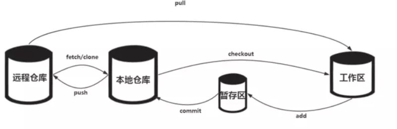

# git

[Learn Git Branching](https://learngitbranching.js.org/?locale=zh_CN&NODEMO=)


## git and SVN

`git`属于开源的分布式版本控制系统，`SVN`是一个集中式版本控制系统。

具体差别可以看看这篇文章：[集中式vs分布式 - Git教程 - 廖雪峰的官方网站](https://liaoxuefeng.com/books/git/what-is-git/svn-vs-git/index.html)


## git 分区

`working directory`：计算机上的项目目录。

`staging area`：临时存储区域，即将提交到版本库中的文件快照。

`reposity`：本地版本库。




## git 命令

### 当想要将本地项目的提交推送到远程Git仓库时

`git init`初始化本地项目仓库。

`git remote add origin <远程仓库URL>`添加**远程仓库**

`git add .`添加所有提交的文件到**暂存区**

`git commit -m "提交信息"`提交暂存区的更改

`git push origin main`将**本地仓库**提交推送到**远程仓库**


### 其它命令

`git checkout`撤销本地仓库中工作区的修改

`git clone <repo>`克隆仓库

`git remote -v origin git@github.com...git`将抓取而已推送的`orgin`地址

`git status`查看状态


## 容易发生的问题

### 本地分支落后远程分支

1. `git push origin main --force` 强制推送，但是会直接覆盖远程分支的内容

2. 先从远程拉取到工作区再推送
   - `git pull origin main`
   - `git push origin main`


### 本地分支和远程分支存在分歧

1. **使用合并（默认策略）**：

```bash
git config pull.rebase false
git pull origin main
```

2. **使用变基**：

```bash
git config pull.rebase true
git pull origin main
```

3. **仅允许快进合并**：

```bash
git config pull.ff only
git pull origin main
```


## Reference

1. [看完这篇还不会用Git，那我就哭了！ - 知乎](https://zhuanlan.zhihu.com/p/94008510)
2. [Git| 菜鸟教程](https://www.runoob.com/git/git-workspace-index-repo.html)
3. [Git教程 - 廖雪峰的官方网站](https://liaoxuefeng.com/books/git/time-travel/delete/index.html)

