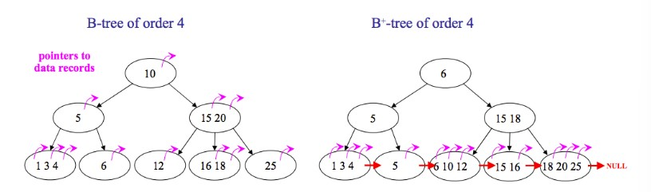
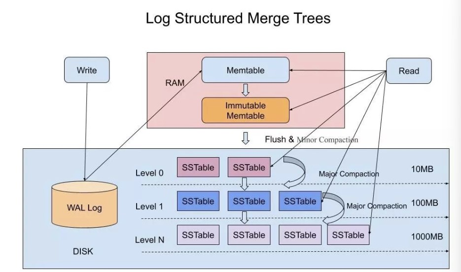

## B+ tree

mysql，能够很好的组织磁盘数据。一般用B+树存储索引数据。结点映射相邻的磁盘页

（从磁盘中读取数据的时候，需要经过内核，系统调用，读取一个字节时会返回一页的数据）

> B+树和红黑树的区别

- 红黑树 平衡二叉搜索树 平衡规则在于从根节点到叶子结点所拥有的黑色结点数相同 查找时间复杂度O(logn)

- B+/B树 多路平衡搜索树

  - B+树（数据只存储在叶节点中）没有与内部结点关联的数据，一页内存中可以容纳更多的键，访问叶节点上的数据所需的缓存未命中次数更少。

    叶结点之间相互链接，对树种所有对象进行全面扫描只需要线性遍历所有叶节点。B树则要遍历每一层，这可能存在更多的缓存未命中

  - B树包含每个键的数据，经常访问的结点更靠近跟，可以更快访问

由于多路平衡一般树高度不高，”矮胖“类型，层高也同时代表着磁盘IO的次数

降低磁盘IO方法：

1. 减少次数
2. 转化为顺序IO（能访问同一页的次数，减少频繁访问磁盘）

数据库查询方式：

- 单点查询
- 范围查询

**就地更新的数据结构**

## 时间轮

https://juejin.cn/post/7083795682313633822

海量定时任务检测，多线程环境下定时器的设计。

> **时间轮** 是一种 **实现延迟功能（定时器）** 的 **巧妙算法**。如果一个系统存在大量的任务调度，时间轮可以高效的利用线程资源来进行批量化调度。把大批量的调度任务全部都绑定时间轮上，通过时间轮进行所有任务的管理，触发以及运行。能够高效地管理各种延时任务，周期任务，通知任务等

定时器

1. 时间序，按照过期时间排序
2. 执行序 指针数组，时间指针

分为时针，分针，秒针；每个小时都会有时针层级的任务重新映射到分针层级，每分钟都会有分针层级的任务重新映射到秒针层级，每秒钟都会取出当前任务执行。

## 跳表

高并发有序存储https://www.jianshu.com/p/9d8296562806

1. 跳表是可以实现二分查找的有序链表；
2. 每个元素插入时随机生成它的level；
3. 最底层包含所有的元素；
4. 如果一个元素出现在level(x)，那么它肯定出现在x以下的level中；
5. 每个索引节点包含两个指针，一个向下，一个向右；（笔记目前看过的各种跳表源码实现包括Redis 的zset 都没有向下的指针，那怎么从二级索引跳到一级索引呢？留个悬念，看源码吧，文末有跳表实现源码）
6. 跳表查询、插入、删除的时间复杂度为O(log n)，与平衡二叉树接近；

## LSM Tree

更高写性能以及更高空间利用率的数据存储结构https://cloud.tencent.com/developer/article/1441835

LSM-Tree全称是Log Structured Merge Tree，是一种分层，有序，面向磁盘的数据结构，其核心思想是充分了利用了，磁盘批量的顺序写要远比随机写性能高出很多。这种结构虽然大大提升了数据的写入能力，却是以牺牲部分读取性能为代价，故此这种结构通常适合于写多读少的场景。

SSTable是一种拥有持久化，有序且不可变的的键值存储结构，它的key和value都是任意的字节数组，并且了提供了按指定key查找和指定范围的key区间迭代遍历的功能。SSTable内部包含了一系列可配置大小的Block块，典型的大小是64KB，关于这些Block块的index存储在SSTable的尾部，用于帮助快速查找特定的Block。当一个SSTable被打开的时候，index会被加载到内存，然后根据key在内存index里面进行一个二分查找，查到该key对应的磁盘的offset之后，然后去磁盘把响应的块数据读取出来。当然如果内存足够大的话，可以直接把SSTable直接通过MMap的技术映射到内存中，从而提供更快的查找。 

如果SSTable的分层越多，那么最坏的情况下要把所有的分层扫描一遍，对于这种情况肯定是需要优化的，如何优化？在 Bigtable 论文中提出了几种方式：

1，压缩

SSTable 是可以启用压缩功能的，并且这种压缩不是将整个 SSTable 一起压缩，而是根据 locality 将数据分组，每个组分别压缩，这样的好处当读取数据的时候，我们不需要解压缩整个文件而是解压缩部分 Group 就可以读取。

2，缓存

因为SSTable在写入磁盘后，除了Compaction之外，是不会变化的，所以我可以将Scan的Block进行缓存，从而提高检索的效率

3，索引，Bloom filters

正常情况下，一个读操作是需要读取所有的 SSTable 将结果合并后返回的，但是对于某些 key 而言，有些 SSTable 是根本不包含对应数据的，因此，我们可以对每一个 SSTable 添加 Bloom Filter，因为布隆过滤器在判断一个SSTable不存在某个key的时候，那么就一定不会存在，利用这个特性可以减少不必要的磁盘扫描。

4，合并

这个在前面的写入流程中已经介绍过，通过定期合并瘦身， 可以有效的清除无效数据，缩短读取路径，提高磁盘利用空间。但Compaction操作是非常消耗CPU和磁盘IO的，尤其是在业务高峰期，如果发生了Major Compaction，则会降低整个系统的吞吐量，这也是一些NoSQL数据库，比如Hbase里面常常会禁用Major Compaction，并在凌晨业务低峰期进行合并的原因。

LSM-Tree的设计思路是，将数据拆分为几百M大小的Segments，并是顺序写入。

B+Tree则是将数据拆分为固定大小的Block或Page, 一般是4KB大小，和磁盘一个扇区的大小对应，Page是读写的最小单位。