# MyTinySTL


> [!NOTE]
>
> 学习基础：C++基础知识，数据结构和算法，C++新特性，模板元编程
>
> 参考书籍：STL源码剖析
>

根据阅读代码方法，文章会重点说明1. 各代码间的逻辑；2. 各模块的实现方式（细化，了解流程语法）


## STL源码剖析

### STL六大组件：

**containers，algorithm，**

**iterator：**扮演容器和算法之间的胶合剂，是所谓的“泛型指针”。

**functors**：行为类似函数，可作为算法的某种策略

**adapters**：修饰容器或者仿函数或者迭代器接口的东西

**allocators**：负责空间配置和管理

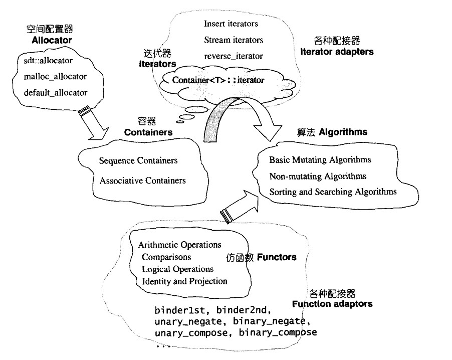


## 代码结构：

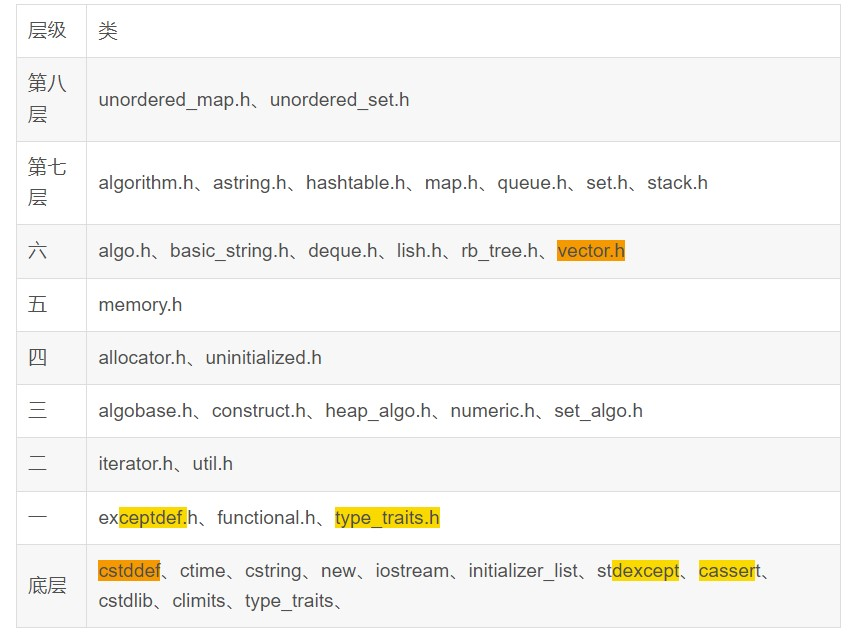


allocator和iterator这部分有个作者专栏也讲了，可以看看，链接如下：[MyTinySTL源码学习 - LetMETalK的专栏 - 掘金 (juejin.cn)](https://juejin.cn/column/7101233014914416677)

### allocator：主要用于空间的配置和清理

> 包括了 `allocator` 和 `constructor`，分别定义在 [allocator.h](https://github.com/Alinshans/MyTinySTL/blob/master/MyTinySTL/allocator.h) 和 [construct.h](https://github.com/Alinshans/MyTinySTL/blob/master/MyTinySTL/construct.h) 中。
> **`allocator` 负责空间的配置与回收**，定义了一个类 **`mystl::alloc` 用于管理内存**，定义在 [alloc.h](https://github.com/Alinshans/MyTinySTL/blob/master/MyTinySTL/alloc.h) 。
> `constructor` 负责对象的构造与析构，对应两个全局函数： `construct` 和 `destroy`。

**allocator**是一种特定的内存模型，将对内存的所求转为对内存的调用。用于实现内存的分配和挥手以及对象的构造和销毁。

```markdown
allocator.h --- construct.h --- type_traits.h
                            --- iterator.h
            --- util.h      --- type_traits.h
```

**流程：**

#### allocator.h


> 这个是SGI标准的空间配置器，一般不建议使用，只要是因为效率不佳。
>
> 包括在源码中，也只是对::operator new和::operator delete做一层薄薄的包装。

- 分配内存allocate
- 释放内存deallocate
- 构造对象construct
- 销毁对象destory

采用::operator new和::operator destory进行内存的分配和释放（全局的operator new和operator destory函数，用于分配内存和销毁内存）

采用`mystl::construct`和`mystl::destory`进行对象的构造和销毁（mystl是改代码设置的命名空间）

###### 完美转发，forward

```cpp
template <class T>
template <class ...Args>
 void allocator<T>::construct(T* ptr, Args&& ...args)
{
     // 可变模板参数的通用引用，不确定是左值还是右值
     /*完美转发，保留参数的值类别（左值或右值），
        从而确保在调用目标函数时能正确地传递原始参数的语义。*/
  mystl::construct(ptr, mystl::forward<Args>(args)...);
}
```

###### 右值引用T&&，移动语义move

```cpp
template <class T>
 void allocator<T>::construct(T* ptr, T&& value)
{
     /*T&&是右值引用，表示找打一个可以移动的对象，窃取临时对象的资源
        move是一种显示的移动语义，可以安全的将value的值转移，不需要额外拷贝*/
  mystl::construct(ptr, mystl::move(value));
}
```


#### construct.h

> 该头文件中包含了对allocator.h中关于对对象的构造和销毁的两个函数的实现。

**construct：**在已经分配的内存上构造对象

**destory：**

该函数有两个版本，1.直接释放内存 2.释放first和last之间的内存

同时注意销毁时要区分是**平凡析构函数还是非平凡析构函数**`is_trivially_destructible`，前者编译器自动调用，后者需要手动调用。


#### util.h

包含一些通用的工具，比如move，forward，swap等函数

###### move

```cpp
/*自定义实现move，也就是将左值或者右值转换层右值引用，从而启动移动语义*/
template <class T>
typename std::remove_reference<T>::type&& move(T&& arg) noexcept
{
    /*noexcept表明这个函数不会抛出异常，
    因为move这样的函数常用于性能优化，需要保证不会因为异常带来额外开销*/
    /*强制类型转换将传入的对象视为右值，允许对象移动，而不是复制*/
    return static_cast<typename std::remove_reference<T>::type&&>(arg);
}
```

###### forward

```cpp
/*完美转发：
根据传入参数的类型，保持左值为左值，右值为右值*/
template <class T>
T&& forward(typename std::remove_reference<T>::type& arg) noexcept
{
    // 折叠，转发引用
  return static_cast<T&&>(arg);
}
```

###### swap

移动语义和完美转发实现tmp

###### 这份代码后边部分就是跟container有关，因此这里不写，见后


#### type_traits.h

1.定义了编译器常量结构体，用他的类型别名表示布尔常量，实现了编译器常量的类型封装，有助于写出安全高效的代码。

- 编译器常量不可变
- 类型萃取，模板特化
- 条件编译
- 静态类型检查

2.通过模板特化机制定义一个类型特征 `is_pair`，用于判断一个类型是否为 `mystl::pair` 类型。

   这种类型特征和模板特化机制，您可以在编译期检测类型特性并做出相应的决策。这在模板编程中非常有用，可以使得模板代码更加灵活和强大，同时提高类型安全性。


#### allo.h

该部分对于空间的配置分为两部分，一级配置器和二级配置器。

**一级配置器**处理大且不频繁的内存分配需求，一般采用malloc或者直接调用系统接口。

**二级配置器**处理小块内存分配，采用内存池和freelist机制，见下图。

```cpp
/*union 的使用使得同一个内存块可以在不同状态下（空闲或已分配）分别作为指向下一个块的指针或存储数据的区域，实现了内存的高效管理。*/
union FreeList 
{
  union FreeList* next;  // 指向下一个区块
  char data[1];          // 储存本块内存的首地址
};
```


> Q：为什么要区分一级二级配置器，一级中的malloc也能分配小内存啊？
>
> A：malloc的设计是通用的，它需要处理不同大小的内存块，并且申请内存时可能会调用操作系统的内存管理接口，比如brk，mmap等，这些调用会降低程序的性能，并且小块可能导致内存碎片。

（该图仅供参考理解，不够准确）

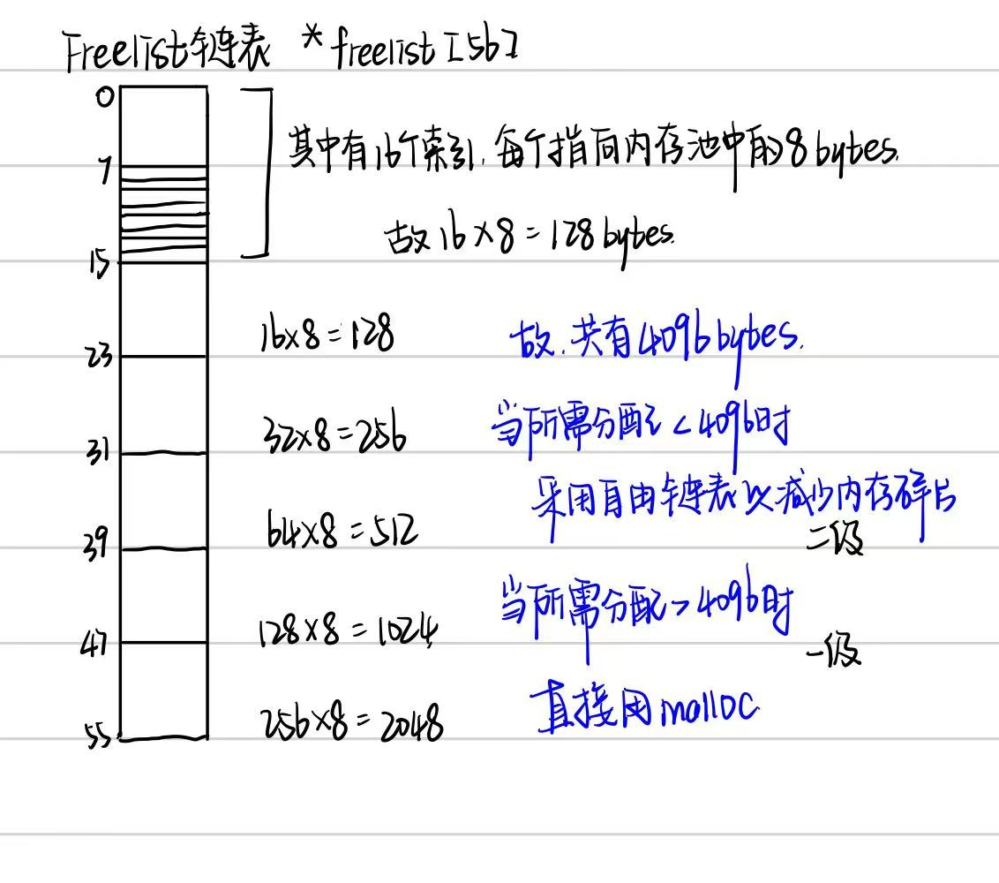

SGI对alloc.h的设计哲学为：

- 向system heap要求空间
- 考虑多线程的状态
- 考虑内存不足的应对措施
- 考虑过多小型区块可能造成的内存碎片

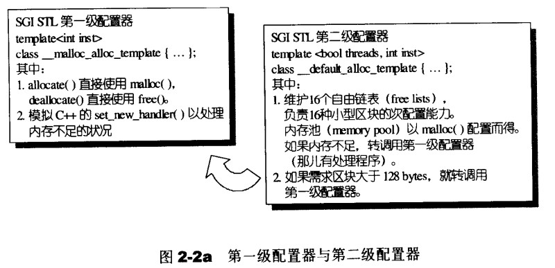

> [!NOTE]
>
> 这部分的源码没有考虑多线程的状态，可以加些锁或者互斥量之类的。
>
> 同样，项目中的aloc.h这部分并没有考虑一二级配置器的区分，而是写在一起。并且没有考虑一级配置器失败后的处理。

##### 剖析一级配置器

一级配置器主要采用malloc(), free(), realloc()等c函数执行实际的内存配置，释放，重配置等操作。实现类似C++ new-handler的机制，但不是使用::operator new配置的内存。

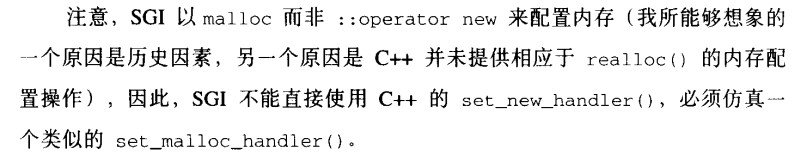

如果一级配置器不成功，该调用omm_malloc()和omm_realloc()，两者都有内循环，不断调用“内存不足处理例程”，期望在某次调用之后获取足够的内存完成任务。两个函数的逻辑相同，下面以其中一个为例：

```cpp
void * _malloc_alloc_template<inst>::omm_malloc(size_t n)
{
    void (* my_malloc_handler)();
    void *result;
    
    for(;;){
        // 不断尝试释放配置，再释放再配置
        // 调用处理例程，企图释放内存
        // 再次尝试配置内存
        my_malloc_handler = _malloc_alloc_omm_handler;
        if(0==my_malloc_handler){_THROW_BAD_ALLOC;}
        result = malloc(n);
        if(result) return (result);
    }
}
```


##### 剖析二级配置器

第二级多了些机制，避免小额区带来的内存碎片。因此在配置区块超过128bytes时，采用一级配置器allocator.h, 当配置区块小于128bytes时，为了降低额外负担，会采用memory pool的方式。

这是为其配置的一些函数：

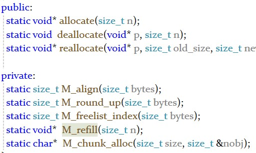

**M_align**内存对齐，**M_round_up**上调到对应区间大小，**M_freelist_index**寻找索引。

这以上几个函数都是对链表和内存池进行操作，看懂内存池和链表关系就不难写出来。

**M_chunk_alloc**：从内存池中取出空间给freelist，分出n个大小为size的block

```cpp
 内存池剩余空间完全满足需求量
 不能完全满足需求量，但是可以供应一个以上的区块
 一个区块的大小都不能提供
   将剩余空间编入
   配置堆空间补充内存池
   检视我们有的，调整尚未用的区块
   递归
```

**M_refill：给定块大小的内存块重新填充**

申请新的内存块，当它没有可用内存时，M_refill调用M_chunk_alloc获取内存

将内存块分割，一块给调用者，其余存入freelist用链表管理

在需要分配时直接从 `freelist` 中取出，减少了 `malloc` 的调用开销，从而提高程序的性能。


#### memory.h

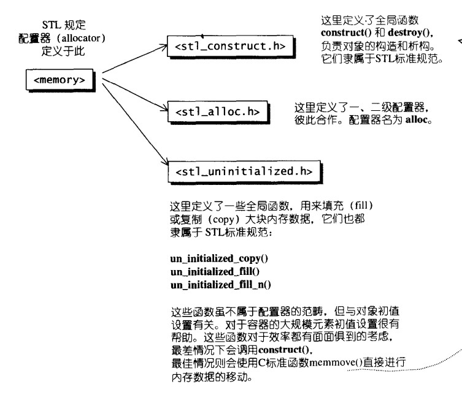


#### unintialized.h 内存基本处理工具

> 该部分主要对于未初始化的空间构造函数
>
> 分为五个部分，uninitialized_copy, uninitialized_fill, uninitialized_fill_n, unintialized_move, uninitialized_move_n

在这个.h中的各个处理未初始化内存块的工具函数，如何高效的在其中构造对象，取决于对象的类型是否是POD类型。

- 是POD类型时。可以直接用低级别的内存操作比如memcpy等快速初始化，优化内存管理
- 不是POD类型，必须调用对象的构造函数正确初始化对象，非POD类型的对象往往需要复杂的生命周期管理，比如析构，移动构造等，注意到正确的调用这些函数以确保内存安全。

将内存的配置和对象的构造分开

**注：C++ standard：uninitialized_copy要么构造出所有必要元素，要么不构造任何东西**

##### uninitialized_copy  uninitialized_fill

##### uninitialized_fill_n

这几个构造的思路是类似的，都是设置三个函数

```cpp
template <class InputIter, class ForwardIter>
ForwardIter /*可平凡赋值*/
unchecked_uninit_copy(InputIter first, InputIter last, ForwardIter result, std::true_type);
ForwardIter /*不是可平凡赋值*/
unchecked_uninit_copy(InputIter first, InputIter last, ForwardIter result, std::false_type);
ForwardIter /*对传入的类型进行判断*/
uninitialized_copy(InputIter first, InputIter last, ForwardIter result);
```


### iterator

> `iterator`，连接着容器与算法，是一种`泛型指针`，定义在 [iterator.h](https://github.com/Alinshans/MyTinySTL/edit/master/MyTinySTL/iterator.h) 中。每个容器都附带专属的迭代器，是一种重载了 `operator*`，`operator->`，`operator++`，`operator--` 等操作的模板类。

（这里面有一些生疏的概念，看着好困难。。。）

> [!TIP]
>
> Q：迭代器的associated type是什么？
>
> A：associated type是为迭代器提供统一接口的基础。通过这些类型，c++能够对不同容器和数     据结构中的元素进行统一操作。
>
> 以`std::vector<int>::iterator it`为例
>
> - **iterator_category**：迭代器的种类（输入迭代器，输出迭代器，前向迭代器，双向迭代器，随机访问迭代器）
>
>   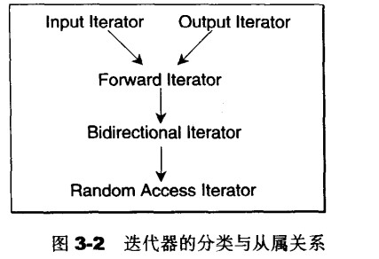
>
> - **value_type**：迭代器所指容器中元素的类型，也就是`int`。
>
> - **difference_type**：迭代器距离范围对应的类型，一般是内置类型ptrdiff_t有符号整数。
>
> - **reference**：迭代器所指容器中元素的引用类型。
>
>   c++中，函数如果传回左值，便以by reference的方式进行
>
>   p为mutable iterators，它的value_type为T，*p的型别就是T&
>
>   p为constant iterators，它的value_type为T，*p的型别就是const T&
>
>   *p就是所谓的reference type
>
> - **pointer**：迭代器所指容器中元素的指针类型。
>
> Q：模板偏特化是什么？class iterator, native pointer, const native pointer是什么？
>
> **偏特化**就是对模板进行部分特化的机制。
>
> 类迭代器常见于标准容器中；原生指针是一种内置指针类型，支持指针算术操作，可以作为高效的迭代器用于数组或者连续内存区域；常量原生指针是一种常量指针。
>
> Q：迭代器如何做到把容器和算法联系起来的？

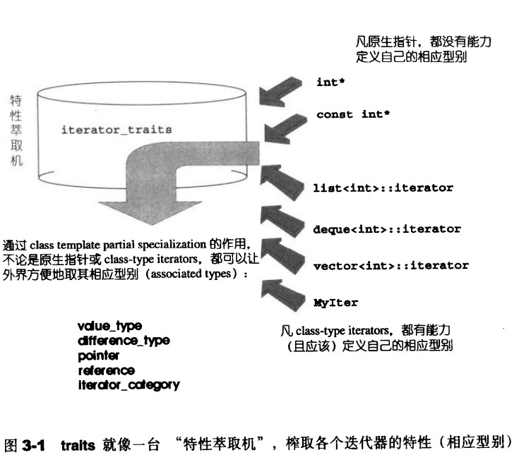

#### iterator.h

迭代器是一种行为类似指针的对象，而指针的各种行为中最常见也最重要的是内容提领和成员访问，因此，迭代器最重要的编程工作就是对operator*和oerator->进行重载工作。

代码结构分析：

首先是**五个内嵌相应的型别**：

```cpp
template <class Category, class T, class Distance = ptrdiff_t,
  class Pointer = T*, class Reference = T&>
  struct iterator
{
  typedef Category       iterator_category;
  typedef T                    value_type;
  typedef Pointer          pointer;
  typedef Reference      reference;
  typedef Distance        difference_type;
};
```

**定义五种迭代器种类**，提前设计，使用类萃取，可以在编译时选择正确的版本

```cpp
// 迭代器种类，iterator_category
    /*提前设计便于编译，如果在运行期再选择哪种迭代器，会影响程序效率，
    最好能在编译器就选择正确的版本*/
struct input_iterator_tag {};
struct output_iterator_tag {};
struct forward_iterator_tag : public input_iterator_tag {};
struct bidirectional_iterator_tag : public forward_iterator_tag {};
struct random_access_iterator_tag : public bidirectional_iterator_tag {};
```

**iterator_traits_impl**类，核心思想在于将类型信息和行为封装到独立的模板之中，编译时检查，提取用户类型的相关信息。

```cpp
template <class Iterator, bool>
struct iterator_traits_impl {};
/*提取用户自定义类型的相关信息*/
template <class Iterator>
struct iterator_traits_impl<Iterator, true>
{
  typedef typename Iterator::iterator_category iterator_category;
  typedef typename Iterator::value_type        value_type;
  typedef typename Iterator::pointer           pointer;
  typedef typename Iterator::reference         reference;
  typedef typename Iterator::difference_type   difference_type;
};
```


**has_iterator_cat**类利用SFINAE规则，使编译器根据迭代器有/没有iterator_catefory类型成员，分别送入两个test函数，这两个test函数并不会执行，而是在编译期间，通过test函数的返回值判断迭代器进了哪个函数，从而判断迭代器有没有iterator_category类。

**iterator_traits_helper**类进行迭代器类型萃取，主要依赖于偏特化和SFINAE技术，观察其迭代器是否是输入或者输出迭代器。

在iterator_traits_helper的第二个参数就是判断是否有iterator_catefory类型成员，因此以上两个类可以嵌套使用，达成一个萃取迭代器**iterator_traits**，同时针对原生指针，常量指针，类指针进行一个偏特化版本。

```cpp
template <class Iterator>
struct iterator_traits : public iterator_traits_helper<Iterator, has_iterator_cat<Iterator>::value> {};

template <class T>
struct iterator_traits<T*>{...};// 省去的部分也用来提取用户的自定义类型

template <class T>
struct iterator_traits<const T*>{...};
```


**has_iterator_cat_of**类用来判断一个迭代器可否被视为输入迭代器、输出迭代器、双向迭代器、或者随机访问迭代器，编译时确立迭代器类型。

```cpp
template <class T, class U, bool = has_iterator_cat<iterator_traits<T>>::value>
struct has_iterator_cat_of : public m_bool_constant<std::is_convertible<typename iterator_traits<T>::iterator_category, U>::value>{};//这里面的m_bool_constant的实现在type_traits.h种实现的
```

后面会通过类型萃取技术，基于前面的 `has_iterator_cat_of` 模板类，判断 `Iter` 迭代器是否具有某种迭代器属性，针对不同的类型进行不同的操作。

```cpp
// 萃取某种迭代器
template <class T, class U>
struct has_iterator_cat_of<T, U, false> : public m_false_type {};

template <class Iter>
struct is_input_iterator : public has_iterator_cat_of<Iter, input_iterator_tag> {};

template <class Iter>
struct is_output_iterator : public has_iterator_cat_of<Iter, output_iterator_tag> {};

template <class Iter>
struct is_forward_iterator : public has_iterator_cat_of<Iter, forward_iterator_tag> {};

template <class Iter>
struct is_bidirectional_iterator : public has_iterator_cat_of<Iter, bidirectional_iterator_tag> {};

template <class Iter>
struct is_random_access_iterator : public has_iterator_cat_of<Iter, random_access_iterator_tag> {};

template <class Iterator>
struct is_iterator :
  public m_bool_constant<is_input_iterator<Iterator>::value || is_output_iterator<Iterator>::value>{};
```

这个采用了type_traits的技法，核心在**于定义一些typedef，它的值不是true_type就是false_type，通过它我们就可以知到任意型别拥有哪些特性**。将判别类在编译期间通过模板函数对object反向推导，怕毛短迭代器种类等融合其对象的特性。


萃取迭代器category,  difference_type,  value_type,类似于下面，其它略。

```cpp
// 萃取某个迭代器的 category
template <class Iterator>
typename iterator_traits<Iterator>::iterator_category
iterator_category(const Iterator&)
{...};
```

萃取distance_dispatch，这个要采取**标签分发**机制，对于不同的迭代器有不同的计算方式。

利用iterator_category种的五个编辑类，让他们有继承关系，在利用萃取出来的迭代器选择重载函数，这样就能达到优先效率，选择最合适的函数调用。


同样还有advance_dispatch,也就是对于不同的迭代器的不同版本实现。


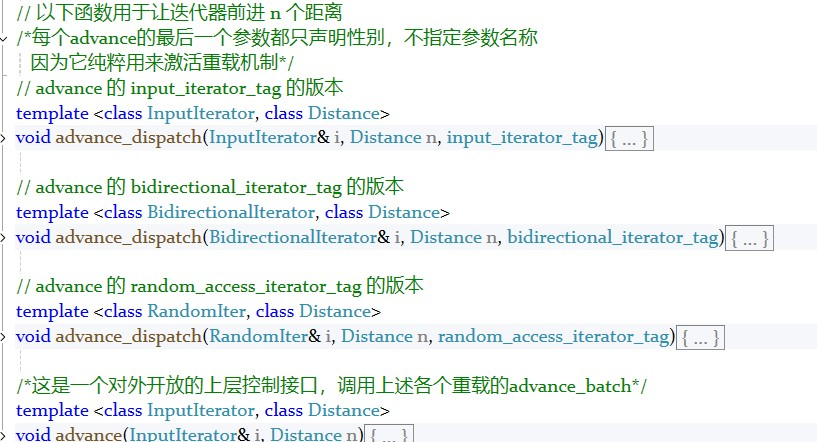


另外定义了一个反向迭代器的模板类**reverse_iterator**，前进为后退，后退为前进。

重载了加减各种比较操作符，


##### 总结：

iterator涉及类型萃取，模板特化/泛化，反向推导，继承，重载模板偏特化等各种机制。

根本上想要在容器和算法间实现的是，

对于容器间的associated type的五种类型的萃取，对于class iterator, native pointer, const native pointer这几种不同类型的处理；还有利用重载去对不同迭代器种类进行操作的选择。

利用type_traits激发让编译器在编译期就能够知道实参的一些特性，这使得我们可以实现不同情况下效率最优的重载函数供编译器在编译期间选派，而不是仅仅用重载函数，那样就需要到执行期间才知道具体用哪个函数，影响效率。


#### type_traits.h

> iterator负责萃取迭代器特性，type_traits负责萃取型别的特性。
>
> 这个型别指的时是否具备non-trivial defalt ctor, non-trivial copy ctor, non-trivial assignment operator, non-trivial dtor.答案shi否定的就可以采用内存直接处理操作获取最大效率


前言：

> - vector，list，deque
>
> - map，set，unordered_map，unordered_set，basic_string
>
>   容器很重要的一点在于理解它们的struct，这样才能更好的推出函数的思想结构

下图种，所谓的衍生并不是派生关系，而是内含关系。比如heap里内含一个vector，priority-queue内含一个heap，stack和queue都内含一个deque，set，map，multiset，multimap种内涵一个RB-tree，hast_x都内含一个hashtable。

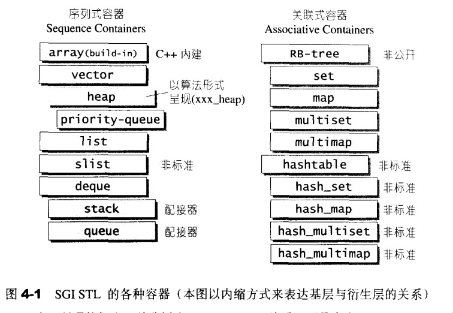

### sequence containers

<u>容器，置物之所也。</u>STL容器是将运用最广的一些数据结构实现出来。

#### vector.h

> vector的实现技术，关键在于对其大小的控制和重新配置时数据移动效率。注意该源码中SGI vector的空间配置策略。
>
> 线性连续空间，空间配置。

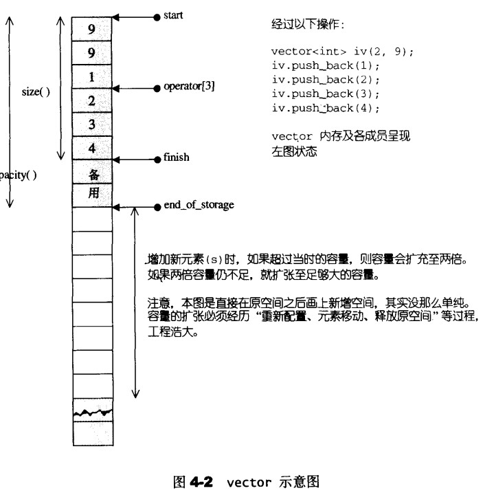

##### 构造函数

这里的构造函数包含了很多情况，比如`explicit vector(size_type n)`直接初始化多少空间，比如`  vector() noexcept`，比如`vector(Iter first, Iter last)`，对于某个迭代器的复制（这里也有` vector(const vector& rhs)`直接复制容器，函数内部也会转换为指针的开始到结束），下面选取几种典型进行分析：

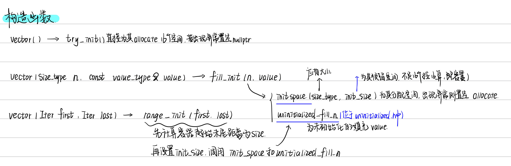

底层都是调用init_space和uninitialized_fill_n，前一个函数会用allocate直接分配空间，分配失败会置空；后一个函数则是位于uninitialized.h函数中，为初始化的空间填充值。


##### emplace_back

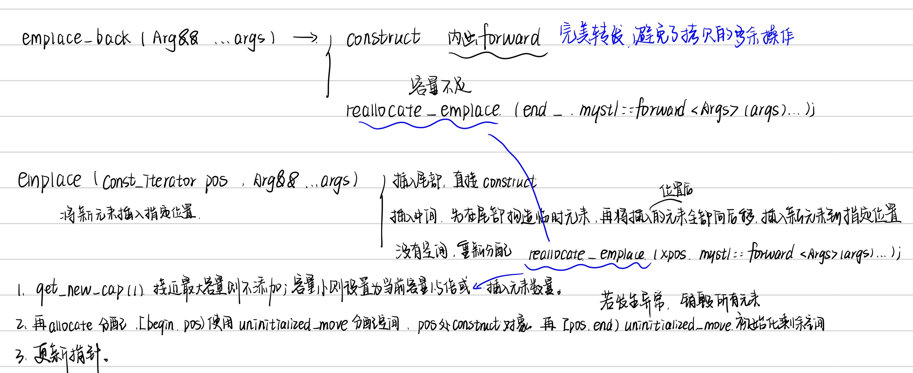

有种底层都差不多的感觉，这里注意一个知识点的多次使用：

###### 完美转发（不详述，可上网查）

然后对于emplace_back就是为其construct在内存上构造对象，内存不足就reallocate，重新分配时会先采用allocate为其重新分配1.5倍或者当前所需容量，再定义新的begin，end，cap，用allocate移动前面的元素，中间元素重新construct，后面一部分再重新初始化。

其实这就是调用了一块新的空间，时间复杂度为O(n)。

emplace也差不多，区别在于emplace_back是在最后添加，emplace是可以在任意位置添加，不过它们在某种情况都是调用reallocate_emplace，在某个位置重新分配。

只要是中间插入元素，都只能重新分配空间，改变指针位置。


##### push_back

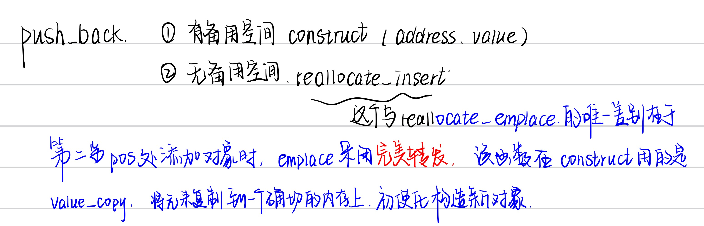

这跟上面差不多，就没有完美转发这一步。


##### pop_back()

调用allocator中的destory()

```cpp
template <class T>
void vector<T>::pop_back(){
  MYSTL_DEBUG(!empty());
  data_allocator::destroy(end_ - 1);
  --end_;
}
```


##### erase

有两种，一种是删除pos上的元素，一种是删除某个范围内的元素。

其实都是先将删除的元素那后面的往前移move，再将多余的元素删除destory

最后改变指针位置即可。

##### clear

也就是`erase(begin(), end()); `


##### insert

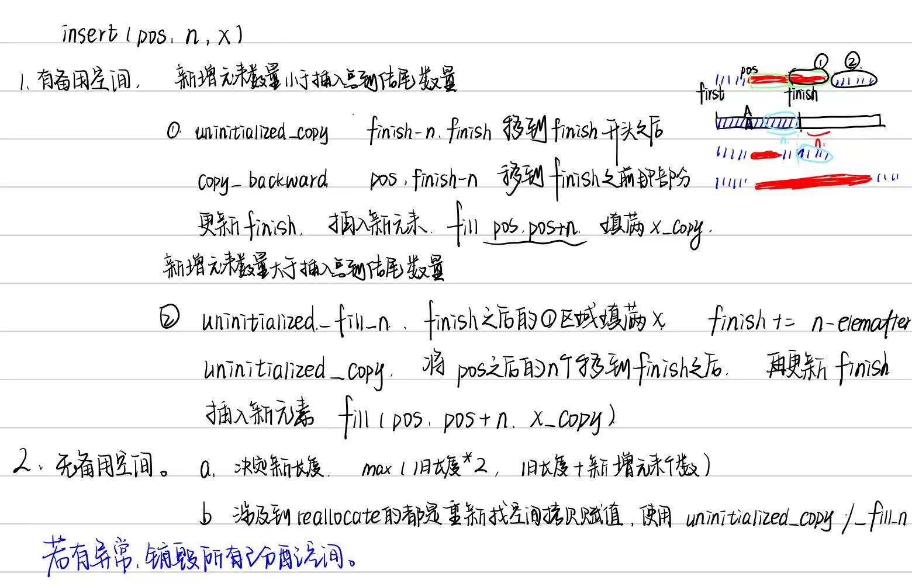

1. 有空间，分两类，然后初始化空间，copy，fill
2. 没有空间，重新找新的空间从头开始分配。


#### list

> 相较于vector的连续线性空间，list就显得复杂更多，好处是每次插入或者删除元素，都会配置或者释放一个空间，因此对于空间的运用很精准，不浪费。
>
> vector中以普通指针作为迭代器，也可以理解成随机访问迭代器，节点不保证在存储空间中连续存在，因此list采用的是双向迭代器。

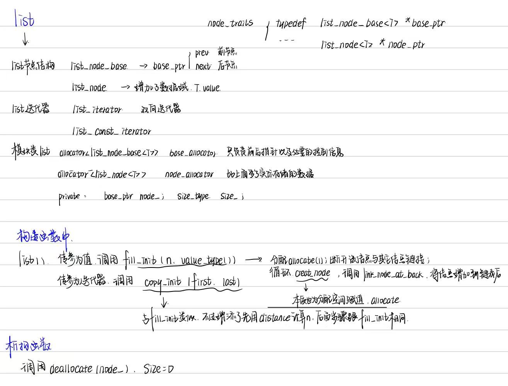

##### push_back

后面的这些都有点大差不差的意味，记住底层是对空间的分配就好。

push_back如果参数是左值，那就是创造节点，将其加入最后，在size++更新

如果参数是右值，那么利用move右值引用，调用emplace_back，emplace_back同样是创造节点creat_node，link_nodes_at_back将节点加到最后，不过creat_node参数利用了forward达到了完美转发，省去了一次参数的复制，简直和vector的思想一模一样，就是从数组转成了链表，还不需要考虑重新拿新空间分配reallocate的问题了。

##### pop_back

我们记录了node_指向末尾节点，直接消除链接unlink()，再destory消除该地址的值，deallocate销毁内存即可。

> allocate和deallocate用于为其分配内存
>
> construct和destory则是在已有的内存上为其声明对象
>
> 这两个都是在allocator.h之中的，至于aloc.h中的一二级分配器如今已经不怎么使用了，如今的allocate中无论是直接调用operator new和operator delete还是malloc，free，mmap等，这些机制内部已经进一步优化，而aloc.h中的一二级分配器反而需要内存池，多线程，自由链表等技术维护，增加复杂度和开销，多线程更容易增加安全问题，优势便不那么明显。
>
> 现在cpp中，提供了更为灵活易用的内存接口，通过智能指针和标准化的allocator，内存管理更加安全简化。

##### clear

从第一个节点到最后一个节点，挨个destory_node

(destory_node会先调用allocator中的destory，去除地址中的value，再调用deallocate，销毁空间)

##### 其它相关操作remove,unique,merge,sort,reverse,splice

- remove，很显然，从头到尾遍历，碰见值相同调用erase，erase会先unlink，再destory_node;

- unique，同样是遍历，满足某个条件进行移除

- merge，按照比较函数合并，这就是算法了，双指针同时遍历两个链表合并，最后加上没有遍历完链表的剩余部分。

- sort，链表排序的话，代码中用的是递归实现的归并排序，。

- reverse，翻转指针

- splice，将链表的一部分移动到当前链表pos位置的函数（只涉及指针的移动，效率还不错）

  先判断移动节点数量是否超过最大允许大小

  再断开原链表中要移动的节点

  将断开的节点插入到目标链表中的指定位置

  更新链表大小等相关数值。


#### deque

> vector是单向开口的连续线性空间，deque是双向开口的连续线性空间。
>
> 二者的最大差异在于
>
> - deque允许常数时间内对头端进行元素的插入或者移除
> - deque没有所谓容量的概念，因为它本身就是动态的以分段连续空间组合，随时可以增加新的空间链接。
>
> 虽然deque也是随机存取迭代器，但是它的迭代器并不是普通指针，vector的指针仅在连续空间内移动，因此运算层面也更加复杂，除非必要，尽可能使用vector而不是deque。
>
> 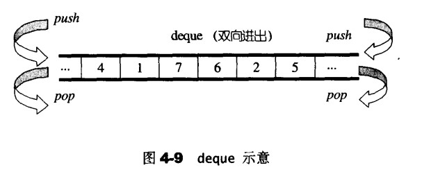

deque为了维护所谓连续线性空间的家乡，采用了一块所谓的**map**作为主控，map是一小块连续空间，其中每个元素都是指针，指向另一块较大的连续线性空间，称为缓冲区。缓冲区才是deque的存储空间主体。

```cpp
  // deque类中 deque 的型别定义
  typedef mystl::allocator<T>                      allocator_type;
  typedef mystl::allocator<T>                      data_allocator;
  typedef mystl::allocator<T*>                     map_allocator;
```

大致是下图：

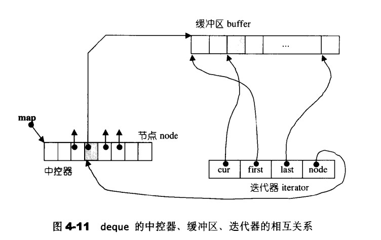

##### 迭代器

比起vector真正的指针向后移一位，和list的指向下一个next，deque的operator++和operator- -显得更为复杂，下面看代码：

先思考，对于deque的要求是什么

- 判断每个缓冲区的边缘
- map中的每个节点之相对应的缓冲区

```cpp
  typedef T*           value_pointer;
  typedef T**          map_pointer;

  value_pointer cur;    // 指向所在缓冲区的当前元素
  value_pointer first;  // 指向所在缓冲区的头部
  value_pointer last;   // 指向所在缓冲区的尾部
  map_pointer   node;   // 缓冲区所在节点
// deque iterator中
```

缓冲区内存分配：

```cpp
template <class T>
struct deque_buf_size
{
  static constexpr size_t value = sizeof(T) < 256 ? 4096 / sizeof(T) : 16;
};
// T较小时，再4096内能放多少就放多少，当T较大时，固定放16个
```

##### operator++

如果该节点当前值cur==last，那么指针随着setnode向后移动一个缓冲区

##### operator- -

如果该节点当前值cur==first，那么指针随着setnode向前移动一个缓冲区


##### deque的数据结构

```cpp
 typedef pointer*                                 map_pointer;
 typedef const_pointer*                           const_map_pointer;

// 用以下四个数据来表现一个 deque
  iterator       begin_;     // 指向第一个节点
  iterator       end_;       // 指向最后一个结点
  map_pointer    map_;       // 指向一块 map，map 中的每个元素都是一个指针，指向一个缓冲区
  size_type      map_size_;  // map 内指针的数目
```

有这些的话，那诸如begin(), end(), front(), back(), size(), empty()等操作便可以很容易的进行。


> 输入迭代器：只能单向遍历，只读访问，不能多次遍历相同元素，适合一次性读取数据的场景。
>
> 前向迭代器：也只能单向遍历，但支持多次遍历相同元素，可以读取和修改元素，适用于需要多次遍历的线性数据结构。

##### deque的构造和内存管理

construct，push_back，push_front

###### construct，

同样是fill_init和copy_init两种

- 对于copy_init，为了高效对deque的初始化，它会根据迭代器的特性采用不同的实现策略，比如当为一次性数据，比如文件读取输入流等只能一次单向遍历不发事先确立数据量大小只能遍历一次时，采用输入迭代器；带数据源可以多次遍历且可以预先计算数据量的场景时，可以采用前向迭代器。
  - 输入迭代器：首先map_init初始化map和缓冲区，再采用emplace逐个处理遍布到结尾。
  - 前向迭代器：首先map_init初始化map和缓冲区，再针对每个节点，确立缓冲区大小，使用uninitialized_copy将元素复制到当前缓冲区，更新迭代器。
- fill_init，则直接map_init初始化map和缓冲区，再直接利用uninitialized_fill填数据就行。没有迭代器，无需区分。


###### push_back

- 结尾有空间时，直接construct对象，再个更新指针

- 结尾缺少空间时，先require_capacity，再在结尾分配好的空间上construct内存，更新指针

  `deque<T>::require_capacity` 是在需要在双端队列（`deque`）的两端添加元素时，确保有足够的容量。如果容量不足，它会创建新的缓冲区或者重新分配 `deque` 的内部结构（`map_`）以容纳更多的元素。如果容量足，会直接创建新的缓冲区。

  `reallocate_map_at_back` 是 `deque` 内存管理的一部分，当需要在后端插入元素且现有 `map_` 不足以容纳新的缓冲区时，它会创建一个更大的 `map_` 并将原有的缓冲区指针迁移到新 `map_` 中。该函数确保了 `deque` 能够在两端灵活扩展，同时避免频繁重新分配内存，提升了性能。

push_front同理。


##### deque的元素操作

###### pop_back

两种情况

1. 最后一个缓冲区一个以上元素，直接destory析构。
2. 最后一个缓冲区没有元素，需要deallocate释放最后一个缓冲区，setnode调整接节点状态，再回退到上一个缓冲区，destory上一个缓冲区的最后一个元素。

pop_front同理。


###### clear

1. 注意需要保留一个缓冲区，这是deque的策略
2. 首先除开头尾意外的两个缓冲区，其它都会直接destory所有值再deallocate；然后如果头尾缓冲区不同，destory两边的内容再deallocate尾缓冲区，如果只有一个缓冲区就直接析构destory；最后调整开头结尾指针即可。


###### erase

这个虽然说有链表的结构吧，但实际上又是个虚拟的内存空间，因此删除元素还是和vector一样通过将所有元素移动一个位置。

因此会判断前面元素少还是后面元素少决定移动方向，有助于优化性能。

移动之后记得destory最前面或者最后面的位置，可以使用pop。


###### insert

猜测一下这个插入是不是类似于erase，插入之后全部移动，也是先判断再移动这样子。

添加:那也可以判断一下是不是在最前面和最后面，这样直接emplace_x就行。


#### stack

> stack是一种FILO的数据结构。
>
> 将deque作为底部结构封闭其头端开口，轻而易举的形成了一个stack，因此SGI STL便以deque作为缺省情况下的stack的底部结构。
>
> 这种“修改某物接口，形成另一种风貌”的性质，称为adapter。因此STL stack往往不被归类为container，而是被归类为container adapter。

这个就大部分要能继承**deque**（默认stack底层）就直接继承，比如empty，size，top，push，pop等都可以直接对应deque的back部分，封闭front的部分就是stack了。

stack所有的元素都要符合先进后出的原则，只有顶端的元素才有被外界取用的机会，因此stack不提供走访功能，**也不提供迭代器**。

该代码中的实现是以deque作为底层结构，其实**还可以通过list或者vector作为stack**的底层容器。

> [!TIP]
>
> Q：为什么现代stl中的stack使用deque作为底层，而不是vector或者list？
>
> A：`std::stack` 使用 `deque` 作为默认的底层容器，主要是因为 `deque` 提供了**高效的双端操作能力、良好的内存管理和适中的实现复杂性**。`deque` 能够在大多数栈操作中提供平衡的性能和灵活性，对于stack的扩容时，内存开销不大，时间开销也不大，同时具有局部缓存性。
>
> 而 `vector`对于频繁的扩容操作， 扩展时需要重新分配整个内存区域，极其影响性能。
>
>  `list` 则是每个节点添加时都需要额外的内存开销，并且缓存局部性很差，性能也不好达到。


#### queue

queue作为FIFO的数据结构，和stack面对deque是一模一样的状态，封闭了某些功能以此达到目的，同样也可以被归类为container adapter。同样，queue只有顶端的元素可以取用，不提供遍历功能，也不提供迭代器。


#### heap

> heap不属于STL容器组件，一般扮演着priority queue的助手。
>
> priority queue允许用户以任何次序将元素推入容器内，但是取出的时候一定会从优先权最高的元素开始取，正是因为binary max heap有这样的特性，才会作为priority queue的底层机制。

由于是完全二叉树之后的层序遍历结果由array存储，因此heap中只需要实现对heap的几个函数的算法就行，不需要实现结构。

heap的具体算法属于数据结构和算法课程的知识，这里不详述。

```cpp
/*添加元素*/
void push_heap(RandomIter first, RandomIter last);
void push_heap(RandomIter first, RandomIter last, Compared comp);
/*删除元素*/
void pop_heap(RandomIter first, RandomIter last);
void pop_heap(RandomIter first, RandomIter last, Compared comp);
/*排序*/
void sort_heap(RandomIter first, RandomIter last);
template <class RandomIter, class Compared>
void sort_heap(RandomIter first, RandomIter last, Compared comp);
/*创造堆*/
void make_heap(RandomIter first, RandomIter last);
void make_heap(RandomIter first, RandomIter last, Compared comp);
```


#### priority_queue

priority是一个有权值观念的queue，可以加入新元素，移除旧元素之类的功能，它里面的元素不是按照自动排序，而是按照权值的高低，缺省情况下利用一个最大堆完成，因此底层是一个vector表现的complete binary tree。

它是以缺省的vector为底部容器，同样也是被称为container adapter。

其中的构造函数，析构函数，push，pop其实底部都是heap中的make_heap，push_heap，pop_heap等泛型算法。

priority的元素内部有自己的规则，只有顶端元素可以被外界取用，因此没有遍历功能，也没有迭代器。


### associative containers

> 关联式容器，观念上类似关联式数据库：每笔数据都有一个键值和一个实值，当元素被插入到关联式容器中，容器内部结构便依照其键值大小，以某种特定规则将元素放置在合适的位置，因此没有所谓的push_back(), push_front()等之类的操作行为。


### RB-tree

[红黑树 - OI Wiki (oi-wiki.org)](https://oi-wiki.org/ds/rbtree/)

红黑树也是平衡二叉搜索树，但是和AVL树不同，详见下图：

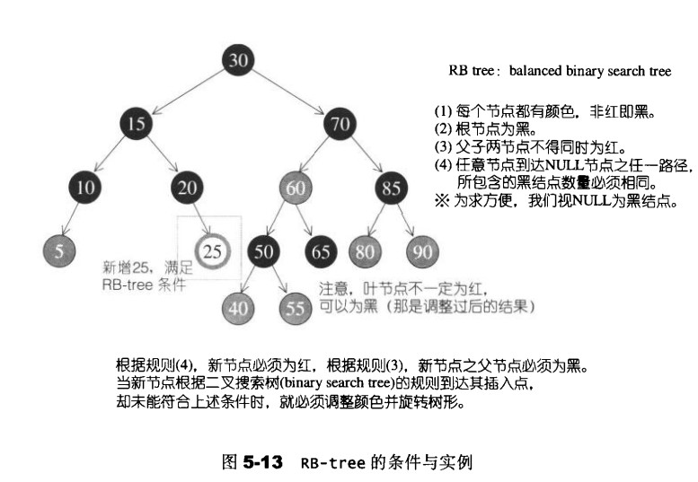

> 性质：
>
> 根节点为黑色，所有叶子NIL节点为黑色。
>
> 每个红色节点必须有两个黑色的子节点。
>
> 任一节点到叶子节点的所有简单路径包含相同数目的黑色节点。

红黑树的插入节点为红色

##### rb_tree_node_base

```cpp
  base_ptr   parent;  // 父节点
  base_ptr   left;    // 左子节点
  base_ptr   right;   // 右子节点
  color_type color;   // 节点颜色
```

SGI把**RB迭代器**实现为两层，属于双向迭代器

rb_tree_node继承自rb_tree_node_base

rb_tre_Iterator继承自rb_tree_base_iterator

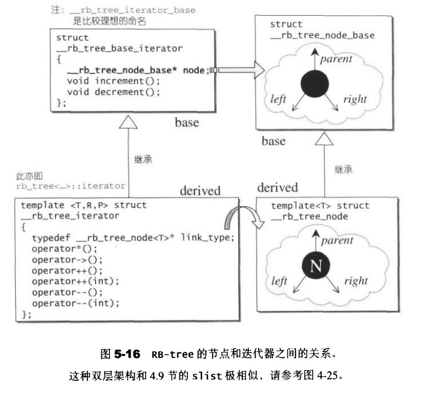

对于迭代器的遍历时利用re_tree_node_iterator中的increment和decrement函数进行的。

**increment**

- 有右节点，找右子树的最左节点
- 没有右节点，查找第一个大于当前节点的祖先节点.
  - 左节点找它的父节点
  - 右节点找它的某个父节点为左节点，那个左节点的父节点就是目标节点
- 右节点不等于此时的父节点，父节点为解答，否则node为解答

##### decrement

- 红节点，父节点的父节点为自己，右子节点为解答

- 有左节点，找左节点的最右（大）节点
- 没有左节点，查找第一个小于当前节点的祖先节点
  - 右节点找它的父节点
  - 左节点找他的某个父节点为右节点，这个右节点的父节点就是目标节点


##### RBtree的数据结构

涉及一些专属的空间配置器，型别定义，简单的成员函数（极小值，极大值，插入，删除，构造，析构，空，大小等。

RB-tree的构造函数有两种：

- copy_from直接拷贝另一棵树
- rb_tree_init初始化这个树的根节点为空

当然为了以防边界情况，也就是对根节点有特殊的处理，我们会创造一个哨兵节点header。

```cpp
rb_tree_init(){
  header_ = base_allocator::allocate(1);
  header_->color = rb_tree_red;  // header_ 节点颜色为红，与 root 区分
  root() = nullptr;
  leftmost() = header_; rightmost() = header_;
  node_count_ = 0;
}
```


对于元素的基本操作，这里以正常情况为例，具体代码中会重载多种情况，比如插入的元素节点键值能不能重复之类的多种情况，这些是为了之后的set，map等一个container adapter能起到的一个作用。

##### insert

**插入时可能出现的情况：**

- case 1: 新增节点位于根节点，令新增节点为黑
- case 2: 新增节点的父节点为黑，没有破坏平衡，直接返回
- case 3: 父节点和叔叔节点都为红，令父节点和叔叔节点为黑，祖父节点为红，然后令祖父节点为当前节点，继续处理
- case 4: 父节点为红，叔叔节点为 NIL 或黑色，父节点为左（右）孩子，当前节点为右（左）孩子，让父节点成为当前节点，再以当前节点为支点左（右）旋
- case 5: 父节点为红，叔叔节点为 NIL 或黑色，父节点为左（右）孩子，当前节点为左（右）孩子，让父节点变为黑色，祖父节点变为红色，以祖父节点为支点右（左）

在插入时会同步记录，键值是否重复，是在某个父子树的左节点还是右节点


##### erase

**删除节点可能出现的情况：**

此时，y 指向要删除的节点，x 为替代节点，从 x 节点开始调整。如果删除的节点为红色，树的性质没有被破坏，否则按照以下情况调整（x 为左子节点为例）：

- case 1: 兄弟节点为红色，令父节点为红，兄弟节点为黑，进行左（右）旋，继续处理
- case 2: 兄弟节点为黑色，且两个子节点都为黑色或 NIL，令兄弟节点为红，父节点成为当前节点，继续处理
- case 3: 兄弟节点为黑色，左子节点为红色或 NIL，右子节点为黑色或 NIL，令兄弟节点为红，兄弟节点的左子节点为黑，以兄弟节点为支点右（左）旋，继续处理
- case 4: 兄弟节点为黑色，右子节点为红色，令兄弟节点为父节点的颜色，父节点为黑色，兄弟节点的右子节点为黑色，以父节点为支点左（右）旋，树的性质调整完成，算法结束

最后再destory_node该节点，先destory，再deallocate


##### find

RBtree是一个二叉搜索树，元素的搜寻正是拿手项目，只要从根节点向下遍历即可。

这里稍微和正常遍历查找不同的就是加了一点点trait。

> 这里总结一下类型萃取。
>
> 类型萃取是一种模板元编程技巧，主要在于编译时获取类型信息和优化代码，为泛型编程提供额外的信息和功能，让模板更加灵活，可扩展，提升编译期的类型安全性。
>
> 编译器通过模板特化匹配具体的类型，根据不同的类型编译器在编译时生成不同的代码，达到类型安全和优化的目的。
>
> 常见的有：
>
> 1.类型特征萃取，在编译器检查和操作类型
>
> **`std::remove_reference<T>`**：去掉类型`T`的引用修饰符；**`std::remove_const<T>`**：去掉类型`T`的`const`修饰符；**`std::is_pointer<T>`**：判断类型`T`是否为指针类型…
>
> 2.迭代器特性萃取，用于提取迭代器的相关信息
>
> **`iterator_category`**：迭代器类型，如`random_access_iterator_tag`，`bidirectional_iterator_tag`等；**`difference_type`**：两个迭代器之间的距离类型…
>
> 3.数值特性萃取，提取数值类型的特性信息
>
> **`std::numeric_limits<T>::max()`**：类型`T`能表示的最大值；**`std::numeric_limits<T>::min()`**：类型`T`能表示的最小值；**`std::numeric_limits<T>::epsilon()`**：浮点数类型`T`的最小精度差值。

> 再总结一下，常见的模板元编程：
>
> 1.递归模板，可以进行编译期计算，类型推导等。
>
> 2.模板特化，为特定的模板参数提供不同的实现
>
> 3.SFINAE，替换失败不是错误，也就是在实例化模板时遇到不合法的模板替换出错后，会选择其它的模板重载而不是报错。
>
> 4.类型萃取
>
> 5.constexpr。允许在编译器执行函数。
>
> 6.using模板别名，常用于模板，属于typedef的增强版。


#### set/multiset

set：

自动排序，键值等于实值，键值不能重复。

它的迭代器是const_iterator，杜绝写入操作，也就不是constant iterator，也不是mutable iterators。

RBtree作为一种平衡二叉搜索树，其自动排序的效果很好，并且set的各种开放操作接口，都是直接调用RBtree中现成的。

multiset：允许键值重复，因此插入调用的是RBtree的insert_equal而不是insert_unique。


#### map/multimap

所有的元素根据键值自动排序，拥有实值和键值，第一个元素为键值。

迭代器也同样，不能通过迭代器修改map的键值，因为键值会影响map元素的排列规则，但是在插入删除时，map里面的元素也会通过迭代器变动。详见代码。

multimap和map的差别，与set和multiset的差别是一样的。


### hashtable

它可以提供对于任何有名项的存取和删除操作，所以也可被视为一种字典结构，结构用意在于提供常数时间的基本操作。

hash function，碰撞

碰撞的解决方案：线性探测（可能导致主集团primary clustering问题），二次探测，开链等

该代码中是以开链法完成hash table的图形表述。

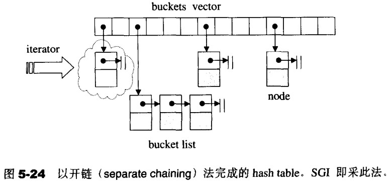

```cpp
struct hashtable_node{
    hashtable_node* next;   // 指向下一个节点
    T value;  // 储存实值
};

/*如果在当前一个list的尾端，可以跳到下一个bucket身上，也就是重载operator++*/
/*bucket聚合体以vector完成*/
struct ht_iterator_base :public mystl::iterator<mystl::forward_iterator_tag, T>{
    node_ptr    node;  // 迭代器当前所指节点
    contain_ptr ht;    // 保持与容器的连结
}
```

##### 构造和内存管理

构造：

**init**建立数组，同时设立初值为0

**copy_init**双层循环，一层创造vector，一层创造link


##### insert和resize

**insert_unique**

- 先判断是否需要重建表格用rehash
- 再插入目标值
  - 遍历如果发现重复直接返回（1）
  - 未重复，指向对应bucket指向链表的头结点
  - （注意返回时的变量包含有没有插入成功）

**insert_multi**

在步骤(1)中如果发现相同键值的，也可以直接插入


**rehash**

- 比较元素个数和bucket vector的大小相比，如果前者大于后者，重建表格，表格大小设立成下一个质数（玄学bushi，质数的碰撞可能性或许会更低）
- 再循环旧的bucket，将每个旧bucket中的头结点让新的bucket指向它即可
- 最后对调新旧bucket
- 释放旧bucket的内存


##### copy和clear

**copy_from**

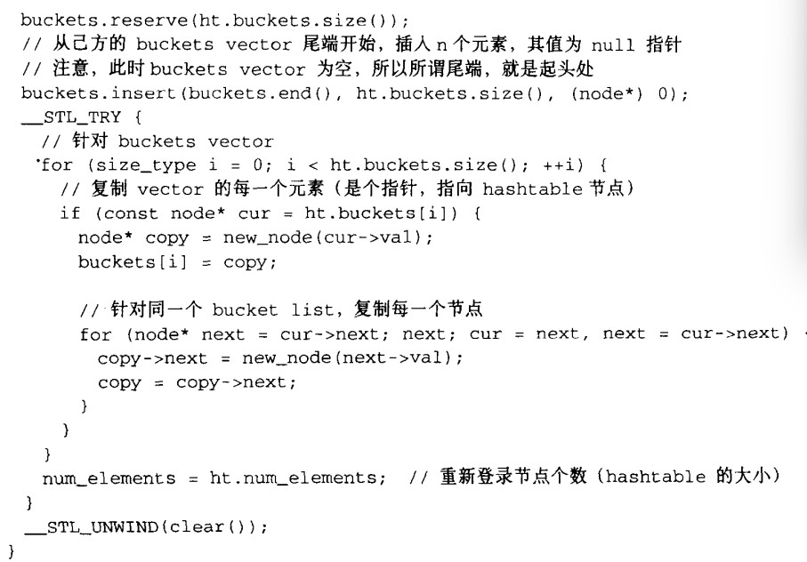

**clear**

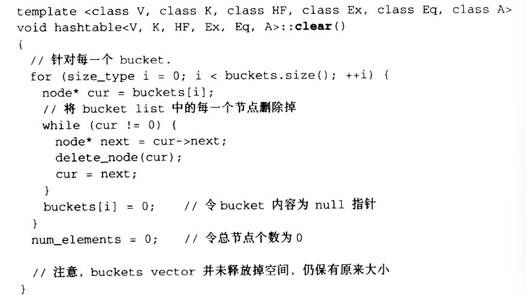


#### hash_set/hash_multiset

实值键值相同，不排序。

#### hash_map/hash_multimap

用键值快速搜索元素。


## Summar：

关于STL的内容到这里就算结束了。代码也是只实现了allocator，iterator和container这几个部分。

后面写一些自问自答算是一个总结了。

> Q：介绍一下allocator.h中代码的实现结构，说出关键点的细节。

A：

**使用方法：**

- 重载和SFINAE使得在stl中会选择合适的重载函数，即使选择失败了也不会报错而是会继续尝试其它函数。
- 采用可变模板参数的通用引用+forward或者右值引用+移动语义，减少了额外拷贝，节约资源提升性能。

**代码结构：**

allocate使用的是operator new，相对应的deallocate使用的是operator delete，对应的是空间的分配和释放。

construct和destory在非平凡析构函数的是显式调用构造和析构函数，对于平凡析构函数，函数内部会自行调用构造和析构函数，用于对象的构造和析构

> Q：代码中还存在aloc.h中利用内存池和自由链表的另一种方式，如今已经被弃用，主要原因在于glibc的malloc/free的内存池设计已经实现的极为精巧，充分利用了是恐惧不行在内存管理和内存消耗的取舍，请详细介绍下两者的对比。

A：

这个文章里面好像写了，本身内存池和自由链表的创造是为了增加性能的，防止malloc时过多的内存碎片导致的内存泄露，但是随着后来malloc机制的逐渐优化，这种思路就被弃用了。

glibc中的内存池代码分析链接：[glibc malloc源码分析](https://chenyuzhuwhiskey.github.io/glibc-malloc-analysis/)

> Q：iterator中有些模板元编程或者type_traits或者一些不太熟悉的特性，请介绍iterator的实现思路并且重点讲讲这些特性的使用和好处。

A：

**结构：**

iterator可以从五个内嵌相应型别入手，迭代器类别，值类型，指针，引用，距离范围。

**迭代器类别**有五个，输入，输出，前向，双向，随机存取

针对有没有迭代器，是什么迭代器，利用重载，偏特化和SFINA技术用于判断迭代器的种类。
对于**原生指针，常量指针，类指针**都会有对应的偏特化版本。
同样也有前进和后退的重载，引用和指针的重载等等，主要是采用类型萃取以便于在编译器确立类型。具体不同容器对于迭代器不同的使用在容器的代码中会详细说明。

> Q：容器中有几个最为底层的，比如vector,list,RBtree,hashable，这些都是heap，priority_queue，set，map等实现的基础，这些也成为container adapter，请介绍这些最为底层的容器。

A：

一般容器中分为迭代器和容器的基本函数实现两部分。
**vector**
由于vector时采用连续的内存空间，因此迭代器很类似于普通的常量指针
对于一些基础的迭代器时采用对于vector结构中的私有成员begin,end,cur指针的直接调用进行的。
基础函数的话就比如构造，析构，push，pop，erase，clear，insert在文章中都有过程的阐述。
欸对，还有push和emplace一般来说emplace会利用右值引用和完美转发所以性能更好。
构造析构其实都是allocate，deallocate，construct，destory函数的调用之类的。后面的基础函数也同样。和我们之前了解的vector的底层思想一致。
比如空间不够，了重新拿个空间重新分配，设置成两倍一点五倍；push时会判断有没有备用空间要不要重新分配；pop时直接destory，erase本质上是将后面元素整体向前移动，时间复杂度O(n)，在destory多余的部分；clear就是erase所有；insert同样是需要分配有无备用空间，有备用空间怎么移动之类的，详细看文章或者去看源码了。

**list**
迭代器的主要作用是遍历，访问和操作链表中的元素，在list中会重载解引用，自增自减之类的运算符，一般都是直接调用比如node的prev，next指针或者节点的值。不过源码中同时重载了普通指针和常量指针，普通指针用于修改容器中存储的元素，常量指针表明支持list的只读操作。
后面的构造析构pushpopremove等也是对于算法的要求更多，然后涉及空间的分配，list中主要是节点的前后指针值和list中的尾指针和大小。

**deque**
双端队列，这个就比以上两个都要更复杂了，这是一段虚假的连续空间，哪怕你迭代器加加减减的很顺利，其实都是无数行默默的代码换来的。
deque的迭代器是会直接包含list的相关特性的，当然也重载了普通指针和常量指针，设置的成员数据有缓冲区当前元素，头部元素，尾部元素所在节点之类的，内部重载运算符，这个是一定要区分指针++或者--时还在不在当前缓冲区的。
至于deque本身那当然要充分符合它自身的特性，私人成员有，指向第一个和最后一个节点，每块map以及map的大小，然后基本函数中要注意缓冲区大小的设置，缓冲区边界，全部清空时记得保留一个缓冲区。

**RBtree**
红黑树的迭代器提供了一种类似指针的方式来访问和遍历容器中的元素。其中也是直接包含红黑树的节点，红黑树的节点内部有父节点，左右子节点和它本身的值，红黑树本身则包括根节点（特殊节点），结点数，键值比较原则这些。迭代器则是要实现自增自减，还有插入删除时树涉及的旋转之类的，也要重载元素键值是否重复，每个节点的的键值和值之类的，这些都是为之后的set，map等提供基础。

**hashable**
哈希表的主要优势应该是在于类似于数组的存取效果。不过当元素过于的散乱时数组显得太过于浪费空间，这也就是哈希表的阐述，哈希表一般会采用取模之类的在某个范围建立一个bucket，但是这样会发生哈希碰撞，然后相应的解决方式有线性探测，二次探测开链等。这里采用的是开链，也就是当重复时会直接在该位置建立链表。将键映射到bucket的索引。
同时哈希表会存在容量和负载因子，当负载因子(每个同的平均元素数量），当负载因子过高时链表变长查找效率下降便会自动调整容量，容量也是用某个数组自动由小到大存储。哈希表中的bucket_type对应的是vector<node_ptr>，而node_ptr中存储也是链表节点，后面的函数插入删除基本思路也就确定了。

感觉在这些容器中频繁使用的知识有，namespace（stl的源码都是在mystl中实现的），typedef为类型重新命名，typename声明其是类型，完美转发，重载，模板元编程等等。


> Q：这些container adapter其实大多都是重载一下运算符，然后缺省其中的一部分函数最终实现的，仅仅这么简单吗，有没有什么注意点？

A：

就感觉，，，没什么注意点吧。

设置一些相关型别，原生指针，常量指针，类指针

然后构造复制移动析构函数，迭代器的开始结束加加减减，

容器的容量，增删改查，特定容器接口的特定操作，

就直接继承底层容器的相关部分，然后不相干的封闭之类的。


##### 作者唠唠嗑

那就暂时这样子了，中间零散着有些其它的事情不过主线是这个项目大概花了一周。之前其实一直记不太住stl的相关知识，那时候就了解一些语法之类的，不从源码或者底层入手很难有个深刻的印象。找工作嘛，天天念叨着要背八股，八股这词一听就不是什么好词，死记硬背着实对工科学生也不太友好，期待着还是最好从代码和书籍中同步学习知识，这样更落地也更深刻。

祝愿我们都有美好的未来。
