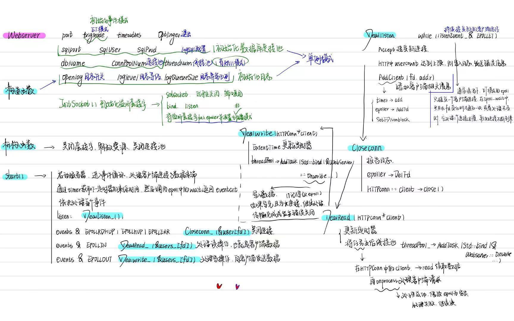

# Webserver


> [!Note]
>
> 推荐书籍：
>
> linux高性能服务器编程
>
> UNIX环境高级编程
>
> UNIX网络编程


**具体模块：**

线程同步封装类，半同步半反应堆线程池

HTTP连接管理

服务器优化：定时器处理，日志系统，

压测，数据库连接池，注册登录


## 环境配置

> 绷，果然配环境始终都是很难的一步。
>
> 这个说是要在ubuntu16.04环境上运行，搭建环境的话据说所知的方法还挺多，比如直接下载一个虚拟机软件再创建所需的虚拟机环境，可以用VMware或者VirtualBox，这两电脑上也都有，不过这两软件都用过但不是很熟悉，能再研究研究；要不然也可以在云平台上启动Ubuntu的实例，搭建远程的测试环境，没用过待定；再者就是用docker容器模拟环境，其实也可以。
>
> docker和virtualbox有个坑点在于docker依赖底层的Hyper-v或者WSL 2，但是virtualbox的一些旧版本在启动hyper-v的情况下会遇到性能问题甚至无法正常启动。

[virtualbox配置Ubuntu出现问题解决方案](https://forums.virtualbox.org/viewtopic.php?t=94291)

软件开发之前，程序员首先面临的第一个问题就是环境配置，一个软件能成功运行也需要依靠当前操作系统的设置，以及各种库和组件的安装。只有这些都正确，程序才能成功运行，如果不同的版本或者os和当前环境不兼容，那么程序便不能运行。

对于此，从前采用的大多是**virtual machine**，也就是虚拟机，在操作系统里运行另一种操作系统，但是虚拟机的资源占用多，冗余步骤多，启动也慢，对于这些问题，linux发展了另一种虚拟化技术，也就是linux containers，即linux容器。它不模拟一个完整的操作系统，只是对进出进行隔离，对于其中的进程而言，它接触的都是虚拟的资源进而实现与底层系统之间的隔离。

[Docker vs virtual machine](https://javaguide.cn/tools/docker/docker-intro.html#%E5%AE%B9%E5%99%A8-vs-%E8%99%9A%E6%8B%9F%E6%9C%BA)


### Docker入门教程

参考资料：[阮一峰 - Docker 入门教程](https://www.ruanyifeng.com/blog/2018/02/docker-tutorial.html)

**Docker 属于 Linux 容器的一种封装，提供简单易用的容器使用接口。**

它的用途：

**（1）提供一次性的环境。**比如，本地测试他人的软件、持续集成的时候提供单元测试和构建的环境。

**（2）提供弹性的云服务。**因为 Docker 容器可以随开随关，很适合动态扩容和缩容。

**（3）组建微服务架构。**通过多个容器，一台机器可以跑多个服务，因此在本机就可以模拟出微服务架构。

**Docker 把应用程序及其依赖，打包在 image 文件里面。**只有通过这个文件，才能生成 Docker 容器。image 文件可以看作是容器的模板。Docker 根据 image 文件生成容器的实例。同一个 image 文件，可以生成多个同时运行的容器实例。

**Dockerfile** 是一个文本文件，用来配置 image。


### 虚拟机的选择：VirtualBox还是VMware

1.**性能**

- **VirtualBox**：性能适中，适合日常开发和测试任务。由于它是开源项目，可能在高性能任务中表现不如 VMware 稳定。
- **VMware**：总体性能表现优于 VirtualBox，尤其是在运行多个虚拟机、复杂的虚拟化任务和大规模企业级应用时，VMware 的虚拟机在资源管理、响应速度和 I/O 性能上更加出色。

2.**易用性**

- **VirtualBox**：安装简单，用户界面直观，适合入门用户和中小型项目。配置文件（如 Vagrantfile）的支持使得虚拟机管理非常灵活，特别是结合 Vagrant 使用时。
- **VMware**：界面更加专业化，功能强大，虽然略显复杂，但提供更多企业级管理和高级功能。适合需要更多虚拟化细节和控制的用户。

3.**功能特性**

- **VirtualBox**
  - 开源、跨平台（支持 Windows、Linux、macOS）。
  - 支持虚拟快照功能，可以保存虚拟机不同的状态。
  - 支持 3D 加速、USB 设备和共享文件夹等功能，但与 VMware 相比，某些高级功能如虚拟网络配置和设备支持上稍显不足。

- **VMware**：
  - 提供更加成熟和高效的快照、克隆功能。
  - 提供更好的 3D 加速、USB 设备支持和网络管理。
  - 企业级产品（如 vSphere）支持集群、容错、高可用性等高级功能，非常适合大型企业级应用和数据中心虚拟化需求。

4.**企业级应用**

- **VirtualBox**：更适合个人开发、测试环境和小型企业的简单虚拟化需求。
- **VMware**：提供丰富的企业级解决方案，尤其是 VMware vSphere 等企业级虚拟化平台，支持数据中心管理、云计算、高可用性等企业级功能，是大型企业和云服务提供商的首选。

**总结：**

- **VirtualBox**：免费、开源、跨平台，适合个人开发者、初学者和中小型项目的虚拟化需求。适合需要快速部署开发环境或简单测试任务的场景。
- **VMware**：性能更优，功能更加丰富，特别是在高级虚拟化管理和企业级功能上领先。适合企业用户和对虚拟机性能、可靠性要求较高的场景，尤其是数据中心和生产环境。


# Linux高性能服务器编程

## 第一篇 tcp/ip协议详解

#### Chapter 1 TCP/IP协议族


#### Chapter 2 IP协议


#### Chapter 3 TCP协议


	

#### Chapter 4 TCP/IP通信案例


## 第二篇 深入解析高性能服务器编程


### 服务器程序框架


#### CS模型


#### IO模型 线程接收整个过程              

[webserver讲解](https://huixxi.github.io/2020/06/02/%E5%B0%8F%E7%99%BD%E8%A7%86%E8%A7%92%EF%BC%9A%E4%B8%80%E6%96%87%E8%AF%BB%E6%87%82%E7%A4%BE%E9%95%BF%E7%9A%84TinyWebServer/#more)

#### 服务器如何接收客户端的报文？

服务端使用socket监听来自用户的请求，epoll实现。

epoll：**IO复用技术**，实现对监听socket和连接socket的同时监听。但是本身是堵塞的。因此需要用**线程池**采取多线程并发为每个就绪的文件描述符分配逻辑单元处理。

服务器通常要处理三类事件：IO事件，**信号以及定时**事件。两种处理方式：

- Reactor模式：主线程只负责监听文件描述符上是否有事件发生，有的话通知工作线程，工作线程中会完成读写数据，接受新连接以及处理客户请求。同步IO

  

- Proactor模式：所有IO都交给主线程和内核处理，工作线程只负责业务逻辑。异步IO

  

> Reactor和Proactor模式的区别。

本项目采用**同步IO模拟的Proactor事件处理模式**。


#### 服务器如何处理以及响应接收的HTTP报文

**并发：**

> 同步：内核向应用程序通知IO的就绪事件，由应用程序完成IO读写。
>
> 异步：内核向应用程序通知IO的完成事件，由内核完成IO读写。
>
> 并发中，同步指程序按照代码序列顺序执行，异步指程序的执行由系统事件驱动

**半同步/半异步模式：**

同步用于处理客户逻辑，异步用于处理IO事件。


领导者/追随者模式


#### 提高服务器性能的相关建议：

##### pool

**线程池**并发处理用户请求。主线程负责读写，工作线程 处理逻辑，（锁和信号量实现线程同步，保证原子性）

> 线程池中线程数目的确定。
>
> 线程池中的线程数量最直接的限制因素是中央处理器(CPU)的处理器(processors/cores)的数量`N`：如果你的CPU是4-cores的，对于CPU密集型的任务(如视频剪辑等消耗CPU计算资源的任务)来说，那线程池中的线程数量最好也设置为4（或者+1防止其他因素造成的线程阻塞）；对于IO密集型的任务，一般要多于CPU的核数，因为线程间竞争的不是CPU的计算资源而是IO，IO的处理一般较慢，多于cores数的线程将为CPU争取更多的任务，不至在线程处理IO的过程造成CPU空闲导致资源浪费。
>
> 公式：`最佳线程数 = CPU当前可使用的Cores数 * 当前CPU的利用率 * (1 + CPU等待时间 / CPU处理时间)`

##### 数据复制

- 避免不必要的数据复制

##### 上下文切换和锁

- 进程切换或者线程切换导致的系统开销。
- 对共享资源的加锁保护，锁通常是导致服务器效率低下的一个因素。


### IO复用 如何同时监听多个过程

> IO复用技术的常见情况：
>
> 客户端
>
> - 同时处理多个socket，比如connect非阻塞技术
> - 同时处理用户和网络连接，比如聊天室程序
>
> 服务端
>
> - 同时处理TCP和UDP请求，比如回射服务器
> - 同时监听多个端口或者多种服务。比如xineted服务器

linux下有三种IO复用方式：**epoll，select和poll**

#### epoll：底层红黑树。

> 用途
>
> - epoll使用一组函数完成任务，而不是单个函数
> - epoll把用户关心的文件描述符的事件放在内核的一个事件表中，无需像select和poll在每次调用都重复传入文件描述符或事件集，但epoll会用一个额外的文件描述符，唯一标识内核中的事件表。
>
> int epoll_ctl(int epfd, int op, int fd, struct epoll_event *event);
>
> int epoll_wait(int epfd, struct epoll_event* events, int maxevents, int timeout);


#### select：底层线性表。

> 用途：在一段指定时间内，监听用户感兴趣的文件描述符上的可读，可写和异常事件。
>
> int select(int nfds, fd_set* readfds, fd_set* writefds, fd_set* exceptfds, struct timeval* timeout);


#### poll：底层链表。

> 用途：指定时间内轮询一定数量的文件描述符，测试其中是否有就绪者。
>
> int poll(struct pollfd* fds, nfds_t nfds, int timeout);


> 三种复用方式的区别。

本项目采用**epoll。**

select的参数类型fd_set没有将文件描述符和事件绑定，需要提供三种类型的参数区分不同事件。

poll的参数类型pollfd将文件描述符和事件都定义其中，时间统一处理。

二者都返回整个用户注册的事件集合，通常工作在LT模式。

epoll在内核中维护一个事件表，对事件表进行增删改查，每次从内核事件中取得用户注册的事件，无需反复从用户空间读入。工作在ET模式。


### LT和ET模式

LT：检测到有事件发生，应用程序可以不立即处理。

ET：检测到有事件发生，应用程序可以立即处理。


## 线程池和进程池


进程池是由服务器预先创建的一组子进程，这些子进程的数目在3-10个之间。httpd守护进程就是使用包含7个子进程的进程池实现并发的。线程池中的线程数量应该和cpu数量差不多。

进程池中的所有子进程有相同的代码和属性，当新任务到来时，主进程通过某种方式选择进程池中的某一个子进程为之服务。


## 压测：webbench的原理


# Code

## Buffer

> Non-blocking IO 的核心思想是避免阻塞在 read() 或 write() 或其他 IO 系统调用上，这样可以最大限度地复用 thread-of-control，让一个线程能服务于多个 socket 连接。IO 线程只能阻塞在 IO-multiplexing 函数上，如 select()/poll()/epoll_wait()。这样一来，应用层的缓冲是必须的，每个 TCP socket 都要有 stateful 的 input buffer 和 output buffer。


对于**线程安全上：**

- 对于 input buffer，onMessage() 回调始终发生在该 TcpConnection 所属的那个 IO 线程，应用程序应该在 onMessage() 完成对 input buffer 的操作，并且不要把 input buffer 暴露给其他线程。这样所有对 input buffer 的操作都在同一个线程，Buffer class 不必是线程安全的。
- 对于 output buffer，应用程序不会直接操作它，而是调用 TcpConnection::send() 来发送数据，后者是线程安全的。

> [!Note]
>
> 在不同线程之间实现数据转移时，我们的代码中仍然以数据拷贝的方式进行，这样是绝对安全的，但是略微存在些性能损失。
>
> 有种思路是用swap实现高效的线程间数据转移，但是还未实现。

在设计**缓冲区大小**时，

一方面我们希望减少系统调用，也就是不要频繁调用read()，这样子似乎应该准备更大的缓冲区；但是另一方面我们希望系统减少内存占用，当缓冲区过大连接过多时，平白占用大量内存导致缓冲区利用率低同样是个很糟糕的问题。

因此我们开辟了一个栈上临时空间，具体过程如下：

*在栈上准备一个 65536 字节的 stackbuf，然后利用 readv() 来读取数据，iovec 有两块，第一块指向 muduo Buffer 中的 writable 字节，另一块指向栈上的 stackbuf。这样如果读入的数据不多，那么全部都读到 Buffer 中去了；如果长度超过 Buffer 的 writable 字节数，就会读到栈上的 stackbuf 里，然后程序再把 stackbuf 里的数据 append 到 Buffer 中。*

### BUFFER的设计


源码略。

```cpp
#ifndef BUFFER_H
#define BUFFER_H
#include ...
class Buffer {
public:
    /*构造和析构*/
    Buffer(int initBuffSize = 1024);
    ~Buffer() = default;

    /*buffer中可写，可读，可预留空间*/
    size_t WritableBytes() const;       
    size_t ReadableBytes() const ;
    size_t PrependableBytes() const;

    /*可读的第一个地址，确保可读长度，移动可写长度*/
    const char* Peek() const;
    void EnsureWriteable(size_t len);
    void HasWritten(size_t len);

    /*移动可读长度，读到末尾*/
    void Retrieve(size_t len);
    void RetrieveUntil(const char* end);

    /*读完所有，读写下表全部归零*/
    void RetrieveAll() ;
    std::string RetrieveAllToStr();

    /*写指针位置*/
    const char* BeginWriteConst() const;
    char* BeginWrite();

    /*对stackbuf的操作，添加str到缓冲区*/
    void Append(const std::string& str);
    void Append(const char* str, size_t len);
    void Append(const void* data, size_t len);
    void Append(const Buffer& buff);

    /*读写的交互接口*/
    ssize_t ReadFd(int fd, int* Errno);
    ssize_t WriteFd(int fd, int* Errno);

private:
    char* BeginPtr_();
    const char* BeginPtr_() const;
    void MakeSpace_(size_t len); // 扩展空间

    /*atomic是一种原子类型，保证多线程的情况下，安全高性能的执行程序更新变量*/
    std::vector<char> buffer_; // 存储实体
    std::atomic<std::size_t> readPos_; // 读缓冲区
    std::atomic<std::size_t> writePos_; // 写缓冲区
};

#endif //BUFFER_H
```

参考链接：[Muduo 设计与实现之一：Buffer 类的设计](https://www.cnblogs.com/Solstice/archive/2011/04/17/2018801.html)


## Log

> 本项目中，使用**单例模式**创建日志系统，对服务器**运行状态、错误信息和访问数据进行记录**，该系统可以实现**按天分类**，**超行分类**功能，可以根据实际情况分别使用**同步和异步**写入两种方式。
>
> 其中异步写入方式，将生产者-消费者模型封装为阻塞队列，创建一个写线程，工作线程将要写的内容push进队列，写线程从队列中取出内容，写入日志文件。
>
> 日志系统大致可以分成两部分，其一是单例模式与阻塞队列的定义，其二是日志类的定义与使用。

**`日志`**，由服务器自动创建，并记录运行状态，错误信息，访问数据的文件。

**`同步日志`**，日志写入函数与工作线程串行执行，由于涉及到I/O操作，当单条日志比较大的时候，同步模式会阻塞整个处理流程，服务器所能处理的并发能力将有所下降，尤其是在峰值的时候，写日志可能成为系统的瓶颈。

**`异步日志`**，将所写的日志内容先存入阻塞队列，写线程从阻塞队列中取出内容，写入日志。

**`阻塞队列`**，将生产者-消费者模型进行封装，使用循环数组实现队列，作为两者共享的缓冲区。

**`单例模式`**，最简单也是被问到最多的设计模式之一，保证一个类只创建一个实例，同时提供全局访问的方法。私有化它的构造函数，以防止外界创建单例类的对象；使用类的私有静态指针变量指向类的唯一实例，并用一个公有的静态方法获取该实例。

**`生产者-消费者模型`**，并发编程中的经典模型。以多线程为例，为了实现线程间数据同步，生产者线程与消费者线程共享一个缓冲区，其中生产者线程往缓冲区中push消息，消费者线程从缓冲区中pop消息。

### log的设计


- 在init中，

  如果队列大于0则是异步方式，用unique_ptr创建日志和新线程；如果队列等于0则采取同步方式。更新isAysnc变量，然后初始化日志，设置文件名，后缀等，确保日志文件能够成功打开。

- 然后调用write_log，

  先判断日期变化或者日志能容纳的总内容是否超过，日期变化或者超过都重新生成新的日志名。

  异步的话，将要写的内容放进队列，写线程从队列中取出再写入日志；如果同步，直接写入日志。

  逻辑： 获取当前时间、生成日志文件名、处理可变参数以格式化日志内容、以及决定写入方式（同步或异步）。

```cpp
#ifndef LOG_H
#define LOG_H

#include ...
class Log {
public:
    /*初始化日志，日志保存路径，文件后缀，最大容量*/
    void init(int level, const char* path = "./log", const char* suffix =".log", int maxQueueCapacity = 1024);

    /*懒汉模式，局部静态变量法*/
    static Log* Instance();
    /*异步日志的写线程函数*/
    static void FlushLogThread();

    /*写日志*/
    void write(int level, const char *format,...);
    void flush();

    int GetLevel();
    void SetLevel(int level);
    bool IsOpen() { return isOpen_; }
    
private:
    Log();
    /*添加日志等级*/
    void AppendLogLevelTitle_(int level);
    virtual ~Log();
    /*异步写日志*/
    void AsyncWrite_();

private:
    static const int LOG_PATH_LEN = 256;
    static const int LOG_NAME_LEN = 256;
    static const int MAX_LINES = 50000;

    const char* path_; // 路径
    const char* suffix_; // 后缀

    int MAX_LINES_; // 最大日志行数

    int lineCount_; // 日志行数
    int toDay_; // 按照当天日期区分文件
    bool isOpen_;
 
    Buffer buff_; // 输出缓冲区
    int level_; // 日志等级
    bool isAsync_; // 是否异步

    FILE* fp_; // 打开log的文件指针
    std::unique_ptr<BlockDeque<std::string>> deque_; // 阻塞队列
    std::unique_ptr<std::thread> writeThread_; // 写线程的指针
    std::mutex mtx_; // 同步日志的锁
};

#define LOG_BASE(level, format, ...) \
    do {\
        Log* log = Log::Instance();\
        if (log->IsOpen() && log->GetLevel() <= level) {\
            log->write(level, format, ##__VA_ARGS__); \
            log->flush();\
        }\
    } while(0);

/*
* 四个宏定义，用于不同类型日志输出，也就是外部使用日志接口
* ...表示可变参数，_VA_ARGS_就是将...的值复制到这里
* ##的作用在于可变参数为0时，去掉前面的逗号
*/
#define LOG_DEBUG(format, ...) do {LOG_BASE(0, format, ##__VA_ARGS__)} while(0);
#define LOG_INFO(format, ...) do {LOG_BASE(1, format, ##__VA_ARGS__)} while(0);
#define LOG_WARN(format, ...) do {LOG_BASE(2, format, ##__VA_ARGS__)} while(0);
#define LOG_ERROR(format, ...) do {LOG_BASE(3, format, ##__VA_ARGS__)} while(0);

#endif //LOG_H
```


## threadpool和sqlconnpool

### threadpool

线程同步问题涉及到了互斥量，条件变量。在代码中，将互斥锁，条件变量，关闭状态，工作队列共同封装，由共享指针管理。

#### detach()的作用

`detach()` 是 C++ 标准库中的 `std::thread` 类的一个成员函数，用于将一个线程与其创建的 `std::thread` 对象分离。

- **分离线程**：调用 `detach()` 后，线程将变为后台线程，独立运行。主线程或其他线程不再需要等待它结束。线程的资源会在执行完任务后自动回收。

- **与 `join()` 的区别**：`join()` 会阻塞调用它的线程，直到目标线程结束，而 `detach()` 则让目标线程在后台独立运行，调用它的线程可以立即继续执行。

```cpp
#ifndef THREADPOOL_H
#define THREADPOOL_H

#include...
class ThreadPool {
public:
    /*explicit：
    *主要用于防止隐式类型转换.当构造函数被声明为explicit时，
    *编译器将禁止使用该构造函数进行隐式的类型转换。
    *作用是防止编译器在某些情况下进行自动类型转换，导致不可预期的行为。
    */
    explicit ThreadPool(size_t threadCount = 8): pool_(std::make_shared<Pool>()) {
            assert(threadCount > 0); // 确保线程数目大于0

            for(size_t i = 0; i < threadCount; i++) {
                std::thread([pool = pool_] {
                    /*该线程的互斥锁*/
                    std::unique_lock<std::mutex> locker(pool->mtx);
                    while(true) {
                        if(!pool->tasks.empty()) {/*池子不为空时*/
                            /*从队列中获取一个任务然后执行
                            * 执行时可以加锁
                            * 获取任务时采用move可以节省资源
                            */
                            auto task = std::move(pool->tasks.front());
                            pool->tasks.pop();
                            locker.unlock();
                            task();
                            locker.lock();
                        } /*线程池关闭时跳出*/
                        else if(pool->isClosed) break;
                        /*线程池为空时，利用条件变量等待*/
                        else pool->cond.wait(locker);
                    }
                }).detach();/*线程类的一个成员函数，用于将线程和创建的thread对象分离*/
            }
    }
    ThreadPool() = default;
    ThreadPool(ThreadPool&&) = default;   
    ~ThreadPool() {
        if(static_cast<bool>(pool_)) {
            {
                /*c++11引入的RALL资源获取即初始化风格的做机制*/
                /*当前作用域自动加锁，作用域结束自动释放锁*/
                std::lock_guard<std::mutex> locker(pool_->mtx);
                pool_->isClosed = true; // 关闭线程池
            }
            pool_->cond.notify_all(); // 唤醒所有线程退出
        }
    }

    template<class F>
    void AddTask(F&& task) {
        {
            /*完美转发添加任务*/
            std::lock_guard<std::mutex> locker(pool_->mtx);
            pool_->tasks.emplace(std::forward<F>(task));
        } // 唤醒一个线程
        pool_->cond.notify_one();
    }
private:
    struct Pool {
        std::mutex mtx; // 互斥锁，保护共享数据
        std::condition_variable cond; // 条件变量，管理任务的等待和通知机制
        bool isClosed; // 标志线程池是否关闭
        std::queue<std::function<void()>> tasks; // 任务队列，存放待执行的任务
    };
    std::shared_ptr<Pool> pool_;
};
#endif //THREADPOOL_H
```


### sqlconnpool

#### 连接池存在的必要性

- 由于服务器需要频繁的访问数据库，也就是需要频繁创建和断开数据库连接，该过程是一个很耗时的操作，也容易对数据库造成安全隐患。
- 在程序初始化的时候，集中创建多个数据库连接，并把他们集中管理，供程序使用，可以保证较快的数据库读写速度，更加安全可靠。

#### RALL

RALL是c++语言的一种管理资源，避免泄漏的惯用法。利用c++构造的对象最终会被销毁的原则，使得让对象在构造时获取对应的资源，在生命期结束时释放构造时获取的资源。

在编程时，我们往往会利用申请资源，使用资源，释放资源三步骤。如果忘记释放资源极易造成资源泄漏。

比如常见的`unique_ptr`，`lock_guard`采用了RALL的机制。因此避免了忘记释放的缺陷，c++新特性可以大大减少代码量。

#### 连接池的底层实现

在连接池中，使用了信号量管理资源的数量。锁则是为了访问公共资源的时候使用。

**不同的是，信号量的使用要先使用信号量sem_wait再上锁，而条件变量的使用要先上锁再使用条件变量wait。**

> pthread_cond_wait
>
> “ 调用者把锁住的互斥量传给函数，函数然后自动把调用线程放到等待条件的线程列表上，**对互斥量解锁。**这就关闭了条件检查和线程进入休眠状态等待条件改变这两个操作之间的时间通道，这样线程就不会错过条件的任何变化。pthread_cond_wait返回时，互斥量再次被锁住。”
>
> 

```cpp
#ifndef SQLCONNPOOL_H
#define SQLCONNPOOL_H

#include...
class SqlConnPool {
public:
    /*单例模式*/
    static SqlConnPool *Instance();

    /*得到连接和释放连接*/
    MYSQL *GetConn();
    void FreeConn(MYSQL * conn);
    int GetFreeConnCount();

    void Init(const char* host, int port, const char* user,const char* pwd, const char* dbName, int connSize);
    void ClosePool();

private:
    SqlConnPool();
    ~SqlConnPool();

    int MAX_CONN_; // 最大连接数
    int useCount_, freeCount_;

    std::queue<MYSQL *> connQue_; // 连接队列
    std::mutex mtx_; // 互斥锁
    sem_t semId_; // 信号量
};

/* 资源在对象构造初始化 资源在对象析构时释放*/
class SqlConnRAII {
public:
    SqlConnRAII(MYSQL** sql, SqlConnPool *connpool) {
        assert(connpool);
        // 建立连接
        *sql = connpool->GetConn();
        sql_ = *sql; connpool_ = connpool;
    }
    
    ~SqlConnRAII() {
        // 释放连接
        if(sql_) { connpool_->FreeConn(sql_); }
    }
    
private:
    MYSQL *sql_; SqlConnPool* connpool_;
};

#endif // SQLCONNPOOL_H
```


## HTTP

### httprequest

过程逻辑如下：

1. 利用search从缓冲区中读取响应的报文片段。

   ```cpp
   const char* lineEnd = search(buff.Peek(), buff.BeginWriteConst(), CRLF, CRLF + 2);
   std::string line(buff.Peek(), lineEnd);
   ```

2. 建立**请求报文**的有限状态机。请求报文中一般包含post和get。该有限状态机的作用原理在于每次读取缓冲区中的一行进行匹配，直至状态变成finish

   

   - REQUEST_LINE——ParseRequestLine_(line)

     ```cpp
     case REQUEST_LINE:
         /*解析请求行，method,path,version*/
         if(!ParseRequestLine_(line)) { // 拆解请求行
             return false;
         }
         ParsePath_(); // 进一步检查路径的有效性安全性
         break;
     ```

     > 正则表达式
     >
     > `[^ ]`：表示**非空格**的字符，`[]` 是字符集合，`^` 在集合中表示**取反**，所以 `[^ ]` 代表任何**不是空格**的字符。
     >
     > `*`：表示前面的字符可以出现 **零次或多次**，即可以匹配任意长度的非空格字符（包括空）。
     >
     > `()`：圆括号表示**捕获组**，用于将匹配的内容保存起来，以供后续引用（如 `subMatch[1]`）。

     该部分代码直接匹配即可。

     ```cpp
     regex patten("^([^ ]*) ([^ ]*) HTTP/([^ ]*)$"); 
     // method path HTTP/version
     ```

   - HEADERS——ParseHeader_(line)

   - ```cpp
     // <字段名>:<可选空格><字段值>
     regex patten("^([^:]*): ?(.*)$");
     smatch subMatch;
     if(regex_match(line, subMatch, patten)) {
         header_[subMatch[1]] = subMatch[2];
     }
     else {
         // 匹配失败时转换状态
         state_ = BODY;
     }
     ```

   - BODY——ParseBody_(line)

     调用ParsePost();，因为只有post中有请求体

     1.**解析 POST 请求**：检查请求方法和 `Content-Type` 是否符合条件。

     2.**解析表单数据**：从 URL 编码的请求体中提取用户提交的数据。

     ```cpp
     /*URL 编码 是一种用于将数据编码为有效 URL 字符串的方式，其中特殊字符（如空格、&、= 等）会被替换为特定的字符序列：
     *空格编码为 %20
     *特殊字符（如 &, =）不会直接出现在值中，而需要进行编码
     *其他特殊字符也会有类似的编码方式，如 %3A 表示冒号 :
     ```

     3.**路径判断**：检查路径是否是需要处理的特定页面（如登录或注册页面）。

     4.**登录或注册逻辑**：根据路径进行用户验证，判断是登录还是注册，并根据结果决定跳转的页面。

     ```cpp
     /*
     从sql池中取出数据；
     登录：
     查询用户名以及密码，看用户名和密码是否和sql语句中查出来的表格匹配。
     注册：
     添加sql语句，插入自己的用户名和密码，用户名再其中存在则注册失败，否则注册成功
     释放数据库连接池；
     */
     ```

     

3. 跳出循环，跳出末尾回车换行符，记录日志。

### httpresponse

> httprequest是读取缓冲区中的可读数据进行解析；
>
> httpresponse是对缓冲区中的可写数据进行写入。

响应报文的四个部分：


```cpp
#ifndef HTTP_RESPONSE_H
#define HTTP_RESPONSE_H

#include...

class HttpResponse {
public:
    HttpResponse();
    ~HttpResponse();

    void Init(const std::string& srcDir, std::string& path, bool isKeepAlive = false, int code = -1);
    void MakeResponse(Buffer& buff); // 该函数中会确定状态码，调用private中的三个添加函数
    void UnmapFile();
    char* File();
    size_t FileLen() const;
    void ErrorContent(Buffer& buff, std::string message);
    int Code() const { return code_; }

private:
    void AddStateLine_(Buffer &buff); // 添加状态行
    void AddHeader_(Buffer &buff); // 添加消息报头
    void AddContent_(Buffer &buff); // 添加响应正文

    void ErrorHtml_();
    std::string GetFileType_();

    int code_; // 状态码
    bool isKeepAlive_; // http保活机制

    /*生成状态码*/
    std::string path_;
    std::string srcDir_; // 源目录
    
    char* mmFile_;  // 映射文件
    struct stat mmFileStat_; // 文件状态信息

    static const std::unordered_map<std::string, std::string> SUFFIX_TYPE; // 后缀类型
    static const std::unordered_map<int, std::string> CODE_STATUS; // http状态码
    static const std::unordered_map<int, std::string> CODE_PATH; // 400，403，404对应的错误路径
};


#endif //HTTP_RESPONSE_H
```

主要函数：

```cpp
void HttpResponse::MakeResponse(Buffer& buff) {
    /* 判断请求的资源文件 */
    if(stat((srcDir_ + path_).data(), &mmFileStat_) < 0 || S_ISDIR(mmFileStat_.st_mode)) {
        code_ = 404; // 文件状态信息小于0或者文件是一个目录
    }
    else if(!(mmFileStat_.st_mode & S_IROTH)) {
        code_ = 403; // 文件没有其它用户的读取权限时
    }
    else if(code_ == -1) { 
        code_ = 200; // 文件成功找到
    }
    ErrorHtml_(); // 根据 HTTP 响应码查找并设置相应的错误页面路径
    AddStateLine_(buff); // buff.Append(HTTP/1.1 状态码 状态)
    AddHeader_(buff); // 添加connection和content-type
    AddContent_(buff); // 映射内存，追加文件长度，错误页面单独处理
}
```


### httpconn

#### HTTP整体流程：

- 浏览器发出http连接请求，主线程创建http对象接收请求同时将所有数据存到对应的buffer，将该对象插入任务队列，工作线程从任务队列中取出一个任务进行处理。
- 工作线程取出任务后，调用process_read函数，通过主从状态机对请求报文进行解析。
- 解析完成后，跳转do_request函数生成响应报文，通过process_write写入buffer，返回给浏览器端。

注意：在生成的响应报文中并没有返回消息的具体内容，文件也并不在缓冲区，因此传输的时候采取分块写的方式，一块传输buff里面的内容，另一块传输内存映射的文件指针。

#### write：

```cpp
    // write核心逻辑在于iov中的多缓冲区的写入。
    // 将writev一次性写入文件描述符中，使用ET写数据，动态调整缓冲区指针和长度
    // ET模式下，循环继续，直到全部数据写出或者数据小于设定阈值。
```

#### read:

```cpp
// 循环读取到没有数据为止，
// ET模式下，文件描述符的事件只触发一次，除非有新的数据到达
```

#### httpconn

```cpp
#ifndef HTTP_CONN_H
#define HTTP_CONN_H

#include...

class HttpConn {
public:
    HttpConn();
    ~HttpConn();

    void init(int sockFd, const sockaddr_in& addr);

    // 将请求报文的内容读取到读缓冲区里面
    ssize_t read(int* saveErrno);
    // 将从缓冲区中得到的响应报文写到浏览器
    ssize_t write(int* saveErrno);

    void Close();

    int GetFd() const;
    int GetPort() const;
    const char* GetIP() const;
    sockaddr_in GetAddr() const;
    
    // 解析请求报文和生成响应报文
    bool process();

    int ToWriteBytes() { 
        return iov_[0].iov_len + iov_[1].iov_len; 
    }

    bool IsKeepAlive() const {
        return request_.IsKeepAlive();
    }

    static bool isET;
    static const char* srcDir;
    static std::atomic<int>;
    
private:
   
    int fd_;
    struct  sockaddr_in addr_;
    bool isClose_;
    
    int iovCnt_;
    struct iovec iov_[2];
    
    Buffer readBuff_; // 读缓冲区
    Buffer writeBuff_; // 写缓冲区

    HttpRequest request_;
    HttpResponse response_;
};


#endif //HTTP_CONN_H
```

> [!Warning]
>
> 啊啊啊啊，有种没理清楚的感觉。虽然大致知到不过没连贯起来。
>
> 比如为什么有两个缓冲区，buffer中不是一个就解决了吗？在http连接管理的过程中，肯定会涉及缓冲区，线程池，连接池，发送和接收，这些的逻辑关系是什么？还有日志的代码是怎么和log相关联的。如今你已经学完了buffer，pool，log，http，这四个如何将其连贯起来。后面还会多个timer,epoller两部分以及webserver最终的综合。
>
> 先把已经学完的四个理清楚再去看最后的部分。

详见下图：


## Timer

待办:https://zhuanlan.zhihu.com/p/668916073

> `非活跃`，是指客户端（这里是浏览器）与服务器端建立连接后，长时间不交换数据，一直占用服务器端的文件描述符，导致连接资源的浪费。
>
> `定时事件`，是指固定一段时间之后触发某段代码，由该段代码处理一个事件，如从内核事件表删除事件，并关闭文件描述符，释放连接资源。
>
> `定时器`，是指利用结构体或其他形式，将多种定时事件进行封装起来。具体的，这里只涉及一种定时事件，即定期检测非活跃连接，这里将该定时事件与连接资源封装为一个结构体定时器。
>
> `定时器容器`，是指使用某种容器类数据结构，将上述多个定时器组合起来，便于对定时事件统一管理。具体的，项目中使用堆将所有定时器串联组织起来。

传统的定时方案是以固定频率调用起搏函数tick，进而执行定时器上的回调函数。而时间堆的做法则是将所有定时器中超时时间最小的一个定时器的超时值作为心搏间隔，当超时时间到达时，处理超时事件，然后再次从剩余定时器中找出超时时间最小的一个，依次反复即可。

- **最小堆**：用于快速找到最早超时的定时器（堆顶元素即为最早的定时器）。
- **回调机制**：每个定时器有一个超时回调函数，一旦超时，定时器会被触发并执行回调。
- **堆优化**：通过上浮和下沉操作保证每次插入、删除和调整操作都可以在对数时间内完成。

```cpp
#ifndef HEAP_TIMER_H
#define HEAP_TIMER_H

#include...

typedef std::function<void()> TimeoutCallBack;
typedef std::chrono::high_resolution_clock Clock;
typedef std::chrono::milliseconds MS;
typedef Clock::time_point TimeStamp;

struct TimerNode {
    int id;
    TimeStamp expires; // 超时时间点
    TimeoutCallBack cb; // 超时回调函数
    bool operator<(const TimerNode& t) {
        return expires < t.expires;
    }
};
/*基于对最小堆的定时器类*/
class HeapTimer {
public:
    HeapTimer() { heap_.reserve(64); }
    ~HeapTimer() { clear(); }
    
    void adjust(int id, int newExpires)
    void add(int id, int timeOut, const TimeoutCallBack& cb); // 添加定时器结点，ID不存在则直接插入然后调整；id存在则更新超时时间
    void doWork(int id);// 触发回调函数，删除该定时器
    void clear(); // 清空

    void tick(); // 检查堆顶元素是否超时，超时则回调删除
    void pop(); // 删除最早超时的定时器
    int GetNextTick(); // 获取下一个超时定时器的剩余时间

private:
    void del_(size_t i);  // 删除定时器
    void siftup_(size_t i); // 向上调整
    bool siftdown_(size_t index, size_t n); // 向下调整
    void SwapNode_(size_t i, size_t j); // 交换两个结点位置

    std::vector<TimerNode> heap_;
    std::unordered_map<int, size_t> ref_; // 定时器ID到堆中结点的索引，便于快速查找定时器
};

#endif //HEAP_TIMER_H
```


## Epoller

> epoll是linux特有的IO复用函数。
>
> - epoll使用一组函数来完成任务，而不是单个函数
>
> - epoll把用户关心的文件描述符上的事件放在内核的一个事件表中，而无需像select和poll那样每次调用都要重复传入文件描述符集或事件集。但epoll需要使用额外的文件描述符唯一标识内核中的事件表。
>
>   `int epoll_creat(int size);`  
>
>   `int epoll_ctl(int epfd, int op, int fd, struct epoll_event *event);`// 操作epoll的内核事件表，成功时返回0，失效则返回-1并设置errno
>
>   op为指定操作类型，比如EPOLL_CTL_ADD,EPOLL_CTL_MOD,EPOLL_CTL_DEL等
>
> - `int epoll_wait(int epfd, struct epoll_event* events, int maxevents, int timeout);`
>
>   成功时返回就绪的文件描述符个数，失败则返回-1并设置errno。
>
>   它会将所有的就绪事件从内核事件表中赋值到它的第二个参数events指向的数组中，这个数组只用于输出epoll_wait检测到的就绪事件，可以提高应用程序索引就绪文件描述符的效率。
>
> - 对于epoll的LT模式和ET模式
>
>   - LT模式：当epoll_wait检测到有事件发生并且通知应用程序之后，应用程序可以不立即处理该事件，等待下次应用程序调用epoll_wait时，还会再次通告，直到该事件被处理。
>   - ET模式：当epoll_wait检测到有事件发生并且通知应用程序之后，应用程序必须立即处理该事件，因为后续的epoll_wait调用将不再向应用程序通知这个事件。
>
> - 为了防止ET模式下，两个线程同时操作一个socket的局面,EPOLLONESHOT登场。
>
>   EPOLLONESHOT能保证操作系统最多触发其上注册的一个可读，可写或者异常事件，并且只触发一次。
>
> - POLLIN ：表示对应的文件描述符可以读（包括对端 SOCKET 正常关闭）；
>   EPOLLOUT：表示对应的文件描述符可以写；
>   EPOLLPRI：表示对应的文件描述符有紧急的数据可读（这里应该表示有带外数据到来）；
>   EPOLLERR：表示对应的文件描述符发生错误；
>   
>   EPOLLRDHUP：远端关闭了读方向（对端不再发送数据，但可能仍能接收数据）。
>   
>   EPOLLHUP：连接完全关闭，文件描述符不可用。
>   EPOLLET：将EPOLL设为边缘触发(Edge Triggered)模式，这是相对于水平触发(Level Triggered)来说的。
>   EPOLLONESHOT：只监听一次事件，当监听完这次事件之后，如果还需要继续监听这个socket的话，需要再次把这个socket加入到EPOLL队列里。
>   
>   1. 客户端直接调用close，会触犯EPOLLRDHUP事件
>   2. 通过EPOLLRDHUP属性，来判断是否对端已经关闭，这样可以减少一次系统调用。

```cpp
#ifndef EPOLLER_H
#define EPOLLER_H

#include...
/*基于epoll的事件处理类*/
class Epoller {
public:
    explicit Epoller(int maxEvent = 1024);

    ~Epoller();

    /*添加事件，修改事件，删除事件epoll_ctl*/
    bool AddFd(int fd, uint32_t events);
    bool ModFd(int fd, uint32_t events);
    bool DelFd(int fd);

    /*等待事件发生，epoll_wait*/
    int Wait(int timeoutMs = -1);

    /*第i个事件的类型or文件描述符*/
    int GetEventFd(size_t i) const;
    uint32_t GetEvents(size_t i) const;
        
private:
    int epollFd_;

    std::vector<struct epoll_event> events_;    
};

#endif //EPOLLER_H
```


## webserver

##### 前置知识

```cpp
/* 设置套接字
* SO_LINGER：
确保当服务器关闭时，未发送的数据能够尽量发送完毕，
提供一个“优雅关闭”的机制。
* SO_REUSEADDR：
允许多个套接字绑定到同一个端口，但同一时间只能有一个套接字接收数据
解决TIME_WAIT状态导致的端口绑定问题。
允许端口复用，避免端口被占用，
确保服务器能够快速重启并继续监听同一个端口。
* SO_REUSEPORT： 
允许多个套接字同时绑定到同一个端口，
内核会将收到的数据包分发给不同的套接字，实现真正的负载均衡。
*/

/* 确立事件模式
* EPOLLRDHUP:检测到对方关闭连接时触发，监控对端连接关闭的情况
* EPOLLONSHOT:事件触发后自动取消，防止多线程竞争
* EPOLLET:变韵出发，只有状态发生变化才会通知
*/
```

下面这图基本就是webserver的一些主要函数和大致用法了。



再来张图，介绍一下所有函数的逻辑

果然比起打字更喜欢直接写出来）


# Last

> 介绍一下每部分的逻辑，以及它们之间的联系。

> 用到了哪些c++新特性
