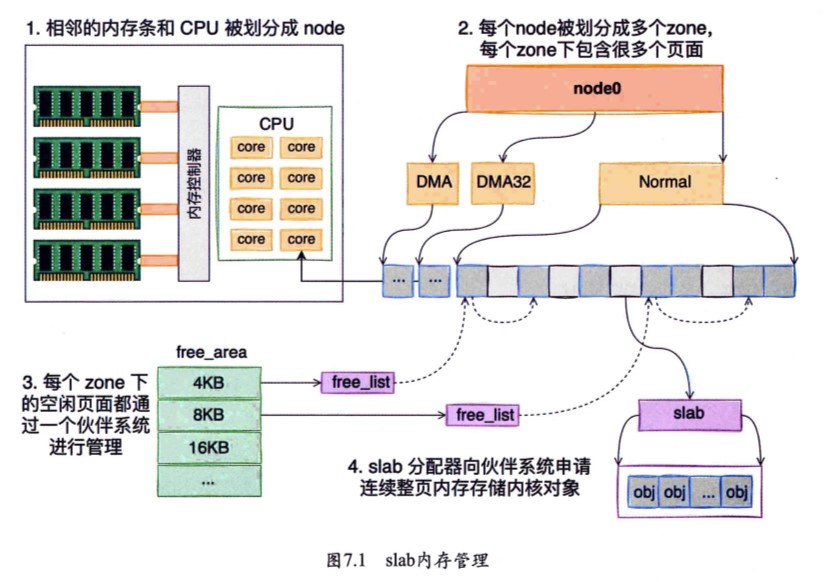

### Book：深入理解`linux`网络


[TOC]

> 前阵子看源码看书的时候，其实我是重在学习，也可以说成整体把握重在浏览，对`cpp`新特性，网络编程，数据库之类的有了个大体的了解，但是坦诚来说并没有把知识运用到实践，也很少对某个细致重要的点进行探究，所以本篇笔记大部分会为个人总结思考，有错误或者表述不当见谅该阶段的目标在于：
>
> **勤加思考，提升coding能力**。

> 业精于勤，荒于嬉；行成于思，毁于随。
>
> ——[唐]韩愈《进学解》


本文主要参考书籍：

《深入理解Linux网络： 修炼底层内功，掌握高性能原理 (张彦飞) 》


#### Chapt2 网络包从网卡送到协议栈

##### 内核的收包，中断


- `poll`底层应当是一个链表，发生再CPU对软中断请求的处理时首保

  （这里软中断也是为了尽快释放CPU资源，软中断发生了`linux`的后半段

- `poll`收到包后，会交给各个协议栈处理，对于TCP包，则会放入socket的接收队列中。

  进入接收队列之前，也是会先进入缓冲区。

- 8为何要唤醒用户进程？2为什么中断前要把帧送到内存，既然送到了为什么还要poll收包？

网卡中传入的帧会先被存入网卡的接收队列`RIngBuffer`中，找到`DMA`后，网卡向CPU发起硬中断，通知数据到达。

- 收包的过程也涉及了`poll`吗，`poll`的应用场景是什么

- 用户执行`recvfrom`调用了什么？为什么调用之后用户进程通过系统调用进行内核态工作？

  `recvfrom`就是接收数据时的系统调用，系统调用是发生在内核中。然后网卡将收到的数据DMA到内存的`RingBuffer`中，

  向CPU发起中断通知；内核线程`ksoftirqd`发现软中断到来时会关闭硬中断，利用`poll`处理软中断请求，`poll`将收到的数据到送到协议栈注册的函数中。

  **(内核接收数据，内存处理软中断和硬中断)**


软中断的数据包标记，其实就对应着`poll`的队列，`epoll`中的红黑树。

软中断就是在`ksoftirqd`内核线程中执行的。


`tcpdump`是网络抓包工具，主要工作在网络设备层。`netfilter`用于管理网络流量，一般实现在IP，ARP层。我们常说的协议栈指的是传输层和网络层。

`top`可以监控系统的性能和进程。


##### 文件传输，零拷贝

没有DMA之前的IO，就是进程阻塞，CPU对数据进行处理，处理完成后进程正常运行。这样的话每次IO中断对CPU都是依次很大的开销，不利于进程。因此`linux`对于快速的请求时仍然为硬中断由CPU处理，对于数据量比较大的请求，也成为软中断，会有DMA对其进行数据处理`ksoftirqd`线程利用poll对齐进行接收处理，将数据从磁盘控制器缓冲区`Ringbuffer`拷贝到内核缓冲区，`cpu`收到DMA的读完信号后，会将数据从内核缓冲区拷贝到用户缓冲区。

重点在于**`cpu`把自己要处理的中断请求丢给了DMA**，这样`cpu`可以在其中的间隙处理其它的进程。


从中我们可以发现，在进行文件传输时，我们需要进行四次拷贝，从**磁盘**到**内核缓冲区**到**用户缓冲区**再到**socket内核缓冲区**到**网卡**。其中过程的繁复可想而知。

1. `mmap+write`实现

大概就是在内核态和用户态的缓冲区中实现一个映射，使得内核缓冲区映射用户缓冲区，用户缓冲区再映射socket缓冲区，反正用户缓冲区也不会对数据进行操作，最终直接演变为数据从**内核缓冲区拷贝到socket缓冲区。**成功减少依次拷贝。不过映射归映射，上下文切换仍然四次，系统调用仍然两次。

2. `sendfile`

它也是让**内核缓冲区拷贝到socket缓冲区**，但是它通过替代两次系统调用，本身也拥有源和目的端的文件描述符。过程大概是系统从用户态上下文切换到内核态，调用`sendfile`从内核缓冲区到socket缓冲区，再DMA拷贝给网卡。实现了服务端的数据传输。

3. 零拷贝，利用`ethtool`看是否支持`scatter-gather`特性

如果支持，数据能够直接从**内核缓冲区经过`SG-DMA`拷贝到网卡**，只需要两次数据拷贝，两次上下文切换。

提高了一倍的数据传输效率。


#### Chapt3 协议栈处理完包后如何通知用户进程

本章主要对`epoll`进行分析。

##### socket创建

```cpp
//服务器监听来自所有网络接口的请求
// 创建一个新的套接字返回一个网络描述符
// 参数（IPV4地址，流式套接字，0默认协议对应流式为tcp）
int listenFd_ = socket(AF_INET, SOCK_STREAM, 0);
```


当软中断上收到数据包时，会通过调用`sk_data_ready`函数指针，唤醒sock上等待的进程。

至此，一个`AF_INET`协议族下的`SOCK_STREAM`对象就算创建完成，这里花费了一次socket系统调用的开销。

##### 同步阻塞IO

```cpp
int sk = socket(AF_INET, SOCK_STREAM, 0);
connect(sk, ...);
recv(sk, ...);
```

对于发送方而言，

首先创建`socket`，我们可以知道`socket`中会移动创造一个接收数据包的**接收队列**，和一个存放用户进程的**等待队列**。

**数据包抵达网卡**后，这里不是CPU对其进行处理，而是**DMA将其放在内存缓冲区`RingBuffer`**中，CPU会**先处理**耗时比较短的**硬中断**，然后**通知`ksofdttirqd`内核线程处理软中断**，内核线程会将DMA放在内存的帧转换为`skb`然后放入socket的接收队列中，同时内核线程处理软中断时会取出数据，因此也会同时**唤醒等待队列的进程**，告知`cpu`已经用好了。

###### Question1：

等待队列中的数据应该是`cpu`获得资源之后能进行处理的，那`socket`接收队列呢，作用是什么？

接收队列：存储到达的数据包，等待应用程序处理

等待队列：存储正在等待处理的连接请求 


总体工作流程：

`socket()`函数会进入内核创建内核对象。

`recv()`函数进入内核态之后查看接收队列，接收队列为空时，阻塞当前进程，直到队列不为空时，才会继续运行接收数据。完成之后让出`CPU`。

可以发现：

- 队列为空时`cpu`**等待**时间是不必要的性能开销
- `recv()`每次在接收队列中寻找就绪事件都需要**遍历**，时间复杂度为O(n)，这个有改善空间。
- 而且这个对于每个用户创建一个进程，低效。

另外，在模拟发送线程时，一般都会有个等待一个小小时间的操作，这里是为了让数据包能够传送到接收队列中，不至于`recv`时受不到数据浪费时间。


##### 多路IO复用——`epoll`

```cpp
listen(1fd, ...);
cfd1 = accept(...);
cfd2 = accept(...);
efd = epoll_creat(...); // 创建一个epoll对象

epoll_ctl(efd, EPOLL_CTL_ADD, cfd1, ...); // 向epoll对象添加要管理的链连接
epoll_ctl(efd, EPOLL_CTL_ADD, cfd2, ...);
epoll_wait(efd, ...); // 等待其管理的连接上的IO事件
```

`epoll`对以上同步阻塞IO出现的问题做出了很好的改进。

首先一张大图展示了`epoll`和进程的关系：


`eventpoll`是由`epoll_create`创建的内核对象，

`eventepoll`的结构如下图所示：


- 红黑树用来管理所有的socket连接；
- 等待队列：软中断数据就绪的时候会通过`wq`来找到阳塞在`epoll`对象上的用户进程。
- 就绪队列，连接就绪时，内核将就绪的连接放在链表中，节省每次需要遍历整棵树的时间；

**通过`epoll_ctl`添加socket时**

1. 分配红黑树节点对象`epitem`。

   1.1`epitem`中包含红黑树节点，`socket`文件描述符信息，所属`eventpoll`对象，等待队列等

2. 将等待事件添加到socket的等待队列中，其回调函数是`ep_ poll_callback` 

3. 将`epitem`插入`epol`对象的红黑树。

###### Question2 

红黑树在哪里起作用，等待队列中存放的到底是什么，插入红黑树节点时随便放位置吗

在`epoll_wait`中，它会观察就绪队列的链表中是否有数据，没有就创建一个等待队列项，加入`eventpoll`等待队列上，然后阻塞。让出CPU进入睡眠状态。

###### Question3

`epoll`是阻塞的，会将`socket`设置成非阻塞，为什么？

```cpp
int WebServer::SetFdNonblock(int fd) {
    assert(fd > 0);
    // 设置为非阻塞模式
    return fcntl(fd, F_SETFL, fcntl(fd, F_GETFD, 0) | O_NONBLOCK);
}
// webserver中
```

###### Question4

IO多路复用，是建立在阻塞还是非阻塞的基础上的？我感觉我连基本的同步异步，阻塞非阻塞都不是很理解，为什么呢？

- 阻塞需要等待两个过程，内核数据准备好，内核数据从内核态拷贝到用户态；对于非阻塞而言.
- `epoll的關鍵`在於減少了無用的进程上下文切换。

[深入揭秘` epoll `是如何实现 IO 多路复用的](https://www.zhihu.com/column/tencent-TEG)


#### Chapt4 内核如何发送网络包




#### 最后

其实之前看小林coding的计网，操作系统时，大概就看过了上面的知识，但是对源码的结合有限，很多地方直接摊开讲其中的理，我也大概明白什么意思，不过具体落在哪里又有点虚，这本书在于将各种源码分析的很清楚（要我自己去找那些源码看，联系`gpt`大抵看的会很艰难，感谢张老师），结合小林coding中较为有趣的讲解，两者结合的观感是很不错的。
