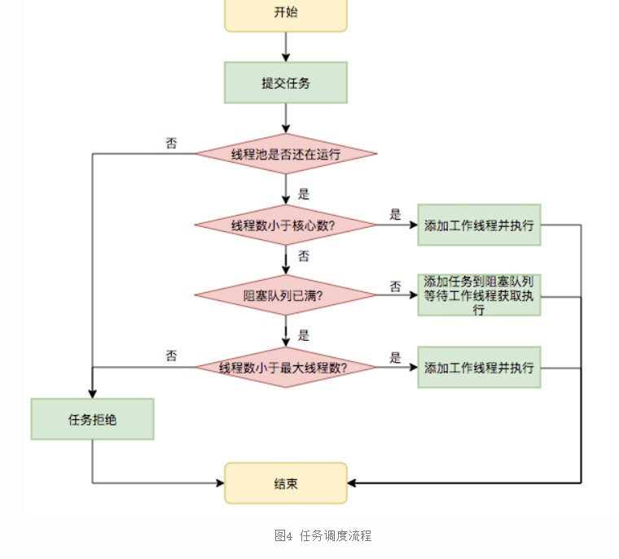

# 从面试角度重新看c++11的Webserver


## 从main函数开始审视整个流程

> WebServer server
>
> 端口1316，ET模式3，timeoutMs60000，优雅退出false；
>
> Mysql配置端口3306，用户名“root”，用户密码“root”，数据库名称“webserver”；
>
> 连接池数量12，线程池数量6，日志开关true，日志等级1，日志同步队列容量1024

#### 调用webserver的构造函数server()

获取当前工作目录，将资源文件夹加到当前工作目录之后进行处理客户端的资源文件；

设置`httpConn::userCount=0`，初始化数据库连接池；

事件模式初始化，设置为ET模式（边缘触发），同时初始化监听套接字；

初始化日志系统，指定日志级别，日志路径，队列大小，同时记录相关信息。


###### Q：线程池数量设置为6的原因

A：假设有8个CPU和8个线程，每个线程占用一个CPU，同一时间内八个线程同时运行，那么相比较5/6/7个线程，8个线程的效率是最高的。如果线程设置比cpu数量少，那么不能完全利用CPU，但是若线程设置比cpu数量高，那么会出现对于多线程对于效率的提升和多线程之间发生线程切换的消耗的衡量，可能发生线程越多效率越低的情况，最坏程序可能崩溃或者阐述二义性。


#### 调用server.start();

###### epoll用法


只要服务器未关闭`while(!isClose_)`:

1.倘若超时，获取下一个超时定时器的剩余时间，清楚超时节点。

作用：

- 动态设置epoll_wait的超时时间
- 协调定时任务和IO时间处理

```cpp
if(timeoutMS_ > 0) { timeMS = timer_->GetNextTick(); }
```

2.会调用`epoller_->wait(timeMS)`等待触发的事件数量，等待就绪事件

依次处理每个事件，通过epoller得到事件的文件描述符和事件类型，大致就是下图：


对于每件事情的处理，首先是处于监听状态DealListen

然后三次判断，比如关闭连接CloseConn，处理读操作DealRead，处理写操作DealWrite。

这里可以看出，整个项目的中心点在于：

- Q1：epoll和线程池如何接收来自客户端的请求，为什么说这是一个Reactor高并发模型
- Q2：http连接对于请求的接收和处理的过程
- Q3：定时器机制的优化的实现，单例和阻塞形成的异步日志系统

##### Q1epoll和线程池如何接收来自客户端的请求，为什么说这是一个Reactor高并发模型

###### DealListen

Reactor会先通过**监听**套接字的可读事件，**调用accept**接收该事件生成新的连接描述符放入红黑树中；

新连接建立后，Reactor开始监听该连接的可读事件，threadpool等待客户端发送请求之后调用**处理器**处理。

epoll能过监听文件描述符上的事件，包括新连接事件和普通的套接字读写事件。

如果用户数量在http能接收的范围内，那么调用addclient

addclient中会将整个新事件利用epoll_ctl注册该监控事件，同时为它设置定时器timer，同时需要设置为非阻塞，默认为阻塞。

###### DealRead/Dealwrite

这里面会在threadpool中加上相应的读写任务，同时调用定时器timer中调整最大超时时间

（注意掌握threadpool和timer，日志的结构，还有线程池中的任务什么时候被取出来执行）

###### CloseConn

从epoll中删除，关闭客户端。

（定时器在到期之后为定时删除）

###### 哇去，那http连接和sql连接什么时候调用

sql连接在http连接之内

HTTP连接：
在threadpool的onread,onwirte中调用了http连接，同时调用httpconn中的process()对client端的数据进行处理，处理完则让epoller修改状态到可写发送回client端，否则继续标识为可读。定时器和关闭连接中也都和httpconn有关。（又有问题，如何将EPOLLOUT的状态发回去）

就是write函数啊，从write函数中写出client的数据，发送给client；从read中读出数据，然后on process（那为什么onwrite中也有on process）

因为write中的onprocee的调用原因是在http处理长连接的时候，可以继续处理下一个请求，避免多次调用，当然这是在写完数据的情况下；如果因为写缓冲区满不能写时，会将其状态修改为可写，等待

（仔细回忆回忆httpconn的结构）


##### Q2：http连接对于请求的接收和处理的过程

> httprequest是读取缓冲区中的可读数据进行解析；
>
> httpresponse是对缓冲区中的可写数据进行写入。

- 浏览器发出http连接请求，主线程创建http对象接收请求同时将所有数据存到对应的buffer，将该对象插入任务队列，工作线程从任务队列中取出一个任务进行处理。
- 工作线程取出任务后，调用process_read函数，通过主从状态机对请求报文进行解析。
- 解析完成后，跳转do_request函数生成响应报文，通过process_write写入buffer，返回给浏览器端。

###### write：

```cpp
    // write核心逻辑在于iov中的多缓冲区的写入。
    // 将writev一次性写入文件描述符中，使用ET写数据，动态调整缓冲区指针和长度
    // ET模式下，循环继续，直到全部数据写出或者数据小于设定阈值。
```

###### read:

```cpp
// 循环读取到没有数据为止，
// ET模式下，文件描述符的事件只触发一次，除非有新的数据到达
```

在ReadFd(int fd, int* saveErrno)中，读取的数据就是从iov中得到的，并且移动的写指针，增加的可读数据。

ReadFd在read中会被调用。所以在各个读写过程中都会有iov和buffer。


##### Q3：定时器机制的优化的实现，线程池，单例和阻塞形成的异步日志系统

###### 定时器

这里定时器采用的是最小堆，因为本身并不需要多好的有序性，只需要知道有没有任务超时就可以。这个定时器的机制是：

- 主循环通过getNextTick()清楚超时节点，关闭相应连接释放资源，然后获取如今最小堆的超时时间，在epoll_wait中设置，若这个连接有IO事件，超时时间延长，调整最小堆。

- 定时器，将所有超时时间最小的设置为超时值，作为定时任务处理函数的定时时间。一旦定时任务处理函数被调用，超时时间最小的必然到期，那么可以处理这个定时器。

  然后再从剩余的定时器找出超时时间放在堆的最上面，同时将这段最小时间设置为下一次处理定时任务处理函数的定时值，如此反复实现精确的定时。

###### 线程池

```cpp
class ThreadPool {
	public:
		explicit ThreadPool(size_t threadCount = 8): pool_(std::make_shared<Pool>()) {
			assert(threadCount > 0);

			for (size_t i = 0; i < threadCount; ++i) {
				std::thread([pool = pool_] {
					std::unique_lock<std::mutex> locker(pool->mtx);
					while (true) {
						if (!pool->tasks.empty()) {
							auto task = std::move(pool->tasks.front());
							pool->tasks.pop();
							locker.unlock();
							task();
							locker.lock();
						} else if (pool->isClosed)break;
						else pool->cond.wait(locker);
					}
				}).detach();
			}
		}

		ThreadPool() = default;
		ThreadPool(ThreadPool&&) = default;
		~ThreadPool() {
			if (static_cast<bool>(pool_)) {
				std::lock_guard<std::mutex> locker(pool_->mtx);
				pool_->isClosed = true; // 关闭线程池
			}
			pool_->cond.notify_all();
		}

		template<class F>
		void AddTask(F&& task) {
			{
				std::lock_guard<std::mutex> locker(pool_->mtx);
				pool_->tasks.emplace(std::forward<F>(task));
			}
			pool_->cond.notify_one();
		}

	private:
		struct Pool {
			std::mutex mtx;
			std::condition_variable cond;
			bool isClosed;
			std::queue<std::function<void()>> tasks;
		};
		std::shared_ptr<Pool> pool_;
};
```

###### 单例模式和异步阻塞的日志系统

> 使用**单例模式**创建日志系统，对服务器运行状态、错误信息和访问数据进行记录，该系统可以实现按天分类，超行分类功能，可以根据实际情况分别使用同步和异步写入两种方式。
> 其中异步写入方式，将生产者-消费者模型封装为阻塞队列，创建一个写线程，工作线程将要写的内容push进队列，**写线程从队列中取出内容，写入日志文件**。

单例模式是什么，为什么设置这个模式？为什么要异步阻塞写日志？你设置了日志等级，什么作用？

单例模式：某个类只有一个实例，提供一个全局访问点，能够被所有模块共享。由于一个实例，因此禁止了拷贝构造函数，不过好像没有禁止赋值构造，赋值构造应该能够通过move转移拥有者，串了，这是unique_ptr能这么做，单例模式应该不行吧，确实不行，它被禁用了，技术上可以，但是不建议。

###### 异步和同步

**写入日志时会产生比较多的系统调用，若是某条日志信息过大，会阻塞日志系统，造成系统瓶颈**。异步方式采用**生产者-消费者模型**，具有较高的并发能力。
生产者-消费者模型，并发编程中的经典模型。
以多线程为例，为了实现线程间数据同步，生产者线程与消费者线程**共享一个缓冲区**，其中生产者线程往缓冲区中push消息，消费者线程从缓冲区中pop消息。
阻塞队列，将生产者-消费者模型进行封装，使用循环数组实现队列，作为两者共享的缓冲区。

1. 异步日志，**将所写的日志内容先存入阻塞队列，写线程从阻塞队列中取出内容，写入日志**。可以提高系统的并发性能。
2. 同步日志，日志写入函数与工作线程串行执行，由于涉及到I/O操作，当单条日志比较大的时候，同步模式会阻塞整个处理流程，服务器所能处理的并发能力将有所下降，尤其是在峰值的时候，写日志可能成为系统的瓶颈。

写入方式通过初始化时**是否设置队列大小**（表示在队列中可以放几条数据）来判断，若队列大小为0，则为同步，否则为异步。若异步，则将日志信息加入阻塞队列，同步则加锁向文件中写。

##     webserver

强推：这个博客写的很仔细，文章也有部分参考他的[webserver面试题汇总-AWei’s blog](https://aweiii.work/posts/23109e98/)

### 总体

#### 1.介绍一下这个项目的框架。

该项目是基于linux的轻量级多线程web服务器。在应用层实现了一个简单的HTTP服务器。

利用**epoll**的IO复用技术同时监听多个请求，和**线程池**处理请求，共同实现了一个**多线程的Reactor高并发模型**；主线程负责监听，监听到有read/wirte事件之后从socket中读取事件，然后将读取的数据封装成一个请求对象放入队列，睡眠在请求队列上的工作线程被唤醒进行处理，使用**状态机**对报文进行处理。

为了进一步对该过程进行优化，添加了**定时器**用于关闭超时的非活动连接；添加了利用**单例模式和阻塞队列实现的异步日志系统**，记录服务器的运行状态；添加了**数据库连接池**实现用户的注册登录功能。

总结下来主要分为三个模块：

- IO处理单元：httpconn，httprequest，httpresponse，buffer

- 逻辑单元：epoll，threadpool，timer，log，blockqueue

- 网络存储单元：sqlconnRALL


再次放上这两张图，感觉还是很好的。


#### 2.该项目利用c++14实现，如何在项目中体现的。

（2,3两个问题应该可以跳转到后面的相关问题）

- 线程池中用了智能指针，lambda函数，右值引用
- RALL，auto
- 原子类型，traits，模板别名，SFINEA


#### 3.你认为你的项目好在哪里，有哪些不足（你做了什么优化）

使用的是“边沿触发（EPOLLET）+非阻塞IO”模式，但是只调用了一次IO，没有循环遍历直到数据为空。这样就产生了一个问题，如下：如果给了1000个连接请求，在60S时间内，但是实际接收的连接数不到一半。这是因为每次触发只调用一次IO时，一次只能accept一个连接请求，那么需要不断的连接请求触发，才能继续accept连接，效率非常低。但是使用了while循环遍历直至数据为空之后，同样的测试，服务器能接收全部的连接请求，其原因就是一次触发就可以处理该次触发所接收的所有连接请求，大大减少了epoll_wait系统调用，减小了内核资源消耗。

「单 Reactor」的模式存在一个问题，因为一个 Reactor 对象承担所有事件的监听和响应，而且只在主线程中运行，在面对瞬间高并发的场景时，容易成为性能的瓶颈的地方。这个也是WebServer这个项目存在的瓶颈之一。


### Epoll

#### 1.介绍一下你在项目中使用的IO复用模型，相比其它模型为什么选择这个。

##### 1.1[五种IO模型](https://blog.csdn.net/weixin_47887421/article/details/125838311?ops_request_misc=%257B%2522request%255Fid%2522%253A%252210E87744-1345-418B-A5DD-4BDEC7B9584F%2522%252C%2522scm%2522%253A%252220140713.130102334.pc%255Fall.%2522%257D&request_id=10E87744-1345-418B-A5DD-4BDEC7B9584F&biz_id=0&utm_medium=distribute.pc_search_result.none-task-blog-2~all~first_rank_ecpm_v1~rank_v31_ecpm-15-125838311-null-null.142^v100^control&utm_term=webserver%E9%9D%A2%E8%AF%95%E9%A2%98&spm=1018.2226.3001.4187)

- 阻塞
- 非阻塞
- IO复用
- 信号驱动
- 异步


##### 1.2IO多路复用技术

[select/poll 数组链表](https://xiaolincoding.com/os/8_network_system/selete_poll_epoll.html)

epoll红黑树

（之前文章里面有，就不再分析了，[小林coding](https://xiaolincoding.com/os/8_network_system/selete_poll_epoll.html#%E6%9C%80%E5%9F%BA%E6%9C%AC%E7%9A%84-socket-%E6%A8%A1%E5%9E%8B)也讲的挺好）


##### 1.3事件处理模式[Reactor和Proactor](https://xiaolincoding.com/os/8_network_system/reactor.html)

之前文章也有，不讲了，详细说一下代码中Reactor的使用过程。

**主线程**首先通过epoll_wait监听，等待事件发生。

**如果监听到的事件描述符仍然为监听**，那么调用accept函数，接收到客户端信息后，分别在timer中添加计时器，epoller中加上文件描述符的信息，同时注意设置事件为非阻塞，主要是为了提高并发能力，阻塞会导致无法处理其它任务，同时可能导致死锁或者饥饿。

**如果监听的事件为读或者写的事件**，更新该事件定时器，同时将事件传给线程池，线程池做的事情在线程池那部分再讲。


#### 2.讲一下ET和LT是什么，你怎么选择，使用的什么模式。对于缺点有什么解决方式。

> 阻塞和非阻塞，异步和同步

假设委托内核检测读事件，检测fd的读缓冲区

**水平触发LT(Level Trigger)**：只要缓冲区有数据，就一直触发，直到缓冲区无数据。如果用户只读一部分数据，或者用户不读数据，只有缓冲区还有数据，就会一直触发。除非缓冲区的数据读完了，才不通知。LT是一种默认的工作方式，同时支持block和non-block socket。**（读一次）**

**边缘触发ET(Edge Trigger)**: 缓冲区从无数据到有数据时，epoll检测到了会给用户通知。如果用户不读数据，数据一直在缓冲区，epoll下次检测的时候就不通知；如果用户只读了部分数据，epoll不通知。直到下一次客户端有新的数据包到达时，`epoll_wait`才会再次被唤醒。**（循环读）**

ET只支持no-block socket，在这种模式下，当描述符从**未就绪**变为**就绪**时，内核通过epoll告诉你，然后它会假设你知道文件描述符已经就绪，并且不会再为那个文件描述符发送更多的就绪通知，直到做了某些操作导致那个文件描述符不再为就绪状态。如果一直不对这个fd做IO操作（从而导致它在此变为未就绪），内核不会发送更多的通知。

ET在很大程度上减少了epoll事件被重复触发的次数，因此效率比LT高。epoll工作在ET模式的时候，必须使用非阻塞接口，**以避免由一个文件句柄的阻塞读/写操作 而把多个文件描述符的任务饿死**。


#### 3.详解一下epoll的底层原理。

> 去看源码。
>
> 并行和并发
>
> [深入理解epoll](https://www.cnblogs.com/cangqinglang/p/15307369.html)


### Threadpool

> 其实webserver中已经包含了常见的池化思想，比如数据库连接池，线程池
>
> 1. 内存池(Memory Pooling)：预先申请内存，提升申请内存速度，减少内存碎片。
> 2. 连接池(Connection Pooling)：预先申请数据库连接，提升申请连接的速度，降低系统的开销。
> 3. 实例池(Object Pooling)：循环使用对象，减少资源在初始化和释放时的昂贵损耗。

#### 1.讲讲线程池是如何实现的，有没有其它实现方式。

[Java线程池实现原理及其在美团业务中的实践](https://tech.meituan.com/2020/04/02/java-pooling-pratice-in-meituan.html)语言为java，因此不参考代码，只参考理论。

- 一方面避免了处理任务时**创建销毁线程开销**的代价，
- 另一方面避免了线程数量膨胀导致的**过分调度**问题，保证了对内核的充分利用。

线程池解决的**核心问题**就是资源管理问题。在内部实际上构建了一个生产者消费者模型，将线程和任务两者解耦，并不直接关联，从而良好的缓冲任务，复用线程。

线程池的运行主要分成两部分：任务管理、线程管理。

任务管理部分充当生产者的角色，当任务提交后，

线程池会判断该任务后续的流转：（1）直接申请线程执行该任务；（2）缓冲到队列中等待线程执行；（3）拒绝该任务。线程管理部分是消费者，它们被统一维护在线程池内，根据任务请求进行线程的分配，当线程执行完任务后则会继续获取新的任务去执行，最终当线程获取不到任务的时候，线程就会被回收。




#### 2.手撕线程池


#### 3.detach和join的区别

在声明一个std::thread对象之后，都可以使用detach和join函数来启动被调线程，区别在于两者是否阻塞主调线程。
（1）当使用join()函数时，主调线程阻塞，等待被调线程终止，然后主调线程回收被调线程资源，并继续运行；

（2）当使用detach()函数时，主调线程继续运行，被调线程驻留后台运行，主调线程无法再取得该被调线程的控制权。当主调线程结束时，由运行时库负责清理与被调线程相关的资源。

join：线程执行完成时函数返回。这将会同步此函数返回的时刻和线程中所有操作的完成：这个会阻塞函数主线程的执行，直到构造时调用的函数返回。

一旦thread对象调用了detach，线程与thread对象将不再有关联，我们也没有直接的方式与线程通信，也不再能join或detach该线程，此时线程的所有权属于C++运行时库，它保证在线程退出时相关资源被回收。分离的线程通常称为守护进程，它们通常在程序的整个生命周期运行，做一些监控、清理工作。同样的thread对象只能被detach一次。


#### 4.线程池的工作过程，是一直等待吗，处理完一个任务后什么状态，如果某个线程占用时间过久有考虑过这个问题吗

是在一直等待，直到有数据可以处理。处理完任务后继续处于等待状态，当某个线程占用时间过久可以设置超时机制，使用定时器强制终止或者重启该线程，避免长时间的资源浪费。


#### 5.1000个客户端同时访问请求，如何及时处理每一个呢

该项目是基于IO复用的并发模式。**需要注意的是，不是一个客户连接就对应一个线程**，本项目通过**对子线程循环调用**来解决高并发的问题的。
首先在创建线程的同时就调用了detach将线程进行分离，不用单独对工作线程进行回收，资源自动回收。
我们通过在子线程中进行while循环，让每一个线程池中的线程永远都不会停止，主线程监听到IO事件后将任务添加到任务队列中，如果没有任务，线程就一直阻塞等待，有任务线程就抢占式进行处理，直到请求队列为空，表示任务全部处理完成。
**如果速度还是慢，那就只能够增大线程池容量**，或者考虑集群分布式的做法。


#### 6.进程间通信方式

##### 6.1简述进程和线程

###### 进程

*进程是什么*

我们在运行一份有代码的可执行文件时，它会被装载到内存中，然后cpu会执行其中的指令，这个运行的程序成为进程。

*进程存在的过程是什么样子的*

01 创建。申请空白的PCB填写控制和管理信息，比如进程标识等；并且为它分配资源，然后插入就绪队列等待被调度运行。

> *PCB是什么，就绪是什么*
>
> PCB，进程控制块，是进程存在的唯一标识，其中包含进程标识符，用户标识符，进程当前状态，资源分配清单，cpu相关信息等。它的底层是链表，相同状态的进程通过链表放在一起，组成我们常说的就绪队列。
>
> 就绪是进程的存在状态，进程还有就绪，运行，阻塞，创建结束这些状态。

02 终止。三种方式，正常结束，异常结束，外界干预（比如kill）。终止过程，在归还资源前分配cpu资源，将子进程交给其它进程，同时终止PCB将其从相应队列中删除。

03 阻塞。自己调用阻塞，找到PCB，保护现场，修改状态，停止运行，更换PCB为阻塞队列。

04 唤醒。阻塞时等待其它进程唤醒，找到PCB，将其从阻塞队列中移除，，状态修改为就绪，进入就绪队列。


###### 线程

*线程是什么*

线程是进程当中的一条执行流程。同一个进程多个线程之间可以共享代码段，数据段，打开的文件资源；线程也会有自己独立的寄存器和栈。某个进程下的线程之间可以并发，可以共享地址空间和文件资源。

在此一问[线程崩溃了，进程也崩溃吗](https://mp.weixin.qq.com/s/easnVQ75Rq-C07W4YWeclQ)

> **用户线程，内核线程，轻量级线程的区分。**
>
> **进程的调度算法（主要是抢占资源），调度原则**


进程是资源分配的基本单位，线程是cpu调度的基本单位。


##### 6.2 linux进程间通信

[进程间通信](https://xiaolincoding.com/os/4_process/process_commu.html#%E7%AE%A1%E9%81%93)

明确，进程间的用户地址空间是独立的，但是内核地址空间共享，需要通过内核

- 管道。匿名管道和命名管道。

  

- 消息队列：保存在内核中的消息列表。不适合大数据传输，存在内核和用户态之间的开销。

- 共享内存：拿出两块虚拟空间，映射到相同的物理内存。

- 信号量：信号量其实是一个整型的计数器，主要用于实现进程间的互斥与同步，而不是用于缓存进程间通信的数据。采用PV操作。

- 信号：对于异常情况下的工作模式，就需要用「信号」的方式来通知进程。

  信号是进程间通信里唯一的异步通信机制。

- socket：用于跨网络和不同主机之间的通信。也可以用于本地进程，有三种方式，基于TCP，基于UDP，本地进程间通信。


> 跨进程之间的最大问题是通信。
>
> 而对于线程而言，线程之间的共享变量很容易实现线程间通信，因此线程面临的最大问题是
>
> [线程间冲突](https://xiaolincoding.com/os/4_process/multithread_sync.html#%E7%AB%9E%E4%BA%89%E4%B8%8E%E5%8D%8F%E4%BD%9C)


### SqlconnRALL

#### 1.这个数据库连接池是如何实现的，有没有其它方案，有没有改进点和优势点

1. 池是资源的容器，这组资源在服务器启动之初就被完全创建好并初始化，本质上是对资源的复用。

   当系统开始处理客户请求的时候，如果它需要相关的资源，可以直接从池中获取，无需动态分配；当服务器处理完一个客户连接后,可以把相关的资源放回池中，无需执行系统调用释放资源。

2. 若系统需要频繁访问数据库，则需要频繁创建和断开数据库连接，而创建数据库连接是一个很耗时的操作，也容易对数据库造成安全隐患。

   在程序初始化的时候，集中创建多个数据库连接，并把他们集中管理，供程序使用，可以保证较快的数据库读写速度，更加安全可靠。

3. 使用单例模式和链表创建数据库连接池，实现对数据库连接资源的复用。

   连接池的功能主要有：初始化，获取连接、释放连接，销毁连接池
   连接池中的多线程使用信号量进行通信，使用互斥锁进行同步。

   

#### 2.如何保障安全的数据输入（涉及数据库，上回面试碰到了，结果不会，痛定思痛）


#### 3.介绍一下RALL

RAII全称是“Resource Acquisition is Initialization”，直译过来是“资源获取即初始化”.
RAII的核心思想是将资源或者状态与对象的生命周期绑定，通过C++的语言机制，实现资源和状态的安全管理,智能指针是RAII最好的例子
具体来说：**构造函数的时候初始化获取资源，析构函数释放资源**


### HTTPConn

#### 1.介绍一下你的报文解析和响应过程，画一下相关的过程图。


#### 2.HTTP的报文格式。GET和POST的区别。HTTP的协议版本。HTTP的状态码等等(都是HTTP计网的八股)

#### 3.HTTP和HTTPs

八股


#### 4.介绍一下缓冲区的设计

在有IO事件发生时，要先把数据读取到缓冲区中，再从缓冲区读取出来进行处理。

首先我们在内存中创建一个缓冲区，缓冲区的大小为1024字节，同时定义两个指针，一个读指针，表示的是可以读取的数据的开始位置，一个写指针表示的是可以写入数据的起始位置，开始的时候两根指针都是指向内存开始的地方。
因为缓冲区的大小是固定的大小，**但ET模式需要一次性将数据全部读取到缓冲区**，那么就有可能装不下数据，所以需要临时创建一个缓冲区来缓解，将存不下的放到临时缓冲区，这样就可以一次性将所有的数据读入，这里利用临时缓冲区的技术是一个分散读的技术，即将数据**分散读**取到内存中不同的位置，再使用Append将两块内存中的数据拼接到一起。
Append在缓冲区空间不足时会发生扩容，**扩容原则**：

1. WritableBytes() >= len，无需扩容
2. WritableBytes() < len
   1. 已读+可写 >= len，覆盖掉已读内容
   2. 已读+可写 < len，resize数组


####  分散读和分散写

1. 分散读发生在从socket缓冲区读取数据的阶段，第一块内存是用户缓冲区readBuff_，第二块内存是一块临时缓冲区，目的是为了保证将socket缓冲区的数据读完。

2. 分散写发生在将响应写入socket阶段，第一块内存是writeBuff_，保存着响应的一些信息，组成响应头部；第二块内存使用mmap将被请求的文件映射到共享内存，调用writev将两块内存分散写入socket缓冲区。

   

#### 5.状态机

在逻辑处理模块中，响应HTTP请求采用主从状态机来完成
传统的控制流程都是按照顺序执行的，状态机能处理任意顺序的事件，并能提供有意义的响应——即使这些事件发生的顺序和预计的不同。
项目中使用主从状态机的模式进行解析，**从状态机（parse_line）负责读取报文的一行，主状态机负责对该行数据进行解析，主状态机内部调用从状态机，从状态机驱动主状态机**。
每解析一部分都会将整个请求的**check_state状态**改变，状态机也就是根据这个状态来进行不同部分的解析跳转的

> 状态机的转移图


### Timer

#### 1.为什么用定时器，定时器如何实现的。

由于非活跃连接占用了连接资源，严重影响服务器的性能，通过实现一个服务器定时器，处理这种非活跃连接，释放连接资源。

由于定时器的触发是由于时间到了，因此只有时间最短的定时器会首先被触发，通过这个原理，我们可以采用最小堆，将按时间顺序排序，堆顶元素是时间最短的定时器，因此只要判断堆顶元素是否被触发即可。只有堆顶定时器的时间到了，才会到其他时间较晚的定时器的时间。
定时器利用结构体将Http连接对应的fd、有效期、回调函数等封装起来。
服务器主循环每建立一个连接则为该连接创建一个定时器节点，插入到最小堆中，主循环通过GetNextTick()清除超时的节点，关闭对应连接，释放连接资源，然后获取最先要超时的连接的**超时的时间**，并设置下一次epoll_wait()的超时时间为该时间。当已建立的连接有IO事件时，延长这个连接的超时时间，调整最小堆

#### 2.最小堆和双向链表的相关知识。

时间复杂度：添加：O(logn)， 删除：O(logn)
工作原理：
将所有定时器中超时时间最小的一个定时器的超时值，作为定时任务处理函数的定时值。这样，一旦定时任务处理函数被调用，超时时间最小的定时器必然到期，我们就可以在定时任务处理函数中处理该定时器。
然后，再次从剩余的定时器中找出超时时间最小的一个（堆），并将这段最小时间设置为下一次定时任务处理函数的定时值。如此反复，就实现了较为精确的定时。


### Log

#### 1.介绍一下单例模式和阻塞队列形成的日志，你为什么这么实现日志系统，有什么好处。

使用**单例模式**创建日志系统，对服务器运行状态、错误信息和访问数据进行记录，该系统可以实现按天分类，超行分类功能，可以根据实际情况分别使用同步和异步写入两种方式。
其中异步写入方式，将生产者-消费者模型封装为阻塞队列，创建一个写线程，工作线程将要写的内容push进队列，**写线程从队列中取出内容，写入日志文件**


#### 2.手写单例模式。单例模式的双重锁和静态成员变量


#### 3.阻塞队列的原因

#### 异步和同步

**写入日志时会产生比较多的系统调用，若是某条日志信息过大，会阻塞日志系统，造成系统瓶颈**。异步方式采用**生产者-消费者模型**，具有较高的并发能力。
生产者-消费者模型，并发编程中的经典模型。
以多线程为例，为了实现线程间数据同步，生产者线程与消费者线程**共享一个缓冲区**，其中生产者线程往缓冲区中push消息，消费者线程从缓冲区中pop消息。
阻塞队列，将生产者-消费者模型进行封装，使用循环数组实现队列，作为两者共享的缓冲区。

1. 异步日志，**将所写的日志内容先存入阻塞队列，写线程从阻塞队列中取出内容，写入日志**。可以提高系统的并发性能。
2. 同步日志，日志写入函数与工作线程串行执行，由于涉及到I/O操作，当单条日志比较大的时候，同步模式会阻塞整个处理流程，服务器所能处理的并发能力将有所下降，尤其是在峰值的时候，写日志可能成为系统的瓶颈。

写入方式通过初始化时**是否设置队列大小**（表示在队列中可以放几条数据）来判断，若队列大小为0，则为同步，否则为异步。
若异步，则将日志信息加入阻塞队列，同步则加锁向文件中写


### 其它

#### 1.webbench的原理

1. WebBench是一款在Linux下使用非常简单的压力测试工具。
2. 原理：父进程 fork 若干个子进程，每个子进程在用户要求时间或默认的时间内对目标 web 循环发出实际访问请求，父子进程通过管道进行通信，子进程通过管道写端向父进程传递在若干次请求访问完毕后记录到的总信息，父进程通过管道读端读取子进程发来的相关信息，子进程在时间到后结束，父进程在所有子进程退出后统计并给用户显示最后的测试结果，然后退出。Webbench最多可以模拟3万个并发连接去测试网站的负载能力。


#### 2.web的域名是主动申请的吗


#### 3.你做的这个项目测试性能了吗，测试性能的指标是什么，你的优化方式是什么提升了多少性能。

原项目用webbench测试，4核8G的服务器能达到百万级QPS，我在自己的服务器上使用webbench测试过，client数量达到4800是0 failed，但到4900，fork就会失败，提示进程已达上限。这时的QPS只有2500左右。


#### 4.为了减少系统调用所作的工作（线程池，缓存机制：零拷贝，读写锁）

- 线程池
- 零拷贝

