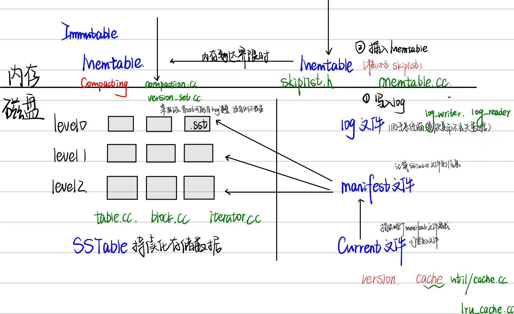

# Leveldb源码阅读1

### 引言

一直听说这个项目的质量很高，终于来见识一下了。今天剩余时间不多，重在理清以下两个问题就行。

> - 为什么会出现leveldb，谷歌怎么想到实现它的，它的作用是什么。
> - leveldb的代码结构是什么样子，涉及到哪些熟悉或者不熟悉的知识点。

### 正文

##### Leveldb的特点

levelDb是能够处理**十亿级别规模Key-Value型**数据**持久**性存储的C++ 程序库。官方网站报道其随机写性能达到40万条记录每秒，而随机读性能达到6万条记录每秒。总体来说，LevelDb的写操作要大大快于读操作，而顺序读写操作则大大快于随机读写操作。

- leveldb是一个持久化存储的KV系统，Redis是一种内存型的KV系统，因此leveldb对内存消耗少，大部分数据存储在**磁盘**上。

- leveldb存储数据时，**按照记录的key值有序存储**，相邻的key值在存储文件中以此顺序存储，而应用可以自定义key大小笔记函数，leveldb可以按照用户定义的比较函数存储记录。

  > 对redis了解过少，需要看看。
  >
  > 推荐文章：[既生 Redis 何生 LevelDB ？](https://cloud.tencent.com/developer/article/1380665)
  >
  > **Redis**是一个基于内存的键值存储系统，支持持久化，复制，事务等功能。它的数据存储在内存中，读写性能很高。常用于缓存，消息队列等场景。
  >
  > Redis 和持久层数据库之间的数据一致性是由应用程序自己来控制的。应用程序会优先去缓存中获取数据，当缓存中没有数据时，应用程序需要从持久层加载数据，然后再放进缓存中。当数据更新发生时，需要将缓存置为失效。
  >
  > **leveldb**是一个持久化存储的KV系统，使用SSD硬盘存储。具有高性能，稳定性好等特点，适用于大规模数据存储和快速查询的场景。
  >
  > LevelDB 将 Redis 缓存和持久层合二为一，一次性帮你搞定缓存和持久层。

- leveldb的**操作接口和**大多数KV系统一样，基本操作包括写记录，读记录，针对多条操作的原子批量操作等。

- leveldb另外支持**数据快照**（读取操作不受写操作影响，可以在读时始终看到一致的数据），**数据压缩**（减少存储空间，增快io效率）等操作。

##### Leveldb的结构

###### 静态结构

leveldb的静态结构主要有六个部分：

内存中：MemTable, Immutable MemTable

磁盘上：Current, Manifest, log, SSTable

leveldb是一种**基于operation log的文件系统，是Log-Structured-Merge Tree的典型实现**.

当**op log文件**大小超过限定值时，就定时做**check point**。Leveldb会生成新的Log文件和**Memtable**，后台调度会将**Immutable Memtable**的数据导出到磁盘，形成一个新的**SSTable**文件。SSTable就是由内存中的数据不断导出并进行**Compaction操作**后形成的，而且SSTable的所有文件是一种层级结构，第一层为Level 0，第二层为Level 1，依次类推，层级逐渐增高，这也是为何称之为LevelDb的原因。

###### 基本操作

**写入操作：**当应用写入一条Key:Value记录的时候，LevelDb会先往log文件里写入，成功后将记录插进Memtable中，只涉及一次磁盘顺序和一次内存写入。

###### 文件夹

- **db/ 文件夹**：这是 LevelDB 的核心部分，包含数据库的主要功能，如数据存储、查找、更新、删除等。重点阅读 `db_impl.cc`、`version_set.cc` 等文件，这些文件处理数据库的核心操作。

- **table/ 文件夹**：处理 SSTable 文件（LevelDB 的数据格式）。`table` 模块管理数据的写入和读取，重要文件如 `block.cc`、`table.cc`。
- **util/ 文件夹**：包含工具类和一些辅助功能的实现，如 `env.cc` 处理文件系统和操作系统的接口，`coding.cc` 包含编码和解码逻辑。
- **port/ 文件夹**：处理跨平台的细节实现，主要是系统相关的接口。如果不是做跨平台开发，可以略读。

##### Leveldb的基础知识

- Leveldb内部通过双向链表实现了一个标准版的LRUCache，内部自己实现了hashtable
- skip list是实现memtable的核心数据结构，memtable的KV数据都存储在skip list中
- log和LSM树
- util中的Arena内存池，CRC32，Random等
- 基本数据结构：slice，布隆过滤器，LRU

### sum

大致看了以下，有几篇文章还挺不错的，估计先按照别人博客的思路走。（果然经典源码肯定会有大佬的博客分析，太赞了）

1.[leveldbhandbook](https://leveldb-handbook.readthedocs.io/zh/latest/basic.html)

评价：各部分知识点讲解很全面，但是很少把源码拿出来分析，重在讲解思路

2.[leveldb源码阅读 - 一只安静的猫](https://www.myway5.com/index.php/articles/)

评价：知识不全面，但是整体框架很好，也联系了源码。

3.[深入浅出leveldb](https://blog.mrcroxx.com/categories/%E6%B7%B1%E5%85%A5%E6%B5%85%E5%87%BAleveldb/)

源码和图片都有，但是花里胡哨的字体代码排版），也可以看看。

4.[漫谈leveldb数据结构](https://www.qtmuniao.com/categories/%E6%BA%90%E7%A0%81%E9%98%85%E8%AF%BB/leveldb/)

只讲了leveldb的数据结构，可供参考。

最终决定自底而上看。因为还没看源码，先确立个大致路线，后面可能会有适当变化

slice — log(LSM) — memtable(skiplist) — sstable(Bloom Filter) — cache(LRU) — 基本操作(iterator) — compaction — read&write — version

### 参考资料：

1. code : [github - google leveldb](https://github.com/google/leveldb/tree/main)

2. 阅读笔记：

   [LevelDB 源码分析「一、基本数据结构」](https://sf-zhou.github.io/leveldb/leveldb_01_data_structure.html)

   [Leveldb代码阅读笔记 - codedump](https://www.codedump.info/post/20190215-leveldb/#%E6%95%B4%E4%BD%93%E6%9E%B6%E6%9E%84)

   [数据分析与处理之二（Leveldb 实现原理） - Haippy - 博客园 (cnblogs.com)](https://www.cnblogs.com/haippy/archive/2011/12/04/2276064.html)

   [CppGuide/articles/leveldb源码分析 at master · balloonwj/CppGuide · GitHub](https://github.com/balloonwj/CppGuide/tree/master/articles/leveldb源码分析)

   [leveldb-handbook — leveldb-handbook 文档](https://leveldb-handbook.readthedocs.io/zh/latest/index.html)

3. 扩展

   [Reveldb 与 Kyoto Tycoon 性能对比(一) - Haippy - 博客园 (cnblogs.com)](https://www.cnblogs.com/haippy/archive/2013/01/03/2843163.html)