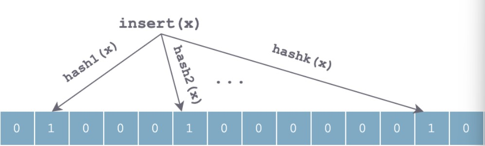
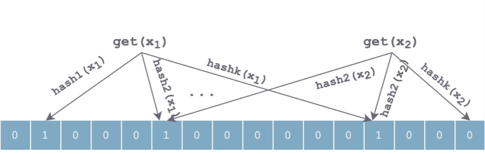

# leveldb源码阅读4 - snapshot,Filter,


## snapshot

*snapshot是什么，有什么用*

snapshot是一种机制，用于在数据库**读取时保持一致**的视图，确保在读取数据时，写入操作不会影响读取结果，从而提供一种简单的**并发**控制方式。LevelDB 的快照机制通过**版本管理**和**引用计数**来实现一致性读取，确保读操作在写入操作发生时不会受到影响。版本管理机制在leveldb5中会讲解，这里暂时掠过。


这个.h文件中的信息有限，主要是有三个类：

```cpp
/*
`Snapshot` 是一个通用的快照接口或基类。
*/

/* 
表示一个具体的快照实例，包含一个序列号和指向前后快照的指针
序列号的主要作用是提供快照创建时数据库状态的唯一标识
双链表，便于快速插入和删除
*/
class SnapshotImpl : public Snapshot{
public:
    ...
private:
  friend class SnapshotList;

  // SnapshotImpl is kept in a doubly-linked circular list. The SnapshotList
  // implementation operates on the next/previous fields directly.
  SnapshotImpl* prev_;
  SnapshotImpl* next_;

  const SequenceNumber sequence_number_;
}

/*
* 管理多个SnapshotImpl的链表结构，处理快照的创建和删除
*/
class SnapshotList {
public:
  ...
private:
  // Dummy head of doubly-linked list of snapshots 虚拟头结点
  SnapshotImpl head_;
}
```


> 当leveldb进行读操作时，过程如下
>
> - 接收读取请求，查询Memtable和Immutable Memtable（内存）
> - 查询blockcache（blockcache中存储了从sstable中读取的data数据块）
> - 如果此时还没找到，就会进入磁盘中，通过**布隆过滤器**定位sstable文件
> - 如果找到，读取sstable中的datablock，否则返回没有找到。

在这个过程中，为了减少读放大的两个措施：

1. 采用major compaction尽量减少sstable文件
2. 利用布隆过滤器进行快速筛选，看key是否在某个sstable文件中


## Bloom Filter

#### bloom filter的数据结构

推荐文章：[bloom filter](https://blog.csdn.net/jiaomeng/article/details/1495500)

**初始状态**：

Bloom Filter底层是一个m位的位数组，每一位置为0

当插入某个元素时，会利用k个哈希函数对x进行散列，然后按照数组长度取余后置相应位置为1：



查找和插入过程类似，也是利用相同的哈希对待元素查找顺序进行哈希，得到k个位置。

如果所有位上均为1，那么元素有可能存在；如果有位上不为1，那么元素一定不存在。



相对于其他表示数据集的数据结构，如平衡二叉搜索树、Trie 树、哈希表，甚至更简单的数组或者链表，Bloom Filter 有着巨大的时空优势。上述提到的表示数据集的数据结构，大都需要对数据项本身存储，可能有的做了压缩，比如 Trie 树。但是 Bloom Filter 走了另一条路，并不存储数据项本身，而是存储数据项的几个哈希值，并且用高效紧凑的位数组来存，避免了指针的额外开销。

这种优势的获得，可以理解为在哈希表基础上，忽略了冲突处理，从而省下了额外开销。


#### 数学结论

跟布隆过滤器的误判率有关的参数有：

1. 哈希函数的个数 k
2. 布隆过滤器位数组的容量m;
3. 布隆过滤器插入的数据数量n;

因此根据[一系列推导](http://blog.csdn.net/jiaomeng/article/details/1495500)可以得到：

1. 为了获得最优的准确率，当k = ln2 * (m/n)时，布隆过滤器获得最优的准确性；
2. 在哈希函数的个数取到最优时，要让错误率不超过є，m至少需要取到最小值的1.44倍；


#### 源码实现

##### filter_policy抽象基类，定义过滤器策略

```cpp
class Slice;

class LEVELDB_EXPORT FilterPolicy {
 public:
  // 虚析构函数，保证派生类正确清理资源
  virtual ~FilterPolicy();

  // 返回过滤策略的名称，如果过滤器的编码方式发生不兼容的变化，该名称也需要更改
  // 否则旧的不兼容的过滤器被错误的传递到方法中
  virtual const char* Name() const = 0;

  // 根据给定的键列表生成过滤器并附加到dst中。
  virtual void CreateFilter(const Slice* keys, int n,
                            std::string* dst) const = 0;

  // 看给定的键是否可能在过滤器中
  virtual bool KeyMayMatch(const Slice& key, const Slice& filter) const = 0;
};

// 返回一个新的布隆过滤器的策略，用户可以直接调用函数来获取实例
// 创建布隆过滤器的逻辑与 FilterPolicy 类本身并不直接相关。将其提取为全局函数可以使其更模块化，便于将来对其他过滤策略的扩展。
LEVELDB_EXPORT const FilterPolicy* NewBloomFilterPolicy(int bits_per_key);
```


##### bloom.cc布隆过滤器的实现

和上面对过滤器原理讲的差不多。

```cpp
class BloomFilterPolicy : public FilterPolicy {
 public:
   
  explicit BloomFilterPolicy(int bits_per_key) : bits_per_key_(bits_per_key) {
    // k太大，增加内存使用，减少假阳性率
    // k太小，节省内存，但是增加假阳性率
    k_ = static_cast<size_t>(bits_per_key * 0.69);  // 0.69 =~ ln(2)
    if (k_ < 1) k_ = 1; if(k_ > 30) k_ = 30;
  }

  // 返回布隆过滤器名称
  const char* Name() const override { return "leveldb.BuiltinBloomFilter2"; }
    
  //接受一个键的数组（keys）、键的数量（n），并将生成的布隆过滤器结果存储在 dst 中
  void CreateFilter(const Slice* keys, int n, std::string* dst) const override {
    // Compute bloom filter size (in both bits and bytes)
    size_t bits = n * bits_per_key_;
    if (bits < 64) bits = 64;

    size_t bytes = (bits + 7) / 8;
    bits = bytes * 8;

    const size_t init_size = dst->size();
    dst->resize(init_size + bytes, 0);
    dst->push_back(static_cast<char>(k_));  // Remember # of probes in filter
    
    char* array = &(*dst)[init_size];
    for (int i = 0; i < n; i++) {
      // Use double-hashing to generate a sequence of hash values.
      // See analysis in [Kirsch,Mitzenmacher 2006].
      uint32_t h = BloomHash(keys[i]); // 使用Bloomhash哈希
      const uint32_t delta = (h >> 17) | (h << 15);  
      // Rotate right 17 bits 为双重哈希生成增量，用于后续的哈希计算
      for (size_t j = 0; j < k_; j++) {
        const uint32_t bitpos = h % bits;
        array[bitpos / 8] |= (1 << (bitpos % 8)); // 将目标位设置为1
        h += delta;
      }
    }
  }
    
  // 匹配数据，略
  bool KeyMayMatch(const Slice& key, const Slice& bloom_filter) const override {...}

    // 双重哈希比对
    uint32_t h = BloomHash(key);
    const uint32_t delta = (h >> 17) | (h << 15);  // Rotate right 17 bits
    for (size_t j = 0; j < k; j++) {
      const uint32_t bitpos = h % bits;
      if ((array[bitpos / 8] & (1 << (bitpos % 8))) == 0) return false;
      h += delta;
    }
    return true;
  }

 private:
  size_t bits_per_key_; // 每个键使用的比特数
  size_t k_; // 哈希函数的数量
};
}  // namespace
```


##### filter_block过滤器块，实现数据块的过滤器功能

###### filter_block.h

该文件定义了leveldb中的过滤器块的相关类，用于实现数据块的过滤器功能，比如布隆过滤器。核心功能是通过构建和读取过滤器块来优化LevelDB的查找性能。

- `FilterPolicy`抽象基类，负责定义过滤器的策略。它并没有直接的实现

- `FilterBlockBuilder`类负责创建过滤器，接受一个filterPolicy指针，指定过滤器策略

- `FilterBlockReader`类负责使用过滤器来判断某个键是否可能在特定数据块中,接收 FilterPolicy 指针和过滤器数据的切片，初始化读取器.

通过有效利用过滤器，LevelDB能够减少不必要的磁盘读取，提高数据访问效率。

```cpp
class FilterBlockBuilder {
 public:
  ...
 private:
  void GenerateFilter();

  const FilterPolicy* policy_; // 过滤器策略。
  std::string keys_;             // 已展平的键内容。
  std::vector<size_t> start_;    // 每个键在 keys_ 中的起始索引。
  std::string result_;             // 当前计算的过滤器数据。
  std::vector<Slice> tmp_keys_;  // policy_->CreateFilter() argument 临时存储
  std::vector<uint32_t> filter_offsets_; // 计算过滤器的辅助数据。
};

class FilterBlockReader {
 public:
  // REQUIRES: "contents" and *policy must stay live while *this is live.
  FilterBlockReader(const FilterPolicy* policy, const Slice& contents);
  /*
  检查给定的键是否可能匹配指定偏移量的数据块。
  如果返回 true，表示键可能存在于该块中，
  否则可以确定该块中不存在该键。
  */
  bool KeyMayMatch(uint64_t block_offset, const Slice& key);

 private:
  const FilterPolicy* policy_;
  const char* data_;    // Pointer to filter data (at block-start)
  const char* offset_;  // Pointer to beginning of offset array (at block-end)
  size_t num_;          // 偏移数组中的条目数。
  size_t base_lg_;      // 编码参数 (see kFilterBaseLg in .cc file)
};
```


###### filter_block.cc

这里包含有关过滤块中对于过滤器的一些操作。过滤块的作用有：

- 布隆过滤器占用内存较多，因此通过分块优化内存使用，以免生成过大的布隆过滤器。
- 为不同的区块采取不同的过滤策略，从而能根据不同的数据分布和访问模式进行调整以获得更好的性能。
- 过滤块通过过滤器来判断某个键是否可能存在于特定区块中，如果过滤器表明某个键不在该区块中，则可以避免不必要的磁盘读取，节省 I/O 资源。

```cpp
/*构造函数，一些需要初始化的私有成员*/
FilterBlockBuilder::FilterBlockBuilder(const FilterPolicy* policy);
/*根据区块偏移量决定何时生成新的过滤器*/
void FilterBlockBuilder::StartBlock(uint64_t block_offset);
/*将键添加到当前过滤器*/
void FilterBlockBuilder::AddKey(const Slice& key);
/*完成当前过滤器构建*/
Slice FilterBlockBuilder::Finish();
/*
* 生成当前键集的过滤器，并将其追加到结果中。
* 在没有键的情况下，会快速路径返回当前过滤器的偏移。
*/
void FilterBlockBuilder::GenerateFilter();

/*
* 负责读取过滤块并检查某个键是否可能在特定区块中。
* 在构造函数中，它解析过滤块的内容并设置相应的成员变量。
*/
FilterBlockReader::FilterBlockReader(const FilterPolicy* policy, const Slice& contents);
/*KeyMayMatch 方法通过查找特定区块的过滤器，来判断某个键是否可能匹配。*/
bool FilterBlockReader::KeyMayMatch(uint64_t block_offset, const Slice& key);
```


`void FilterBlockBuilder::GenerateFilter()`这个生成过滤器的关键在于先要找到keys的数组，keys的slice应该由每个key的初始位置也就是字符串和长度构成，而这些参数可以从FilterBlockBuilder的私有成员starts\_数组和keys\_中找到。


这个函数时从Slice中读取相关数据。

在contents中，有 偏移数组，偏移数组起始位置（4字节），编码参数（1字节）组成，根据这一点在contents中读出相关数据。

```cpp
/*
* 负责读取过滤块并检查某个键是否可能在特定区块中。
* 在构造函数中，它解析过滤块的内容并设置相应的成员变量。
*/
FilterBlockReader::FilterBlockReader(const FilterPolicy* policy, const Slice& contents) : policy_(policy), data_(nullptr), offset_(nullptr), num_(0), base_lg_(0) {
  size_t n = contents.size(); // 过滤内容
  if (n < 5) return;  // 1 byte for base_lg_ and 4 for start of offset array
  
  base_lg_ = contents[n - 1]; // 编码参数
  uint32_t last_word = DecodeFixed32(contents.data() + n - 5); // 偏移数组在原始数据中的起始位置
  if (last_word > n - 5) return;
  
  data_ = contents.data();
  offset_ = data_ + last_word; // 现指向偏移数组的位置
  //FilterBlockBuilder时，偏移量可能是动态生成并存储在某个结构中
  num_ = (n - 5 - last_word) / 4; // 偏移数组总字节数/4=过滤器的实际数量
}
```


`bool FilterBlockReader::KeyMayMatch`这个里面key已经给出来了，从offset_中找到过滤器的起始和结束位置，从而定义一个filter，利用policy中的keymaymatch进行调用。

